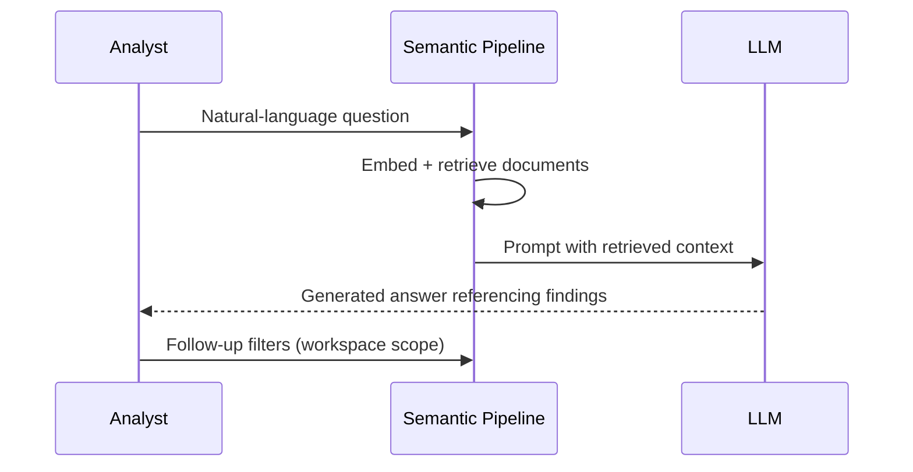

# Semantic Search for Security Findings

>**STATUS:Tutorial is currently in beta. If you have issues see our [Communication & Support guide](../../about/communication.md)**

Use this tutorial to ingest security scans into Certus TAP and query them with true semantic search (dense vector embeddings) instead of pure keyword matching. We’ll reuse the privacy governance workflow, but the focus here is the Haystack pipeline and OpenSearch vector indices that power natural-language questions like “Show me auth-related SQL injection issues”.



## When to Use Semantic Search

Semantic search with OpenSearch is ideal for:

- **Exploratory analysis** - "Find all findings related to SQL injection"
- **Natural language queries** - "Show me recent security issues in authentication"
- **Text pattern matching** - "Which files mention hardcoded credentials?"
- **Relevance ranking** - "Most critical findings relevant to my question"
- **Keyword search** - "All findings in database module"

It's less ideal for:

- **Exact structural queries** - "All packages with MIT license"
- **Dependency analysis** - "What depends on requests?"
- **Multi-hop relationships** - "Transitive dependency chains"
- **Deterministic aggregations** - "Exact count of HIGH findings by file"

## Prerequisites

- Working directory: project root unless noted otherwise.

## Step 1 - Set-up

### 1.1 Bring up relevant services

```bash
just ask-up
```

### 1.2 Check if everything is ready for the tutorial

```bash
just preflight-ask
```

### 1.3 Configure `aws` CLI for LocalStack

```bash
aws configure set aws_access_key_id test
aws configure set aws_secret_access_key test
aws configure set default.region us-east-1
aws configure set profile.localstack.s3.endpoint_url ${S3_ENDPOINT}
```

## Step 2 - Bootstrap + Ingest Everything in One Shot

Use the helper script to provision the buckets, upload the sample SARIF/SPDX files, promote them into `golden/scans/`, ingest every object via the backend, and create the OpenSearch aliases:

```bash
./scripts/setup-security-search.sh --workspace security-scans --ingest-all
export WORKSPACE_ID=security-scans
```

## Step 3 - Query Using the FastAPI RAG Endpoint

> **LLM variability:** Because `/ask` routes through an LLM with temperature > 0 by default, two identical questions can yield slightly different phrasing (and occasionally different focus). Set `LLM_TEMPERATURE=0` whenever you need deterministic tutorials or automated tests, then raise it again for exploratory analysis. Model size also drives accuracy, depth, and variability—smaller local models are convenient but less precise, so consider switching to a hosted or larger model when you need higher-fidelity answers.

Try these variations to sanity-check different aspects of the sample corpus:

### 3.1 Highlight SQL injection issues

```bash
curl -s -X POST "${CERTUS_ASK_URL}/v1/${WORKSPACE_ID}/ask" \
  -H "Content-Type: application/json" \
  -d '{"question": "Summarize every SQL injection risk in the scans"}' | jq '.answer'
```

### 3.2 License & SBOM questions

```bash
curl -s -X POST "${CERTUS_ASK_URL}/v1/${WORKSPACE_ID}/ask" \
  -H "Content-Type: application/json" \
  -d '{"question": "Which packages include LGPL or copyleft licenses we need to track?"}' | jq '.answer'
```

### 3.3 Severity triage

```bash
curl -s -X POST "${CERTUS_ASK_URL}/v1/${WORKSPACE_ID}/ask" \
  -H "Content-Type: application/json" \
  -d '{"question": "Which high severity findings affect the database or utils modules?"}' | jq '.answer'
```

### 3.4 Hygiene checks

```bash
curl -s -X POST "${CERTUS_ASK_URL}/v1/${WORKSPACE_ID}/ask" \
  -H "Content-Type: application/json" \
  -d '{"question": "Do we have any pickle usage or untrusted deserialization risks?"}' | jq '.answer'
```

### 3.5 Concept search: database hardening

```bash
curl -s -X POST "${CERTUS_ASK_URL}/v1/${WORKSPACE_ID}/ask" \
  -H "Content-Type: application/json" \
  -d '{"question": "How should we harden the database queries flagged by Bandit?"}' \
  | jq '.answer'
```

### 3.6 Prompt-scoped filters (SARIF-only answers)

```bash
curl -s -X POST "${CERTUS_ASK_URL}/v1/${WORKSPACE_ID}/ask" \
  -H "Content-Type: application/json" \
  -d '{"question": "Using only SARIF findings, summarize how to mitigate shell injection risks."}' \
  | jq '.answer'
```

### 3.7 Hybrid-style intent (mix keywords + semantics)

```bash
curl -s -X POST "${CERTUS_ASK_URL}/v1/${WORKSPACE_ID}/ask" \
  -H "Content-Type: application/json" \
  -d '{"question": "Combine the B602 shell injection findings with any other auth-related subprocess risks."}' \
  | jq '.answer'
```

### 3.8 SBOM reasoning via semantic search

```bash
curl -s -X POST "${CERTUS_ASK_URL}/v1/${WORKSPACE_ID}/ask" \
  -H "Content-Type: application/json" \
  -d '{"question": "Which packages from the Pallets ecosystem carry restrictive licenses?"}' \
  | jq '.answer'
```

## Step 4 - Cleanup

```bash
just down          # stop containers, keep volumes
just cleanup       # stop + remove containers, keep volumes
just destroy       # full tear-down (volumes removed)
```
