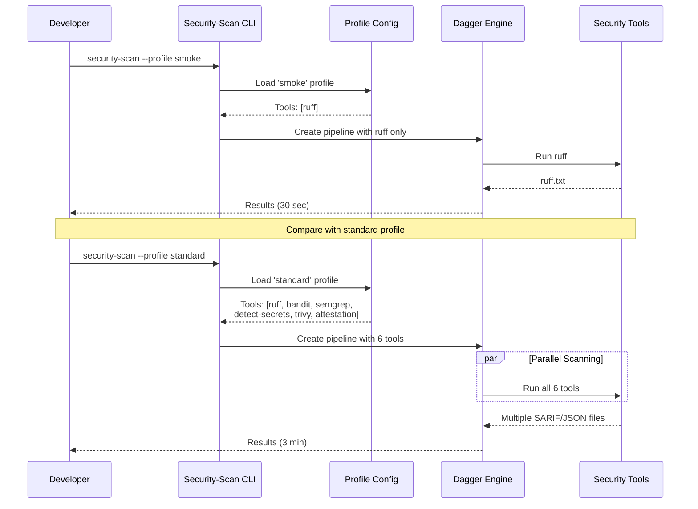

# Security Profiles: Tailored Security Scanning

Learn how to use different security profiles to customize scans for your needs.

## What You'll Learn

- Compare available built-in profiles
- Understand what tools run in each profile
- Choose the right profile for your use case
- Run scans with different profiles

## Prerequisites

- Completed Tutorial 1 (Quick Start)
- 15 minutes

## How Profile Selection Works



**Key Points**:

- **smoke**: 1 tool, 30 seconds - fastest feedback
- **standard**: 6 tools, 3 minutes - production-ready
- **light**: 8 tools, 5 minutes - comprehensive (default)
- Profiles trade off speed vs. coverage

## Why Use Different Profiles?

**Default (light):** Comprehensive scanning with all tools

**Other profiles:** Tailored for specific needs:

- ✅ **smoke** - Ultra-fast linting only
- ✅ **fast** - Quick security checks (secrets + SAST)
- ✅ **standard** - Production-ready without SBOM overhead
- ✅ **full** - Everything including SBOM and privacy
- ✅ **javascript** - JavaScript/Node.js specific tools

## Step 1: View Available Profiles

```bash
# See all available profiles
security-scan --help | grep -A1 "profile"
```

**Available profiles:**

- `smoke` - Ultra-fast (1 tool, ~30 sec)
- `fast` - Quick security (3 tools, ~1 min)
- `medium` - Balanced (5 tools, ~2 min)
- `standard` - Production-ready (6 tools, ~3 min)
- `light` - Comprehensive (8 tools, ~5 min)
- `full` - Everything (8 tools, ~5 min)
- `javascript` - JavaScript/Node.js (6 tools, ~3 min)
- `heavy` - Includes DAST (9 tools, ~10+ min)
- `attestation-test` - SBOM + attestation (3 tools, ~1 min)

## Step 2: Understand Profile Tools

Here's what runs in each profile:

| Profile              | Tools                                                                | Time     | Best For                                    | Notes                        |
| -------------------- | -------------------------------------------------------------------- | -------- | ------------------------------------------- | ---------------------------- |
| **smoke**            | ruff                                                                 | ~30 sec  | Pre-commit hooks, quick linting             | Fastest option               |
| **fast**             | ruff, bandit, detect-secrets                                         | ~2 min   | Fast CI checks, development                 | Quick security scan          |
| **medium**           | fast + opengrep, attestation                                         | ~4 min   | PR checks, branch protection                | Balanced coverage            |
| **standard**         | fast + trivy, sbom                                                   | ~10 min  | Main branch CI, supply chain tracking       | Recommended for CI/CD        |
| **light**            | standard + opengrep, privacy                                         | ~15 min  | Nightly scans, security reviews, compliance | Most comprehensive (alias)   |
| **full**             | Same as light (8 tools)                                              | ~15 min  | Complete security coverage                  | Alias for light              |
| **heavy**            | full + dast                                                          | ~20+ min | Pre-release security validation             | Requires running application |
| **javascript**       | eslint-security, retire-js, detect-secrets, trivy, sbom, attestation | ~10 min  | JavaScript/Node.js projects                 | Language-specific            |
| **attestation-test** | ruff, sbom, attestation                                              | ~5 min   | Testing attestation generation              | For SBOM/attestation testing |

## Step 3: Run with Different Profiles

> **Timeout tip:** Large repos stream a lot of artifacts during teardown, so every `security-scan` call below is prefixed with `DAGGER_TIMEOUT=900` to give Dagger up to 15 minutes to disconnect cleanly. Adjust the value if your environment needs more or less time.

### Try the Smoke Profile (Fastest)

```bash
# Ultra-fast linting only
DAGGER_TIMEOUT=900 security-scan \
  --runtime dagger \
  --workspace . \
  --export-dir ./security-results/smoke-test \
  --profile smoke
```

**View results:**

```bash
# Check what files were generated
ls security-results/smoke-test/latest/
# Output: ruff.txt, summary.json, attestation.intoto.json

# View the linting results
cat security-results/smoke-test/latest/ruff.txt

# Check scan summary
cat security-results/smoke-test/latest/summary.json | python3 -m json.tool
```

### Try the Fast Profile

```bash
# Quick security check
DAGGER_TIMEOUT=900 security-scan \
  --runtime dagger \
  --workspace . \
  --export-dir ./security-results/fast-test \
  --profile fast
```

**View results:**

```bash
# Check scan summary
cat security-results/fast-test/latest/summary.json | python3 -m json.tool

# View bandit security findings
cat security-results/fast-test/latest/bandit.json | python3 -m json.tool

# Check for potential secrets
cat security-results/fast-test/latest/detect-secrets.json | jq '.results | keys'

# Count findings
echo "Bandit security issues:"
cat security-results/fast-test/latest/bandit.json | jq '.results | length'
```

**Example summary output:**

```json
{
  "generated_at": "2025-12-29T20:23:09.489619+00:00",
  "executed": ["ruff", "bandit", "detect-secrets"],
  "skipped": [],
  "bundle_id": "20251229-202230-1ea7968"
}
```

### Try the Standard Profile

```bash
# Production-ready security scan
DAGGER_TIMEOUT=900 security-scan \
  --runtime dagger \
  --workspace . \
  --export-dir ./security-results/standard-test \
  --profile standard
```

**Results:**

```bash
ls security-results/standard-test/latest/
# Output: ruff.txt, bandit.json, detect-secrets.json, opengrep.sarif.json,
#         trivy.sarif.json, attestation.intoto.json, summary.json
```

## Step 4: Compare Results

Let's compare what each profile generates:

```bash
# Smoke profile (minimal)
cat security-results/smoke-test/latest/summary.json | jq '.executed'

# Standard profile (balanced)
cat security-results/standard-test/latest/summary.json | jq '.executed'

# Light profile (comprehensive - from Tutorial 1)
cat security-results/latest/summary.json | jq '.executed'
```

**Comparison:**

| Profile      | Tools | SBOM | Privacy | DAST | Scan Time |
| ------------ | ----- | ---- | ------- | ---- | --------- |
| **smoke**    | 1     | ❌   | ❌      | ❌   | ~30 sec   |
| **fast**     | 3     | ❌   | ❌      | ❌   | ~1 min    |
| **medium**   | 5     | ❌   | ❌      | ❌   | ~2 min    |
| **standard** | 6     | ❌   | ❌      | ❌   | ~3 min    |
| **light**    | 8     | ✅   | ✅      | ❌   | ~5 min    |
| **full**     | 8     | ✅   | ✅      | ❌   | ~5 min    |
| **heavy**    | 9     | ✅   | ✅      | ✅   | ~10+ min  |

## Step 5: Choose the Right Profile for Your Workflow

### Development Workflow

```bash
# Pre-commit hook (very fast)
DAGGER_TIMEOUT=900 security-scan --profile smoke --workspace .

# Pre-push check (quick but thorough)
DAGGER_TIMEOUT=900 security-scan --profile fast --workspace .
```

### CI/CD Pipeline

```bash
# Pull request checks (balanced)
DAGGER_TIMEOUT=900 security-scan --profile medium --workspace . --export-dir ./scan-results

# Main branch / production gate (comprehensive)
DAGGER_TIMEOUT=900 security-scan --profile standard --workspace . --export-dir ./scan-results

# Nightly security scan (complete with SBOM)
DAGGER_TIMEOUT=900 security-scan --profile light --workspace . --export-dir ./scan-results
```

### Compliance & Auditing

```bash
# Full security review with SBOM for compliance
DAGGER_TIMEOUT=900 security-scan --profile light --workspace . --export-dir ./compliance-scan

# Pre-release validation (includes DAST)
DAGGER_TIMEOUT=900 security-scan --profile heavy --workspace . --export-dir ./release-scan
```

## When to Use Each Profile

### Use **smoke** when:

- Running pre-commit hooks
- You need results in seconds
- Only checking code style/basic issues

### Use **fast** when:

- Running on every push
- Development iteration speed matters
- You want secrets + basic security

### Use **medium** when:

- Protecting PR merges
- You need attestations for provenance
- Balancing speed and coverage

### Use **standard** when:

- Running on main branch CI
- Production deployment gates
- You need CVE scanning without SBOM overhead

### Use **light** when:

- Running nightly comprehensive scans
- Compliance requirements need SBOM
- Privacy scanning is important
- Full security review needed

### Use **heavy** when:

- Pre-release security validation
- You have a running application to test
- DAST (dynamic testing) is required

## Troubleshooting

For common issues and solutions, see the [Certus Assurance Troubleshooting Guide](../../reference/troubleshooting/certus_assurance.md).

**Quick fixes:**

- **Scan taking too long** - [Use faster profiles](../../reference/troubleshooting/certus_assurance.md#scan-taking-too-long)
- **Missing SBOM files** - [Only certain profiles generate SBOM](../../reference/troubleshooting/certus_assurance.md#missing-sbom-files)
- **JavaScript/Node.js scanning** - [Use the javascript profile](../../reference/troubleshooting/certus_assurance.md#need-javascriptnodejs-scanning)
- **Custom manifest issues** - [Manifest validation](../../reference/troubleshooting/certus_assurance.md#custom-manifest-fails-validation)

## Advanced: Custom Manifests

Custom JSON manifests allow you to select specific tools and set custom thresholds beyond what built-in profiles offer.

### Creating a Custom JSON Manifest

You can create a custom manifest to select specific tools and use custom profile names:

```bash
# Create a custom profile with a descriptive name
cat > ~/ci-profile-manifest.json << 'EOF'
{
  "product": "my-app",
  "version": "1.0.0",
  "profiles": [
    {
      "name": "ci-pipeline",
      "description": "Custom CI profile (secrets + basic SAST)",
      "tools": [
        {
          "id": "ruff",
          "description": "Python linting"
        },
        {
          "id": "bandit",
          "description": "Python security"
        },
        {
          "id": "detect-secrets",
          "description": "Secret scanning"
        }
      ],
      "thresholds": {
        "critical": 0,
        "high": 10,
        "medium": 50
      }
    }
  ]
}
EOF
```

> **Note:** Custom profile names are now supported when using a manifest. You can use any name you want (like `ci-pipeline` above) as long as it matches a profile entry in your manifest. Without a manifest, you must use one of the built-in profile names: `smoke`, `fast`, `medium`, `standard`, `full`, `light`, `heavy`, `javascript`, or `attestation-test`.

### Run with Custom Manifest

```bash
# Run scan with custom manifest and custom profile name
DAGGER_TIMEOUT=900 security-scan \
  --runtime dagger \
  --workspace . \
  --export-dir ./security-results/custom-ci \
  --manifest ~/ci-profile-manifest.json \
  --profile ci-pipeline
```

**Important:** The `--profile` argument must match a profile entry in your manifest's `profiles` array. When using a manifest, you can use any custom profile name you want. Without a manifest, you must use one of the built-in profile names.

**What happens:**

- Only runs the 3 specified tools (ruff, bandit, detect-secrets)
- Faster than built-in profiles (~1 minute)
- Custom thresholds are evaluated
- **Artifacts are always exported** (even when thresholds are exceeded)
- Policy results written to `policy-result.json` for calling pipelines to evaluate

**Understanding threshold enforcement:**

Thresholds are evaluated and results are written to the artifacts directory:

```bash
# Example: If you have 15 high severity findings but threshold is 10
# Result: Scan completes and shows:
# [policy] high findings exceeded threshold (15 > 10)
#
# ✓ Scan completed: 20251230-042209-1ea7968
#   Artifacts: ./security-results/custom-ci/20251230-042209-1ea7968
#   Policy: ✗ FAILED
#     - high findings exceeded threshold (15 > 10)
#
#   Review artifacts at: ./security-results/.../policy-result.json
#   Note: Artifacts were exported for review. Calling pipeline should decide on blocking actions.
```

**For CI/CD Integration:**

The scan always exports artifacts. Your calling pipeline should check `policy-result.json` to decide on blocking:

```python
import json
from pathlib import Path

# Read policy results
policy_file = Path("security-results/latest/policy-result.json")
if policy_file.exists():
    policy = json.loads(policy_file.read_text())

    if not policy["passed"]:
        print(f"Security policy failed: {policy['violations']}")
        exit(1)  # Block the pipeline
    else:
        print("Security policy passed!")
```

**Tip:** Start with permissive thresholds and tighten them over time:

```json
"thresholds": {
  "critical": 0,    // Block any critical
  "high": 50,       // Allow up to 50 high (permissive at first)
  "medium": 200     // Allow up to 200 medium
}
```

### Available Tool IDs

You can include any of these tools in your custom manifest:

| Tool ID           | Category     | Description                                   |
| ----------------- | ------------ | --------------------------------------------- |
| `ruff`            | SAST         | Python linting and code quality               |
| `bandit`          | SAST         | Python security anti-patterns                 |
| `detect-secrets`  | Secrets      | Hardcoded credential scanning                 |
| `opengrep`        | SAST         | Semgrep security patterns                     |
| `trivy`           | SCA          | CVE/vulnerability scanning                    |
| `privacy`         | Privacy      | PII detection (Presidio)                      |
| `sbom`            | SBOM         | Software Bill of Materials (SPDX + CycloneDX) |
| `attestation`     | Supply Chain | In-toto attestation generation                |
| `eslint-security` | SAST         | JavaScript security (ESLint plugin)           |
| `retire-js`       | SCA          | JavaScript dependency vulnerabilities         |
| `dast`            | DAST         | Dynamic application security testing          |

**Example usage in manifest:**

```json
"tools": [
  {"id": "ruff"},
  {"id": "bandit"},
  {"id": "detect-secrets"}
]
```

### Custom Manifest Examples

#### Example 1: Minimal Pre-commit Check

```json
{
  "product": "my-app",
  "version": "1.0.0",
  "profiles": [
    {
      "name": "pre-commit",
      "description": "Fast pre-commit check",
      "tools": [{ "id": "ruff" }, { "id": "detect-secrets" }]
    }
  ]
}
```

**Usage:** `DAGGER_TIMEOUT=900 security-scan --manifest ~/pre-commit-manifest.json --profile pre-commit`

#### Example 2: Security-Only (No Linting)

```json
{
  "product": "my-app",
  "version": "1.0.0",
  "profiles": [
    {
      "name": "security-only",
      "description": "Security-focused scan without linting",
      "tools": [
        { "id": "bandit" },
        { "id": "detect-secrets" },
        { "id": "trivy" },
        { "id": "opengrep" }
      ],
      "thresholds": {
        "critical": 0,
        "high": 10,
        "medium": 50
      }
    }
  ]
}
```

**Usage:** `DAGGER_TIMEOUT=900 security-scan --manifest ~/security-only-manifest.json --profile security-only`

#### Example 3: Compliance Scan with SBOM

```json
{
  "product": "patient-portal",
  "version": "2.0.0",
  "profiles": [
    {
      "name": "hipaa-compliance",
      "description": "HIPAA compliance scan",
      "tools": [
        { "id": "bandit" },
        { "id": "trivy" },
        { "id": "privacy" },
        { "id": "sbom" },
        { "id": "attestation" }
      ],
      "thresholds": {
        "critical": 0,
        "high": 20,
        "medium": 100
      }
    }
  ]
}
```

**Usage:** `DAGGER_TIMEOUT=900 security-scan --manifest ~/hipaa-manifest.json --profile hipaa-compliance`

### Verify Custom Manifest Results

After running with a custom manifest:

```bash
# Check which tools actually ran
cat security-results/custom-ci/latest/summary.json | jq '.executed'

# Verify only your selected tools ran
# Example output: ["ruff", "bandit", "detect-secrets"]

# Check manifest metadata
cat security-results/custom-ci/latest/summary.json | jq '._certus_manifest'
```

**Example output:**

```json
{
  "product": "my-app",
  "version": "1.0.0",
  "profile_requested": "light",
  "profile_resolved": "light",
  "tools_selected": ["ruff", "bandit", "detect-secrets"],
  "policy_thresholds": {
    "critical": 0,
    "high": 10,
    "medium": 50
  }
}
```

### Using CUE for Advanced Manifest Authoring

CUE provides type-safe manifest authoring with validation and reusable definitions:

```bash
# View CUE examples
ls dagger_modules/security/manifests/examples/
cat dagger_modules/security/manifests/examples/python-light.cue

# Export CUE to JSON (must include all files in package)
cd dagger_modules/security/manifests
cue export schema.cue tool_registry.cue presets.cue > ~/exported-manifest.json

# Use the exported JSON manifest
security-scan \
  --manifest ~/exported-manifest.json \
  --profile light \
  --workspace . \
  --export-dir ./results
```

**Note:** When exporting CUE files, you must include all files in the package (schema.cue, tool_registry.cue, etc.) to resolve cross-file references. For simpler workflows, JSON manifests can be created directly without CUE.

## Next Steps

**Now that you understand profiles:**

1. **Tutorial 3: Managed Service** - Use the API for team-wide scanning
2. **Tutorial 4: End-to-End** - See how scans flow through Trust → Transform → Ask

## Quick Reference

```bash
# Use built-in profiles
DAGGER_TIMEOUT=900 security-scan --profile smoke --workspace .      # Fastest
DAGGER_TIMEOUT=900 security-scan --profile fast --workspace .       # Quick
DAGGER_TIMEOUT=900 security-scan --profile standard --workspace .   # CI/CD
DAGGER_TIMEOUT=900 security-scan --profile light --workspace .      # Complete (default)
DAGGER_TIMEOUT=900 security-scan --profile heavy --workspace .      # Everything + DAST

# View scan summary
cat security-results/latest/summary.json | jq '.executed'

# List all available profiles
security-scan --help | grep "profile {"
```

## Summary: What Works vs What Doesn't

### ✅ Working Features

- **Built-in profiles** - All 9 profiles work perfectly via `--profile` flag
- **Profile selection** - Choose from smoke, fast, medium, standard, light, full, heavy, javascript, attestation-test
- **Tool combinations** - Each profile runs a specific set of tools
- **Scan results** - All output formats (SARIF, SBOM, attestations) work correctly

### ✅ Custom Manifests (Now Working!)

- **JSON manifests** - Fully functional! Select specific tools and set custom thresholds
- **Policy enforcement** - Automatic threshold checking with exit code 2 on violations
- **Manifest metadata** - Embedded in scan results for traceability

### ⚠️ Known Limitations

- **CUE manifests** - Need to extract `.manifest` object from CUE export before use
- **Profile names** - Must use a built-in profile name like "light" or "standard"
- **Threshold enforcement** - Scans fail if findings exceed limits (this is by design)

### 💡 Built-in Profile Quick Reference

| Your Need                 | Use This Profile | Tools Included                    |
| ------------------------- | ---------------- | --------------------------------- |
| Only linting              | `smoke`          | ruff                              |
| Secrets + basic security  | `fast`           | ruff, bandit, detect-secrets      |
| PR checks                 | `medium`         | fast + opengrep + attestation     |
| Production CI + SBOM      | `standard`       | fast + trivy + sbom               |
| Full security + privacy   | `full`           | standard + opengrep + privacy     |
| Everything including DAST | `heavy`          | full + dast                       |

## What You Learned

✅ Available built-in security profiles
✅ What tools run in each profile
✅ How to choose the right profile for your use case
✅ When to use fast vs comprehensive scans
✅ How to integrate profiles into CI/CD workflows
✅ **How to create custom JSON manifests** with specific tools and thresholds
✅ **How threshold enforcement works** and how to set appropriate limits
✅ **How to verify custom manifest results** in scan output

## Cleanup (Optional)

Remove tutorial artifacts once you're done experimenting:

```bash
rm -rf security-results/smoke-test \
       security-results/fast-test \
       security-results/standard-test \
       security-results/custom-ci \
       security-results/latest
```

Delete any sample manifests you created (such as `~/fast-profile-manifest.json`, `~/pre-commit-manifest.json`, etc.):

```bash
rm -f ~/fast-profile-manifest.json \
      ~/pre-commit-manifest.json \
      ~/security-only-manifest.json \
      ~/hipaa-manifest.json
```

Uninstall the CLI if you installed it just for this tutorial:

```bash
# If installed via pipx
pipx uninstall security-scan

# If installed inside a virtualenv
pip uninstall security-scan
```

**You're now ready to use the Certus Assurance API for team scanning (Tutorial 3)!**
