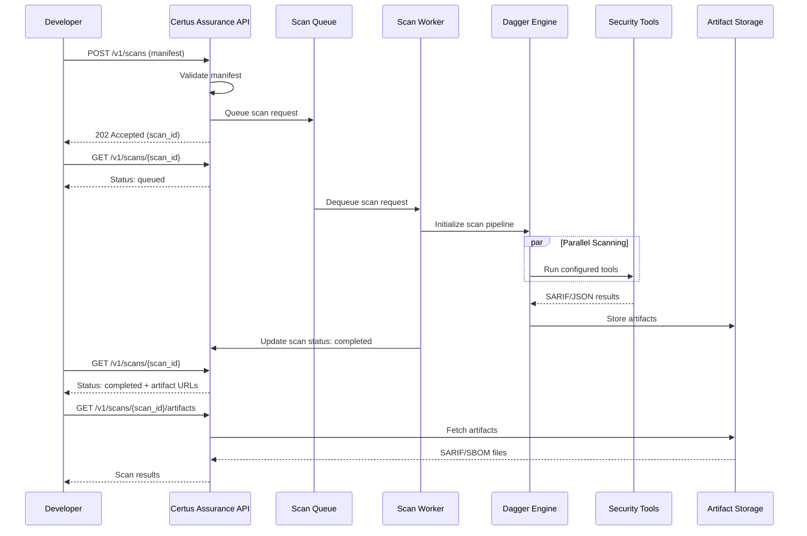

# Scanning methods

Learn how to use Certus Assurance as a centralized scanning service for your team.

## What You'll Learn

- Submit scans via the Assurance API
- Scan remote GitHub repositories
- Monitor scan progress in real-time
- Track scans across teams with identifiers
- Compare API vs CLI workflows

## Prerequisites

- Completed Tutorial 1 (Quick Start)
- Docker/Colima running
- 15 minutes

## How Managed API Scanning Works



**Key Points**:

- **Async workflow**: Submit scan, poll for results
- **Centralized**: All team scans tracked in one service
- **Persistent storage**: Results available for audit/history
- **Queue-based**: Multiple scans handled concurrently

## When to Use the Managed Service

**Use CLI (Tutorial 1)** when:

- Scanning on developer laptop
- Running in CI/CD pipeline
- One-off security checks
- Offline/air-gapped environments

**Use Managed API (this tutorial)** when:

- Centralized security scanning
- Tracking scans across teams
- Need scan history and audit trail
- Multiple users scanning different projects

## Step 1: Start the Certus Assurance Service

```bash
# Start Assurance + minimal infrastructure
just assurance-up

# Verify service is running
curl http://localhost:8056/health | jq
```

**Expected response (Production Mode):**

```json
{
  "status": "ok",
  "scanning_mode": "production",
  "security_module_available": "True"
}
```

**Expected response (Sample Mode):**

```json
{
  "status": "ok",
  "scanning_mode": "sample",
  "security_module_available": "False"
}
```

### Understanding Scanning Modes

The Certus Assurance service supports two modes:

| Mode                 | security_module_available | Scan Behavior                                  | Speed       | Use Case                 |
| -------------------- | ------------------------- | ---------------------------------------------- | ----------- | ------------------------ |
| **Sample** (default) | False                     | Returns pre-generated mock results             | <5 seconds  | Quick demos, testing API |
| **Production**       | True                      | Runs real security tools (trivy, bandit, etc.) | 2-5 minutes | Actual security scanning |

**Sample mode is enabled by default for tutorials.** The service returns pre-generated findings quickly.

**To switch to production mode (real scanners):**

```bash
sed -i.bak 's/CERTUS_ASSURANCE_USE_SAMPLE_MODE=true/CERTUS_ASSURANCE_USE_SAMPLE_MODE=false/' certus_assurance/deploy/docker-compose.yml && just assurance-down && just assurance-up
```

**To switch back to sample mode (faster):**

```bash
sed -i.bak 's/CERTUS_ASSURANCE_USE_SAMPLE_MODE=false/CERTUS_ASSURANCE_USE_SAMPLE_MODE=true/' certus_assurance/deploy/docker-compose.yml && just assurance-down && just assurance-up
```

**Verify mode:**

```bash
curl http://localhost:8056/health | jq '.scanning_mode'
# "sample" or "production"
```

**Note:** Mode changes require restarting the assurance service (included in commands above).

## Step 2: Understanding Scan Identifiers

Every scan needs four identifiers for tracking:

| Identifier      | Purpose                          | Example         |
| --------------- | -------------------------------- | --------------- |
| `workspace_id`  | Team/organization                | `security-team` |
| `component_id`  | Application/service              | `pygoat`        |
| `assessment_id` | Security campaign                | `q1-2025-audit` |
| `test_id`       | Individual scan (auto-generated) | `test_abc123`   |

**Why?** These let you query later:

- "Show all scans for the security-team workspace"
- "Show all pygoat scans"
- "Show all scans from Q1 2025 audit"

## Step 3: Submit Your First API Scan

We'll scan **PyGoat** - an intentionally vulnerable Django app for security training.

```bash
# Submit scan to Assurance
curl -X POST http://localhost:8056/v1/security-scans \
  -H 'Content-Type: application/json' \
  -d '{
    "workspace_id": "security-demo",
    "component_id": "pygoat",
    "assessment_id": "tutorial-scan",
    "git_url": "https://github.com/adeyosemanputra/pygoat.git",
    "commit": "7bc2d0d",
    "branch": "master",
    "requested_by": "tutorial@example.com",
    "profile": "fast",
    "manifest": {
      "product": "pygoat",
      "version": "1.0",
      "profiles": [
        {
          "name": "fast",
          "description": "Quick security scan",
          "tools": []
        }
      ]
    }
  }' | jq
```

**Expected response:**

```json
{
  "test_id": "test_xyz789",
  "workspace_id": "security-demo",
  "component_id": "pygoat",
  "assessment_id": "tutorial-scan",
  "status": "QUEUED",
  "profile": "fast",
  "manifest_digest": "841cafbb42f0733faf0ef7a2d4d51ab6fa2339b49a53935806ee5982979ed36e",
  "stream_url": "/v1/security-scans/test_xyz789/stream"
}
```

**Capture and export the scan ID automatically:**

```bash
export SCAN_ID=$(curl -s -X POST http://localhost:8056/v1/security-scans \
  -H 'Content-Type: application/json' \
  -d '{
    "workspace_id": "security-demo",
    "component_id": "pygoat",
    "assessment_id": "tutorial-scan",
    "git_url": "https://github.com/adeyosemanputra/pygoat.git",
    "commit": "7bc2d0d",
    "branch": "master",
    "requested_by": "tutorial@example.com",
    "profile": "fast",
    "manifest": {
      "product": "pygoat",
      "version": "1.0",
      "profiles": [
        {
          "name": "fast",
          "description": "Quick security scan",
          "tools": []
        }
      ]
    }
  }' | jq -r '.test_id')

echo "Scan ID: $SCAN_ID"
```

## Step 4: Monitor Scan Progress

### Option A: Poll Status Endpoint

```bash
# Check scan status (manual polling)
curl -s http://localhost:8056/v1/security-scans/$SCAN_ID | jq '{status, started_at, completed_at}'

# Or use a loop to poll every 5 seconds (macOS/Linux)
while true; do
  curl -s http://localhost:8056/v1/security-scans/$SCAN_ID | jq '{status, started_at, completed_at}'
  sleep 5
done
```

**Status progression:**

```
QUEUED → RUNNING → SUCCEEDED (or FAILED)
```

### Option B: Stream Logs via WebSocket

```bash
# Install wscat if needed
npm install -g wscat

# Stream real-time logs
wscat -c ws://localhost:8056/v1/security-scans/$SCAN_ID/stream
```

**Expected log events:**

```json
{"type": "phase", "message": "Cloning repository"}
{"type": "phase", "message": "Running Bandit", "tool": "bandit"}
{"type": "stdout", "message": "Found 12 issues"}
{"type": "phase", "message": "Running Trivy", "tool": "trivy"}
{"type": "scan_complete", "status": "SUCCEEDED", "bundle": "/path/to/artifacts"}
```

**Scan takes ~2 seconds to 2 minutes** (PyGoat with fast profile - depends on profile selected)

## Step 5: View Scan Results

Once status is `SUCCEEDED`:

```bash
# Get full scan details
curl -s http://localhost:8056/v1/security-scans/$SCAN_ID | jq
```

**Key fields:**

```json
{
  "test_id": "test_xyz789",
  "status": "SUCCEEDED",
  "started_at": "2025-01-15T10:30:00Z",
  "completed_at": "2025-01-15T10:32:45Z",
  "artifacts": {
    "sarif": "reports/sast/trivy.sarif.json",
    "sbom_spdx": "reports/sbom/syft.spdx.json",
    "manifest_json": "manifest.json"
  },
  "manifest_digest": "sha256:abc...",
  "manifest_metadata": {
    "profile_resolved": "fast",
    "tools_selected": ["ruff", "bandit", "detect-secrets"]
  }
}
```

## Step 6: Access Scan Artifacts

Artifacts are stored locally in the project root directory:

```bash
# Navigate to project root (if needed)
cd /path/to/certus-TAP  # Or wherever you cloned the repo

# Set artifacts directory path
ARTIFACTS_DIR="certus-assurance-artifacts/$SCAN_ID"

# List artifacts
ls -la $ARTIFACTS_DIR/
```

**Note:** The artifacts directory is relative to your project root, not your current directory.

**You'll see:**

```
scan.json                    # Metadata
manifest.json                # Manifest used
summary.json                 # Scan summary
reports/
  sast/
    ruff.txt                # Code quality issues (fast profile)
    detect-secrets.json     # Secret detection (fast profile)
    bandit.sarif.json       # Python security issues (light+ profiles)
    trivy.sarif.json        # Vulnerabilities (light+ profiles)
  sbom/
    syft.spdx.json          # Dependencies (light+ profiles)
logs/
  runner.log
```

**Note:** The `fast` profile runs fewer tools for speed. Use `light` or higher profiles for more comprehensive scanning.

## Step 7: Examine PyGoat Findings

For the `fast` profile, examine code quality issues found by ruff:

```bash
# View ruff findings (code quality issues)
head -30 $ARTIFACTS_DIR/reports/sast/ruff.txt
```

**Expected (PyGoat has intentional vulnerabilities):**

```
challenge/views.py:18:29: F841 [*] Local variable `e` is assigned to but never used
challenge/views.py:24:9: E722 Do not use bare `except`
challenge/views.py:46:20: E711 Comparison to `None` should be `cond is None`
introduction/apis.py:100:5: E722 Do not use bare `except`
introduction/apis.py:66:19: F405 `os` may be undefined, or defined from star imports
```

```bash
# Count total issues found
wc -l $ARTIFACTS_DIR/reports/sast/ruff.txt
```

For more comprehensive security scanning (vulnerabilities, SBOM), use the `standard` profile:

```bash
# Submit a more comprehensive scan and capture ID
SCAN_ID_LIGHT=$(curl -s -X POST http://localhost:8056/v1/security-scans \
  -H 'Content-Type: application/json' \
  -d '{
    "workspace_id": "security-demo",
    "component_id": "pygoat",
    "assessment_id": "comprehensive-scan",
    "git_url": "https://github.com/adeyosemanputra/pygoat.git",
    "commit": "7bc2d0d",
    "profile": "light",
    "manifest": {
      "product": "pygoat",
      "version": "1.0",
      "profiles": [{"name": "light", "description": "Balanced scan", "tools": []}]
    }
  }' | jq -r '.test_id')

echo "Light scan ID: $SCAN_ID_LIGHT"

# Monitor the light scan (takes 2-3 minutes)
curl -s http://localhost:8056/v1/security-scans/$SCAN_ID_LIGHT | jq '{status, tools_selected: .manifest_metadata.tools_selected}'
```

**These are INTENTIONAL vulnerabilities** - PyGoat is a training app!

## Step 8: Scan Multiple Components

Track different components under the same workspace:

```bash
# Scan component 1 (PyGoat)
SCAN_ID_1=$(curl -s -X POST http://localhost:8056/v1/security-scans \
  -H 'Content-Type: application/json' \
  -d '{
    "workspace_id": "security-demo",
    "component_id": "pygoat",
    "assessment_id": "q1-2025",
    "git_url": "https://github.com/adeyosemanputra/pygoat.git",
    "commit": "7bc2d0d",
    "profile": "fast",
    "manifest": {
      "product": "pygoat",
      "version": "1.0",
      "profiles": [{"name": "fast", "description": "Quick scan", "tools": []}]
    }
  }' | jq -r '.test_id')

echo "PyGoat scan ID: $SCAN_ID_1"

# Scan component 2 (your own project)
SCAN_ID_2=$(curl -s -X POST http://localhost:8056/v1/security-scans \
  -H 'Content-Type: application/json' \
  -d '{
    "workspace_id": "security-demo",
    "component_id": "my-api",
    "assessment_id": "q1-2025",
    "git_url": "https://github.com/yourusername/your-repo.git",
    "commit": "main",
    "profile": "fast",
    "manifest": {
      "product": "my-api",
      "version": "1.0",
      "profiles": [{"name": "fast", "description": "Quick scan", "tools": []}]
    }
  }' | jq -r '.test_id')

echo "My-API scan ID: $SCAN_ID_2"
```

**Result:** Both scans tracked under `assessment_id: "q1-2025"`

You can now check both scans:

```bash
curl -s http://localhost:8056/v1/security-scans/$SCAN_ID_1 | jq '{component: .component_id, status}'
curl -s http://localhost:8056/v1/security-scans/$SCAN_ID_2 | jq '{component: .component_id, status}'
```

## Step 9: Query Scan History

```bash
# Get service statistics
curl -s http://localhost:8056/stats | jq
```

**Response:**

```json
{
  "total_scans": 3,
  "scans_by_status": {
    "queued": 0,
    "running": 1,
    "succeeded": 2,
    "failed": 0
  },
  "upload_stats": {
    "pending": 2,
    "permitted": 0,
    "uploaded": 0
  },
  "active_streams": 1,
  "timestamp": "2025-01-15T10:45:00Z"
}
```

## Comparison: CLI vs API

| Aspect       | CLI (Tutorial 1)        | API (This Tutorial)                 |
| ------------ | ----------------------- | ----------------------------------- |
| **Setup**    | Install security_module | Start service (`just assurance-up`) |
| **Target**   | Local directory only    | Local or remote git repos           |
| **Tracking** | Manual test_id          | Workspace/Component/Assessment IDs  |
| **History**  | Files on disk           | Queryable via `/stats`              |
| **Logs**     | File-based              | Real-time WebSocket streaming       |
| **Use case** | Developer laptop, CI    | Team scanning, audit trails         |

## Advanced: Scanning with Remote Manifests

Instead of inline manifests, reference manifests stored externally. This enables centralized manifest management with signature verification.

### Supported URI Schemes:

- **`file://`** - Local filesystem (container paths)
- **`s3://`** - AWS S3 or S3-compatible storage (LocalStack)
- **`https://`** - HTTP/HTTPS URLs (GitHub, GitLab, web servers)
- **`oci://`** - OCI container registries

### Example 1: S3 with Custom Profile Name

#### Step 1: Create Custom Manifest

```bash
cat > /tmp/pygoat-ci.json << 'EOF'
{
  "product": "pygoat",
  "version": "1.0",
  "profiles": [{
    "name": "my-ci-profile",
    "description": "Custom CI pipeline profile",
    "tools": [
      {"id": "ruff"},
      {"id": "bandit"},
      {"id": "detect-secrets"}
    ],
    "thresholds": {
      "critical": 0,
      "high": 15,
      "medium": 100
    }
  }]
}
EOF
```

#### Step 2: Upload to S3 (LocalStack)

```bash
# Create bucket
aws --endpoint-url=http://localhost:4566 s3 mb s3://manifests

# Upload manifest
aws --endpoint-url=http://localhost:4566 s3 cp /tmp/pygoat-ci.json s3://manifests/pygoat-ci.json
```

#### Step 3: Create Signature (Optional)

```bash
# Option A: Generate real signature (requires cosign keys)
# First time only: cosign generate-key-pair
# cosign sign-blob --key cosign.key /tmp/pygoat-ci.json > /tmp/pygoat-ci.json.sig

# Option B: Create empty signature (verification disabled by default)
touch /tmp/pygoat-ci.json.sig

# Upload signature
aws --endpoint-url=http://localhost:4566 s3 cp /tmp/pygoat-ci.json.sig s3://manifests/pygoat-ci.json.sig
```

#### Step 4: Run Scan with Remote Manifest

```bash
SCAN_ID_S3=$(curl -s -X POST http://localhost:8056/v1/security-scans \
  -H 'Content-Type: application/json' \
  -d '{
    "workspace_id": "security-demo",
    "component_id": "pygoat",
    "assessment_id": "remote-manifest-test",
    "git_url": "https://github.com/adeyosemanputra/pygoat.git",
    "profile": "my-ci-profile",
    "manifest_uri": "s3://manifests/pygoat-ci.json",
    "manifest_signature_uri": "s3://manifests/pygoat-ci.json.sig"
  }' | jq -r '.test_id')

echo "S3 manifest scan ID: $SCAN_ID_S3"
```

#### Step 5: Verify Scan Results

```bash
# Check scan status and configuration
curl -s http://localhost:8056/v1/security-scans/$SCAN_ID_S3 | jq '{
  status,
  profile,
  tools_selected: .manifest_metadata.tools_selected,
  policy_thresholds: .manifest_metadata.policy_thresholds
}'

# Expected output:
# {
#   "status": "SUCCEEDED",
#   "profile": "my-ci-profile",
#   "tools_selected": ["ruff", "bandit", "detect-secrets"],
#   "policy_thresholds": {
#     "critical": 0,
#     "high": 15,
#     "medium": 100
#   }
# }
```

#### Step 6: Review Policy Enforcement

The scan always completes and exports artifacts. Check the policy results:

```bash
# Get artifact directory
ARTIFACT_DIR=$(curl -s http://localhost:8056/v1/security-scans/$SCAN_ID_S3 | jq -r '.test_id')
POLICY_FILE="certus-assurance-artifacts/${ARTIFACT_DIR}/policy-result.json"

# View policy results
cat $POLICY_FILE | jq

# Example output:
# {
#   "passed": false,
#   "thresholds": {"critical": 0, "high": 15, "medium": 100},
#   "counts": {"critical": 0, "high": 23, "medium": 156, "low": 5149},
#   "violations": [
#     "high findings exceeded threshold (23 > 15)",
#     "medium findings exceeded threshold (156 > 100)"
#   ]
# }
```

#### Step 7: Integrate with CI/CD Pipeline

```bash
# Use policy results to make blocking decisions
if [ "$(jq -r '.passed' $POLICY_FILE)" = "false" ]; then
  echo "Security policy failed:"
  jq -r '.violations[]' $POLICY_FILE

  # Decision options:
  # - Block deployment (exit 1)
  # - Create JIRA ticket
  # - Notify security team
  # - Generate report

  exit 1
fi

echo "Security policy passed - proceeding with deployment"
```

### Example 2: File System (Docker volume)

```bash
SCAN_ID_FILE=$(curl -s -X POST http://localhost:8056/v1/security-scans \
  -H 'Content-Type: application/json' \
  -d '{
    "workspace_id": "security-demo",
    "component_id": "pygoat",
    "assessment_id": "file-manifest-demo",
    "git_url": "https://github.com/adeyosemanputra/pygoat.git",
    "profile": "light",
    "manifest_uri": "file:///app/manifests/pygoat.json",
    "manifest_signature_uri": "file:///app/manifests/pygoat.json.sig"
  }' | jq -r '.test_id')

echo "File manifest scan ID: $SCAN_ID_FILE"
```

### Example 3: GitHub Raw URL

Store manifests in a GitHub repository and reference them directly:

```bash
# Example: Manifest stored in GitHub repo
# https://github.com/your-org/security-manifests/blob/main/manifests/pygoat-ci.json

SCAN_ID_GITHUB=$(curl -s -X POST http://localhost:8056/v1/security-scans \
  -H 'Content-Type: application/json' \
  -d '{
    "workspace_id": "security-demo",
    "component_id": "pygoat",
    "assessment_id": "github-manifest-test",
    "git_url": "https://github.com/adeyosemanputra/pygoat.git",
    "profile": "my-ci-profile",
    "manifest_uri": "https://raw.githubusercontent.com/your-org/security-manifests/main/manifests/pygoat-ci.json",
    "manifest_signature_uri": "https://raw.githubusercontent.com/your-org/security-manifests/main/manifests/pygoat-ci.json.sig"
  }' | jq -r '.test_id')

echo "GitHub manifest scan ID: $SCAN_ID_GITHUB"
```

**Benefits of GitHub-hosted manifests:**

- Version control with full history
- Pull request review process for changes
- Team collaboration on security policies
- CI/CD automation for manifest updates
- Branch-based testing (dev/staging/prod manifests)

**Example repository structure:**

```
security-manifests/
├── manifests/
│   ├── pygoat-ci.json
│   ├── pygoat-ci.json.sig
│   ├── prod-strict.json
│   └── prod-strict.json.sig
├── .github/workflows/
│   └── sign-manifests.yml  # Auto-sign on merge
└── README.md
```

### Example 4: OCI Registry

```bash
# Package manifest in OCI image
docker build -t registry.example.com/manifests/pygoat:v1.0 - << 'EOF'
FROM scratch
COPY pygoat-ci.json /manifest.json
COPY pygoat-ci.json.sig /manifest.sig
EOF

docker push registry.example.com/manifests/pygoat:v1.0

# Run scan with OCI manifest
SCAN_ID_OCI=$(curl -s -X POST http://localhost:8056/v1/security-scans \
  -H 'Content-Type: application/json' \
  -d '{
    "workspace_id": "security-demo",
    "component_id": "pygoat",
    "profile": "my-ci-profile",
    "git_url": "https://github.com/adeyosemanputra/pygoat.git",
    "manifest_uri": "oci://registry.example.com/manifests/pygoat:v1.0"
  }' | jq -r '.test_id')

echo "OCI manifest scan ID: $SCAN_ID_OCI"
```

**Benefits:**

- Centralized manifest versioning and control
- Signature verification ensures manifest integrity
- Custom profile names supported
- Reusable across multiple scans

## Troubleshooting

For common issues and solutions, see the [Certus Assurance Troubleshooting Guide](../../reference/troubleshooting/certus_assurance.md).

**Quick fixes:**

- **Service not running** - [Check Docker and restart](../../reference/troubleshooting/certus_assurance.md#service-not-running)
- **Scan stuck in QUEUED** - [Check worker capacity](../../reference/troubleshooting/certus_assurance.md#scan-stuck-in-queued)
- **Git clone failed** - [Verify repository access](../../reference/troubleshooting/certus_assurance.md#git-clone-failed)
- **Scan takes too long** - [Use faster profiles](../../reference/troubleshooting/certus_assurance.md#scan-taking-too-long)

## Next Steps

**Now that you can use the API:**

1. **Tutorial 4: End-to-End** - See the complete flow: Assurance → Trust → Transform → Ask

## Quick Reference

```bash
# Submit scan and capture ID
SCAN_ID=$(curl -s -X POST http://localhost:8056/v1/security-scans \
  -H 'Content-Type: application/json' \
  -d '{
    "workspace_id": "...",
    "component_id": "...",
    "git_url": "...",
    "profile": "fast",
    "manifest": {
      "product": "...",
      "version": "1.0",
      "profiles": [{"name": "fast", "description": "Quick scan", "tools": []}]
    }
  }' | jq -r '.test_id')

echo "Scan ID: $SCAN_ID"

# Check status
curl http://localhost:8056/v1/security-scans/$SCAN_ID | jq .status

# Stream logs
wscat -c ws://localhost:8056/v1/security-scans/$SCAN_ID/stream

# View stats
curl http://localhost:8056/stats | jq
```

## What You Learned

✅ How to submit scans via the Assurance API
✅ How to scan remote GitHub repositories
✅ How to monitor scans in real-time with WebSocket
✅ How to use identifiers to track scans across teams
✅ Difference between CLI and API workflows
✅ How to examine findings in intentionally vulnerable apps

**You're now ready for the end-to-end integration tutorial (Tutorial 4) that shows how Assurance, Trust, Transform, and Ask work together!**
