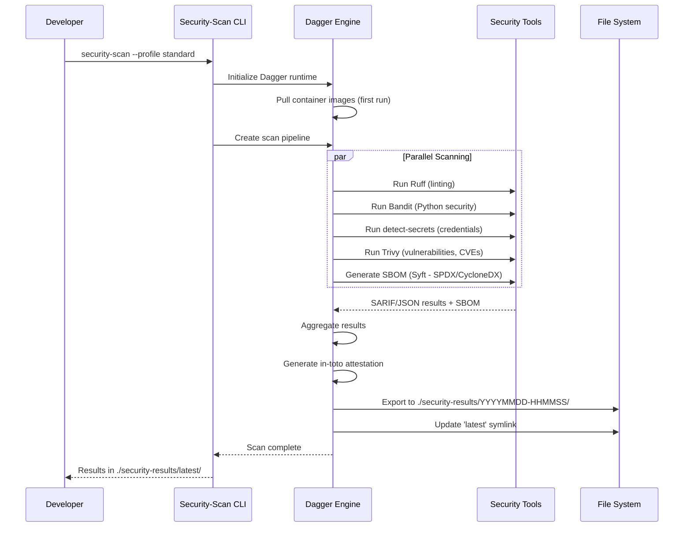

# Quick Start: Your First Security Scan

Start with a quick 2-minute scan, then optionally upgrade to a comprehensive 10-minute scan with SBOM generation.

## What You'll Learn

- Run a fast security scan to verify setup (~2 min)
- Optionally: Run comprehensive scan with SBOM generation (~10 min)
- Explore SARIF security findings
- Analyze SBOM (Software Bill of Materials)
- Understand scan metadata and attestations
- See what tools found in your code

## How It Works



**Key Points**:

- Scanners run in **parallel** containers for speed
- Results exported to timestamped directory with `latest` symlink
- SBOM generated in both SPDX and CycloneDX formats
- In-toto attestation for supply chain verification

## Prerequisites

- Docker or Colima running with **at least 4GB RAM** and **2 CPU cores** allocated
- This repository cloned: `certus-TAP`
- 10-15 minutes for first run (subsequent runs: 5-8 minutes)

**Resource Requirements:**

- **Standard profile** (this tutorial): 4GB RAM, 2 CPUs, ~10 minutes
- **Full profile** (with privacy scanning): 8GB+ RAM, 4+ CPUs, ~15 minutes

**Note:** If you encounter timeout issues on your local machine, either:

1. Use `--profile light` (default for this tutorial)
2. Run the scan on a cloud instance with more resources
3. Increase Docker/Colima resource limits in settings

## Step 1 - Install Dependencies

```bash
# Install security module using pipx (recommended for CLI tools)
pipx install --editable dagger_modules/security

# Alternative: If you have a virtual environment active
pip install -e dagger_modules/security

# Install Dagger (one-time setup)
# macOS
brew install dagger

# Linux
curl -fsSL https://dl.dagger.io/dagger/install.sh | sh

# Verify installations
dagger version
security-scan --help
```

## Step 2 - Run Your First Scan (Fast Profile)

**Start with a quick scan to verify everything works:**

```bash
# Clear Dagger cache first
pkill -f dagger
rm -rf ~/.cache/dagger

# From the project root
# Fast profile: Core security checks (~2 minutes)
security-scan \
  --runtime dagger \
  --workspace . \
  --export-dir ./security-results \
  --profile fast
```

**What's included in the fast profile?**

- **Ruff**: Python linting and code quality
- **Bandit**: Python security anti-patterns
- **detect-secrets**: Hardcoded credentials detection

**What happens:**

1. Dagger starts containers for each security tool
2. Runs 3 core security tools in parallel
3. Exports results to `./security-results/latest/` (symlink to timestamped directory)
4. Takes ~2 minutes (first run may take 5 minutes for image downloads)

**Expected output:**

```
⠴ Disconnecting
```

The scan runs quietly. When complete, results are in `./security-results/latest/`

## Step 3 - View Fast Scan Results

```bash
# Go to results directory
cd security-results/latest

# List artifacts
ls -la
```

**You should see (fast profile):**

```
bandit.json                  # Python security issues (JSON format)
detect-secrets.json          # Hardcoded credential findings
ruff.txt                     # Python linting results
summary.json                 # Scan execution summary
```

## Step 4 - Upgrade to Standard Profile (SBOM + CVE Scanning)

⚠️ **Warning: The standard profile takes ~10 minutes and may timeout on resource-constrained machines.**

**Requirements:**
- 4GB+ RAM, 2+ CPU cores allocated to Docker/Colima
- Stable network connection
- ~10-15 minutes available

**If your machine is resource-constrained, skip to Step 7** - the fast profile results are sufficient to learn the concepts.

**Ready to try? Run the standard profile:**

```bash
# Clear cache to prevent timeout
pkill -f dagger
rm -rf ~/.cache/dagger

# Standard profile: Adds Trivy + SBOM (~10 minutes)
security-scan \
  --runtime dagger \
  --workspace . \
  --export-dir ./security-results \
  --profile standard
```

**What's added in standard profile:**

- **Trivy**: CVE/vulnerability scanning (SARIF output)
- **SBOM**: Software Bill of Materials (SPDX + CycloneDX)
- **Attestation**: In-toto supply chain attestation

**If the scan times out:** Don't worry - the fast profile already demonstrated the core concepts. The timeout is a known issue with Dagger cleanup on some systems.

## Step 5 - View Standard Profile Results

**If your standard scan completed successfully:**

```bash
cd security-results/latest
ls -la
```

**You should now see (standard profile):**

```
attestation.intoto.json      # In-toto attestation for supply chain
bandit.json                  # Python security issues (JSON format)
detect-secrets.json          # Hardcoded credential findings
ruff.txt                     # Python linting results
sbom.cyclonedx.json         # SBOM in CycloneDX format
sbom.spdx.json              # SBOM in SPDX format
summary.json                 # Scan execution summary
trivy.sarif.json            # Trivy vulnerabilities (SARIF format)
```

## Step 6 - Inspect Findings

### View Scan Summary

```bash
# See what tools ran
cat summary.json | python3 -m json.tool
```

**Example output:**

```json
{
  "generated_at": "2026-01-01T20:15:42.721539+00:00",
  "executed": ["ruff", "bandit", "detect-secrets", "trivy", "sbom", "attestation"],
  "skipped": [],
  "bundle_id": "20260101-201542-2b416e5"
}
```

### View Security Findings

```bash
# Count findings by severity from Bandit
jq '[.results[] | .issue_severity] | group_by(.) | map({severity: .[0], count: length})' \
  bandit.json
```

**Possible outputs:**

```json
[]
```
This means **no issues found** - great! Your code passed Bandit's security checks.

**Or if issues are found:**

```json
[
  { "severity": "HIGH", "count": 3 },
  { "severity": "MEDIUM", "count": 8 },
  { "severity": "LOW", "count": 12 }
]
```

**If you see empty results, check other tools:**

```bash
# Check if Trivy found CVEs
jq '.runs[].results | length' trivy.sarif.json

# Check detect-secrets
jq '.results | length' detect-secrets.json
```

## Step 7 - Explore SBOM (Software Bill of Materials)

**⚠️ This step requires the standard profile scan to have completed successfully.**

If your standard scan timed out or you skipped it, you can still learn from the examples below.

The SBOM shows all dependencies in your project - critical for supply chain security.

### View SBOM Summary

```bash
# Count total packages in SBOM (SPDX format)
jq '.packages | length' sbom.spdx.json
```

**Example output:**
```
47
```

### List All Dependencies

```bash
# List all package names and versions
jq -r '.packages[] | "\(.name) \(.versionInfo)"' sbom.spdx.json | head -20
```

**Example output:**
```
fastapi 0.104.1
pydantic 2.5.0
uvicorn 0.24.0
httpx 0.25.1
...
```

### Find Specific Package

```bash
# Check if a specific package is in your SBOM
jq '.packages[] | select(.name == "fastapi")' sbom.spdx.json
```

**Example output:**
```json
{
  "SPDXID": "SPDXRef-Package-fastapi",
  "name": "fastapi",
  "versionInfo": "0.104.1",
  "downloadLocation": "https://pypi.org/project/fastapi/0.104.1",
  "filesAnalyzed": false,
  "supplier": "Organization: PyPI"
}
```

### Analyze SBOM Formats

**You have two SBOM formats:**

1. **SPDX** (`sbom.spdx.json`) - Industry standard, better for compliance
2. **CycloneDX** (`sbom.cyclonedx.json`) - Better for vulnerability tracking

```bash
# Compare file sizes
ls -lh sbom.*

# View CycloneDX structure
jq '.components | length' sbom.cyclonedx.json
```

## Step 8 - Explore SARIF Security Findings

**⚠️ This step requires the standard profile scan to have completed successfully.**

If your standard scan timed out or you skipped it, you can still learn from the examples below.

SARIF (Static Analysis Results Interchange Format) is the standard for security tool output.

### View Trivy Vulnerabilities

```bash
# Count CVEs by severity
jq '[.runs[].results[] | .level] | group_by(.) | map({severity: .[0], count: length})' \
  trivy.sarif.json
```

**Example output:**
```json
[
  { "severity": "error", "count": 5 },
  { "severity": "warning", "count": 12 },
  { "severity": "note", "count": 8 }
]
```

### Find High Severity Issues

```bash
# List all HIGH/CRITICAL vulnerabilities
jq -r '.runs[].results[] | select(.level == "error") |
  "\(.ruleId): \(.message.text)"' trivy.sarif.json
```

**Example output:**
```
CVE-2023-12345: fastapi vulnerable to request smuggling
CVE-2024-67890: pydantic allows arbitrary code execution
```

### View Specific CVE Details

```bash
# Get full details for a specific CVE
jq '.runs[].results[] | select(.ruleId == "CVE-2023-12345")' trivy.sarif.json
```

**Example output:**
```json
{
  "ruleId": "CVE-2023-12345",
  "level": "error",
  "message": {
    "text": "fastapi 0.95.0 has known vulnerability"
  },
  "locations": [{
    "physicalLocation": {
      "artifactLocation": {
        "uri": "requirements.txt"
      }
    }
  }]
}
```

## Step 9 - Understanding the Results

### What Each Tool Does (Standard Profile)

| Tool               | What It Finds                   | Output File              |
| ------------------ | ------------------------------- | ------------------------ |
| **Ruff**           | Python linting and code quality | `ruff.txt`               |
| **Bandit**         | Python security anti-patterns   | `bandit.json`            |
| **detect-secrets** | Hardcoded credentials           | `detect-secrets.json`    |
| **Trivy**          | CVEs, vulnerabilities, secrets  | `trivy.sarif.json`       |
| **Syft (SBOM)**    | Dependency inventory            | `sbom.spdx.json`         |
| **Attestation**    | Supply chain proof              | `attestation.intoto.json`|

**Tools in other profiles:**

- **fast**: Just ruff, bandit, detect-secrets (skip Trivy and SBOM for speed)
- **medium**: Adds Opengrep SAST pattern matching
- **full**: Adds privacy scanning for PII detection

### Severity Levels

- **CRITICAL** - Immediate action required (e.g., RCE vulnerability)
- **HIGH** - Fix before production (e.g., SQL injection)
- **MEDIUM** - Should fix soon (e.g., weak crypto)
- **LOW** - Nice to fix (e.g., code quality)

## Step 10 - Common Findings Explained

### Finding: "Hardcoded Password"

```json
{
  "ruleId": "B105",
  "message": "Possible hardcoded password",
  "level": "warning"
}
```

**What to do:** Move passwords to environment variables or secret management.

### Finding: "SQL Injection Risk"

```json
{
  "ruleId": "semgrep.sql-injection",
  "message": "Unsanitized user input in SQL query",
  "level": "error"
}
```

**What to do:** Use parameterized queries or an ORM.

### Finding: "Known CVE in Dependency"

```json
{
  "ruleId": "CVE-2023-12345",
  "message": "fastapi 0.95.0 has known vulnerability",
  "level": "error"
}
```

**What to do:** Upgrade the package: `pip install --upgrade fastapi`

## Troubleshooting

### "command not found: security-scan"

This means the security module isn't installed. Try:

```bash
# Option 1: Using pipx (recommended for CLI tools)
pipx install --editable dagger_modules/security

# Option 2: If you get "externally-managed-environment" error with pip
# Create and activate a virtual environment first
python3 -m venv .venv
source .venv/bin/activate
pip install -e dagger_modules/security
```

### "Docker not running"

```bash
# macOS with Colima
colima start

# Check Docker
docker ps
```

### "Dagger timeout" or "TimeoutExpired: Command timed out after 300 seconds"

The Dagger engine may timeout during the disconnect phase (after scan completes) due to accumulated cache. This is especially common with SBOM generation or multiple consecutive scans.

**Recommended Solution - Clear Dagger Cache:**

```bash
# Clear cache before scanning
pkill -f dagger
rm -rf ~/.cache/dagger

# Then run your scan
security-scan --runtime dagger --workspace . --profile standard
```

**Why this happens:** The Dagger SDK has a hardcoded 300-second (5 minute) timeout during session cleanup. When cache accumulates, cleanup can exceed this limit, causing the timeout even though the scan itself completed successfully.

**Best Practice:** Clear the Dagger cache before running scans with SBOM generation or when scanning large projects.

**Alternative Solutions (if cache cleanup doesn't help):**

```bash
# Option 1: Scan a smaller project to isolate the issue
cd ~/smaller-project
security-scan --runtime dagger --workspace . --profile fast

# Option 2: Use local runtime (requires tools installed)
security-scan --runtime local --workspace . --profile standard
```

**For resource-constrained environments:**

- **Increase Docker/Colima resources**: Settings → Resources → Set to 4GB+ RAM, 2+ CPUs
- **Run on cloud infrastructure**: Digital Ocean droplet ($12/month for 4GB RAM) or AWS EC2

**Heavy scans** (`--profile standard`, `--profile full`, or profiles with SBOM) benefit from clearing the Dagger cache first and having adequate system resources (4GB+ RAM, 2+ CPUs).

### "No findings"

This is good! It means no security issues were found. The scan still generates:

- SBOM (list of dependencies)
- Summary metadata
- Attestation artifacts
- Clean bill of health

## Cleanup (Optional)

After completing the tutorial, you may want to clean up the generated scan results:

```bash
# Remove scan results directory (~20-50 MB depending on scans run)
rm -rf ./security-results
```

**Clean up Docker infrastructure (including Dagger containers):**

```bash
# Stop all services and remove volumes
just destroy

# Or manually with docker commands
docker system prune -a
```

**Uninstall the security-scan tool:**

The security-scan tool is globally installed via pipx. To remove it:

```bash
pipx uninstall certus-TAP
```

**Note:** The `security-results/` directory is not tracked by git (it should be in `.gitignore`), but it persists on your filesystem until you manually delete it.

## Next Steps

**Now that you've scanned your local code, you can:**

1. **Tutorial 2: Custom Manifests** - Customize which tools run and configure thresholds
2. **Tutorial 3: Managed Service** - Use the Certus Assurance API for team scanning
3. **Tutorial 4: End-to-End** - See the complete flow through Trust → Transform → Ask

## Quick Reference

```bash
# Clear Dagger cache (recommended before scans)
pkill -f dagger && rm -rf ~/.cache/dagger

# Scan current directory (standard profile - includes SBOM)
security-scan --runtime dagger --workspace . --profile standard

# Scan specific directory
security-scan --runtime dagger --workspace ~/my-project --profile standard

# Use fast profile (skip SBOM for speed)
security-scan --runtime dagger --workspace . --profile fast

# Use full profile (add privacy scanning)
security-scan --runtime dagger --workspace . --profile full

# Save results to specific location
security-scan --runtime dagger --workspace . \
  --export-dir ~/scan-results --profile standard

# Explore SBOM
jq '.packages | length' security-results/latest/sbom.spdx.json
jq -r '.packages[] | "\(.name) \(.versionInfo)"' security-results/latest/sbom.spdx.json

# Find CVEs in SARIF
jq '[.runs[].results[] | .level] | group_by(.) | map({severity: .[0], count: length})' \
  security-results/latest/trivy.sarif.json
```

## What You Learned

✅ How to run production-ready scans with SBOM generation
✅ Explore SARIF security findings from Trivy
✅ Analyze SBOM in both SPDX and CycloneDX formats
✅ Query dependencies and CVEs with jq
✅ Understand scan metadata and attestations
✅ Clear Dagger cache to prevent timeouts
✅ Which tools scan for what vulnerabilities

**You're now ready to customize scans with manifests (Tutorial 2) or use the managed API (Tutorial 3)!**
