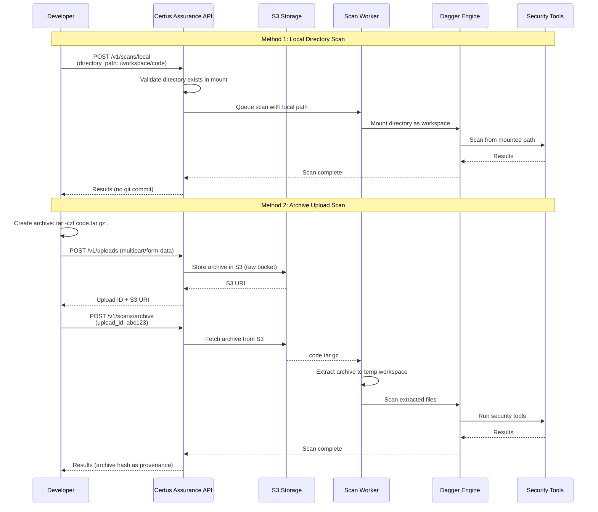

# Tutorial: Scanning Without Git

**Time:** 15 minutes
**Prerequisites:** Docker, completed [Quick Start](quick-start-cli-scan.md)
**What you'll learn:** Scan local directories and archives without requiring git

## Overview

Not all code lives in git repositories. This tutorial shows you how to:

1. **Scan a local directory** - No git required, perfect for development
2. **Scan an uploaded archive** - Perfect for third-party libraries and CI artifacts
3. **Compare provenance tracking** - Understand how each method tracks code identity

## What You'll Learn

- Scan code without git repositories
- Upload and scan .tar.gz archives
- Understand provenance tracking for different source types
- Choose the right scanning method for your workflow

## How Non-Git Scanning Works



**Key Points**:

- **Local directory**: Fast, no upload, but requires Docker mount
- **Archive upload**: Works remotely, portable, creates content-addressable ID
- **Provenance tracking**: Archives get SHA-256 hash; local directories use path + timestamp

## Prerequisites

Start the Certus Assurance service:

```bash
# Start the service
just assurance-up

# Verify it's running
curl http://localhost:8056/health | jq .
```

**Ensure S3 buckets exist:**

The upload process requires S3 buckets in LocalStack. Check if they exist:

```bash
# Check if buckets exist
docker exec localstack awslocal s3 ls s3://raw
docker exec localstack awslocal s3 ls s3://golden
```

If either command fails, create the buckets:

```bash
# Create buckets if they don't exist
docker exec localstack awslocal s3 mb s3://raw
docker exec localstack awslocal s3 mb s3://golden
```

**Note:** These buckets should be created automatically by `just up`, but if LocalStack restarted or volumes were cleared, you may need to recreate them.

## Step 1: Scan a Local Directory

### 1.1 Prepare a sample directory

Create a simple Python project:

```bash
# Create project directory
mkdir -p ~/tmp/my-local-project
cd ~/tmp/my-local-project

# Create a simple Python app
cat > app.py <<'EOF'
#!/usr/bin/env python3
import os

# TODO: This should use environment variables
API_KEY = "sk-1234567890abcdef"  # Hardcoded secret!

def fetch_data():
    """Fetch data from API."""
    import requests
    response = requests.get(
        "https://api.example.com/data",
        headers={"Authorization": f"Bearer {API_KEY}"}
    )
    return response.json()

if __name__ == "__main__":
    data = fetch_data()
    print(data)
EOF

# Create requirements.txt
cat > requirements.txt <<'EOF'
requests==2.26.0
flask==2.0.1
EOF

echo "✓ Sample project created at ~/tmp/my-local-project"
```

### 1.2 Mount the directory in Docker

The directory needs to be accessible from within the Docker container.

Edit `certus_assurance/deploy/docker-compose.yml` and add a volume mount:

```yaml
services:
  certus-assurance:
    volumes:
      - ../../:/app
      - ~/tmp/my-local-project:/scans/my-project # Add this line
```

Restart the service:

```bash
just assurance-down
just assurance-up
```

### 1.3 Scan the directory

```bash
# Create the scan
SCAN_ID=$(curl -s -X POST http://localhost:8056/v1/security-scans \
  -H "Content-Type: application/json" \
  -d '{
    "workspace_id": "tutorial",
    "component_id": "local-project",
    "assessment_id": "dir_scan_'$(date +%s)'",
    "source_type": "directory",
    "directory_path": "/scans/my-project",
    "manifest": {
      "product": "my-local-project",
      "version": "dev",
      "profiles": [{"name": "light", "description": "Security scan", "tools": []}]
    }
  }' | jq -r '.test_id')

echo "Directory scan started: $SCAN_ID"
```

### 1.4 Check scan status

```bash
# Wait for completion
while true; do
  STATUS=$(curl -s http://localhost:8056/v1/security-scans/$SCAN_ID | jq -r '.status')
  echo "Status: $STATUS"
  if [ "$STATUS" = "SUCCEEDED" ] || [ "$STATUS" = "FAILED" ]; then break; fi
  sleep 2
done

# View results
curl -s http://localhost:8056/v1/security-scans/$SCAN_ID | jq .
```

### 1.5 Examine provenance

```bash
# Check the source metadata
curl -s http://localhost:8056/v1/security-scans/$SCAN_ID | jq '{
  source_type,
  provenance_id,
  directory_path,
  content_hash
}'
```

**You should see:**

```json
{
  "source_type": "directory",
  "provenance_id": "a1b2c3d4e5f6...",
  "directory_path": "/scans/my-project",
  "content_hash": "a1b2c3d4e5f6..."
}
```

**Note:** The `provenance_id` is a SHA256 hash of the directory contents. If you modify any file, the hash changes.

## Step 2: Scan an Uploaded Archive

### 2.1 Create an archive

Package the same project as a .tar.gz:

```bash
cd ~/tmp
tar czf my-app-1.0.tar.gz my-local-project/

echo "✓ Archive created: ~/tmp/my-app-1.0.tar.gz"
ls -lh my-app-1.0.tar.gz
```

### 2.2 Upload the archive

```bash
# Upload to Certus
UPLOAD_RESPONSE=$(curl -s -X POST http://localhost:8056/v1/security-scans/upload-archive \
  -F "file=@$HOME/tmp/my-app-1.0.tar.gz")

# Extract the archive path
ARCHIVE_PATH=$(echo $UPLOAD_RESPONSE | jq -r '.archive_path')
ARCHIVE_HASH=$(echo $UPLOAD_RESPONSE | jq -r '.archive_hash')

echo "✓ Archive uploaded"
echo "  Path: $ARCHIVE_PATH"
echo "  Hash: $ARCHIVE_HASH"
```

### 2.3 Scan the uploaded archive

```bash
# Create scan from archive
SCAN_ID_2=$(curl -s -X POST http://localhost:8056/v1/security-scans \
  -H "Content-Type: application/json" \
  -d '{
    "workspace_id": "tutorial",
    "component_id": "archived-project",
    "assessment_id": "archive_scan_'$(date +%s)'",
    "source_type": "archive",
    "archive_path": "'$ARCHIVE_PATH'",
    "manifest": {
      "product": "my-app-archive",
      "version": "1.0",
      "profiles": [{"name": "light", "description": "Security scan", "tools": []}]
    }
  }' | jq -r '.test_id')

echo "Archive scan started: $SCAN_ID_2"
```

### 2.4 Wait for results

```bash
# Wait for completion
while true; do
  STATUS=$(curl -s http://localhost:8056/v1/security-scans/$SCAN_ID_2 | jq -r '.status')
  echo "Status: $STATUS"
  if [ "$STATUS" = "SUCCEEDED" ] || [ "$STATUS" = "FAILED" ]; then break; fi
  sleep 2
done

# View results
curl -s http://localhost:8056/v1/security-scans/$SCAN_ID_2 | jq .
```

### 2.5 Examine archive provenance

```bash
# Check the source metadata
curl -s http://localhost:8056/v1/security-scans/$SCAN_ID_2 | jq '{
  source_type,
  provenance_id,
  archive_path,
  archive_hash,
  archive_name
}'
```

**You should see:**

```json
{
  "source_type": "archive",
  "provenance_id": "def789...",
  "archive_path": "/artifacts/uploads/1735488000000_my-app-1.0.tar.gz",
  "archive_hash": "def789...",
  "archive_name": "my-app-1.0.tar.gz"
}
```

**Note:** The `provenance_id` is the SHA256 hash of the archive file. This is immutable - the same archive always has the same hash.

## Step 3: Compare the Results

### 3.1 View security findings

Both scans found the same issues in the code:

```bash
# Directory scan findings
echo "=== Directory Scan Findings ==="
curl -s http://localhost:8056/v1/security-scans/$SCAN_ID | jq '.artifacts'

# Archive scan findings
echo "=== Archive Scan Findings ==="
curl -s http://localhost:8056/v1/security-scans/$SCAN_ID_2 | jq '.artifacts'
```

Both should find:

- **Hardcoded API key** in `app.py` (detect-secrets)
- **requests==2.26.0** vulnerability (trivy)
- Other security issues

### 3.2 Compare provenance

```bash
# Side-by-side comparison
echo "Directory provenance:"
curl -s http://localhost:8056/v1/security-scans/$SCAN_ID | \
  jq -r '.provenance_id'

echo ""
echo "Archive provenance:"
curl -s http://localhost:8056/v1/security-scans/$SCAN_ID_2 | \
  jq -r '.provenance_id'
```

**Key difference:**

- **Directory hash**: Changes every time you edit files
- **Archive hash**: Immutable for the same .tar.gz file

## Step 4: Understanding When to Use Each

### Use Directory Scanning When:

✓ **Developing locally** - Scan work-in-progress code
✓ **No git repository** - Projects not in version control
✓ **Fast iteration** - Quick feedback during development
✓ **Testing scanners** - Experiment with security tools

```bash
# Example: Daily development scan
curl -X POST http://localhost:8056/v1/security-scans \
  -H "Content-Type: application/json" \
  -d '{
    "source_type": "directory",
    "directory_path": "/scans/my-project",
    ...
  }'
```

### Use Archive Scanning When:

✓ **Third-party libraries** - Scan dependencies from npm, PyPI, Maven
✓ **CI/CD artifacts** - Scan build outputs
✓ **Immutable provenance** - Need unchanging hash
✓ **Air-gapped environments** - No network access required

```bash
# Example: Supply chain scanning
# 1. Upload third-party library
curl -X POST http://localhost:8056/v1/security-scans/upload-archive \
  -F "file=@vendor-lib-1.0.tar.gz"

# 2. Scan it
curl -X POST http://localhost:8056/v1/security-scans \
  -d '{"source_type": "archive", "archive_path": "...", ...}'
```

### Use Git Scanning When:

✓ **CI/CD pipelines** - Automated scanning on commits
✓ **Reproducible builds** - Git SHA provides perfect provenance
✓ **Team workflows** - Scan code from repositories
✓ **Audit trails** - Link scans to specific commits

```bash
# Example: CI/CD scan
curl -X POST http://localhost:8056/v1/security-scans \
  -d '{
    "source_type": "git",
    "git_url": "https://github.com/example/repo.git",
    "commit": "'$CI_COMMIT_SHA'",
    ...
  }'
```

## Step 5: Cleanup

```bash
# Remove test directory
rm -rf ~/tmp/my-local-project
rm ~/tmp/my-app-1.0.tar.gz

# Remove volume mount from docker-compose.yml
# (Edit certus_assurance/deploy/docker-compose.yml and remove the line)

# Restart service
just assurance-down
just assurance-up
```

## What You Learned

✅ Scanned a local directory without git
✅ Uploaded and scanned a .tar.gz archive
✅ Understood provenance tracking for each source type
✅ Learned when to use each scanning method

## Next Steps

- **Tutorial:** [End-to-End Workflow](end-to-end-workflow.md) - Complete Trust → Transform → Ask pipeline
- **Reference:** [Multi-Source Scanning Guide](../../reference/multi-source-scanning.md) - Detailed API documentation
- **Tutorial:** [Custom Manifests](custom-manifests.md) - Control which tools run

## Troubleshooting

For common issues and solutions, see the [Certus Assurance Troubleshooting Guide](../../reference/troubleshooting/certus_assurance.md).

**Quick fixes:**

- **Directory not found** - [Configure volume mounts](../../reference/troubleshooting/certus_assurance.md#directory-not-found)
- **Archive upload failed** - [Check supported formats](../../reference/troubleshooting/certus_assurance.md#archive-upload-failed-or-unsupported-file-type)
- **Scan stuck in QUEUED** - [Check service logs](../../reference/troubleshooting/certus_assurance.md#scan-stuck-in-queued)
