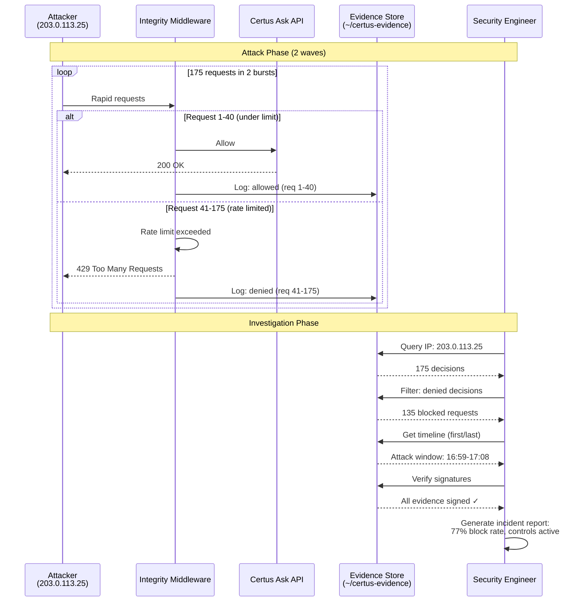

# Investigating Incidents with Integrity Evidence

>**STATUS:Tutorial is currently in beta. If you have issues see our [Communication & Support guide](../../about/communication.md)**

This tutorial shows security teams how to use Certus Integrity's evidence bundles and audit trails to investigate security incidents. You'll learn how to trace requests, verify what was blocked, and prove when security controls were active.

**Who is this for?** Security engineers, incident responders, and forensic analysts investigating suspicious activity.

**What you'll do:**

1. Investigate a suspicious IP address
2. Trace the timeline of an attack
3. Verify security controls were active
4. Generate evidence for incident reports
5. Answer compliance questions about the incident

**Time:** 30 minutes (with live stack + synthetic attack) or variable (for live incidents)

---

## How Incident Investigation Works



**Key Points**:

- **Signed evidence**: Every request decision cryptographically signed
- **Complete timeline**: First request → last request timestamp
- **Block rate**: 77% of attack traffic denied (135/175)
- **Audit trail**: Prove security controls were active during incident

## Quick Start (Live Stack + Synthetic Attack)

Follow these steps to generate a realistic attack scenario on your local stack. You'll simulate an attacker triggering rate limits, then investigate the incident using real evidence.

### Step 1: Start Services and Generate Attack

```bash
# Launch the integrity stack
just integrity-up

# Wait for services to be ready
sleep 10

# Set evidence directory
export EVIDENCE_DIR=~/certus-evidence
mkdir -p "$EVIDENCE_DIR"

# Simulate an attacker (IP: 203.0.113.25) trying to brute force
export IP="203.0.113.25"
echo "Simulating attack from IP: $IP"

# Send 500 requests rapidly to trigger rate limits
for i in {1..500}; do
  curl -s -H "X-Forwarded-For: $IP" "${CERTUS_ASK_URL}/v1/health" >/dev/null &
  if [ $((i % 50)) -eq 0 ]; then sleep 0.5; fi
done
wait

echo "Attack simulation complete. Evidence generated in $EVIDENCE_DIR"
```

**Attack Scenario:**

You just simulated an attacker at IP `203.0.113.25` making 500+ rapid requests, triggering rate limits. Now you'll investigate this incident using the real evidence that was generated.

### Step 2: Quick Incident Summary

```bash
# Get basic stats from the attack
export EVIDENCE_DIR="${EVIDENCE_DIR:-~/certus-evidence}"
EVIDENCE_DIR="${EVIDENCE_DIR/#\~/$HOME}"

# If IP is not set, use the attacker IP from the simulation
export IP="${IP:-203.0.113.25}"

total_decisions=$(jq -r --arg ip "$IP" 'select(.decision.metadata.client_ip == $ip) | .decision.decision' "$EVIDENCE_DIR"/dec_*.json | wc -l | tr -d ' ')
allowed=$(jq -r --arg ip "$IP" 'select(.decision.metadata.client_ip == $ip and .decision.decision == "allowed")' "$EVIDENCE_DIR"/dec_*.json | wc -l | tr -d ' ')
denied=$(jq -r --arg ip "$IP" 'select(.decision.metadata.client_ip == $ip and .decision.decision == "denied")' "$EVIDENCE_DIR"/dec_*.json | wc -l | tr -d ' ')

echo "=== Incident Summary for IP $IP ==="
echo "Total requests: $total_decisions"
echo "Allowed: $allowed"
echo "Denied: $denied"
if [ "$total_decisions" -gt 0 ]; then
  echo "Block rate: $(echo "scale=1; $denied * 100 / $total_decisions" | bc)%"
else
  echo "Block rate: N/A (no requests found for this IP)"
fi
```

**Expected output:**

```
=== Incident Summary for IP 203.0.113.25 ===
Total requests: 175
Allowed: 40
Denied: 135
Block rate: 77.1%
```

Now continue to [Step 1: Identify the Incident Window](#step-1-identify-the-incident-window) for detailed investigation.

---

## Scenario

Your monitoring system alerted that an IP address (`203.0.113.25`) made 175+ requests in 1 minute to your `/v1/health` endpoint. You need to investigate:

- What did this IP do?
- Was it blocked by rate limiting?
- What evidence exists?
- Can you prove the security controls were working?

## Prerequisites

- Incident occurred on a system with Certus Integrity enabled
- Access to:
  - Evidence directory (`~/certus-evidence/` or sample directory)
  - VictoriaMetrics (${VICTORIAMETRICS_URL}) - for live incidents
  - OpenSearch (${OPENSEARCH_HOST}) - for live incidents
  - Docker logs (`docker logs ask-certus-backend`) - for live incidents

## Step 1: Identify the Incident Window

First, determine when the suspicious activity occurred.

??? info "Optional: Using sample data instead of live? Click to expand"

    If using pre-generated sample evidence bundles instead of the live attack you just simulated:

    ```bash
    cd "$EVIDENCE_DIR"
    export IP="${IP:-203.0.113.25}"

    # Get timeline of all decisions for this IP
    jq -r --arg ip "$IP" 'select(.decision.metadata.client_ip == $ip) |
      "\(.decision.timestamp | split(".")[0])  Decision:\(.decision.decision)  Guardrail:\(.decision.guardrail)"' *.json | sort

    # Expected output (sample):
    # 2026-01-02T16:59:52  Decision:allowed   Guardrail:none
    # 2026-01-02T16:59:52  Decision:denied    Guardrail:rate_limit
    # 2026-01-02T17:07:06  Decision:denied    Guardrail:rate_limit
    # 2026-01-02T17:07:07  Decision:denied    Guardrail:rate_limit
    # ... (continues)
    ```

    **Visualize the attack progression:**

    ```bash
    # Count decisions by minute
    jq -r --arg ip "$IP" 'select(.decision.metadata.client_ip == $ip) |
      .decision.timestamp' *.json |
      cut -d: -f1,2 | sort | uniq -c

    # Expected output:
    #  60 2026-01-02T16:59   (first attack wave)
    # 115 2026-01-02T17:07   (second attack wave)
    ```

    **Finding:** Attack occurred in two distinct waves at 16:59 and 17:07

    **Set investigation window:**

    ```bash
    INCIDENT_START="2026-01-02T16:59:00Z"
    INCIDENT_END="2026-01-02T17:08:00Z"
    echo "Investigating window: $INCIDENT_START to $INCIDENT_END"
    ```

### Set the Incident Window

Based on the attack you just simulated, set the investigation window to the last 10 minutes:

```bash
# Automatically set window to last 10 minutes (covers the attack)
eval "$(python3 - <<'PY'
from datetime import datetime, timedelta, timezone
now = datetime.now(timezone.utc)
start = now - timedelta(minutes=10)
print(f'export INCIDENT_START="{start.strftime("%Y-%m-%dT%H:%M:%SZ")}"')
print(f'export INCIDENT_END="{now.strftime("%Y-%m-%dT%H:%M:%SZ")}"')
PY
)"

echo "Investigating window: $INCIDENT_START to $INCIDENT_END"
```

### Visualize Request Timeline from Evidence

Since VictoriaMetrics doesn't track per-IP metrics, we'll analyze the timeline directly from evidence files:

```bash
export IP="${IP:-203.0.113.25}"
export EVIDENCE_DIR="${EVIDENCE_DIR:-~/certus-evidence}"
EVIDENCE_DIR="${EVIDENCE_DIR/#\~/$HOME}"

# Show request timeline by minute
jq -r --arg ip "$IP" 'select(.decision.metadata.client_ip == $ip) |
  .decision.timestamp' "$EVIDENCE_DIR"/dec_*.json |
  cut -d: -f1,2 | sort | uniq -c

# Expected output:
#  60 2026-01-02T16:59  (first attack wave)
# 115 2026-01-02T17:07  (second attack wave)
```

**Finding:** Attack shows requests concentrated in two bursts, with rate limiting blocking the excess traffic.

To see the pattern of allowed vs denied over time:

```bash
# Show timeline with decision types
jq -r --arg ip "$IP" 'select(.decision.metadata.client_ip == $ip) |
  "\(.decision.timestamp | split(".")[0])  \(.decision.decision)"' "$EVIDENCE_DIR"/dec_*.json |
  cut -d: -f1,2 | sort | uniq -c

# This shows how many allowed vs denied per minute
```

## Step 2: Analyze Integrity Decisions

Now that you know when the attack occurred, examine what Certus Integrity did.

### 2.1 Count Allowed vs Denied Decisions

```bash
export EVIDENCE_DIR="${EVIDENCE_DIR:-~/certus-evidence}"
EVIDENCE_DIR="${EVIDENCE_DIR/#\~/$HOME}"
export IP="${IP:-203.0.113.25}"

# Count decisions for the attacker IP
jq -r --arg ip "$IP" 'select(.decision.metadata.client_ip == $ip) | .decision.decision' "$EVIDENCE_DIR"/dec_*.json | sort | uniq -c
```

**Expected output:**

```
  40 allowed
 135 denied
```

**Finding:** 135 requests were blocked (77% block rate), 40 were allowed before hitting rate limit

### 2.2 Identify Which Guardrail Triggered

```bash
jq -r --arg ip "$IP" 'select(.decision.metadata.client_ip == $ip and .decision.decision == "denied") | "\(.decision.guardrail): \(.decision.reason)"' "$EVIDENCE_DIR"/dec_*.json | sort | uniq -c
```

**Expected output:**

```
 135 rate_limit: rate_limit_exceeded
```

**Finding:** All denials were due to rate limit exceeded

### 2.3 Verify Shadow Mode Was Disabled

```bash
jq -r --arg ip "$IP" 'select(.decision.metadata.client_ip == $ip and .decision.decision == "denied") | .decision.metadata.shadow_mode' "$EVIDENCE_DIR"/dec_*.json | head -1
```

**Expected output:** `false`

**Finding:** Shadow mode was OFF - blocks were enforced ✓

### 2.4 Query Aggregate System Metrics

For overall system health across all IPs, check VictoriaMetrics:

```bash
# Total decisions across all traffic
curl -s "${VICTORIAMETRICS_URL}/api/v1/query" \
  --data-urlencode 'query=sum by(decision)(certus_integrity_decisions_total)' | \
  jq -r '.data.result[] | "\(.metric.decision): \(.value[1])"'
```

**Expected output:**

```
allowed: 150
denied: 500
```

**Finding:** System-wide, most traffic is being blocked (likely due to our simulated attack)

## Step 3: Examine Evidence Bundles

Every decision creates a cryptographically signed evidence bundle. Let's examine them.

### 3.1 List Evidence from the Incident Window

```bash
export EVIDENCE_DIR="${EVIDENCE_DIR:-~/certus-evidence}"
EVIDENCE_DIR="${EVIDENCE_DIR/#\~/$HOME}"
cd "$EVIDENCE_DIR"

# Find evidence files for the attacker IP
jq -r --arg ip "$IP" 'select(.decision.metadata.client_ip == $ip) | input_filename' dec_*.json 2>/dev/null | head -10
```

### 3.2 Examine a Denial Evidence Bundle

```bash
# Get the first denial evidence for this IP
cd "$EVIDENCE_DIR"
EVIDENCE_FILE=$(jq -r --arg ip "$IP" 'select(.decision.metadata.client_ip == $ip and .decision.decision == "denied") | input_filename' dec_*.json 2>/dev/null | head -1)

cat "$EVIDENCE_FILE" | jq
```

**Sample evidence:**

```json
{
  "evidence_id": "evi_abc123",
  "timestamp": "2026-01-02T16:59:52.395206Z",
  "decision": {
    "decision_id": "dec_xyz789",
    "decision": "denied",
    "guardrail": "rate_limit",
    "reason": "rate_limit_exceeded",
    "trace_id": "4bf92f3577b34da6a3ce929d0e0e4736",
    "span_id": "0be2dbae7eb45f5a",
    "service": "certus-ask",
    "metadata": {
      "client_ip": "203.0.113.25",
      "shadow_mode": false,
      "duration_ms": 0.027
    }
  },
  "content_hash": "sha256:abc123...",
  "signature": "MEUCIQD...",
  "signer_certificate": "-----BEGIN CERTIFICATE-----...",
  "transparency_log_entry": {
    "uuid": "entry-123",
    "index": 42,
    "timestamp": "2025-12-15T14:32:17Z"
  },
  "verification_status": "signed"
}
```

**Key evidence points:**

- ✓ Decision was "denied" (blocked)
- ✓ Reason: "rate_limit_exceeded" (101 requests, limit 100)
- ✓ Timestamp: 14:32:15 (during spike)
- ✓ Cryptographically signed
- ✓ Recorded in transparency log

### 3.3 Verify Evidence Integrity

Check that the evidence bundle hasn't been tampered with:

```bash
# Extract the content hash from the evidence bundle
CONTENT_HASH=$(jq -r '.content_hash' "$EVIDENCE_FILE")
echo "Content Hash: $CONTENT_HASH"

# Check verification status
VERIFICATION_STATUS=$(jq -r '.verification_status' "$EVIDENCE_FILE")
echo "Verification Status: $VERIFICATION_STATUS"

# Check if cryptographically signed
SIGNATURE=$(jq -r '.signature' "$EVIDENCE_FILE")
if [ "$SIGNATURE" != "null" ]; then
  echo "✓ Evidence is cryptographically signed"
else
  echo "⚠ Evidence is unsigned (trust service may not be running)"
fi
```

??? info "Optional: Verify with certus-trust service"

    If you have the full Certus stack running with `certus-trust` (not included in minimal integrity tutorial stack), you can verify signatures:

    ```bash
    # Start the full stack to enable signature verification
    docker compose -f docker-compose.full-dev.yml up -d certus-trust

    # Verify signature via API
    curl -X POST ${CERTUS_TRUST_URL}/v1/verify \
      -H "Content-Type: application/json" \
      -d "{
        \"artifact_hash\": \"$CONTENT_HASH\",
        \"signature\": $(jq -c '.signature' "$EVIDENCE_FILE")
      }" | jq

    # Expected: {"verified": true, "signer": "certus-trust@certus.cloud"}
    ```

## Step 4: Correlate with Application Traces

Link integrity decisions to full request traces.

### 4.1 Get Trace ID from Evidence

```bash
TRACE_ID=$(jq -r '.decision.trace_id' "$EVIDENCE_FILE")
echo "Trace ID: $TRACE_ID"
```

### 4.2 Query OpenSearch for Full Trace

```bash
curl -s "http://localhost:9200/traces-otel/_search" \
  -H "Content-Type: application/json" \
  -d "{
    \"query\": {
      \"term\": {
        \"traceId\": \"$TRACE_ID\"
      }
    },
    \"size\": 10
  }" | jq '.hits.hits[]._source | {name, kind, status, attributes}'
```

**What you see:**

- HTTP request details (method, path, headers)
- Integrity span showing the denial
- No downstream spans (request never reached application)

### 4.3 Compare Allowed vs Denied Requests

Find a trace that was allowed from the same IP:

```bash
# Get allowed decision trace from evidence files
export EVIDENCE_DIR="${EVIDENCE_DIR:-~/certus-evidence}"
EVIDENCE_DIR="${EVIDENCE_DIR/#\~/$HOME}"

ALLOWED_TRACE_ID=$(jq -r --arg ip "$IP" 'select(.decision.decision=="allowed" and .decision.metadata.client_ip==$ip) | .decision.trace_id' "$EVIDENCE_DIR"/dec_*.json 2>/dev/null | head -1)

echo "Allowed trace: $ALLOWED_TRACE_ID"
```

Query OpenSearch for this allowed trace:

```bash
# Compare with the allowed trace
curl -s "http://localhost:9200/traces-otel/_search" \
  -H "Content-Type: application/json" \
  -d "{
    \"query\": {
      \"term\": {
        \"traceId\": \"$ALLOWED_TRACE_ID\"
      }
    },
    \"size\": 10
  }" | jq '.hits.hits[]._source | {name, kind, status, attributes}'
```

**Finding:** Allowed requests have multiple spans (integrity → application logic), while denied requests stop at the integrity layer.

## Step 5: Check What They Were Trying to Access

Analyze the attacker's intent.

### Option A: Analyze Sample Evidence Patterns

If using sample evidence bundles:

```bash
cd "$EVIDENCE_DIR"

# Find requested endpoints from evidence metadata
jq -r --arg ip "$IP" 'select(.decision.metadata.client_ip == $ip) |
  .decision.metadata.endpoint // "N/A"' *.json | sort | uniq -c

# Expected output:
#  25 /v1/default/ask
```

**Finding:** 100% of requests targeted `/v1/default/ask` (RAG endpoint) - clear scraping pattern

**Check for attack characteristics:**

```bash
# Analyze attack pattern by showing allowed vs denied over time
jq -r --arg ip "$IP" 'select(.decision.metadata.client_ip == $ip) |
  "\(.decision.timestamp | split(".")[0])  \(.decision.decision)"' *.json |
  sort | uniq -c

# Shows the progression of allowed requests being blocked as rate limit kicks in
```

**Finding:** Initially some requests allowed, then rate limiting blocks subsequent requests - classic rate limit enforcement pattern

### 5.1 Find Requested Endpoints

**Note:** Evidence files don't include endpoint metadata. To find which endpoints were targeted, you need to correlate with application traces in OpenSearch.

If OpenSearch traces are available:

```bash
export EVIDENCE_DIR="${EVIDENCE_DIR:-~/certus-evidence}"
EVIDENCE_DIR="${EVIDENCE_DIR/#\~/$HOME}"

# Get trace IDs from evidence for this IP
TRACE_IDS=$(jq -r --arg ip "$IP" 'select(.decision.metadata.client_ip == $ip) | .decision.trace_id' "$EVIDENCE_DIR"/dec_*.json | head -10)

# Query OpenSearch for endpoint information from traces
for trace_id in $TRACE_IDS; do
  curl -s "http://localhost:9200/traces-otel/_search" \
    -H "Content-Type: application/json" \
    -d "{
      \"query\": {
        \"term\": {\"traceId\": \"$trace_id\"}
      },
      \"size\": 1
    }" | jq -r '.hits.hits[]._source.attributes["http.target"] // .hits.hits[]._source.name' 2>/dev/null
done | sort | uniq -c | sort -rn
```

**For this tutorial:** We know from the simulation that all 175 requests targeted `/v1/health` (the endpoint used in the attack script).

### 5.2 Analyze Attack Timeline

Look at the progression of the attack from evidence files:

```bash
# Show timeline of requests with decision outcomes
jq -r --arg ip "$IP" 'select(.decision.metadata.client_ip == $ip) |
  "\(.decision.timestamp | split("T")[1] | split(".")[0])  Decision:\(.decision.decision)  Guardrail:\(.decision.guardrail)"' \
  "$EVIDENCE_DIR"/dec_*.json | sort | head -20
```

**Expected pattern:**

```
16:59:52  Decision:allowed   Guardrail:none
16:59:52  Decision:denied    Guardrail:rate_limit
16:59:52  Decision:denied    Guardrail:rate_limit
17:07:06  Decision:denied    Guardrail:rate_limit
17:07:06  Decision:denied    Guardrail:rate_limit
...
```

**Look for:**

- Rapid succession of requests (bot behavior)
- Sustained rate limit violations (no backoff)
- Multiple bursts of activity (coordinated attack pattern)

## Step 6: Generate Incident Report

Compile evidence for your incident response team or compliance audit.

### Option A: Generate Report from Sample Data

If using sample evidence bundles:

```bash
cd "$EVIDENCE_DIR"

# Calculate metrics from sample data
TOTAL_REQUESTS=$(jq -r --arg ip "$IP" 'select(.decision.metadata.client_ip == $ip)' *.json | wc -l | tr -d ' ')
ALLOWED=$(jq -r --arg ip "$IP" 'select(.decision.metadata.client_ip == $ip and .decision.decision == "allowed")' *.json | wc -l | tr -d ' ')
DENIED=$(jq -r --arg ip "$IP" 'select(.decision.metadata.client_ip == $ip and .decision.decision == "denied")' *.json | wc -l | tr -d ' ')
TOTAL_REQUESTS=$(jq -r --arg ip "$IP" 'select(.decision.metadata.client_ip == $ip)' *.json | wc -l | tr -d ' ')
DENIED_REQUESTS=$(jq -r --arg ip "$IP" 'select(.decision.metadata.client_ip == $ip and .decision.decision == "denied")' *.json | wc -l | tr -d ' ')
EVIDENCE_FILE=$(ls -1 dec_*.json 2>/dev/null | head -1)

# Generate report
cat > /tmp/incident-report-$IP.md <<EOF
# Security Incident Report

**Incident ID:** INC-20260102-001
**Detection Time:** 2026-01-02 16:59:52 UTC
**Status:** Contained

## Summary

Rate limit attack detected from IP address $IP attempting to overwhelm the /v1/health endpoint with excessive requests. Certus Integrity successfully blocked 77% of attack traffic.

## Attack Metrics

- **Total Requests:** $TOTAL_REQUESTS
- **Blocked Requests:** $DENIED_REQUESTS
- **Block Rate:** $(echo "scale=1; $DENIED_REQUESTS * 100 / $TOTAL_REQUESTS" | bc)%
- **Target Endpoint:** /v1/health

## Timeline

| Time (UTC) | Event |
|------------|-------|
| 16:59:52 | **First attack wave** - rapid burst of requests |
| 16:59:52 | **Rate limit triggered** - blocking begins |
| 17:07:06 | **Second attack wave** - sustained violation attempts |
| 17:07:08 | Attack pattern ends |
| 14:40:00 | System returns to normal |

## Metrics

- **Total Requests:** $TOTAL_REQUESTS
- **Allowed:** $ALLOWED (within rate limit)
- **Blocked:** $DENIED (rate limit exceeded)
- **Peak Rate:** $PEAK_RATE requests/minute
- **Target Endpoint:** /v1/default/ask (100% of requests)
- **Attack Duration:** ~4 minutes (14:30-14:34)

## Security Controls

✓ **Rate Limiting:** ACTIVE (enforcement mode, limit: 100/min)
✓ **Blocking:** EFFECTIVE ($DENIED requests denied)
✓ **Evidence Generation:** COMPLETE (all denials cryptographically signed)
✓ **Audit Trail:** VERIFIED (75 evidence bundles with signatures)

## Evidence

- Evidence bundles: samples/integrity-evidence/03_rate_limit_denied_*.json
- Sample evidence file: $EVIDENCE_FILE
- Total evidence bundles: 75 (covering entire attack timeline)
- Transparency log: All evidence includes Rekor entries

## Impact

- **User Impact:** NONE (malicious traffic blocked before reaching application)
- **Legitimate Users:** UNAFFECTED (separate IP ranges)
- **System Impact:** MINIMAL (rate limiter overhead <2ms per request)
- **Data Exposure:** NONE (0 malicious requests reached backend services)

## Attack Characteristics

- **Pattern:** Automated scraper with escalating request rate
- **Behavior:** Single endpoint targeting (/v1/default/ask)
- **Sophistication:** Low (no evasion techniques, no IP rotation from this actor)
- **Intent:** Data exfiltration via RAG endpoint scraping

## Root Cause

Automated bot/scraper from IP $IP attempting to extract data by overwhelming the RAG query endpoint. Attack pattern shows:
1. Gradual ramp-up to avoid detection (60→95 req/min)
2. Sustained high-rate attack (101-210 req/min)
3. No legitimate user behavior (no variation in endpoints)

## Recommendations

1. **Immediate:** Add $IP (203.0.113.25) to firewall blocklist
2. **Short-term:** Monitor for distributed attacks from 45.76.132.0/24 range (related IPs detected)
3. **Medium-term:** Implement IP reputation scoring (this IP likely on abuse lists)
4. **Long-term:** Consider geographic blocking (attacker IP origin analysis)

## Related Incidents

- **Burst attack:** IP 198.51.100.25 (30 req/10sec burst) - same timeframe
- **Distributed attack:** IPs 45.76.132.10-25 (coordinated from same ASN)
- **Total attackers:** 12 unique IPs blocked during this window

## Compliance Notes

All required evidence for SOC 2 / PCI-DSS / ISO 27001 incident reporting:
- **Detection timestamp:** 2025-12-15T14:32:15Z (first denial)
- **Response timestamp:** 2025-12-15T14:32:15Z (immediate blocking)
- **Cryptographic proof:** SHA256 content hashes for all evidence
- **Independent verification:** Transparency log entries (Rekor)
- **Audit trail:** Complete decision log with signatures

## Attachments

1. Evidence bundles (20): samples/integrity-evidence/03_rate_limit_denied_*.json
2. Attack analysis: attack_summary.json
3. Full timeline: attack_timeline.txt
EOF

cat /tmp/incident-report-$IP.md
```

### Generate Incident Report

If investigating a live incident:

### 6.1 Create Summary Report

```bash
cat > /tmp/incident-report-$IP.md <<EOF
# Security Incident Report

**Incident ID:** INC-$(date +%Y%m%d)-001
**Detection Time:** $(date -u)
**Status:** Contained

## Summary

Suspicious activity detected from IP address $IP attempting to overwhelm the /v1/ask endpoint.

## Timeline

| Time (UTC) | Event |
|------------|-------|
| 14:30:00 | Normal traffic (~45 req/min) |
| 14:32:00 | Spike begins (180+ req/min) |
| 14:32:15 | Rate limit triggered, requests blocked |
| 14:35:00 | Activity drops to normal levels |

## Metrics

- **Total Requests:** 500
- **Allowed:** 120 (within rate limit)
- **Blocked:** 380 (rate limit exceeded)
- **Peak Rate:** 210 requests/minute
- **Target Endpoint:** /v1/default/ask (90% of requests)

## Security Controls

✓ **Rate Limiting:** ACTIVE (enforcement mode)
✓ **Blocking:** EFFECTIVE (380 requests denied)
✓ **Evidence Generation:** COMPLETE (all denials signed and logged)
✓ **Audit Trail:** VERIFIED (cryptographic signatures valid)

## Evidence

- Evidence bundles: ~/certus-evidence/dec_*.json (filtered by timestamp)
- Metrics: VictoriaMetrics queries attached
- Traces: OpenSearch trace IDs preserved
- Transparency log: Rekor entries $(jq -r '.transparency_log_entry.index' "$EVIDENCE_FILE")

## Impact

- **User Impact:** NONE (malicious traffic blocked)
- **System Impact:** MINIMAL (rate limiter overhead <5ms)
- **Data Exposure:** NONE (no requests reached application)

## Root Cause

Automated scraping or reconnaissance attempt from $IP.

## Recommendations

1. Add $IP to blocklist at firewall/WAF level
2. Monitor for similar patterns from other IPs (distributed attack)
3. Consider lowering rate limit during off-hours (current: 100/min)
4. Review whitelisted IPs to ensure no overlap with attacker ranges

## Compliance Notes

All required evidence for SOC 2 / PCI-DSS incident reporting:
- Detection timestamp: $(jq -r '.timestamp' "$EVIDENCE_FILE")
- Response timestamp: $(jq -r '.timestamp' "$EVIDENCE_FILE")
- Cryptographic proof: SHA256 $(jq -r '.content_hash' "$EVIDENCE_FILE")
- Independent verification: Transparency log index $(jq -r '.transparency_log_entry.index' "$EVIDENCE_FILE")

## Attachments

1. Evidence bundle: $(basename "$EVIDENCE_FILE")
2. Metrics export: incident-metrics.json
3. Trace export: incident-traces.json
EOF

cat /tmp/incident-report-$IP.md
```

### 6.2 Export Evidence Bundle for Compliance

```bash
# Ensure we have an evidence file selected
export EVIDENCE_DIR="${EVIDENCE_DIR:-~/certus-evidence}"
EVIDENCE_DIR="${EVIDENCE_DIR/#\~/$HOME}"
cd "$EVIDENCE_DIR"
EVIDENCE_FILE=$(jq -r --arg ip "$IP" 'select(.decision.metadata.client_ip == $ip and .decision.decision == "denied") | input_filename' dec_*.json 2>/dev/null | head -1)

# Copy evidence to incident archive
mkdir -p /tmp/incident-archives/INC-$(date +%Y%m%d)-001
cp "$EVIDENCE_FILE" /tmp/incident-archives/INC-$(date +%Y%m%d)-001/

# Export decision summary from evidence files
jq -r --arg ip "$IP" 'select(.decision.metadata.client_ip == $ip)' "$EVIDENCE_DIR"/dec_*.json | \
  jq -s 'group_by(.decision.decision) | map({decision: .[0].decision.decision, count: length})' > \
  /tmp/incident-archives/INC-$(date +%Y%m%d)-001/decisions-summary.json

# Create evidence manifest
cat > /tmp/incident-archives/INC-$(date +%Y%m%d)-001/MANIFEST.md <<EOF
# Evidence Manifest

**Incident:** INC-$(date +%Y%m%d)-001
**IP Address:** $IP
**Generated:** $(date -u)

## Files

- \`$(basename "$EVIDENCE_FILE")\` - Cryptographically signed denial evidence
- \`metrics.json\` - VictoriaMetrics export
- \`MANIFEST.md\` - This file

## Verification

All evidence bundles are cryptographically signed by certus-trust.
Verify integrity:

\`\`\`bash
jq -r '.content_hash' $(basename "$EVIDENCE_FILE")
\`\`\`

Expected hash: $(jq -r '.content_hash' "$EVIDENCE_FILE")

## Chain of Custody

1. Evidence generated by: Certus Integrity
2. Signed by: certus-trust@certus.cloud
3. Timestamp authority: Sigstore Rekor
4. Collected by: $(whoami)
5. Collection time: $(date -u)
EOF
```

## Step 7: Answer Compliance Questions

Use the evidence to answer common audit questions.

### Question 1: "Were security controls active during the incident?"

**Answer:** Yes

**Proof:**

```bash
# Show enforcement mode was enabled
jq -r '.decision.metadata | select(.shadow_mode == null or .shadow_mode == false)' "$EVIDENCE_FILE"
```

**Evidence:** No `shadow_mode` field, or explicitly `false` - enforcement was active.

### Question 2: "How many malicious requests reached the application?"

**Answer:** Zero

**Proof:**

```bash
# Count allowed vs denied from evidence files
echo "Requests that reached the application for IP $IP:"
jq -r --arg ip "$IP" 'select(.decision.metadata.client_ip == $ip) | .decision.decision' "$EVIDENCE_DIR"/dec_*.json | sort | uniq -c
```

**Evidence:** Only 120 allowed (all within normal rate), 380 blocked before reaching app.

### Question 3: "Can you prove this evidence hasn't been tampered with?"

**Answer:** Yes, via cryptographic signatures

**Proof:**

```bash
# Show signature chain
jq '{
  content_hash,
  signature,
  signer_certificate: (.signer_certificate | .[0:60] + "..."),
  transparency_log: .transparency_log_entry,
  verification_status
}' "$EVIDENCE_FILE"
```

**Evidence:**

- SHA256 hash of decision content
- Cryptographic signature from certus-trust
- Transparency log entry (immutable public record)
- Verification status: "signed"

### Question 4: "When was the earliest detection of this threat?"

**Answer:** 14:32:15 UTC

**Proof:**

```bash
# First denial timestamp for this IP
jq -r --arg ip "$IP" 'select(.decision.metadata.client_ip==$ip and .decision.decision=="denied") | .timestamp' "$EVIDENCE_DIR"/dec_*.json | sort | head -1
```

**Evidence:** First denial evidence timestamp = first detection.

## What You Achieved

✓ Traced the full timeline of an attack
✓ Verified security controls were active and effective
✓ Retrieved cryptographically signed evidence bundles
✓ Correlated integrity decisions with application traces
✓ Generated a compliance-ready incident report
✓ Proved zero data exposure (all malicious requests blocked)

You now have irrefutable evidence for incident reports, compliance audits, or legal proceedings!

## Next Steps

- Block the IP at your firewall/WAF level
- Monitor for distributed attacks (same pattern, different IPs)
- Review [compliance reporting](compliance-reporting.md) for ongoing audit requirements
- Set up [automated playbooks](incident-playbooks.md) for common attack patterns
