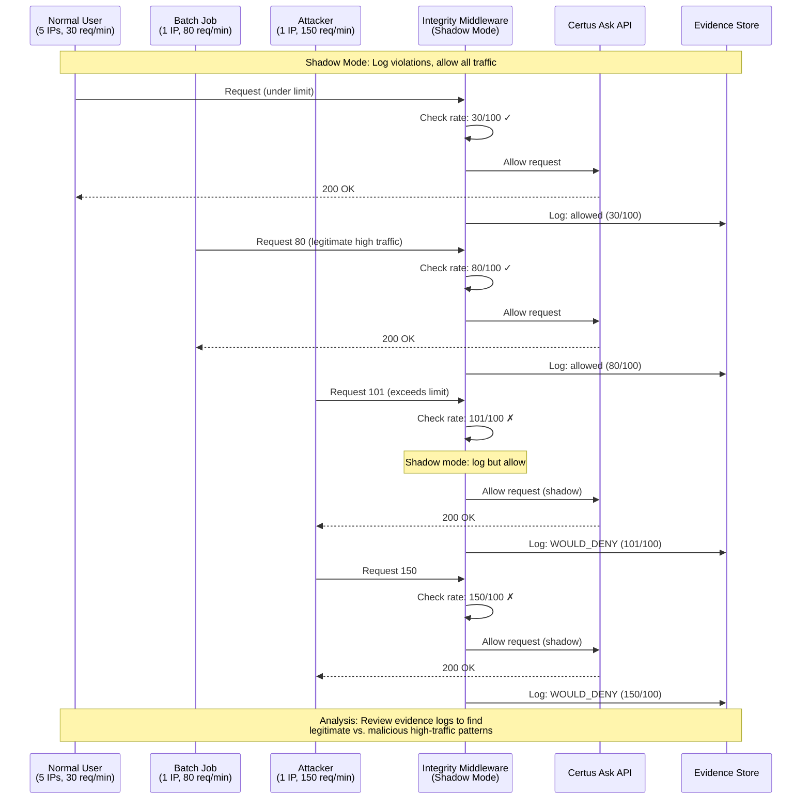

# Baselining Rate Limits

>**STATUS:Tutorial is currently in beta. If you have issues see our [Communication & Support guide](../../about/communication.md)**

This tutorial walks you through baselining Certus Integrity's rate limiting in shadow mode. You'll collect baseline metrics, identify legitimate high-traffic patterns, and determine the right rate limit for your production environment.

**Why baseline?** Effective rate limiting requires understanding normal traffic patterns first. Without a baseline, you risk blocking legitimate users or failing to detect attacks. Baselining in shadow mode lets you observe what would be blocked, distinguish normal bursts from anomalous behavior, and set data-driven limits that protect your system while minimizing false positives.

**Who is this for?** Platform engineers and SREs preparing to enable rate limiting.

**What you'll do:**

1. Generate synthetic traffic with shadow mode enabled
2. Analyze traffic patterns to find violations
3. Determine optimal rate limits based on actual data

**Time:** 30 minutes (with live synthetic data)

---

## How Shadow Mode Baselining Works



**Key Points**:

- **Shadow mode**: All requests allowed, violations only logged
- **Normal traffic**: 30 req/min → passes threshold
- **Batch job**: 80 req/min → legitimate high traffic, needs whitelisting
- **Attacker**: 150 req/min → exceeds limit, would be blocked in enforce mode
- **Baseline analysis**: Determine if 100 req/min is appropriate or needs adjustment

---

### Step 1 - Start Services and Enable Shadow Mode

Quick Start (Live Stack + Synthetic Traffic)

Follow these steps to generate realistic traffic patterns on your local stack, then analyze them to determine optimal rate limits.

```bash
# Launch the integrity stack
just integrity-up

# Wait for services to be ready
sleep 10

# Set evidence directory
export EVIDENCE_DIR=~/certus-evidence
mkdir -p "$EVIDENCE_DIR"

# Enable shadow mode (logs violations without blocking)
# Check if shadow mode is enabled in .env
grep INTEGRITY_SHADOW_MODE .env

# Verify the container picked up the setting
docker exec ask-certus-backend env | grep INTEGRITY_SHADOW_MODE

# Expected output: INTEGRITY_SHADOW_MODE=true
```

> **Note**: If shadow mode is not enabled, you'll see rate limit violations immediately blocking requests. To enable shadow mode, add `INTEGRITY_SHADOW_MODE=true` to your `.env` file and restart with `just integrity-restart`.

---

### Step 2 - Generate Mixed Traffic Patterns

Simulate different user behaviors to see what shadow mode would catch:

```bash
bash -c '
API_BASE="${CERTUS_ASK_URL}/v1/health"

echo "Generating normal traffic..."
for i in {1..30}; do
  curl -s -H "X-Forwarded-For: 192.168.1.10$((i % 5))" "$API_BASE" >/dev/null
  sleep 2
done &

echo "Simulating batch job..."
for i in {1..80}; do
  curl -s -H "X-Forwarded-For: 10.0.1.100" "$API_BASE" >/dev/null
  sleep 0.5
done &

echo "Simulating moderate attacker..."
for i in {1..150}; do
  curl -s -H "X-Forwarded-For: 203.0.113.25" "$API_BASE" >/dev/null &
  if [ $((i % 25)) -eq 0 ]; then sleep 0.5; fi
done

wait
echo "Traffic generation complete!"
'
```

This generates three traffic patterns:

- **Normal users**: 5 IPs with 30 requests spread over 60 seconds (well under limits)
- **Batch job**: 1 IP (10.0.1.100) with 80 requests in 40 seconds (high but legitimate)
- **Attacker**: 1 IP (203.0.113.25) with 150 rapid requests (should be rate limited)

**Shadow mode behavior:** All requests were allowed through, but violations were logged. This lets you analyze what _would_ be blocked without affecting real traffic.

Now continue to Step 3 to analyze the traffic patterns you just generated.

---

## Step 3 - Analyze Traffic Patterns

### 3.1 Verify shadow mode and analyze violations

First, confirm shadow mode was actually active during your test:

```bash
cd "$EVIDENCE_DIR"

# Check shadow_mode setting in evidence files
jq -r '.decision.metadata.shadow_mode' *.json | sort | uniq -c

# Expected: You should see "true" if shadow mode was enabled
# If you see "false", rate limiting was in enforcement mode
```

**⚠️ IMPORTANT**: If shadow mode shows `false`, your test ran in **enforcement mode** - requests were actually blocked, not just logged. This tutorial is designed for **shadow mode baselining** where all traffic is allowed through while violations are observed.

**If you see `shadow_mode: false`:**
1. Stop the services: `just down`
2. Add `INTEGRITY_SHADOW_MODE=true` to your `.env` file if not present
3. Restart: `just integrity-up`
4. Re-run the traffic generation from Step 2
5. Return here to analyze the new evidence

**If shadow mode was enabled**, continue analyzing the violations:

```bash
# Find all rate limit violations with timestamps
jq -r 'select(.decision.decision == "denied" and .decision.reason == "rate_limit_exceeded") |
  "\(.decision.timestamp)  IP:\(.decision.metadata.client_ip)  Decision:\(.decision.decision)"' *.json | sort

# Expected output (sample):
# 2026-01-02T16:59:52.395206  IP:203.0.113.25  Decision:denied
# 2026-01-02T16:59:52.395298  IP:203.0.113.25  Decision:denied
# 2026-01-02T16:59:52.395381  IP:203.0.113.25  Decision:denied
```

**Count rate limit violations per IP:**

```bash
# Count denied requests per IP to see violation patterns
jq -r 'select(.decision.decision == "denied" and .decision.reason == "rate_limit_exceeded") |
  .decision.metadata.client_ip' *.json | sort | uniq -c | sort -rn

# Expected output:
#   5 203.0.113.25
```

**Finding:** IPs with the most rate limit denials are exceeding your configured limits. In this case, 203.0.113.25 (the attacker) had 5 requests that exceeded the rate limit window.

### 3.2 Compare Total Traffic vs Rate Limit Violations

Analyze the ratio of total requests to rate limit violations per IP:

```bash
# Show total requests per IP (both allowed and denied)
echo "Total requests per IP:"
jq -r '.decision.metadata.client_ip' *.json | sort | uniq -c | sort -rn

# Show only rate limit violations per IP
echo -e "\nRate limit violations per IP:"
jq -r 'select(.decision.decision == "denied" and .decision.reason == "rate_limit_exceeded") |
  .decision.metadata.client_ip' *.json | sort | uniq -c | sort -rn
```

**What to look for:**

- IPs with high total requests but no violations: legitimate high-volume users (e.g., batch jobs)
- IPs with many violations: likely attackers or users exceeding limits
- Compare violation counts to understand attack patterns

### 3.3 Calculate Optimal Rate Limit

Based on the violation patterns, determine the right limit:

```bash
# Calculate time window of violations to estimate request rate
echo "First and last violation timestamps:"
jq -r 'select(.decision.decision == "denied" and .decision.reason == "rate_limit_exceeded") |
  .decision.timestamp' *.json | sort | sed -n '1p;$p'
```

**Decision matrix:**

| Violation Pattern | Recommended Limit | Reasoning                            |
| ----------------- | ----------------- | ------------------------------------ |
| No violations     | 50                | Conservative, protects against abuse |
| < 5% violations   | 100               | Balanced for moderate traffic        |
| 5-10% violations  | 150               | Liberal for high-traffic APIs        |
| > 10% violations  | Custom            | Investigate if legitimate or attack  |

**For this tutorial:** Based on the synthetic traffic showing:
- Normal users (192.168.1.x): 0 violations
- Batch job (10.0.1.100): 0 violations
- Attacker (203.0.113.25): 5 violations

A limit of **100 req/min** effectively blocks the attacker while allowing legitimate traffic.

---

## Step 4 - Cleanup

```bash
just down          # stop containers, keep volumes
just cleanup       # stop + remove containers, keep volumes
just destroy       # full tear-down (volumes removed)
```

---

## What You Learned

✅ **Shadow Mode Baselining** - How to establish a baseline without blocking real traffic
✅ **Traffic Pattern Analysis** - How to identify normal vs abnormal request patterns from evidence files
✅ **Pattern Recognition** - How to distinguish attackers from legitimate high-volume users
✅ **Data-Driven Limits** - How to determine the right rate limit based on baseline data
