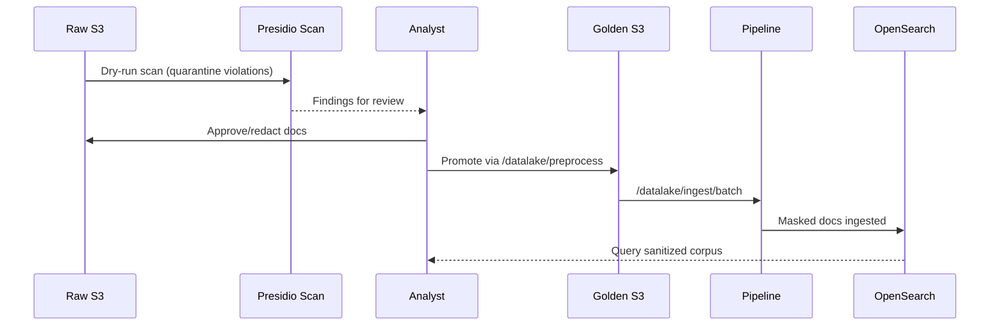

# Scenario: Privacy Screening & Rejection

This scenario shows how to stage a mixed-format knowledge pack (PDF, Markdown, RTF) and scan it for personally identifiable information (PII) with a Presidio guardrail before ingesting into the vector database. In this case, we are mirroring the
“raw → curated → consumption” pattern from data lakes. This pattern allows us to quarantine (or delete) violations without polluting downstream indexes and gives auditors a clear trail.

Things to note:

- Raw S3 is the untrusted landing zone and Golden S3 is the curated layer.
- Only Golden content flows into RAG/OpenSearch.
- Even after promotion, the pipeline runs Presidio anonymization a second time before writing to OpenSearch and suspected PII is masked.



## Prerequisites

- Working directory: project root unless noted otherwise.
- Ensure `.env` has the default `DATALAKE_RAW_BUCKET=raw`
- Have sample files in `samples/privacy-pack`

## Step 1 - Set-up

### 1.1 Bring up relevant services

```bash
just transform-up
```

### 1.2 Check if everything is ready for the tutorial

```bash
just preflight-transform
```

### 1.3 Configure `aws` CLI for LocalStack

```bash
aws configure set aws_access_key_id test
aws configure set aws_secret_access_key test
aws configure set default.region us-east-1
aws configure set profile.localstack.s3.endpoint_url ${S3_ENDPOINT}
```

**Note:** `${S3_ENDPOINT}` works with any S3-compatible storage (LocalStack, MinIO, DigitalOcean Spaces, etc.). For production AWS S3, skip this step and use real AWS credentials.

## Step 2 - Copy privacy files

We ship a ready-made bundle under `samples/privacy-pack/` so you can get started immediately. To protect the original files for future use, we will make a copy of the files for the transformations. If you prefer to skip the manual copy, the new data-prep API exposes `/v1/uploads/raw` so you can POST documents straight into `raw/active` without touching the filesystem.

```bash
mkdir -p ~/corpora
cp -R samples/privacy-pack ~/corpora/
ls ~/corpora/privacy-pack/raw
```

Feel free to add your own documents (PDF, Markdown, RTF) to `~/corpora/privacy-pack/raw/` if you want to extend the scenario. The preprocessing pipeline accepts these formats natively (via `FileTypeRouter` + Haystack converters), so no manual conversions are required.

## Step 3 - Datalake Quarantine

This scenario assumes every artifact has already been uploaded to S3 (via sync jobs, or direct client uploads). Instead of running the dry-run locally, we scan documents in-place in the S3 bucket, quarantine risky objects under a dedicated prefix, and only promote approved documents into the golden bucket. The entire workflow stays in S3, which mirrors how production pipelines enforce privacy when data lands in object storage first.

### Upload raw folder to S3

```bash
aws --endpoint-url=${S3_ENDPOINT} s3 sync \
  ~/corpora/privacy-pack/raw/ s3://raw/privacy-pack/incoming/
```

### Task 2: Run the S3-based Presidio scan

```bash
cat <<'PY' > /tmp/privacy_scan_s3.py
import os
from pathlib import Path

import boto3
from certus_integrity.services.presidio import get_analyzer

S3_ENDPOINT = os.getenv("S3_ENDPOINT", "http://localhost:4566")
RAW_BUCKET = "raw"
RAW_PREFIX = "privacy-pack/incoming/"
QUARANTINE_PREFIX = "privacy-pack/quarantine/"
REPORT_PATH = Path("~/corpora/privacy-pack/s3-privacy-report.txt").expanduser()

analyzer = get_analyzer()
s3 = boto3.client(
    "s3",
    endpoint_url=S3_ENDPOINT,
    aws_access_key_id="test",
    aws_secret_access_key="test",
    region_name="us-east-1",
)

report_lines: list[str] = []
resp = s3.list_objects_v2(Bucket=RAW_BUCKET, Prefix=RAW_PREFIX)
for item in resp.get("Contents", []):
    key = item["Key"]
    if key.endswith("/"):
        continue
    obj = s3.get_object(Bucket=RAW_BUCKET, Key=key)
    text = obj["Body"].read().decode("utf-8", errors="ignore")
    findings = analyzer.analyze(text=text, entities=[], language="en")
    if findings:
        report_lines.append(f"[BLOCK] s3://{RAW_BUCKET}/{key}\n")
        quarantine_key = key.replace(RAW_PREFIX, QUARANTINE_PREFIX, 1)
        s3.copy_object(Bucket=RAW_BUCKET, CopySource={"Bucket": RAW_BUCKET, "Key": key}, Key=quarantine_key)
        s3.delete_object(Bucket=RAW_BUCKET, Key=key)
    else:
        report_lines.append(f"[OK] s3://{RAW_BUCKET}/{key}\n")

REPORT_PATH.write_text("".join(report_lines))
print(f"Report written to {REPORT_PATH}")
PY

PYTHONPATH=. uv run python /tmp/privacy_scan_s3.py
```

The script uses `certus_integrity.services.presidio` which automatically falls back to a regex-based PII detector if the full Presidio library encounters compatibility issues.

Any `[BLOCK]` entries are automatically moved from `raw/.../incoming/` to `raw/.../quarantine/`. At this point a human reviewer can inspect the quarantine prefix (e.g., download from `s3://raw/privacy-pack/quarantine/`, redact, and decide whether to release the file). Approved items can be moved back to `raw/privacy-pack/incoming/` before the promotion step.

```bash
aws --endpoint-url ${S3_ENDPOINT} s3 ls s3://raw/privacy-pack/quarantine --recursive
```

```bash
2025-11-25 10:47:13        551 privacy-pack/quarantine/customer-onboarding.md
2025-11-25 10:47:13        760 privacy-pack/quarantine/intake-form.pdf
2025-11-25 10:47:13        272 privacy-pack/quarantine/legacy-contact.rtf
```

```bash
aws --endpoint-url ${S3_ENDPOINT} s3 cp s3://raw/privacy-pack/quarantine/customer-onboarding.md -
```

```bash
# Customer Onboarding Workflow

## Intake Data
- Full name: Jane Example
- Personal email: jane.example@contoso.com
- Mobile: +1-202-555-0148
- Mailing address: 1800 Mission St, San Francisco, CA 94103

## Controls
1. Encrypt uploaded IDs at rest (S3 SSE-KMS key `tap-priv`).
2. Redact contact details in support transcripts before sharing with vendors.
3. Retain onboarding packets for 90 days, then purge.

## Reviewer Notes
The pilot program in **RegionWest** allows temporary storage in the "quarantine" folder until Presidio approves release.
```

### Human-in-the-Loop Review

Share the quarantine report with a reviewer. They can pull specific files for inspection:

```bash
aws --endpoint-url=${S3_ENDPOINT} s3 cp \
  s3://raw/privacy-pack/quarantine/customer-onboarding.md \
  ~/Downloads/review/customer-onboarding.md
```

After review, you have several options:

**Option 1: Move approved/redacted files back to incoming**

After redaction or approval, move released files back into the incoming prefix so the automated promotion picks them up:

```bash
aws --endpoint-url=${S3_ENDPOINT} s3 mv \
  s3://raw/privacy-pack/quarantine/customer-onboarding.md \
  s3://raw/privacy-pack/incoming/customer-onboarding.md
```

To move all quarantined files back at once:

```bash
for file in customer-onboarding.md intake-form.pdf legacy-contact.rtf; do
  aws --endpoint-url=${S3_ENDPOINT} s3 mv \
    s3://raw/privacy-pack/quarantine/$file \
    s3://raw/privacy-pack/incoming/$file
done
```

**Option 2: Upload a clean test file**

For tutorial purposes, you can upload a file without PII to test the workflow end-to-end:

```bash
cat > /tmp/product-handoff.md << 'EOF'
# Product Handoff Documentation

## Product Overview
This document outlines the handoff process for the new feature release.

## Key Components
- Feature documentation
- API endpoints
- Configuration guides
- Deployment procedures

## Release Notes
Version 2.0 includes enhanced security features and improved performance.
EOF

aws --endpoint-url=${S3_ENDPOINT} s3 cp \
  /tmp/product-handoff.md s3://raw/privacy-pack/incoming/product-handoff.md
```

**Option 3: Archive permanently rejected files**

Leave permanently rejected files in `quarantine/` (or move them to an archive bucket) for audit trails:

```bash
aws --endpoint-url=${S3_ENDPOINT} s3 mv \
  s3://raw/privacy-pack/quarantine/legacy-contact.rtf \
  s3://archive/privacy-pack/rejected/legacy-contact.rtf
```

The remaining clean files (if any) stay under `raw/privacy-pack/incoming/`.

### Promote Clean Files to the Golden Bucket

Promote each clean document into the golden bucket:

```bash
curl -X POST "${CERTUS_ASK_URL}/v1/datalake/preprocess" \
  -H "Content-Type: application/json" \
  -d '{
    "source_key": "privacy-pack/incoming/customer-onboarding.md",
    "destination_prefix": "privacy-pack/golden"
  }'
```

Or promote the entire incoming prefix:

```bash
curl -X POST "${CERTUS_ASK_URL}/v1/datalake/preprocess/batch" \
  -H "Content-Type: application/json" \
  -d '{
    "source_prefix": "privacy-pack/incoming/",
    "destination_prefix": "privacy-pack/golden"
  }'
```

> Tip: the customer-side data-prep service exposes the same workflow at `POST ${CERTUS_TRANSFORM_URL}/v1/promotions/golden`. Send `{"keys":["privacy-pack/incoming/customer-onboarding.md"]}` (or a longer list) and it will copy everything into `golden/` without touching the SaaS backend credentials.

### Verify the curated objects:

```bash
aws --endpoint-url=${S3_ENDPOINT} s3 ls s3://golden/privacy-pack/golden/ --recursive
```

## Step 4 - Ingest from the Golden Bucket

Ingest the curated prefix directly from S3:

```bash
curl -X POST "${CERTUS_ASK_URL}/v1/datalake/ingest/batch" \
  -H "Content-Type: application/json" \
  -d '{"bucket": "golden", "prefix": "privacy-pack/golden/"}'
```

Behind the scenes the pipeline:

1. Downloads each golden object and routes it to the correct converter.
2. Cleans the text.
3. Runs Presidio again, anonymizing any residual PII.
4. Splits, embeds, and writes the chunks into OpenSearch.

Alternatively, have the on-prem data-prep service trigger SaaS ingestion for specific golden keys:

```bash
curl -s -X POST "${CERTUS_TRANSFORM_URL}/v1/ingest/security" \
  -H "Content-Type: application/json" \
  -d '{
        "workspace_id": "privacy-workspace",
        "keys": ["privacy-pack/golden/customer-onboarding.md","privacy-pack/golden/product-handoff.md"]
      }'
```

That endpoint simply forwards each key to `/v1/{workspace}/index/security/s3`, so you get the same SARIF/SPDX normalization without exposing additional credentials.

## Step 4. Verify Guardrail Behavior

- **Dashboards:** In OpenSearch Dashboards, filter `meta.source` for the new corpus and confirm that sensitive strings were masked.
- **API health:** `curl -s ${CERTUS_ASK_URL}/v1/health/rag | jq .` should stay `ok`.

- **Document** Search for the document in OpenSearch to verify masking

  ```bash
  curl "${OPENSEARCH_HOST}/ask_certus/_search?pretty" \
    -H 'Content-Type: application/json' \
    -d '{
      "query": { "match": { "content": "Customer Onboarding" } }
    }'
  ```

- **Ask a question:**

  ```bash
  curl -X POST "${CERTUS_ASK_URL}/v1/datalake-workspace/ask" \
    -H "Content-Type: application/json" \
    -d '{"question": "What privacy controls apply to customer onboarding?"}'

  ```

  Responses should cite the sanitized documents, demonstrating that only approved content entered the knowledge base.

## Step 5 - Cleanup

After testing, remove the uploaded artifacts and reports:

```bash
aws --endpoint-url=${S3_ENDPOINT} s3 rm s3://raw/privacy-pack --recursive
aws --endpoint-url=${S3_ENDPOINT} s3 rm s3://golden/privacy-pack --recursive
rm -rf ~/corpora/privacy-pack
rm -f ~/corpora/privacy-pack/privacy-report.txt ~/corpora/privacy-pack/s3-privacy-report.txt
aws --endpoint-url=${S3_ENDPOINT} s3 ls s3://raw/   # sanity check
```

To remove everything

```bash
just down          # stop containers, keep volumes
just cleanup       # stop + remove containers, keep volumes
just destroy       # full tear-down (volumes removed)
```

Without `just`, run the underlying scripts in `./scripts`. Re-run `just up` (or `./scripts/start-up.sh`) whenever you want to bring the stack back.
