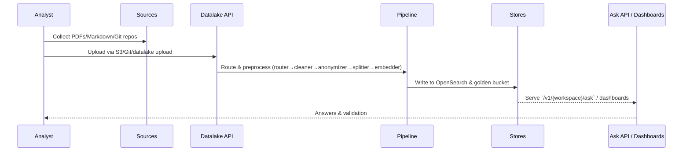

# Basic Document Ingestion

>**STATUS:Tutorial is currently in beta. If you have issues see our [Communication & Support guide](../../about/communication.md)**

This tutorial walks through moving raw content into the Certus TAP pipeline using the api (curl) and the Streamlit UI. The preprocessing pipeline already handles a mix of file types (Markdown, PDF, HTML, etc.) via its file-type router, anonymizer, and converter chain, so you can upload heterogeneous corpora without manual format conversion.

## Workflow Overview



## Prerequisites

- Working directory: project root unless noted otherwise
- Environment variables configured via `.envrc` (direnv will auto-load when you cd into the project)

## Step 1 - Set-up

### 1.1 Bring up relevant services

```bash
just transform-up
```

### 1.2 Check if everything is ready for the tutorial

```bash
just preflight-transform
```

## Step 2 - Single Document Ingestion

### 2.1 Upload a single document (PDF, TXT, DOCX, MD, etc.) directly to the API:

```bash
curl -X POST "${CERTUS_ASK_URL}/v1/default/index/" \
  -H "Content-Type: multipart/form-data" \
  -F "uploaded_file=@$(pwd)/samples/ingestion-examples/quick-start-guide.txt"
```

**Note:** `${CERTUS_ASK_URL}` is automatically set by your `.envrc` file:

- **Local development**: `http://localhost:8000`
- **DigitalOcean**: `https://ask.certus.example.com` (configure in `.envrc.digitalocean`)
- **Production**: Your production URL (configure in `.envrc.production`)

**Response:**

```json
{
  "ingestion_id": "550e8400-e29b-41d4-a716-446655440000",
  "message": "Indexed document document.pdf",
  "document_count": 42,
  "metadata_preview": [
    {
      "filename": "document.pdf",
      "source": "upload",
      "ingestion_id": "550e8400-e29b-41d4-a716-446655440000"
    }
  ]
}
```

The document is processed through the pipeline and indexed into OpenSearch for this workspace.

## Step 3 - Batch Document Ingestion

### 3.1 Upload all documents from a local folder (recursive):

**Note:** The path must be **absolute** from the backend container's perspective. Use `/app/samples` (the mounted samples directory) or an absolute filesystem path.

```bash
# Using the sample ingestion-examples folder (recommended - works everywhere)
curl -X POST "${CERTUS_ASK_URL}/v1/default/index_folder/" \
  -H "Content-Type: application/json" \
  -d '{
    "local_directory": "/app/samples/ingestion-examples"
  }'
```

Or with any absolute filesystem path

```bash
curl -X POST "${CERTUS_ASK_URL}/v1/default/index_folder/" \
  -H "Content-Type: application/json" \
  -d '{
    "local_directory": "/absolute/path/to/documents"
  }'
```

**Response:**

```json
{
  "ingestion_id": "550e8400-e29b-41d4-a716-446655440001",
  "message": "Indexed 15 files from /path/to/documents",
  "processed_files": 15,
  "failed_files": 2,
  "quarantined_documents": 3,
  "document_count": 127,
  "metadata_preview": [...]
}
```

This processes all files in the folder and subfolders, continuing on per-file errors.

This approach keeps your documents in persistent S3 storage and is better for production workflows.

## Step 4 - Verify & Query

### 4.1 using Curl:

```bash
# Query the default workspace
curl "${OPENSEARCH_HOST}/ask_certus_default/_search?pretty" \
  -H "Content-Type: application/json" \
  -d '{"query": {"match": {"content": "TAP"}}}'

```

Or query a custom workspace

```bash
curl "${OPENSEARCH_HOST}/ask_certus_my_workspace/_search?pretty" \
  -H "Content-Type: application/json" \
  -d '{"query": {"match": {"content": "TAP"}}}'
```

### 4.2 Ask a Question

Once the sample documents are indexed, confirm RAG retrieval by asking questions relevant to the ingested content:

```bash
# Query about features from quick-start-guide.txt
curl -X POST "${CERTUS_ASK_URL}/v1/default/ask" \
  -H "Content-Type: application/json" \
  -d '{"question":"What file formats does the system support?"}'
```

Or ask about the API endpoints from api-documentation.md

```bash
curl -X POST "${CERTUS_ASK_URL}/v1/default/ask" \
  -H "Content-Type: application/json" \
  -d '{"question":"How do I upload a single document using the API?"}'
```

Or ask about security findings from the SARIF file

```bash
curl -X POST "${CERTUS_ASK_URL}/v1/default/ask" \
  -H "Content-Type: application/json" \
  -d '{"question":"What shell injection vulnerabilities were found?"}'
```

??? note "Details on how ingestion works (click to expand)"

    ## How Ingestion Works: OpenSearch vs Neo4j

    The Certus TAP system uses two different backends for different purposes:

    ### OpenSearch (Document Search & RAG)

    **What it stores:**

    - Document chunks (split text with embeddings)
    - Full-text and semantic search indexes
    - Metadata (source, filename, ingestion_id, workspace_id, etc.)

    **How it works:**

    1. File is uploaded or pulled from source (S3, GitHub, local folder)
    2. **File-Type Router** detects format (PDF, TXT, DOCX, etc.)
    3. **Cleaner/Converter** extracts text and normalizes formatting
    4. **PII Anonymizer** detects and optionally redacts sensitive data
    5. **Splitter** breaks text into manageable chunks (overlap to preserve context)
    6. **Embedder** converts each chunk to a vector embedding
    7. Chunks + embeddings → indexed in OpenSearch
    8. **RAG Pipeline** retrieves relevant chunks when you ask a question

    **Use case:** "What are the key features?" → OpenSearch finds relevant document chunks → LLM generates answer with citations

    **Example workflow:**

    ```bash
    # Upload document
    curl -X POST "${CERTUS_ASK_URL}/v1/default/index/" \
      -F "uploaded_file=@guide.pdf"

    # Query
    curl -X POST "${CERTUS_ASK_URL}/v1/default/ask" \
      -H "Content-Type: application/json" \
      -d '{"question":"What are the key features?"}'
    ```

    ### Neo4j (Security Findings & Relationships)

    **What it stores:**

    - SARIF vulnerability findings (nodes: Finding, Location, File)
    - SPDX SBOM package dependencies (nodes: Package, Dependency, License)
    - Relationships between entities (Finding -[LOCATED_IN]-> Location -[FILE]-> File)

    **How it works:**

    1. SARIF or SPDX file is uploaded
    2. File is parsed to extract structured data
    3. **Graph Builder** creates nodes and relationships
    4. Stored in Neo4j as a queryable graph
    5. You can traverse relationships (e.g., "find all files affected by this CVE")

    **Use case:** "What packages does this vulnerability affect?" → Neo4j traverses dependency tree → returns all affected packages

    **Example workflow:**

    ```bash
    # Upload SARIF (security scan results) using sample file
    curl -X POST "${CERTUS_ASK_URL}/v1/default/index/security" \
      -F "uploaded_file=@/app/samples/ingestion-examples/security-findings.sarif"

    # Or with your own SARIF file
    curl -X POST "${CERTUS_ASK_URL}/v1/default/index/security" \
      -F "uploaded_file=@/absolute/path/to/bandit-results.sarif"

    # Query via Neo4j (or through dashboard)
    # MATCH (f:Finding {severity: "critical"})
    #   -[:LOCATED_IN]->(l:Location)
    #   -[:FILE]->(file:File)
    # RETURN f.title, file.path
    ```

    ### Key Differences

    | Aspect         | OpenSearch                     | Neo4j                           |
    | -------------- | ------------------------------ | ------------------------------- |
    | **Purpose**    | Document search & RAG          | Security graph & relationships  |
    | **Data**       | Text chunks + embeddings       | Structured findings & packages  |
    | **Query**      | Semantic similarity, full-text | Relationship traversal (Cypher) |
    | **File Types** | Any (PDF, TXT, MD, etc.)       | SARIF, SPDX only                |
    | **Use Case**   | "Find documents about X"       | "Find CVEs affecting package Y" |
    | **Default**    | All uploads go here            | SARIF/SPDX files only           |

    ### Diagram: Two-Backend Ingestion

    ```
    Regular Documents (PDF, TXT, etc.)
        ↓
    OpenSearch Pipeline → Chunks + Embeddings → OpenSearch Index
        ↓
    RAG Queries: "What is X?"

    Security Scan Files (SARIF, SPDX)
        ↓
    Both:
      - OpenSearch (for text search)
      - Neo4j (for graph queries)
        ↓
    Graph Queries: "What packages are affected?"
    ```

## Step 5 - Ingest Git Repo

### 5.1 Ingest a repo

Use `POST /v1/{workspace_id}/index/github` to clone and index a repo:

```bash
curl -X POST "${CERTUS_ASK_URL}/v1/default/index/github" \
  -H "Content-Type: application/json" \
  -d '{
        "repo_url": "https://github.com/deepset-ai/haystack.git",
        "branch": "main",
        "include_globs": ["**/*.md", "**/*.py"],
        "exclude_globs": ["**/tests/**"],
        "max_file_size_kb": 256
      }'
```

Key details:

- Shallow clone (`depth=1`) for quick ingestion.
- Globs control which files enter the pipeline (defaults target code + docs).
- Metadata stored per chunk includes `source="repository"`, repo URL, branch, commit.

To access private repos, provide `GITHUB_TOKEN` in `.env` (`https://token@github.com/...` is injected automatically).

### 5.2 Ask question about repo content

After the ingestion finishes, you can immediately query what was indexed. For example, ask about Haystack components:

```bash
curl -X POST "${CERTUS_ASK_URL}/v1/default/ask" \
  -H "Content-Type: application/json" \
  -d '{"question":"Which Haystack components are required to build a basic document-search pipeline?"}'
```

The RAG response now cites the freshly ingested Markdown/code files instead of generic knowledge.

## Step 6 - Clean-up

```bash
just down-transfotm          # stop containers, keep volumes
just cleanup       # stop + remove containers, keep volumes
just destroy       # full tear-down (volumes removed)
```

Without `just`, run the underlying scripts in `./scripts`. Re-run `just up` (or `./scripts/start-up.sh`) whenever you want to bring the stack back.
