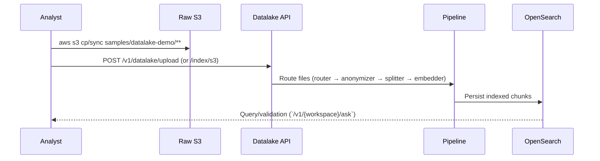

# Sample Datalake Upload

In this example, we are batch uploading and batch ingesting mix of documents (pdf, md, csv etc) and then asking basic questions fo the corpus.

We will use the baked-in `samples/datalake-demo/` bundle to practice `/datalake/upload` and verify LocalStack buckets without hunting for your own files.



## Prerequisites

- Working directory: project root unless noted otherwise
- Have sample files in `samples/datalake-demo`

## Step 1 - Set-up

### 1.1 Bring up relevant services

```bash
just transform-up
```

### 1.2 Check if everything is ready for the tutorial

```bash
just preflight-transform
```

### 1.3 Configure `aws` CLI for LocalStack

```bash
aws configure set aws_access_key_id test
aws configure set aws_secret_access_key test
aws configure set default.region us-east-1
aws configure set profile.localstack.s3.endpoint_url ${S3_ENDPOINT}
```

**Note:** `${S3_ENDPOINT}` works with any S3-compatible storage (LocalStack, MinIO, DigitalOcean Spaces, etc.). For production AWS S3, skip this step and use real AWS credentials.

## Step 2 - Upload Files to Datalake

Throughout this guide, we'll use the `datalake-workspace` workspace. Workspaces are created automatically when you first use them. If you would rather not call `aws s3` directly, the customer-run data-prep API at `${CERTUS_TRANSFORM_URL}/v1/uploads/raw` accepts multipart uploads and writes them into `raw/active/` using the credentials in `.env`.

**Note:** `${CERTUS_ASK_URL}` and `${CERTUS_TRANSFORM_URL}` are automatically set by your `.envrc` file (defaults to `http://localhost:8000` and `http://localhost:8100` for local development).

### 2.1 Upload Files to Datalake

Upload single file

```bash
aws --endpoint-url ${S3_ENDPOINT} s3 cp samples/datalake-demo/notes/team-sync.md s3://raw/samples/notes/team-sync.md
```

Upload all sample files to S3

```bash
aws --endpoint-url ${S3_ENDPOINT} s3 sync samples/datalake-demo s3://raw/samples/
```

**Note:** In production AWS, omit `--endpoint-url ${S3_ENDPOINT}` to use real AWS S3:

```bash
aws s3 sync samples/datalake-demo s3://your-production-bucket/samples/
```

### 2.2 List contents

```bash
aws --endpoint-url ${S3_ENDPOINT} s3 ls s3://raw/samples/ --recursive
```

## Step 3 - Trigger the Ingestion Pipeline

### 3.1 Ingest via API

Ingest a single file

```bash
curl -X POST "${CERTUS_ASK_URL}/v1/datalake-workspace/index/s3" \
  -H 'Content-Type: application/json' \
  -d '{
    "bucket_name": "raw",
    "prefix": "samples/notes/team-sync.md"
  }'
```

Ingest all sample files to the workspace

```bash
curl -X POST "${CERTUS_ASK_URL}/v1/datalake-workspace/index/s3" \
  -H 'Content-Type: application/json' \
  -d '{
    "bucket_name": "raw",
    "prefix": "samples/"
  }'
```

Ingest an entire bucket

> Prefer to keep ingestion orchestration on the data-prep side? Hit `POST ${CERTUS_TRANSFORM_URL}/v1/ingest/security` (or upcoming batch endpoints) with `{"keys":["samples/notes/team-sync.md"]}` and the service forwards each key to `/v1/{workspace}/index/security/s3` on the SaaS backend.

```bash
curl -X POST "${CERTUS_ASK_URL}/v1/datalake-workspace/index/s3" \
  -H 'Content-Type: application/json' \
  -d '{
    "bucket_name": "raw",
    "prefix": "/"
  }'
```

## Step 4 - Ask Questions against indexed data

### Query 1: Answered from team-sync.md

```bash
curl -X POST "${CERTUS_ASK_URL}/v1/datalake-workspace/ask" \
  -H 'Content-Type: application/json' \
  -d '{"question":"What rate limit did we configure for the web crawler?"}'
```

### Query 2: Answered from help-page.html

```bash
curl -X POST "${CERTUS_ASK_URL}/v1/datalake-workspace/ask" \
  -H 'Content-Type: application/json' \
  -d '{"question":"What type of file types does the API accept?"}'
```

## Step 5 - Exploring the privacy filter

Certus TAP runs in a privacy a default mode

**Anonymizer Behavior**

- The ingestion pipeline uses a Presidio-based component (`PresidioAnonymizer`) right after cleaning. It scans each chunk for PII entities (names, emails, phone numbers, etc.), logs what it finds, and either masks them (replacing text with `<PERSON>`, `<EMAIL>`, etc.) or quarantines the entire document if strict mode is enabled.
- The anonymizer runs before chunking/embedding, so anything it masks stays masked throughout the stack: OpenSearch, Neo4j, and `/ask` responses all see the sanitized text. Metadata captures include flags (`pii_anonymized`, `pii_count`, `quarantined`) so you can audit what was redacted.

**Toggling On/Off**

- Control is via the backend `.env` flag `ANONYMIZER_ENABLED` (defaults to `true`). On startup, `create_preprocessing_pipeline` checks `settings.anonymizer_enabled` and simply skips wiring the Presidio component when the flag is `false`.
- To disable anonymization for a run:
  1. Set `ANONYMIZER_ENABLED=false` in `.env`.
  2. Restart the backend container so it picks up the new env (e.g., `docker compose restart ask-certus-backend`). No rebuild is needed if `.env` sits next to `docker-compose.yml`.
  3. Re-ingest any documents you want in raw form. Previously masked text won’t “unmask” automatically—you must reprocess the source files.
- To re-enable masking, flip the flag back to `true`, restart again, and re-ingest. Future uploads will go through Presidio as before.

Try it!

### Query 3: Answered from customer-mapping.csv

```bash
curl -X POST "${CERTUS_ASK_URL}/v1/datalake-workspace/ask" \
  -H 'Content-Type: application/json' \
  -d '{"question":"Who is the success manager for Blue Orbital?"}'
```

Experiment with this by running the query twice: once with the anonymizer enabled and once with it disabled.

After restarting the backend service, you can use the following simple one-liner to quickly run the comparison and expedite the experiment.

??? note "Oneliner"

    ```bash
    WORKSPACE_ID=datalake-workspace aws --endpoint-url ${S3_ENDPOINT} s3 cp samples/datalake-demo/csv/customer-mapping.csv s3://raw/samples/customer-mapping.csv && curl -s -X POST "${CERTUS_ASK_URL}/v1/${WORKSPACE_ID}/index/s3" -H 'Content-Type: application/json' -d '{"bucket_name":"raw","prefix":"samples/customer-mapping.csv"}' >/dev/null && curl -s -X POST "${CERTUS_ASK_URL}/v1/${WORKSPACE_ID}/ask" -H 'Content-Type: application/json' -d '{"question":"Who is the success manager for Blue Orbital?"}'
    ```

Expected results with anonymizer on:

```bash
'{"question":"Who is the success manager for Blue Orbital?"}'
upload: samples/datalake-demo/csv/customer-mapping.csv to s3://raw/samples/customer-mapping.csv
{"reply":"No relevant findings in the current workspace."}%
```

Expected results with anonymizer off:

```bash
{"question":"Who is the success manager for Blue Orbital?"}'
upload: samples/datalake-demo/csv/customer-mapping.csv to s3://raw/samples/customer-mapping.csv
{"reply":"Jordan Lee. (Location: customer_name = \"Blue Orbital\")"}%
```

**Don't forget to re-enable the anonymizer feature in your .env**

## Step 6 - Cleaning Up

```bash
just down          # stop containers, keep volumes
just cleanup       # stop + remove containers, keep volumes
just destroy       # full tear-down (volumes removed)
```

Without `just`, run the underlying scripts in `./scripts`. Re-run `just up` (or `./scripts/start-up.sh`) whenever you want to bring the stack back.
