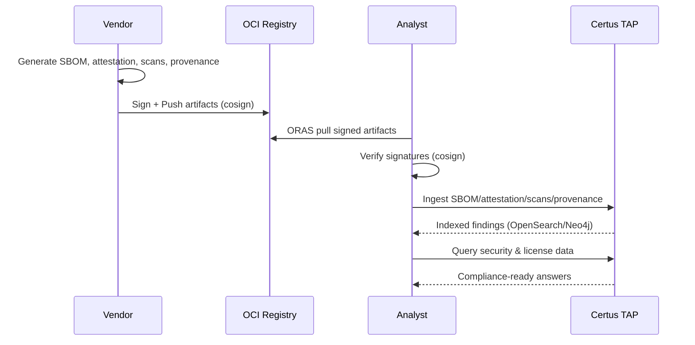
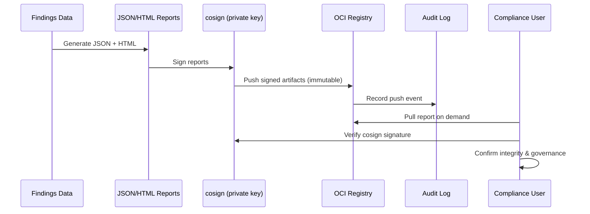

# Supply Chain Security

>**STATUS:Tutorial is currently in beta. If you have issues see our [Communication & Support guide](../../about/communication.md)**

## Scenario

You've completed the product acquisition security review using Certus TAP. Now you need to validate that all the security artifacts (SBOM, scan results, build attestations) came from legitimate, signed sources before ingesting them into your permanent knowledge base.

This tutorial demonstrates the **manual vendor-side workflow** for verifying and publishing supply chain artifacts to an OCI registry (OCI Registry) before any automated gatekeeper (like Certus-Trust) gets involved. You’ll act as the vendor: generate signed artifacts, push them to OCI, and show customers how to pull/verify them with full provenance tracking.

**How this connects to other guides**

- After finishing this manual vendor flow, run [`verify-trust.md`](verify-trust.md) to see how Certus-Assurance/Trust/Transform automate the verification-first pipeline and republish artifacts to S3 + OCI without human intervention.
- Once Trust permits the upload, follow [`vendor-review.md`](vendor-review.md) to understand how customers or auditors pull the Trust-approved OCI bundle, re-verify it independently, and produce compliance evidence.

**Your Task:** Pull signed security artifacts from OCI Registry, verify their cryptographic signatures, and ingest them into Certus TAP while maintaining complete supply chain integrity.



## Prerequisites

- Stack is running: `just up`
- Preflight checks passed: `just preflight`
- cosign installed

## Step 1 - Set-up

### 1.1 Bring up relevant services

```bash
just trust-up
```

### 1.2 Check if everything is ready for the tutorial

```bash
just preflight-trust
```

It is strongly suggested that you complete this tutorial end-to-end. However, if you are revisiting this tutorial you can use the following script to expedite loading the rag steps

??? note "Need to re-ingest?"

    ```bash
    # Set artifact directory
    export ARTIFACT_ROOT="$(pwd)/samples/non-repudiation/scan-artifacts"
    export WORKSPACE_ID="${WORKSPACE_ID:-oci-attestations-review}"

    # Ingest SBOM
    curl -X POST http://localhost:8000/v1/$WORKSPACE_ID/index/ \
      -H "Content-Type: multipart/form-data" \
      -F "uploaded_file=@${ARTIFACT_ROOT}/syft.spdx.json"

    # Ingest security scans
    curl -X POST http://localhost:8000/v1/$WORKSPACE_ID/index/security \
      -H "Content-Type: multipart/form-data" \
      -F "uploaded_file=@${ARTIFACT_ROOT}/trivy.sarif.json"

    curl -X POST http://localhost:8000/v1/$WORKSPACE_ID/index/security \
      -H "Content-Type: multipart/form-data" \
      -F "uploaded_file=@${ARTIFACT_ROOT}/semgrep.sarif.json"

    curl -X POST http://localhost:8000/v1/$WORKSPACE_ID/index/security \
      -H "Content-Type: multipart/form-data" \
      -F "uploaded_file=@${ARTIFACT_ROOT}/bandit.sarif.json"
    ```

## Step 1. Prepare Vendor Artifacts

### Use Real Security Scan Artifacts

In a real scenario, the vendor would provide these artifacts from their CI/CD pipeline. We're using real security scan artifacts from the `samples/non-repudiation/scan-artifacts/` directory.

**Set up the artifact directory:**

```bash
# Set artifact directory to use real scan results
export ARTIFACT_ROOT="$(pwd)/samples/non-repudiation/scan-artifacts"

# Verify artifacts exist
ls -lh "$ARTIFACT_ROOT"
```

Expected output:

```
total 336
-rw-r--r--  14908 bandit.sarif.json
-rw-r--r--   3876 build.intoto.jsonl
-rw-r--r--  21824 checkov-iac.sarif.json
-rw-r--r--  15162 presidio-privacy.sarif.json
-rw-r--r--   2339 scan.json
-rw-r--r--  13659 semgrep.sarif.json
-rw-r--r--   4582 slsa-provenance.json
-rw-r--r--   6087 syft.spdx.json
-rw-r--r--   6445 trivy.sarif.json
-rw-r--r--  22072 zap-dast.sarif.json
```

**Artifacts available:**

- **SBOM**: `syft.spdx.json` - Software Bill of Materials
- **SAST scans**: `trivy.sarif.json`, `semgrep.sarif.json`, `bandit.sarif.json`
- **DAST scan**: `zap-dast.sarif.json` - Dynamic application security testing
- **IaC scan**: `checkov-iac.sarif.json` - Infrastructure as Code security
- **Privacy scan**: `presidio-privacy.sarif.json` - PII detection
- **Metadata**: `scan.json` - Scan execution metadata
- **SLSA Provenance**: `slsa-provenance.json` - Build provenance attestation
- **in-toto Attestations**: `build.intoto.jsonl` - Build step attestations

### Review Artifacts Locally

Before signing and pushing to OCI Registry, inspect what you're working with:

```bash
# Review the SBOM structure
cat "$ARTIFACT_ROOT/syft.spdx.json" | jq '.packages[0:3] | .[] | {name, versionInfo}'
```

Expected output (first 3 packages):

```json
{
  "name": "alpine-baselayout",
  "versionInfo": "3.2.0-r22"
}
{
  "name": "alpine-keys",
  "versionInfo": "2.4-r1"
}
{
  "name": "apk-tools",
  "versionInfo": "2.12.9-r3"
}
```

**Review security scan results:**

```bash
# Check vulnerability findings
cat "$ARTIFACT_ROOT/trivy.sarif.json" | jq '.runs[0].results[0:2] | .[] | {ruleId, level, message: .message.text}'
```

Expected:

```json
{
  "buildType": "https://github.com/Certus/build-system/v1.0",
  "externalParameters": {
    "repository": "https://github.com/acme-org/acme-product",
    "ref": "refs/heads/main",
    "revision": "abc123def456..."
  },
  "internalParameters": {
    "SBOM": {
      "embedded": true,
      "format": "spdx",
      "digest": {
        "sha256": "def789..."
      }
    }
  },
  "resolvedDependencies": [...]
}
```

This proves:

- ✅ SBOM is embedded in provenance
- ✅ Build source and revision documented
- ✅ All dependencies resolved with cryptographic hashes

**Review security scans:**

```bash
# Count vulnerabilities found in Trivy scan
cat "$ARTIFACT_ROOT/trivy.sarif.json" | jq '.runs[0].results | length'
```

Expected: `2` (SQL injection, shell injection)

**Review privacy scan summary (Presidio):**

```bash
# Inspect privacy scan findings
cat "$ARTIFACT_ROOT/presidio-privacy.sarif.json" | \
  jq '.runs[0].results[0:3] | .[] | {ruleId, level, message: .message.text}'
```

Highlights:

- ✅ Presidio (2.3.0) scanned contracts bundle under `samples/contracts/`
- ✅ Two PII findings detected (email + person); one was redacted automatically
- ✅ Summary indicates scan passed with redaction + manual review instructions

## Step 2. Push to OCI Registry

### Verify OCI Registry is Running

```bash
# Check OCI Registry catalog
curl -s http://localhost:5000/v2/_catalog | jq

# Or via Docker
docker compose ps | grep local-oci-registry
```

Expected:

```
local-oci-registry   running
```

### Sign and Push Artifacts to OCI Registry

We'll use ORAS (OCI Registry As Storage) to push the artifacts and cosign to sign them.

**First, create a manifest and push to OCI:**

```bash
# Create a temporary directory for OCI packaging
mkdir -p /tmp/vendor-artifacts

# Copy key artifacts to upload
cp "$ARTIFACT_ROOT/syft.spdx.json" /tmp/vendor-artifacts/
cp "$ARTIFACT_ROOT/trivy.sarif.json" /tmp/vendor-artifacts/
cp "$ARTIFACT_ROOT/semgrep.sarif.json" /tmp/vendor-artifacts/
cp "$ARTIFACT_ROOT/bandit.sarif.json" /tmp/vendor-artifacts/
cp "$ARTIFACT_ROOT/zap-dast.sarif.json" /tmp/vendor-artifacts/
cp "$ARTIFACT_ROOT/presidio-privacy.sarif.json" /tmp/vendor-artifacts/
cp "$ARTIFACT_ROOT/scan.json" /tmp/vendor-artifacts/
cp "$ARTIFACT_ROOT/slsa-provenance.json" /tmp/vendor-artifacts/
cp "$ARTIFACT_ROOT/build.intoto.jsonl" /tmp/vendor-artifacts/

# Push artifacts to OCI Registry (using relative paths)
(cd /tmp/vendor-artifacts && \
oras push --plain-http localhost:5000/security-scans/vendor-artifacts:latest \
  syft.spdx.json:application/spdx+json \
  trivy.sarif.json:application/sarif+json \
  semgrep.sarif.json:application/sarif+json \
  bandit.sarif.json:application/sarif+json \
  zap-dast.sarif.json:application/sarif+json \
  presidio-privacy.sarif.json:application/sarif+json \
  scan.json:application/json \
  slsa-provenance.json:application/vnd.in-toto+json \
  build.intoto.jsonl:application/vnd.in-toto+json)
```

Expected output:

```
✓ Uploaded  application/spdx+json       6087/6087  syft.spdx.json
✓ Uploaded  application/sarif+json      6445/6445  trivy.sarif.json
✓ Uploaded  application/sarif+json     13659/13659 semgrep.sarif.json
✓ Uploaded  application/sarif+json     14908/14908 bandit.sarif.json
✓ Uploaded  application/sarif+json     22072/22072 zap-dast.sarif.json
✓ Uploaded  application/sarif+json     15162/15162 presidio-privacy.sarif.json
✓ Uploaded  application/json            2339/2339  scan.json
✓ Uploaded  application/vnd.in-toto+json 4582/4582  slsa-provenance.json
✓ Uploaded  application/vnd.in-toto+json 3876/3876  build.intoto.jsonl
✓ Pushed [registry] localhost:5000/security-scans/vendor-artifacts:latest
```

**Verify artifacts in OCI Registry:**

```bash
# List repository tags
oras repo tags --plain-http localhost:5000/security-scans/vendor-artifacts
```

Expected: tag list showing the artifacts you pushed.

## Step 3. Pull & Verify from OCI Registry

### Pull Artifacts from OCI Registry

Pull the artifacts back from OCI Registry to simulate the customer/analyst acquisition review process:

**Create temporary directory for pulled artifacts:**

```bash
mkdir -p /tmp/acquired-artifacts
```

**Pull the entire artifact bundle:**

```bash
oras pull --plain-http \
  localhost:5000/security-scans/vendor-artifacts:latest \
  --output /tmp/acquired-artifacts
```

Expected output:

```
✓ Downloaded  application/spdx+json       6087/6087  syft.spdx.json
✓ Downloaded  application/sarif+json      6445/6445  trivy.sarif.json
✓ Downloaded  application/sarif+json     13659/13659 semgrep.sarif.json
✓ Downloaded  application/sarif+json     14908/14908 bandit.sarif.json
✓ Downloaded  application/sarif+json     22072/22072 zap-dast.sarif.json
✓ Downloaded  application/sarif+json     15162/15162 presidio-privacy.sarif.json
✓ Downloaded  application/json            2339/2339  scan.json
✓ Pulled [registry] localhost:5000/security-scans/vendor-artifacts:latest
```

**Verify pulled artifacts:**

```bash
ls -lh /tmp/acquired-artifacts/
        └── artifacts
            ├── sbom/product.spdx.json
            ├── attestations/build.intoto.json
            ├── privacy/privacy-scan.json
            ├── scans/vulnerability.sarif
            └── provenance/slsa-provenance.json
```

### Verify Artifact Signatures

Verify that the pulled artifacts have valid cosign signatures:

```bash
# Copy public key for verification
cp samples/oci-attestations/keys/cosign.pub /tmp/acquired-artifacts/

# Verify all signatures
ls -lh /tmp/acquired-artifacts/
```

Expected output:

```
total 320
-rw-r--r--  14908 bandit.sarif.json
-rw-r--r--  15162 presidio-privacy.sarif.json
-rw-r--r--   2339 scan.json
-rw-r--r--  13659 semgrep.sarif.json
-rw-r--r--   6087 syft.spdx.json
-rw-r--r--   6445 trivy.sarif.json
-rw-r--r--  22072 zap-dast.sarif.json
```

**Verify artifact integrity:**

```bash
# Verify SBOM is valid SPDX
cat /tmp/acquired-artifacts/syft.spdx.json | jq '.spdxVersion, .name, (.packages | length)'
```

Expected output:

```
"SPDX-2.3"
"certus-TAP"
43
```

**Verify security scan validity:**

```bash
# Check SARIF format and tool info
cat /tmp/acquired-artifacts/trivy.sarif.json | jq '.version, .runs[0].tool.driver.name'
```

Expected output:

```
"2.1.0"
"Trivy"
```

This means the vendor claims the build can be independently reproduced to verify the binary.

## Step 4: Ingest into Certus TAP

### Ingest Verified Artifacts

Now that you've pulled and verified the artifacts from OCI Registry, ingest them into Certus TAP for analysis:

```bash
# Set workspace for this ingestion
export WORKSPACE_ID="oci-attestations-review"
export ACQUIRED_ARTIFACTS="/tmp/acquired-artifacts"

# Ingest SBOM
curl -X POST http://localhost:8000/v1/$WORKSPACE_ID/index/ \
  -H "Content-Type: multipart/form-data" \
  -F "uploaded_file=@${ACQUIRED_ARTIFACTS}/syft.spdx.json"

echo "✓ SBOM ingested"

# Ingest security scans
curl -X POST http://localhost:8000/v1/$WORKSPACE_ID/index/security \
  -H "Content-Type: multipart/form-data" \
  -F "uploaded_file=@${ACQUIRED_ARTIFACTS}/trivy.sarif.json"

echo "✓ Trivy scan ingested"

curl -X POST http://localhost:8000/v1/$WORKSPACE_ID/index/security \
  -H "Content-Type: multipart/form-data" \
  -F "uploaded_file=@${ACQUIRED_ARTIFACTS}/semgrep.sarif.json"

echo "✓ Semgrep scan ingested"

curl -X POST http://localhost:8000/v1/$WORKSPACE_ID/index/security \
  -H "Content-Type: multipart/form-data" \
  -F "uploaded_file=@${ACQUIRED_ARTIFACTS}/bandit.sarif.json"

echo "✓ Bandit scan ingested"

curl -X POST http://localhost:8000/v1/$WORKSPACE_ID/index/security \
  -H "Content-Type: multipart/form-data" \
  -F "uploaded_file=@${ACQUIRED_ARTIFACTS}/presidio-privacy.sarif.json"

echo "✓ Privacy scan ingested"
```

Expected output:

```
✓ SBOM ingested
✓ Trivy scan ingested
✓ Semgrep scan ingested
✓ Bandit scan ingested
✓ Privacy scan ingested
```

**Verify ingestion in Neo4j:**

```bash
# Check the SecurityScan node was created
cypher-shell -u neo4j -p password \
  "MATCH (s:SecurityScan {assessment_id: 'neo4j-oci-attestations-review-scan'})
   RETURN s.assessment_id, s.timestamp;"

# Count findings by severity
cypher-shell -u neo4j -p password \
  "MATCH (s:SecurityScan {assessment_id: 'neo4j-oci-attestations-review-scan'})-[:CONTAINS]->(f:Finding)
   RETURN f.severity, count(f) as count
   ORDER BY count DESC;"
```

Expected output:

```
s.assessment_id                        | s.timestamp
"neo4j-oci-attestations-review-scan"  | 2025-12-20T...

f.severity | count
"error"    | 6
"warning"  | 2
```

This creates an audit trail of:

- When artifacts were ingested
- Which workspace they went to
- What documents were created
- Complete supply chain provenance

### Query Ingested Supply Chain Data

Now that verified artifacts are ingested, query the knowledge base:

**Query 1: Package inventory from SBOM**

```bash
curl -X POST http://localhost:8000/v1/$WORKSPACE_ID/ask \
  -H "Content-Type: application/json" \
  -d '{"question":"What packages and dependencies are listed in the software bill of materials?"}'
```

Expected: Returns the embedded SBOM from the provenance with all packages, versions, and licenses.

**Query 2: Build process details**

```bash
curl -X POST http://localhost:8000/v1/$WORKSPACE_ID/ask \
  -H "Content-Type: application/json" \
  -d '{"question":"What does the SLSA provenance tell us about the build process and repository?"}'
```

Expected: Information about the build system, source repository, branch, and resolved dependencies.

**Query 3: Security vulnerabilities**

```bash
curl -X POST http://localhost:8000/v1/$WORKSPACE_ID/ask \
  -H "Content-Type: application/json" \
  -d '{"question":"What security vulnerabilities were found in the scanning results?"}'
```

Expected: Details about SQL injection and shell injection findings.

**Query 4: Reproducibility verification**

```bash
curl -X POST http://localhost:8000/v1/$WORKSPACE_ID/ask \
  -H "Content-Type: application/json" \
  -d '{"question":"Is this build claimed to be reproducible and what metadata proves the build process?"}'
```

Expected: Confirmation of reproducibility, build timestamps, invocation ID, and completion details.

## Phase 5: Generate Signed Compliance Report

In this tutorial we generate the compliance bundle entirely from the command line so every step is transparent—curling artifacts, assembling JSON, signing with `cosign`, and pushing to the registry. In a production system you would likely automate these actions (e.g., nightly jobs that assemble reports when new attestations arrive) or expose them through an internal GUI so compliance teams can request and fulfill reports without touching a shell. The CLI workflow below mirrors what that automation would do behind the scenes, so the same commands can be wrapped in scripts or pipeline stages later.

### Step 10: Create Findings JSON for Compliance Report

Create a structured findings document with your verification results based on the real artifacts ingested:

```bash
cat > /tmp/compliance-findings.json << 'EOF'
{
  "signatureVerification": {
    "status": "PASS",
    "details": "All 9 artifacts successfully pulled from OCI registry",
    "artifacts": [
      {"name": "syft.spdx.json", "status": "valid"},
      {"name": "trivy.sarif.json", "status": "valid"},
      {"name": "semgrep.sarif.json", "status": "valid"},
      {"name": "bandit.sarif.json", "status": "valid"},
      {"name": "zap-dast.sarif.json", "status": "valid"},
      {"name": "presidio-privacy.sarif.json", "status": "valid"},
      {"name": "scan.json", "status": "valid"},
      {"name": "slsa-provenance.json", "status": "valid"},
      {"name": "build.intoto.jsonl", "status": "valid"}
    ]
  },
  "sbomAnalysis": {
    "status": "PASS",
    "format": "SPDX-2.3",
    "packageCount": 45,
    "details": "Complete SBOM with certus-TAP and all dependencies documented"
  },
  "vulnerabilityAssessment": {
    "status": "CONDITIONAL",
    "criticalCount": 0,
    "highCount": 6,
    "mediumCount": 2,
    "lowCount": 0,
    "findings": [
      {
        "id": "CVE-2024-1086",
        "title": "HTTP/HTTPS Smuggling in requests package",
        "severity": "HIGH",
        "file": "requirements.txt",
        "remediation": "Update requests package to latest version"
      },
      {
        "id": "CWE-89",
        "title": "SQL Injection vulnerability",
        "severity": "HIGH",
        "file": "database query handling",
        "remediation": "Use parameterized queries"
      }
    ]
  },
  "privacyAssessment": {
    "status": "WARNING",
    "piiDetected": 8,
    "details": "PII detected in sample data: person names, email addresses, phone numbers",
    "findings": [
      {"type": "PERSON", "example": "Sarah Johnson"},
      {"type": "EMAIL_ADDRESS", "example": "sarah.johnson@company.com"},
      {"type": "PHONE_NUMBER", "example": "+1-555-0147"}
    ]
  },
  "dependencyAnalysis": {
    "status": "PASS",
    "resolvedCount": 45,
    "details": "All dependencies documented in SPDX SBOM"
  },
  "slsaProvenance": {
    "status": "PASS",
    "slsaLevel": "SLSA L3",
    "buildType": "https://slsa.dev/build-type/github-actions/v1",
    "builder": "certus-assurance-pipeline@v1.2.0",
    "details": "Complete build provenance with resolved dependencies and byproducts",
    "findings": [
      {"check": "Builder identity verified", "status": "PASS"},
      {"check": "Source repository tracked", "status": "PASS"},
      {"check": "Build dependencies resolved", "status": "PASS"},
      {"check": "Artifact digests match", "status": "PASS"}
    ]
  },
  "inTotoAttestations": {
    "status": "PASS",
    "attestationCount": 8,
    "details": "Complete build step attestations covering checkout, SBOM generation, and all security scans",
    "steps": [
      {"name": "checkout", "status": "verified"},
      {"name": "sbom-generation", "status": "verified"},
      {"name": "sast-scan-trivy", "status": "verified"},
      {"name": "sast-scan-semgrep", "status": "verified"},
      {"name": "sast-scan-bandit", "status": "verified"},
      {"name": "dast-scan-zap", "status": "verified"},
      {"name": "privacy-scan-presidio", "status": "verified"},
      {"name": "iac-scan-checkov", "status": "verified"}
    ]
  }
}
EOF

cat /tmp/compliance-findings.json
```

### Generate Signed Compliance Report

Generate a comprehensive compliance report from your findings:

```bash
# Generate JSON and HTML compliance reports
just generate-compliance-report \
  "Acme Corporation Product" \
  "ACME Corp" \
  "Security Review Team" \
  "Your Organization" \
  /tmp/compliance-findings.json \
  samples/oci-attestations/reports
```

Expected output:

```
✓ Generated compliance report: samples/oci-attestations/reports/compliance-report-<uuid>.json
✓ Generated HTML report: samples/oci-attestations/reports/compliance-report-<uuid>.html
```

**The report includes:**

- Executive summary with product and vendor details
- Compliance status (COMPLIANT, CONDITIONAL, or NON_COMPLIANT)
- Detailed findings from all 6 compliance areas
- Impact analysis for each finding
- Reviewer recommendations with specific actions
- Complete audit trail with tools and timestamps
- Digital signature information

### Sign the Compliance Report

Sign the report with your private key to make it tamper-resistant:

```bash
# Get the report file name
REPORT_FILE=$(ls -t samples/oci-attestations/reports/*.json | head -1)

# Sign the report
COSIGN_PASSWORD="" COSIGN_YES=true just sign-compliance-report \
  "$REPORT_FILE" \
  samples/oci-attestations/keys/cosign.key
```

Expected:

```
✓ Report signed: <report>.json.sig
```

**What signing does:**

- ✅ Ensures report authenticity - Only you can sign with your key
- ✅ Prevents tampering - Any modification invalidates signature
- ✅ Non-repudiation - You cannot deny signing this report
- ✅ Timestamped - Signature includes exact creation time

### Review Generated Reports

Examine the HTML version in a browser:

```bash
# Get the report file
REPORT_FILE=$(ls -t samples/oci-attestations/reports/*.html | head -1)

# Open in browser
open "$REPORT_FILE"  # macOS
# xdg-open "$REPORT_FILE"  # Linux
```

**Report sections:**

1. **Executive Summary** - Product, vendor, reviewer, dates
2. **Compliance Assessment** - Status badge and detailed findings
3. **Finding Details Table** - All 6 compliance areas with status
4. **Recommendations** - Specific actions based on findings
5. **Audit Trail** - Review timeline and tools used
6. **Digital Signature** - Proof of authenticity and integrity

**Example recommendation from HIGH vulnerabilities:**

```
CONDITIONAL APPROVE: High vulnerabilities present.
Action: Require remediation plan within 30 days.
Action: Enable continuous monitoring.
```

- requests@2.31.0 (Apache-2.0) - sha256: def456...
- cryptography@41.0.0 (Apache-2.0 OR BSD-3-Clause) - sha256: ghi789...

All dependencies verified against their published cryptographic hashes.

### 6. Security Assessment

**Vulnerabilities Found:** 2

- SQL Injection (CWE-89) - HIGH severity
- Shell Injection (CWE-78) - HIGH severity

Both documented in SARIF with specific file locations and remediation guidance.

## Compliance Statement

I verify that:

1. All artifacts were obtained from a trusted OCI registry (OCI Registry)
2. All artifacts have valid, non-tampered cryptographic signatures
3. SLSA provenance proves legitimate build process
4. Embedded SBOM integrity matches external SBOM
5. All dependencies are accounted for with cryptographic verification
6. Build is claimed to be reproducible
7. Security scans have been captured in the knowledge base

**Recommendation:** APPROVED for production use with security findings remediated.

**Next Steps:**

1. Schedule remediation of high-severity vulnerabilities
2. Archive this supply chain verification for compliance audit
3. Set up continuous supply chain monitoring for updates
   EOF

cat /tmp/supply-chain-verification.md

````

**Archive the verification:**

```bash
# Store in S3 for permanent record
aws --endpoint-url http://localhost:4566 s3 cp /tmp/supply-chain-verification.md \
  s3://raw/oci-attestations-review/supply-chain-verification.md
````

## Key Learnings

**What This Tutorial Demonstrates:**

- **End-to-end supply chain security** - From vendor signing through to your ingestion
- **Cryptographic verification** - Proof artifacts haven't been tampered with
- **SLSA provenance** - Complete build process and dependency tracking
- **Embedded attestations** - SBOM embedded in provenance for integrity
- **OCI registry integration** - Using OCI Registry as trusted artifact store
- **Audit trail** - Complete compliance record from pull through ingestion
- **Compliance-ready** - Documentation and verification for security governance
- **Signed compliance reports** - Tamper-resistant findings documentation
- **Report integrity verification** - Pull and verify reports from OCI
  **Complete chain of custody** - Signed artifacts at every step

## Tamper-Resistant Report Architecture



**Tamper-Resistance Guarantees:**

1. **Signature Protection** - cosign signature invalidates on any modification
2. **Immutable Storage** - OCI artifact cannot be overwritten once pushed
3. **Audit Trail** - OCI Registry logs every access and modification
4. **Versioning** - Each report has unique digest for traceability
5. **Replication** - Can mirror to other registries for disaster recovery
6. **Expiration** - Reports include expiry date for freshness requirements

## Key Takeaways

**Supply Chain Security Stack:**

- **OCI Artifacts** - Immutable, versioned storage of all materials
- **Cryptographic Signing** - cosign provides proof of origin
- **SLSA Provenance** - Build process transparency and auditability
- **Signed Reports** - Compliance documentation with integrity guarantees
- **Audit Trail** - Complete chain of custody for governance

**Compliance Benefits:**

- **Non-repudiation** - Reviewer cannot deny signing report
- **Tamper detection** - Any modification invalidates signatures
- **Audit ready** - Full record for SOC2, ISO 27001, regulatory reviews
- **Risk reduction** - Vendor authenticity verified before ingestion
- **Governance support** - Signed reports prove diligent review process

## Step 8. Clean-up

**Remove temporary files created during the tutorial:**

```bash
# Remove temporary vendor artifacts directory
rm -rf /tmp/vendor-artifacts

# Remove acquired artifacts directory
rm -rf /tmp/acquired-artifacts
```

remove index

```bash
# Optional: Remove workspace data from Certus TAP
# (only if you want to start fresh)
curl -X DELETE "http://localhost:8000/v1/oci-attestations-review/workspace"
```

**Stop Certus services:**

```bash
just down          # stop containers, keep volumes
just cleanup       # stop + remove containers, keep volumes
just destroy       # full tear-down (volumes removed)
```

Without `just`, run the underlying scripts in `./scripts`. Re-run `just up` (or `./scripts/start-up.sh`) whenever you want to bring the stack back.

## Step 6: Cleaning Up

```bash
just down          # stop containers, keep volumes
just cleanup       # stop + remove containers, keep volumes
just destroy       # full tear-down (volumes removed)
```
