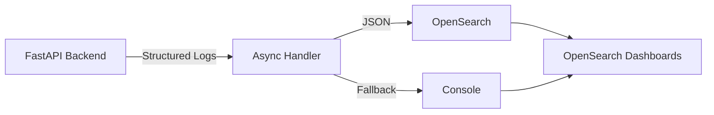

# Structured Logging

## Purpose

Provide a single entry point for Certus TAP’ structured logging system: what problems it solves, how it is wired, and where to find operational guidance.

## Audience & Prerequisites

- Backend engineers instrumenting services with `structlog`.
- Operators watching ingestion/PII events in OpenSearch Dashboards.
- Familiarity with Certus TAP’ deployment stack (FastAPI, OpenSearch, LocalStack).

## Overview

Certus TAP emits JSON logs with `trace_id`, workspace metadata, and privacy context. Logs flow through an async handler (non-blocking) to the `logs-certus-tap` OpenSearch index, with console fallback if the cluster is down. Daily index rotation and retention keep storage predictable.



## Key Concepts

| Capability       | Details                                                                                     |
| ---------------- | ------------------------------------------------------------------------------------------- |
| Non-blocking     | Async worker + queue (default batch 100, max queue 1,000) keeps request latency flat.       |
| Resilient        | Works when OpenSearch is offline (console fallback, exponential backoff reconnect).         |
| Traceable        | Request middleware injects `trace_id`, `workspace_id`, and `ingestion_id` into every event. |
| Production-ready | JSON formatting, daily index rotation, 30-day retention, health metrics.                    |
| Privacy-aware    | Dedicated events for PII detection/quarantine integrate with privacy dashboards.            |

## Workflows / Operations

1. **Instrument code**
   ```python
   from certus_ask.core.logging import get_logger
   logger = get_logger(__name__)
   logger.info("operation.start", doc_id="123", action="upload")
   ```
2. **Trace a request**
   - Read `trace_id` from API response.
   - Query OpenSearch or Dashboards for matching events.
3. **Monitor in Dashboards**
   - Visit `http://localhost:5601`, create data view `logs-certus-*`, filter by `level` or `event`.

## Configuration / Interfaces

| Environment | Recommended Settings                                                                                                                    |
| ----------- | --------------------------------------------------------------------------------------------------------------------------------------- |
| Development | `LOG_LEVEL=DEBUG`, `LOG_JSON_OUTPUT=false`, `SEND_LOGS_TO_OPENSEARCH=false` (console output).                                           |
| Production  | `LOG_LEVEL=INFO`, `LOG_JSON_OUTPUT=true`, `SEND_LOGS_TO_OPENSEARCH=true`, `OPENSEARCH_LOG_HOST=opensearch`, `OPENSEARCH_LOG_PORT=9200`. |

Log helper APIs live in `certus_ask/core/logging.py` and privacy logging utilities in `certus_ask/services/privacy_logger.py`. OpenSearch index name defaults to `logs-certus-tap` but can be overridden via env vars documented in [Configuration](configuration.md).

## Troubleshooting / Gotchas

- **OpenSearch unavailable:** Logs fall back to console; check `ENABLE_OPENSEARCH_LOGGING` flag and cluster health.
- **Missing trace IDs:** Ensure tracing middleware is registered before routers (see [Usage](usage.md#request-context)).
- **Backpressure:** If queue length spikes, increase batch size or investigate downstream OpenSearch latency (see [Troubleshooting](troubleshooting.md)).

## Related Documents

- [Overview](overview.md) – Deep dive into components and lifecycle.
- [Getting Started](getting-started.md) – Installing deps and running locally.
- [Configuration](configuration.md) – All env vars and tunables.
- [Usage](usage.md) – Patterns (basic logging, context binding, privacy events).
- [OpenSearch](opensearch.md) – Queries, dashboards, index maintenance.
- [Privacy Operations](privacy-operations.md) & [Privacy Investigation Queries](privacy-queries.md).
- [Logging Stack Component](../components/logging-stack.md) – Higher-level ops perspective.
