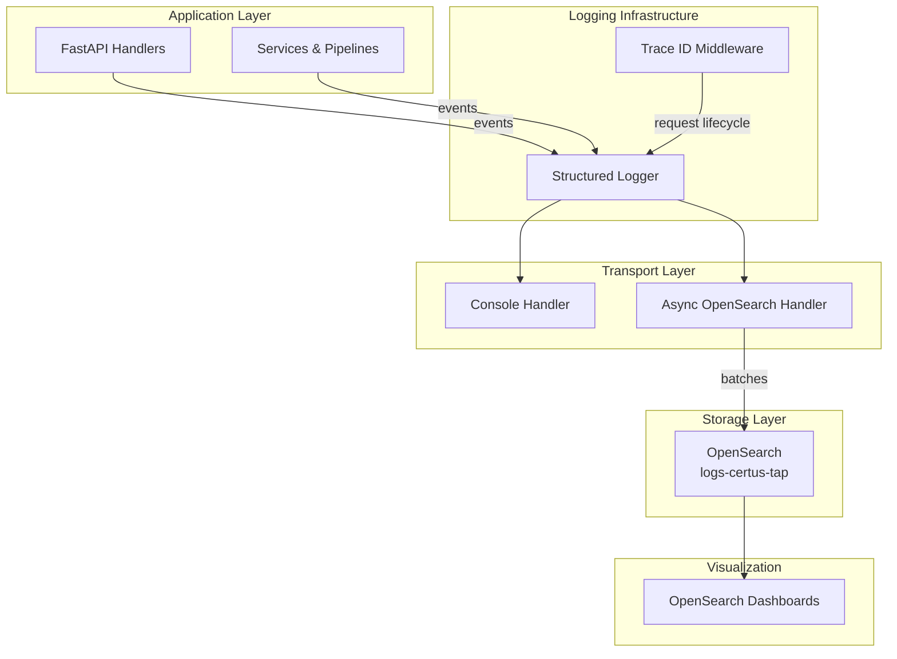

# Logging Architecture Overview

## Purpose

Describe how structured logs move from FastAPI routers to OpenSearch (and back to analysts) so engineers can reason about reliability, tracing, and operational controls.

## Audience & Prerequisites

- Engineers modifying middleware, async handlers, or index lifecycle policies.
- Operators designing dashboards or alerting on log events.
- Familiarity with structlog, FastAPI middleware, and OpenSearch basics.

## Overview

The logging pipeline separates concerns into middleware, structured loggers, transport handlers, and storage/visualization. Request middleware injects trace IDs, `get_logger(__name__)` binds context, the console handler provides immediate visibility, and the async OpenSearch handler streams JSON events to `logs-certus-tap`. Dashboards sits on top for discovery and alerting.

## Key Concepts

| Component                                                     | Description                                                                                                                              |
| ------------------------------------------------------------- | ---------------------------------------------------------------------------------------------------------------------------------------- |
| Trace ID middleware (`certus_ask/core/middleware.py`)         | Extracts/creates `X-Trace-ID`, logs `http.request.start/end`, and stores contextvars used downstream.                                    |
| Logging config (`certus_ask/core/logging.py`)                 | Initializes structlog processors, console handler, and async OpenSearch handler.                                                         |
| Async handler (`certus_ask/core/async_opensearch_handler.py`) | Maintains queue (max 1,000), batches 100 records, retries with exponential backoff, and trips a circuit breaker when OpenSearch is down. |
| Indices (`logs-certus-tap-*`)                              | Daily-rotated indices governed by `logs-policy` ILM/ISM; see [OpenSearch](opensearch.md) for setup.                                      |

## Workflows / Operations

1. **Request lifecycle**
   - Middleware logs `http.request.start`, binds `trace_id`, `workspace_id`, etc.
   - Business code emits structured events.
   - `http.request.end` finalizes trace and response header.
2. **Background/cron jobs**
   - Call `get_trace_id()` (auto-generates if absent) before logging so events remain traceable even outside HTTP paths.
3. **Index rotation**
   - Run `scripts/opensearch/setup-logging-policy.sh` (see [OpenSearch doc](opensearch.md)) to apply lifecycle policies before production use.

## Configuration / Interfaces

- Handler tunables (queue size, batch size, target host/port) live in `certus_ask/core/logging.py` and are exposed via env vars detailed in [Configuration](configuration.md).
- Privacy logger hooks (`certus_ask/services/privacy_logger.py`) feed the same pipeline; toggle strict mode per deployment needs.

## Troubleshooting / Gotchas

- **OpenSearch outage**: Expect `opensearch.connection_failed` logs. Console output continues; fix cluster connectivity and the handler auto-recovers.
- **Queue saturation**: If you see `logging.queue_full`, lower log volume or increase queue/batch sizes (with corresponding memory impact).
- **Trace leakage**: Always call `clear_context()` when writing custom background workers to avoid sharing trace IDs across coroutines.

## Related Documents

- [Configuration](configuration.md)
- [Usage](usage.md)
- [OpenSearch Logging Guide](opensearch.md)
- [Logging Stack Component](../components/logging-stack.md)
