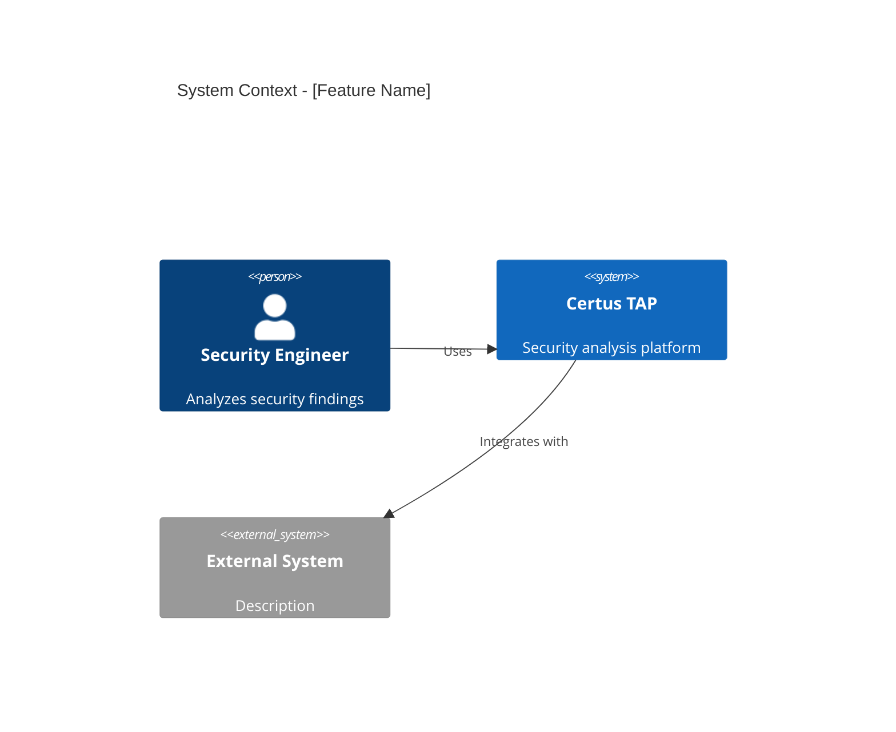
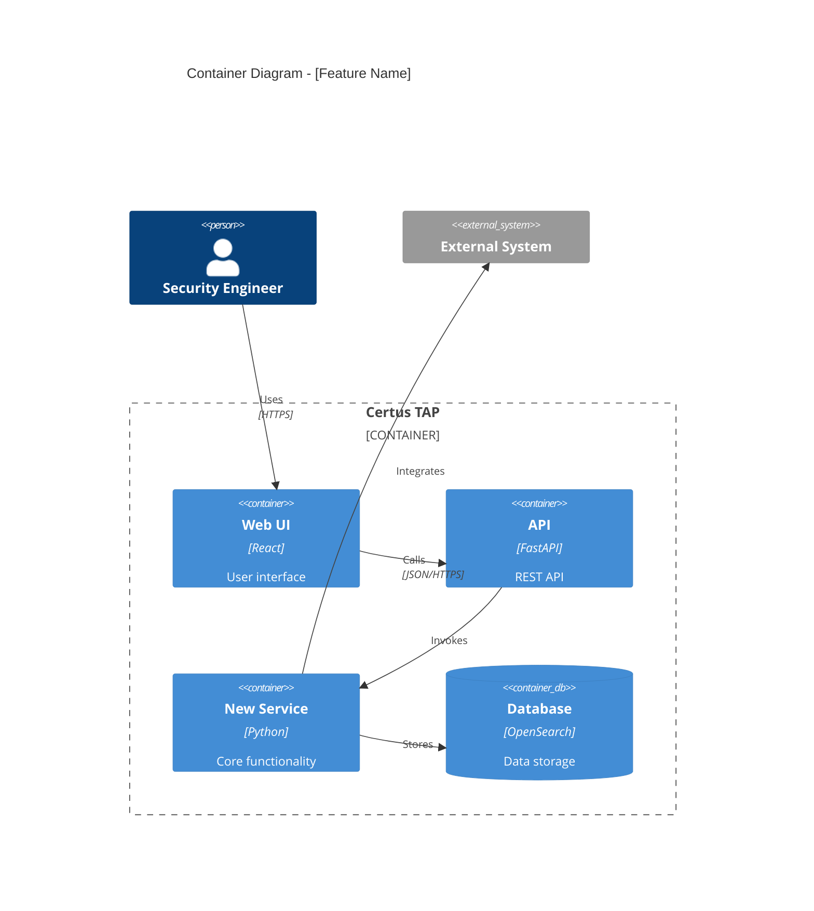
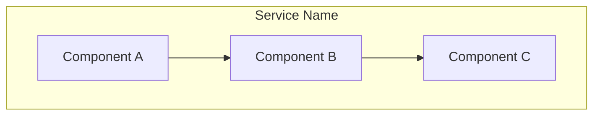
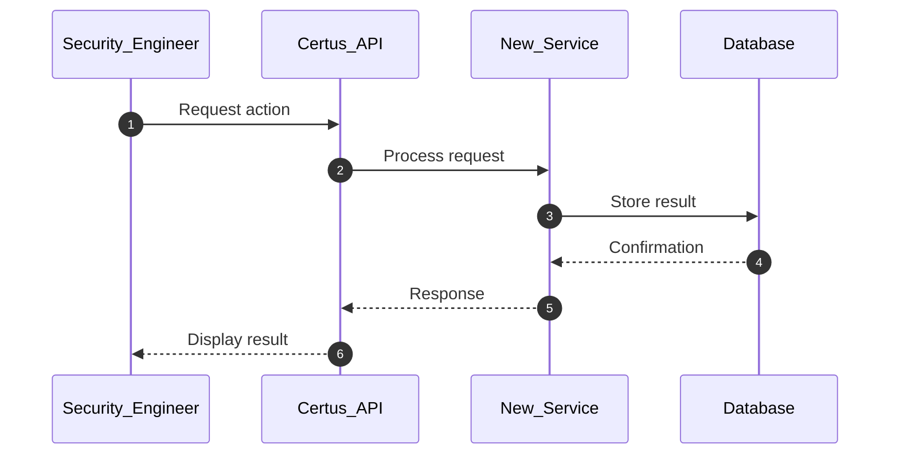

# [Proposal/Enhancement Name]

> Replace this entire line with a one-sentence description of what this proposal does.

## Metadata
- **Type**: Proposal | Enhancement
- **Status**: Draft | In Review | Approved | Implemented | Rejected
- **Author**: [Your Name / GitHub Handle]
- **Created**: YYYY-MM-DD
- **Last Updated**: YYYY-MM-DD
- **Target Version**: [e.g., v2.0, or "TBD"]
- **Implementation Timeline**: [e.g., 8 weeks, or "TBD"]

## Executive Summary

[2-3 paragraphs explaining WHAT this is and WHY it matters. This should be understandable by non-technical stakeholders.]

**Key Points**:
- **Problem**: What problem does this solve?
- **Solution**: What is the proposed approach?
- **Benefits**: What are the main benefits?
- **Risks**: What are the key risks or tradeoffs?

## Motivation

### Problem Statement
[Detailed description of the problem or opportunity. What pain points exist today? What capabilities are missing?]

### Background
[Context needed to understand the problem. Include any relevant history, existing solutions, or prior attempts.]

### User Impact
[How this affects Security Engineers, researchers, or the platform. Who benefits and how?]

### Research Context
[For research-focused proposals: How does this enable new research? What questions can we explore? What experiments does this enable?]

## Goals & Non-Goals

### Goals
- [ ] Goal 1: [Specific, measurable objective]
- [ ] Goal 2: [Specific, measurable objective]
- [ ] Goal 3: [Specific, measurable objective]

### Non-Goals
- **Non-Goal 1**: [Explicitly out of scope for this proposal]
- **Non-Goal 2**: [Will be addressed separately or later]
- **Non-Goal 3**: [Intentionally not included]

### Success Criteria
| Criterion | Measurement |
|-----------|-------------|
| Criterion 1 | How we know this succeeded |
| Criterion 2 | Specific metrics or outcomes |
| Criterion 3 | Acceptance test or validation |

## Proposed Solution

### Overview
[High-level description of the solution. What are we building? How does it work conceptually?]

### Architecture

#### System Context (C4 Level 1)
[If applicable: Show how this fits into the broader Certus TAP ecosystem]



**Description**: [Explain the system context diagram - who are the actors, what are the boundaries, what external systems are involved]

#### Container View (C4 Level 2)
[If applicable: Show the internal structure - services, databases, components]



**Description**: [Explain the container diagram - what are the main technical building blocks, how do they communicate, what technologies are used]

#### Component Design (Optional)
[Only if internal component structure is critical to understanding]



**Description**: [Explain the component interactions]

### Workflows

[Document any new user or system workflows introduced by this proposal]

#### Workflow 1: [Name]
> _Brief description of what this workflow accomplishes_



**Actors**:
- _Security Engineer_ – Initiates the workflow
- _Certus API_ – Orchestrates the request
- _New Service_ – Performs core logic
- _Database_ – Persists data

**Actions**:
1. **Step 1**: User initiates action via UI
2. **Step 2**: API validates request and routes to service
3. **Step 3**: Service executes core logic
4. **Step 4**: Results are persisted to database
5. **Step 5**: User receives confirmation

**Desired Outcomes**:
| Outcome | Description |
|---------|-------------|
| **Outcome 1** | What success looks like |
| **Outcome 2** | Expected behavior or state |
| **Outcome 3** | Validation or confirmation |

#### Workflow 2: [Name]
[Repeat pattern for additional workflows]

### Technical Design

#### Data Model
[Describe any new data structures, database schemas, or data flows]

```python
# Example data model
class NewEntity:
    id: str
    name: str
    created_at: datetime
    metadata: dict
```

#### APIs
[Document any new API endpoints or changes to existing APIs]

```http
POST /api/v1/resource
Content-Type: application/json

{
  "name": "example",
  "config": {}
}
```

**Response:**
```json
{
  "id": "uuid",
  "status": "created"
}
```

#### Integration Points
[How does this integrate with existing Certus TAP components?]

- **Integration 1**: Description and interface
- **Integration 2**: Description and interface

### Technology Stack
- **Language**: [e.g., Python 3.11+]
- **Framework**: [e.g., FastAPI, Haystack]
- **Dependencies**: [List key new dependencies]
- **Infrastructure**: [Any infrastructure requirements]

### Security Considerations

[Critical for all proposals given Certus TAP's security focus]

#### Authentication & Authorization
[How is access controlled? Who can use this feature?]

#### Data Protection
[How is sensitive data protected? Encryption? Access controls?]

#### Threat Model
[What threats does this introduce? How are they mitigated?]

| Threat | Impact | Likelihood | Mitigation |
|--------|--------|------------|------------|
| Threat 1 | High/Med/Low | High/Med/Low | How we address it |
| Threat 2 | High/Med/Low | High/Med/Low | How we address it |

#### Compliance
[Any regulatory or policy considerations?]

### Research Considerations

[For research-focused proposals - how does this enable research?]

#### Reproducibility
[How do we ensure research results can be reproduced?]

#### Evaluation Metrics
[What metrics matter for research validation?]

#### Experiment Design
[What kinds of experiments does this enable?]

#### Data Collection
[What data is collected for research purposes?]

## Alternatives Considered

### Alternative 1: [Name]

**Description**: [Brief explanation of this alternative approach]

**Pros**:
- Pro 1
- Pro 2
- Pro 3

**Cons**:
- Con 1
- Con 2
- Con 3

**Decision**: [Why this alternative was not chosen]

### Alternative 2: [Name]

[Repeat pattern for each alternative considered]

### Why the Proposed Solution?

[Summarize why the proposed solution is better than the alternatives]

## Dependencies

### Prerequisites
[What must be completed before this can start?]

- [ ] **Dependency 1**: Description and status
- [ ] **Dependency 2**: Description and status
- [ ] **Dependency 3**: Description and status

### Downstream Impact
[What will be affected by this change?]

- **Component 1**: [How it will be impacted, what changes needed]
- **Component 2**: [How it will be impacted, what changes needed]

### External Dependencies
[Any external libraries, services, or tools required?]

- **Dependency 1**: Version requirements, license, stability
- **Dependency 2**: Version requirements, license, stability

## Risks & Mitigations

| Risk | Probability | Impact | Mitigation Strategy |
|------|------------|--------|---------------------|
| Technical complexity exceeds estimates | Medium | High | Start with minimal viable implementation, prototype critical paths early |
| Integration issues with existing components | Low | Medium | Early integration testing, maintain backward compatibility |
| Performance degradation | Low | High | Performance testing in phase 1, implement with monitoring |
| Security vulnerability introduced | Low | Critical | Security review before each phase, automated scanning, manual audit |
| Lack of adoption by researchers | Medium | Medium | User research upfront, iterative feedback, documentation and examples |

## Implementation Plan

### Phased Roadmap

#### Phase 1: [Name] (X weeks)

**Objectives**:
- Objective 1: [What we're trying to achieve]
- Objective 2: [What we're trying to achieve]

**Deliverables**:
- [ ] **Deliverable 1**: Description
- [ ] **Deliverable 2**: Description
- [ ] **Deliverable 3**: Description

**Success Criteria**:
- Criterion 1: How we know this phase succeeded
- Criterion 2: Specific test or validation

**Estimated Effort**: X person-weeks

#### Phase 2: [Name] (X weeks)

[Repeat pattern for each phase]

#### Phase 3: [Name] (X weeks)

[Repeat pattern]

### Timeline Summary

| Phase | Duration | Start After | Deliverables |
|-------|----------|-------------|--------------|
| Phase 1 | X weeks | Approval | Core functionality |
| Phase 2 | X weeks | Phase 1 | Extended features |
| Phase 3 | X weeks | Phase 2 | Polish and docs |
| **Total** | **X weeks** | | |

### Resource Requirements

**Development**:
- Phase 1: X person-weeks
- Phase 2: X person-weeks
- Phase 3: X person-weeks
- **Total**: X person-weeks

**Testing**: X person-weeks

**Documentation**: X person-weeks

**Infrastructure**: [Any infrastructure costs or requirements]

### Milestones

- **M1** (Week X): [Milestone description]
- **M2** (Week X): [Milestone description]
- **M3** (Week X): [Milestone description]

## Testing Strategy

### Unit Testing
[Approach to unit tests - coverage goals, key areas to test]

### Integration Testing
[Approach to integration tests - what integrations need testing, how to test them]

### Research Validation
[For research proposals - how to validate that this enables the intended research]

- **Validation 1**: Description and acceptance criteria
- **Validation 2**: Description and acceptance criteria

### Performance Testing
[If applicable - performance benchmarks, load testing, scalability validation]

### Security Testing
[Security-specific testing - penetration testing, vulnerability scanning, threat validation]

## Documentation Requirements

- [ ] **API Documentation**: [What APIs need documenting]
- [ ] **User Guides**: [What user-facing documentation is needed]
- [ ] **Architecture Documentation**: [What architecture docs need creating/updating]
- [ ] **Workflow Documentation**: [What workflows need documenting in `docs/framework/workflows/`]
- [ ] **Runbooks**: [What operational documentation is needed]
- [ ] **Research Documentation**: [Papers, experiment guides, validation reports]

## Migration Strategy

[Only if this changes existing functionality]

### Breaking Changes
[List any breaking changes and their impact]

- **Change 1**: Description of break, who is affected, migration path
- **Change 2**: Description of break, who is affected, migration path

### Upgrade Path
[How do existing users/systems upgrade to use this?]

1. Step 1: [Action required]
2. Step 2: [Action required]
3. Step 3: [Action required]

### Backward Compatibility
[What remains compatible? What doesn't?]

### Rollback Plan
[How to roll back if something goes wrong]

1. Step 1: [Rollback action]
2. Step 2: [Rollback action]
3. Step 3: [Rollback action]

## Open Questions

[Questions that need answering before or during implementation]

- [ ] **Question 1**: [What needs to be decided] - **Owner**: [Who will answer]
- [ ] **Question 2**: [What needs to be decided] - **Owner**: [Who will answer]
- [ ] **Question 3**: [What needs to be decided] - **Owner**: [Who will answer]

## Future Enhancements

[Ideas that are out of scope now but worth capturing for future consideration]

- **Enhancement 1**: Description and rationale for deferring
- **Enhancement 2**: Description and rationale for deferring

## References

### Related Proposals
- [Proposal Name](./proposals/name-proposal.md) - Relationship description
- [Enhancement Name](./enhancements/name.md) - Relationship description

### Standards & Specifications
- [AAIF](https://aaif.io/) - Agent framework standards
- [MCP Protocol](https://modelcontextprotocol.io/) - Tool integration protocol
- [Other Standard] - Description

### Research Papers
- [Paper Title](URL) - Relevant findings
- [Paper Title](URL) - Relevant methodology

### External Documentation
- [Tool/Library Name](URL) - Version and usage
- [Technology Name](URL) - Integration details

### Implementation Priority
[Reference to where this sits in the roadmap]
- See [Implementation Priority](./implemenation-priority.md) - Tier X, Item #Y

## Appendices

### Appendix A: Detailed Technical Specifications
[Any additional technical details that would clutter the main document]

### Appendix B: Research Background
[Background research, benchmarks, prototypes, proof-of-concept results]

### Appendix C: Glossary
[Define any domain-specific terms used in this proposal]

| Term | Definition |
|------|------------|
| Term 1 | Clear definition |
| Term 2 | Clear definition |

---

## Notes for Proposal Authors

### Before You Submit
- [ ] All required sections completed
- [ ] Metadata filled out accurately
- [ ] Architecture diagrams included (if complex proposal)
- [ ] Workflows documented (if user-facing changes)
- [ ] Security considerations addressed
- [ ] Dependencies identified
- [ ] Implementation timeline estimated
- [ ] Alternatives considered and documented
- [ ] Reviewed against [Proposal Submission Guide](./proposal-submission.md)

### During Review
- Keep proposal status updated as "In Review"
- Respond to all reviewer comments
- Update Last Updated date when making changes
- Document decisions in PR comments

### After Approval
- Update status to "Approved"
- Extract user-facing workflows to `docs/framework/workflows/` if applicable
- Add to [Implementation Priority](./implemenation-priority.md)
- Create tracking issues for implementation phases
- Update status to "Implemented" when complete

### Proposal vs Enhancement
- **Use PROPOSAL** for: New major capabilities, new services, significant architectural changes
- **Use ENHANCEMENT** for: Improvements to existing components, infrastructure upgrades, optimizations

See [Proposal Submission Guide](./proposal-submission.md) for detailed guidance.
