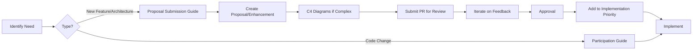

# Certus TAP Roadmap

This directory contains the strategic roadmap for Certus TAP, a platform for learning, experimentation, and research into how AI can assist security analysis.

## Purpose

Certus TAP is primarily a **research and learning platform**. The roadmap prioritizes:

1. **Research Capabilities** - Enabling security analysis experimentation with AI
2. **Reproducibility** - Ensuring research work can be validated and repeated
3. **Security-First AI** - Demonstrating security practices in AI systems
4. **Learning** - Supporting exploration and understanding

Production readiness is a secondary concern, though security elements remain critical given the platform's focus on security research.

## Directory Structure

```
roadmap/
├── README.md                           # This file - overview and navigation
├── proposal-submission.md              # Process for submitting new proposals/enhancements
├── implemenation-priority.md           # Tiered implementation roadmap
├── proposals/                          # Major new capabilities and features
│   ├── aaif-agent-framework-proposal.md
│   ├── assurance-manifest-proposal.md
│   ├── certus-assurance-proposal.md
│   ├── certus-insight-proposal.md
│   ├── certus-trust-proposal.md
│   ├── conversational-interface-proposal.md
│   ├── dagger-proposal.md
│   ├── data-ingestion-enrichment-proposal.md
│   ├── mcp-acp-proposal.md
│   ├── n8n-workflow-integration-proposal.md
│   └── security-slm-proposal.md
└── enhancements/                       # Improvements to existing components
    ├── authentication-authorization-proposal.md
    ├── cicd-deployment-proposal.md
    ├── evaluation-framework-proposal.md
    ├── guardrails-proposal.md
    ├── infrastructure-secrets-management.md
    ├── observability-platform-proposal.md
    ├── optimization-performance-proposal.md
    ├── runtime-policy-engine.md
    ├── security-platform-architecture.md
    └── service-layer-migration-proposal.md
```

## Key Documents

### 1. [Implementation Priority](./implemenation-priority.md)

**Purpose**: Defines the phased roadmap organized into tiers based on research priorities.

**Tier Structure**:

- **Tier 0: Foundation** - Core architecture and policy foundation (5 items, 15 weeks)
- **Tier 1: AI Experimentation Core** - AI agents, guardrails, evaluation (5 items, 22 weeks)
- **Tier 2: Research Acceleration** - Optional research tools and workflows (5 items, 23 weeks)
- **Tier 3: Research Infrastructure** - Supporting infrastructure (2 items, 7 weeks)
- **Tier 4: Production Hardening** - Deferred production features (3 items)

**Use When**: Planning sprints, understanding dependencies, setting milestones

### 2. [Proposal Submission Guide](./proposal-submission.md)

**Purpose**: Defines the process for proposing new features, enhancements, or architectural changes.

**Key Sections**:

- 7-step submission process (PR → Workflows → C4 Diagrams → Proposal Doc → Review → Iterate → Approval)
- C4 architecture diagram requirements (Context and Container diagrams for complex changes)
- Proposal/enhancement template
- Review criteria and timelines

**Use When**: You want to propose a new feature or significant change

### 3. [Proposals Directory](./proposals/)

**Purpose**: Contains strategic initiatives that introduce major new capabilities.

**Proposal Types**:

- New AI capabilities (AAIF Agent Framework, Security SLM)
- New services (Certus Assurance, Certus Trust, Certus Insight)
- Major integrations (MCP-ACP, N8n Workflows)
- Core infrastructure (Dagger, Assurance Manifest, Data Ingestion)

**When to Create**: When introducing a completely new capability or major component that doesn't exist yet

### 4. [Enhancements Directory](./enhancements/)

**Purpose**: Contains improvements and additions to existing components.

**Enhancement Types**:

- Infrastructure improvements (Secrets Management, Auth)
- Platform capabilities (Observability, CI/CD)
- AI safety features (Guardrails, Runtime Policy Engine)
- Quality improvements (Evaluation Framework, Optimization)

**When to Create**: When improving, extending, or refactoring existing functionality

## Proposal vs Enhancement

### Use **PROPOSAL** when:

- ✅ Introducing a completely new capability
- ✅ Adding a new major component or service
- ✅ Research-oriented exploration
- ✅ Requires significant architectural changes

**Examples**:

- `aaif-agent-framework-proposal.md` - New AI agent system
- `certus-trust-proposal.md` - New service for provenance tracking
- `dagger-proposal.md` - New scanning infrastructure

### Use **ENHANCEMENT** when:

- ✅ Improving an existing component
- ✅ Adding features to existing services
- ✅ Infrastructure improvements
- ✅ Optimization or refactoring

**Examples**:

- `infrastructure-secrets-management.md` - Improving existing infrastructure
- `runtime-policy-engine.md` - Adding policy layer to existing system
- `evaluation-framework-proposal.md` - Framework for evaluating existing AI components

## Contributing

**Note:** Certus TAP is currently in a pre-alpha phase with gated contributions. See [Participation & Contributions](../../about/participation.md) for the contribution model and access requirements.

### For Proposals & Enhancements

See [Proposal Submission Guide](./proposal-submission.md) for:

- New feature proposals
- Architecture changes
- Enhancement documents
- Research initiatives

## Workflow Overview



## Current Status

### Tier 0: Foundation (In Progress)

The foundational architecture work is currently underway:

- Service Layer Migration
- Dagger Security Module
- Assurance Manifest

### Tier 1: AI Experimentation Core (Planning)

Core AI capabilities are in the planning phase:

- AAIF Agent Framework
- MCP-ACP Integration
- AI Guardrails
- Evaluation Framework

See [Implementation Priority](./implemenation-priority.md) for detailed status and timelines.

## Architecture Approach

Certus TAP follows the [C4 Model](https://c4model.com/) for architecture documentation:

1. **Level 1 - System Context**: How the system fits in the world
2. **Level 2 - Container**: High-level technical building blocks
3. **Level 3 - Component**: Components within containers (optional)
4. **Level 4 - Code**: Class diagrams and code structure (rare)

**Requirements**:

- Complex proposals MUST include Level 1 and Level 2 diagrams
- Use [Structurizr DSL](https://structurizr.com/) for consistency
- Store diagrams in `docs/architecture/dsl/`

## Technology Stack

### Core Technologies

- **Language**: Python 3.11+
- **API Framework**: FastAPI
- **AI Orchestration**: Haystack
- **Vector Database**: OpenSearch
- **Scanning**: Dagger + multiple security tools
- **Policy**: Cue (Assurance Manifest), OPA (Runtime)

### AI & Integration

- **Agent Standard**: AAIF (MCP, Goose, AGENTS.md)
- **Tool Integration**: MCP (Model Context Protocol)
- **Workflow**: N8n (planned)

### Research & Validation

- **Provenance**: Certus Trust
- **Evaluation**: Custom framework (planned)
- **Guardrails**: Prompt injection detection, output validation

## Success Metrics

For this research platform, success is measured by:

1. **Research Capability**: Can we experiment with AI-assisted security analysis?
2. **Reproducibility**: Can research results be validated and repeated?
3. **Learning Value**: Does the platform help understand AI security applications?
4. **Security Demonstration**: Does it showcase secure AI practices?

Production metrics (uptime, performance, scale) are secondary.

## Timeline

- **Minimum Viable Research Platform**: 16-18 weeks (parallelized Tier 0 + Tier 1 core)
- **Full Research Capability**: 28-30 weeks (through Tier 2)
- **Infrastructure Hardening**: 35-37 weeks (+ Tier 3)
- **Production Ready**: Deferred (Tier 4 on hold)

See [Implementation Priority](./implemenation-priority.md) for detailed phasing.

## Questions?

- **Participation & contributions**: See [Participation Guide](../../about/participation.md)
- **Proposal process**: See [Proposal Submission Guide](./proposal-submission.md)
- **Architecture questions**: Check existing proposals and C4 diagrams
- **Governance**: See [GOVERNANCE.md](../../../GOVERNANCE.md)

## Related Documentation

- [Architecture Documentation](../../architecture/) - System architecture and C4 diagrams
- [Participation & Contributions](../../about/participation.md) - Contribution model and access
- [AAIF Standards](https://aaif.io/) - Agent framework standards we follow
