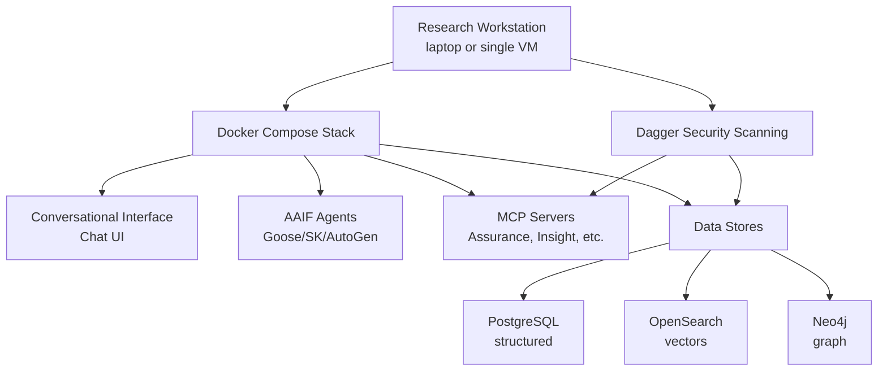

# Implementation Priority

**Last Updated:** 2025-12-11
**Platform Purpose:** Learning, experimentation, and research into AI-assisted security analysis

## Legend

- ✎ Draft
- ☑ Approved
- ◐ In Progress
- ● Implemented

We implement new capabilities through a process of proposals as described in the proposal submission guide. This document acts as the order of priority we will implement the approved proposals and enhancements.

Certus TAP is primarily a **research and experimentation platform**, not a production-ready commercial product. Initially, it will focus exploring how AI can assist with security analysis, but the ultimate goal is to be a framework for anyone looking to leverage trust and assurance as part of their AI strategy. This fundamentally changes implementation priorities:

- **Prioritize:** What enables research, learning, and AI experimentation
- **Deprioritize:** Production hardening, enterprise features, scalability
- **Maintain:** Core security (since researching security tools requires secure infrastructure)
- **Security By design:** Implement basic AI security BEFORE deploying agents to establish credibility. You can't publish research on secure AI if your own AI is insecure. This is about reputation and demonstrating best practices, not production hardening.

## Priority Tiers

### Tier 1: Core Services (Critical Platform Layer)

_Everything needed to make the platform trustworthy before AI touches it_

| Item                           | Type        | Why Critical                                                                                                                                             |
| ------------------------------ | ----------- | -------------------------------------------------------------------------------------------------------------------------------------------------------- |
| **1. Service Layer Migration** | Enhancement | Establishes clean FastAPI service boundaries, dependency injection, and modular pipelines every other capability plugs into                              |
| **2. Dagger Security Module**  | Proposal    | Generates the real security scan data the research platform analyzes; no data means no research                                                          |
| **3. Assurance Manifest**      | Proposal    | Declarative policy brain that orchestrates which scans to run, how to enforce compliance, and how downstream services interpret results                  |
| **4. Certus Assurance**        | Proposal    | Persistence and validation layer for all scan results; guarantees policy-compliant evidence is always stored                                             |
| **5. Certus Integrity**        | Proposal    | Operability + observability layer that measures health of Certus services so researchers can trust their experimental environment                        |
| **6. Certus Trust**            | Proposal    | Provenance, signing, and AGENTS.md automation so we can prove which manifest/policy created each dataset (reproducible experiments demand this metadata) |

**Rationale:** This tier builds the **core services pipeline**: clean architecture (Service Layer) → data generation (Dagger) → policy brain (Assurance Manifest) → evidence store (Certus Assurance) → operational integrity (Certus Integrity) → provenance (Certus Trust). Without this, higher tiers only amplify technical debt.

---

### Tier 2: Core AI (MCP + Agents + SLM)

_Enable AI to safely interact with Tier-1 services_

| Item                        | Type     | Why Important                                                                                                                 |
| --------------------------- | -------- | ----------------------------------------------------------------------------------------------------------------------------- |
| **7. MCP-ACP Integration**  | Proposal | Exposes Tier-1 services through MCP servers with capability metadata so any agent (internal or external) can call them safely |
| **8. AAIF Agent Framework** | Proposal | Standardizes how we run agent experiments (Goose, SK, AutoGen) while plugging into MCP; reproducible agent pipelines          |
| **9. Security SLM**         | Proposal | Allows research into tuned small language models specialized for security workloads; critical for comparing SLM vs LLM        |

**Rationale:** Once the services are stable, we wire them into MCP so agents have a contract. Then AAIF orchestrates those agents. Security SLM research is the last mile—smaller models only make sense after the agent and service mesh exists.

---

### Tier 3: Evaluate (Measure What We Build)

_Add evaluation infrastructure before scaling experiments_

| Item                              | Type     | Why Useful                                                                                                 |
| --------------------------------- | -------- | ---------------------------------------------------------------------------------------------------------- |
| **10. Certus Evaluate Service**   | Proposal | Enables automated scoring of agent output versus policy/evidence; without it we cannot prove progress      |
| **11. Certus-Evaluate Tech Spec** | Proposal | Detailed architecture + reference tests to guarantee the evaluate service behaves consistently across runs |

**Rationale:** Evaluation is its own tier because research credibility depends on measurable outcomes. Once agents are running, we immediately validate them with the evaluate service plus its technical spec to codify behaviors.

---

### Tier 4: Production Readiness

_Lightweight hardening so the research platform can run multi-team pilots_

| Item                                      | Type        | Why Needed                                                                                               |
| ----------------------------------------- | ----------- | -------------------------------------------------------------------------------------------------------- |
| **12. Authentication & Authorization**    | Enhancement | Basic RBAC keeps collaborators separated and enforces policy on MCP/agent usage                          |
| **13. Infrastructure Secrets Management** | Enhancement | Centralize API keys and credentials for Certus services + agents; prerequisite for any shared deployment |
| **14. DigitalOcean Deployment**           | Proposal    | Reference deployment for remote researchers; doubles as the template for customer-style pilots           |

**Rationale:** Once evaluation exists, we can harden for limited production pilots. Authentication and secrets prevent research credentials from leaking. The DigitalOcean deployment gives us a reproducible target for remote teams or sponsor demos.

---

## Recommended Implementation Sequence

### Phase 1: Core Services

**Goal:** Stand up the trustworthy backbone every other capability depends on.

- **Architecture:** Service Layer Migration (clean FastAPI modules, dependency injection, boundary enforcement).
- **Data Generation:** Dagger Security Module (run scans, push artifacts into the lake).
- **Policy Engine:** Assurance Manifest (codify which scans, cadence, compliance targets).
- **Evidence Store:** Certus Assurance (persist/validate scan outputs).
- **Reliability + Provenance:** Certus Integrity (operational telemetry) and Certus Trust (signing, AGENTS.md, lineage). These can stagger/overlap depending on staffing.

**Outcome:** Architecture → Scanning → Policy → Storage → Integrity/Provenance; researchers now have real data with lineage guarantees.

---

### Phase 2: Core AI

**Goal:** Connect Tier-1 services to AI agents through consistent interfaces.

- **Connectivity:** MCP-ACP Integration (wrap services as MCP servers, document capabilities, secure transport).
- **Agents + Models:** AAIF Agent Framework (standard agent harness) followed by Security SLM experimentation (training/evaluating tuned models). SLM work can begin in parallel once MCP contracts are stable.

**Outcome:** MCP servers expose the Certus services, AAIF orchestrates multi-agent experiments, and the SLM initiative starts comparing tuned models against hosted LLMs.

---

### Phase 3: Evaluate

**Goal:** Measure whether the AI stack is actually delivering trustworthy results.

- **Service Implementation:** Certus Evaluate Service (shadow-mode scoring, quality gates).
- **Hardening:** Certus-Evaluate Technical Spec (flows, APIs, fixtures) so future contributors reproduce evaluation runs exactly.

**Outcome:** Every experiment now includes automated scoring + documented expectations, which lets us publish research with confidence.

---

### Phase 4: Production Readiness

**Goal:** Prepare for multi-team pilots and light production deployments.

- **Access Controls:** Authentication & Authorization (basic RBAC and project scoping).
- **Credential Hygiene:** Infrastructure Secrets Management (central store, rotation hooks).
- **Reference Deployment:** DigitalOcean Deployment (IaC + runbooks for a managed environment).

**Outcome:** A shareable deployment with RBAC, managed secrets, and a reproducible infrastructure template.

---

## Key Differences from Production Priority

| Concern                | Production Priority                         | Research Priority                          |
| ---------------------- | ------------------------------------------- | ------------------------------------------ |
| **Scalability**        | Critical (multi-tenant, thousands of users) | Low (research team size)                   |
| **High Availability**  | Critical (99.9% uptime)                     | Low (downtime just delays research)        |
| **Security Hardening** | Critical (OPA policies, audit logs)         | Moderate (secure credentials, basic auth)  |
| **Performance**        | Critical (sub-second latency)               | Low (researchers can wait seconds)         |
| **AI Experimentation** | Nice-to-have (features for customers)       | **CRITICAL** (the entire point)            |
| **Data Quality**       | Moderate (good enough for users)            | **HIGH** (research validity depends on it) |
| **Reproducibility**    | Low (users don't care)                      | **HIGH** (research must be reproducible)   |
| **Flexibility**        | Low (stable API for customers)              | **CRITICAL** (rapid experimentation)       |

---

## Research-Driven Prioritization Framework

Use these questions to prioritize any new proposal/enhancement:

### **HIGH Priority** if it answers:

- "Does this let me experiment with AI analyzing security data?"
- "Does this generate/improve the security data AI analyzes?"
- "Does this help me measure/evaluate AI performance?"
- "Does this enable research reproducibility?"

### **MEDIUM Priority** if it answers:

- "Does this make research faster/easier?"
- "Does this enable collaboration with other researchers?"
- "Does this secure the research environment?"

### **LOW Priority** if it answers:

- "Does this improve production scalability?"
- "Does this add enterprise features?"
- "Does this optimize performance beyond research needs?"
- "Does this add compliance/audit capabilities?"

---

## Simplified Architecture for Research

Instead of full microservices architecture:

**NOT:**

- Kubernetes cluster (overkill)
- Load balancers (single user)
- OPA sidecars (complex policies unnecessary)
- Multi-region deployment (research is local)
- Redis caching (premature optimization)

**YES:**

- Docker Compose (simple, reproducible)
- Volume mounts (easy data access)
- Hot reload (rapid iteration)
- Jupyter notebooks (ad-hoc analysis)
- Local LLM support (privacy, cost)
