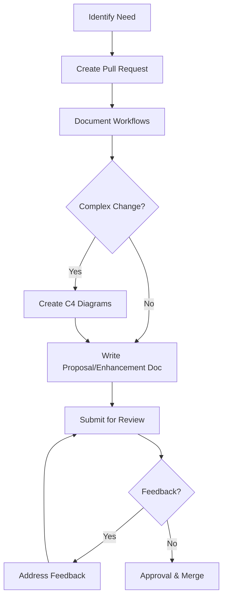
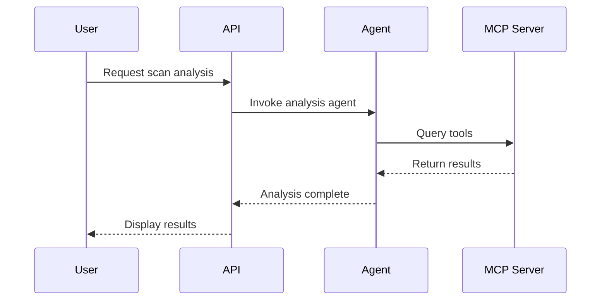

# Submission Guidelines

## Proposal & Enhancement Submission Process

This guide outlines the process for proposing new features, enhancements, or architectural changes to the Certus TAP platform.

## Overview

All significant changes to Certus TAP should follow a structured proposal process that includes documentation, architecture diagrams (where appropriate), and peer review. This ensures:

- **Alignment**: Proposals align with platform goals and research objectives
- **Quality**: Technical decisions are well-documented and reviewed
- **Transparency**: Community can understand and contribute to the platform's evolution
- **Reproducibility**: Research work is documented for future reference

## Process Overview



## Step-by-Step Process

### 1. Create Pull Request

**When**: As soon as you identify a need for a new feature or enhancement

**Actions**:

- Fork the repository (external contributors) or create a branch (maintainers)
- Create a draft pull request with title format: `[PROPOSAL] <Brief Description>`
- Add appropriate labels: `proposal`, `enhancement`, `documentation`

**Example Branch Names**:

- `proposal/mcp-integration`
- `enhancement/secrets-management`
- `proposal/agent-framework`

### 2. Document Workflows (If Applicable)

**When**: The proposal introduces new user interactions or processes

**Actions**:

- Create workflow diagrams showing user journeys
- Document integration points with existing systems
- Use Mermaid diagrams for consistency

**Workflow Types**:

- **User Workflows**: How users interact with the feature
- **System Workflows**: How components interact
- **Data Flows**: How data moves through the system

**Example**:



### 3. Create Architecture Diagrams (If Complex)

**When**: The proposal involves architectural changes or new components

**Required for Complex Changes**:

- New services or components
- Changes to system boundaries
- Integration with external systems
- Significant refactoring

**C4 Model Requirements**:

We follow the [C4 Architecture Model](https://c4model.com/) for documenting system architecture.

#### Level 1: System Context Diagram

**REQUIRED for all complex proposals**

Shows how the system fits into the wider world, including:

- External users and systems
- System boundaries
- High-level interactions

**Tool**: [Structurizr DSL](https://structurizr.com/)

**Location**: `docs/architecture/dsl/<proposal-name>-context.dsl`

**Example**:

```dsl
workspace "Certus TAP" "System Context for MCP Integration" {
    model {
        user = person "Security Engineer" "Analyzes scan results"
        certus = softwareSystem "Certus TAP" "Security analysis platform"
        mcpServer = softwareSystem "MCP Servers" "External tool integrations"

        user -> certus "Analyzes scans using"
        certus -> mcpServer "Connects to tools via"
    }

    views {
        systemContext certus "SystemContext" {
            include *
            autoLayout
        }
    }
}
```

#### Level 2: Container Diagram

**REQUIRED for all complex proposals**

Shows high-level technical building blocks:

- Applications and services
- Data stores
- Technology choices
- Communication protocols

**Location**: `docs/architecture/dsl/<proposal-name>-container.dsl`

**Example**:

```dsl
workspace "Certus TAP" "Container View for MCP Integration" {
    model {
        user = person "Security Engineer"

        certus = softwareSystem "Certus TAP" {
            webApp = container "Web UI" "React/TypeScript"
            api = container "API" "FastAPI"
            agentRuntime = container "Agent Runtime" "Python/Haystack"
            mcpClient = container "MCP Client" "Python/ACP"
            db = container "Database" "OpenSearch"
        }

        mcpServer = softwareSystem "MCP Server" "External tools"

        user -> webApp "Uses"
        webApp -> api "JSON/HTTPS"
        api -> agentRuntime "Invokes agents"
        agentRuntime -> mcpClient "Uses"
        mcpClient -> mcpServer "MCP Protocol/stdio"
        agentRuntime -> db "Stores results"
    }

    views {
        container certus "Containers" {
            include *
            autoLayout
        }
    }
}
```

#### Level 3: Component Diagram

**OPTIONAL** - Use when internal component structure is critical to understanding the proposal

Shows components within a container:

- Classes and interfaces
- Component responsibilities
- Implementation details

**Location**: `docs/architecture/dsl/<proposal-name>-component.dsl`

#### Level 4: Code Diagram

**RARELY NEEDED** - Only for proposals requiring very specific implementation patterns

Shows actual code structure (UML class diagrams, etc.)

**Generating Diagrams**:

1. Install Structurizr CLI:

   ```bash
   brew install structurizr-cli
   ```

2. Export to PlantUML:

   ```bash
   structurizr-cli export -workspace docs/architecture/dsl/proposal.dsl -format plantuml
   ```

3. Include in proposal:

   ```markdown
   ## Architecture

   ### System Context

   

   ### Container View

   
   ```

### 4. Write Proposal/Enhancement Document

**When**: Always required

**Location**:

- **Proposals**: `docs/reference/roadmap/proposals/<name>-proposal.md`
- **Enhancements**: `docs/reference/roadmap/enhancements/<name>.md`

**Naming Convention**:

- Use kebab-case: `mcp-integration-proposal.md`
- Be descriptive: `infrastructure-secrets-management.md`
- Include type: `-proposal.md` or as enhancement `.md`

#### Proposal vs Enhancement

**Use PROPOSAL when**:

- Introducing a completely new capability
- Adding a new major component or service
- Requires significant architectural changes
- Involves multiple teams or systems
- Research-oriented exploration

**Examples**: `aaif-agent-framework-proposal.md`, `security-slm-proposal.md`

**Use ENHANCEMENT when**:

- Improving an existing component
- Adding a feature to an existing service
- Infrastructure improvements
- Optimization or refactoring

**Examples**: `runtime-policy-engine.md`, `infrastructure-secrets-management.md`

#### Required Template

**Use the standard template**: [PROPOSAL-TEMPLATE.md](./PROPOSAL-TEMPLATE.md)

Copy this template to create your proposal or enhancement document:

```bash
# Copy template to create a new proposal
cp docs/reference/roadmap/TEMPLATE.md docs/reference/roadmap/proposals/my-feature-proposal.md

# Or for an enhancement
cp docs/reference/roadmap/TEMPLATE.md docs/reference/roadmap/enhancements/my-enhancement.md
```

The template includes:

- Complete structure with all required sections
- Mermaid diagram examples for architecture and workflows
- Guidance on what to include in each section
- Checklist for before submission
- Notes on proposal vs enhancement usage

**Key sections in the template**:

- **Metadata**: Status, author, timeline
- **Executive Summary**: High-level overview
- **Motivation**: Problem statement and context
- **Architecture**: C4 diagrams using Mermaid (System Context, Container View)
- **Workflows**: Mermaid sequence diagrams for user interactions
- **Technical Design**: Data models, APIs, integrations
- **Security Considerations**: Threat model and mitigations
- **Implementation Plan**: Phased roadmap with timelines
- **Testing Strategy**: Unit, integration, and research validation

**During Proposal Phase**:
Keep all content (architecture diagrams, workflows, technical details) in your proposal document for easier review.

**After Approval**:
User-facing workflows may be extracted to `docs/framework/workflows/` for discoverability, while the complete proposal remains as a historical record.

### 5. Submit for Review

**When**: Proposal document is complete and ready for feedback

**Actions**:

1. Mark PR as "Ready for Review"
2. Request reviewers (tag maintainers)
3. Add to roadmap discussion board
4. Present in team meeting (if applicable)

**Reviewer Checklist**:

- [ ] Aligns with platform goals and research objectives
- [ ] Architecture diagrams are clear and complete
- [ ] Security considerations addressed
- [ ] Dependencies identified
- [ ] Timeline is realistic
- [ ] Success criteria are measurable
- [ ] Risks are identified with mitigations

### 6. Address Feedback & Iterate

**When**: Reviewers provide comments

**Actions**:

- Respond to all comments
- Update proposal based on feedback
- Re-request review when ready
- Document decisions in PR comments

**Communication**:

- Be open to feedback
- Explain your reasoning
- Seek to understand concerns
- Find compromises when needed

### 7. Approval & Merge

**When**: Proposal has been approved by required reviewers

**Actions**:

1. Update proposal status to "Approved"
2. Add to implementation priority roadmap
3. Merge PR
4. Create tracking issues for implementation phases

**Post-Approval**:

- Proposal becomes the authoritative design document
- Changes to approved proposals require new review
- Implementation should follow the approved design

## Review Criteria

Proposals will be evaluated on:

### 1. Alignment

- Does this support the platform's research and learning goals?
- Is this consistent with existing architecture?
- Does this align with security best practices?

### 2. Technical Quality

- Is the design sound and well-thought-out?
- Are dependencies clearly identified?
- Are risks adequately addressed?
- Is the solution maintainable?

### 3. Completeness

- Are all required sections filled out?
- Are architecture diagrams provided (if needed)?
- Are success criteria clear and measurable?
- Is the implementation plan detailed?

### 4. Feasibility

- Is the timeline realistic?
- Are required resources available?
- Are technical risks acceptable?

### 5. Research Value

- Does this enable new research capabilities?
- Is it reproducible and well-documented?
- Does it support experimentation and learning?

## Timeline Expectations

| Proposal Type          | Review Time | Approval Time |
| ---------------------- | ----------- | ------------- |
| Small Enhancement      | 3-5 days    | 1-2 weeks     |
| Medium Proposal        | 1-2 weeks   | 2-4 weeks     |
| Large/Complex Proposal | 2-3 weeks   | 4-6 weeks     |

**Note**: These are guidelines. Complex proposals requiring architectural changes may take longer.

## Examples

### Example 1: Simple Enhancement

**Scenario**: Add Vault integration for secrets management

**Process**:

1. Create PR: `enhancement/vault-secrets`
2. Skip workflows (not user-facing)
3. Skip C4 diagrams (infrastructure change, not architectural)
4. Write enhancement doc: `infrastructure-secrets-management.md`
5. Submit for review
6. Address feedback (add migration strategy)
7. Approved and merged

**Time**: 2 weeks from proposal to approval

### Example 2: Complex Proposal

**Scenario**: Implement AAIF Agent Framework

**Process**:

1. Create PR: `proposal/aaif-agent-framework`
2. Document workflows:
   - User invokes agent
   - Agent queries MCP servers
   - Results returned to user
3. Create C4 diagrams:
   - Level 1: System context (Certus + MCP ecosystem)
   - Level 2: Container view (Agent Runtime, MCP Client, etc.)
4. Write proposal: `aaif-agent-framework-proposal.md`
5. Submit for review
6. Address feedback:
   - Add dependency on MCP-ACP integration
   - Clarify security model
   - Update timeline
7. Re-submit
8. Approved and merged

**Time**: 6 weeks from initial proposal to approval

## FAQs

### Q: Do I need architecture diagrams for every proposal?

**A**: No. Only complex proposals that introduce new components or change system boundaries need C4 diagrams. Simple enhancements to existing components can skip this step.

### Q: Can I start implementing before approval?

**A**: You can create a prototype or proof-of-concept, but production implementation should wait for approval. This prevents wasted effort if the design needs significant changes.

### Q: What if I'm not sure if my idea needs a proposal?

**A**: When in doubt, start with a discussion issue. If the change:

- Affects multiple components
- Changes APIs or interfaces
- Requires more than a few days of work
- Has security implications

...then it probably needs a proposal.

### Q: How do I update an approved proposal?

**A**: Create a new PR with the proposed changes and explain why the update is needed. Significant changes may require re-review.

### Q: What if my proposal is rejected?

**A**: Rejection is not failure. Common reasons for rejection:

- Not aligned with current priorities
- Technical concerns that can't be resolved
- Better alternatives exist

You can always revise and resubmit, or the proposal may be deferred for future consideration.

### Q: Who can submit proposals?

**A**: Anyone! Maintainers, contributors, and community members are all welcome to submit proposals. External proposals may require sponsorship from a maintainer.

## Tools & Resources

### Architecture Tools

- [Structurizr](https://structurizr.com/) - C4 model diagrams
- [PlantUML](https://plantuml.com/) - Diagram rendering
- [Mermaid](https://mermaid.js.org/) - Workflow diagrams

### Documentation

- [C4 Model](https://c4model.com/) - Architecture documentation approach
- [Architecture Decision Records](https://adr.github.io/) - ADR format
- [AAIF](https://aaif.io/) - Agentic AI Foundation standards

### Templates

- [Proposal Template](https://github.com/certus/certus-TAP/templates/proposal-template.md)
- [Enhancement Template](https://github.com/certus/certus-TAP/templates/enhancement-template.md)

## Getting Help

If you have questions about the proposal process:

1. Check the [Roadmap Documentation](./README.md)
2. Review existing [proposals](./proposals/) and [enhancements](./enhancements/)
3. Ask in GitHub Discussions
4. Reach out to maintainers

## Related Documentation

- [Implementation Priority Roadmap](./implemenation-priority.md)
- [Participation & Contributions](../../about/participation.md) - contribution model and access
- [Architecture Guidelines](../architecture/README.md)
