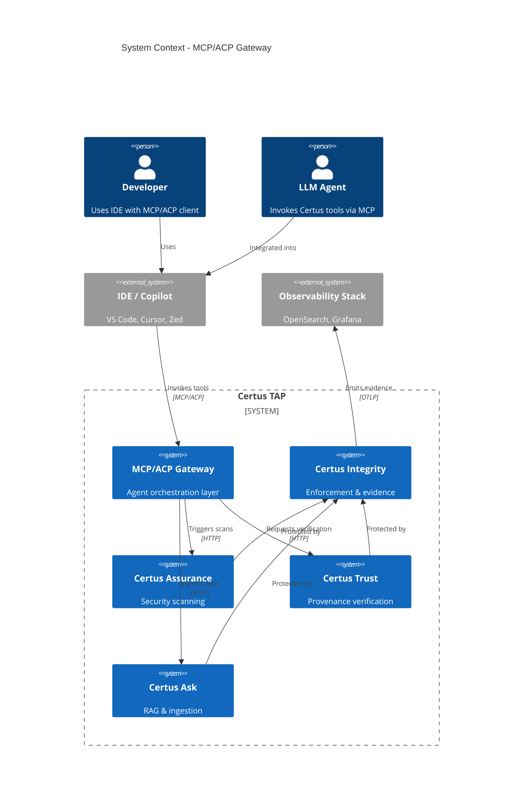
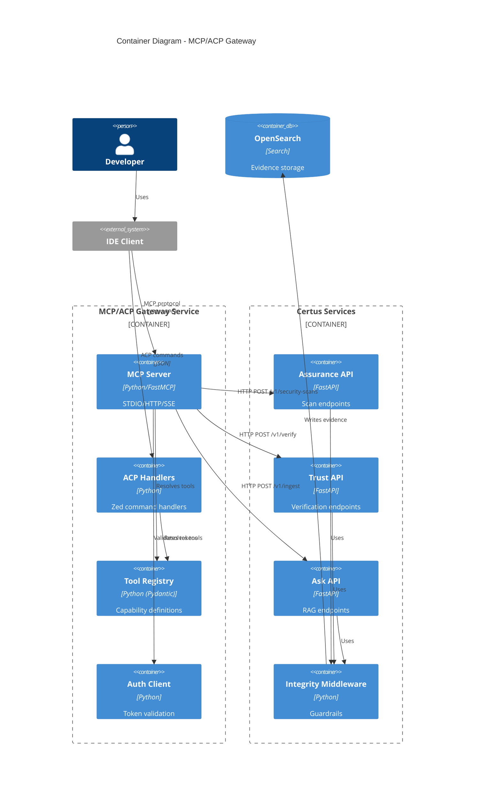
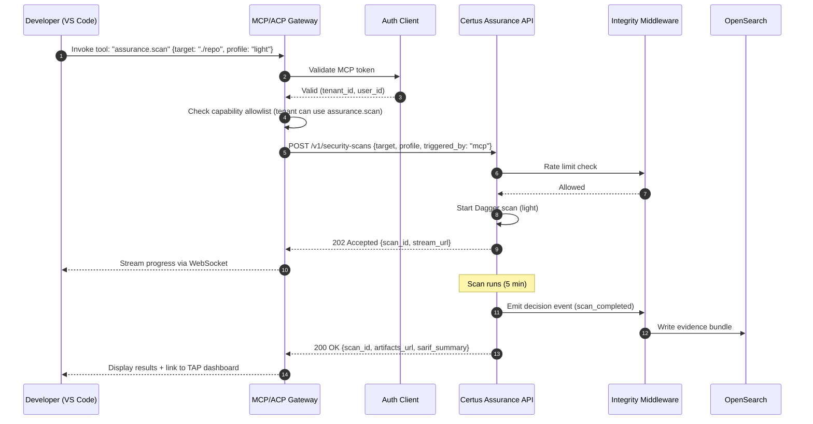

# MCP & ACP Integration: Agent Orchestration Layer

> Standardized agent and IDE integration for Certus services via Model Context Protocol (MCP) and Agent Control Plane (ACP)

## Metadata

- **Type**: Proposal
- **Status**: Draft
- **Author**: Certus Architecture Team
- **Created**: 2025-12-07
- **Last Updated**: 2025-12-14
- **Target Version**: v2.0
- **Implementation Timeline**: 10 weeks (phased)

## Executive Summary

Certus services (Assurance, Trust, Ask, Transform, Insight) expose REST APIs, CLI tooling, and Dagger modules. To meet developers where they work (editors, agents, IDEs), we will build a unified **MCP/ACP Gateway** that provides standardized agent integration. This gateway enables LLM copilots and IDE agents to invoke Certus operations (scans, verification, ingestion) with structured responses, while Certus Integrity enforces guardrails and produces evidence.

**Key Points**:

- **Problem**: Developers rely on LLM copilots and IDE agents, but Certus has no standardized integration. Each IDE requires custom glue code with fragmented auth, policy, and observability.
- **Solution**: Add a FastMCP-based orchestration layer inside the Certus TAP stack that exposes Certus tools (Assurance, Trust, Ask, Transform, Insight) via MCP and ACP, while reusing the existing Python services, guardrails, and telemetry.
- **Benefits**: Developers can trigger scans, verify attestations, and ingest docs from their IDE without leaving the editor. Unified auth, policy, and observability across all agent integrations, no duplicate HTTP façade, and the FastMCP server can compose multiple Certus services—even once they live in separate repos.
- **Risks**: MCP/ACP protocols are evolving, exposing operations via IDEs increases attack surface if tokens leak, IDE-triggered scans may increase backend load, and adoption may be gradual.

## Motivation

### Problem Statement

Certus TAP lacks standardized agent integration:

1. **Fragmented UX**: Developers must memorize service-specific commands (`just certus-assurance scan`, `curl` to certus-trust) instead of invoking "scan this repo" inside their editor.

2. **Agent Blind Spots**: LLM assistants (GitHub Copilot, Cursor, Zed AI) lack safe, structured hooks into Certus. They cannot automate security scans, verification checks, or document ingestion without brittle shell scripts.

3. **Policy Drift**: Each IDE integration implements its own auth and guardrails. No unified enforcement of rate limits, budgets, or PII redaction for agent-triggered requests.

4. **Limited Observability**: Scans triggered from IDEs rarely feed status or artifacts back into Certus TAP automatically. No audit trail for agent actions.

### Background

The agent ecosystem is rapidly evolving:

- **MCP (Model Context Protocol)**: Anthropic-led standard for LLM agents to invoke tools with structured schemas. Originally TypeScript-first, now with mature Python support through FastMCP.
- **ACP (Agent Control Plane)**: Zed editor's agent integration framework for IDE-native workflows.
- **IDE Copilots**: GitHub Copilot, Cursor, Zed AI, and others increasingly expect tool integration via MCP or similar protocols.

Certus services already have the capabilities (REST APIs, Dagger modules, CLI tools), but lack the orchestration layer to expose them in agent-friendly formats.

### User Impact

**Developers**:

- Trigger Certus-Assurance scans without leaving their IDE (select repo → "Run Security Scan" → view results inline)
- Verify trust attestations on dependencies with one command (hover over package.json → "Verify Provenance")
- Ingest documentation into Certus-Ask directly from editor (select markdown files → "Index in Certus Knowledge Base")

**Security Engineers**:

- Audit all agent-triggered operations via unified telemetry (OpenSearch dashboards show which developers ran which scans)
- Enforce consistent policies (rate limits, severity gates, PII redaction) regardless of trigger source (CLI, REST, or agent)

**Platform Operators**:

- Reduce fragmentation by maintaining one MCP/ACP gateway instead of N custom IDE plugins
- Apply Certus Integrity guardrails to agent requests automatically (graph budgets, circuit breakers, evidence emission)

### Research Context

MCP/ACP integration enables research into:

1. **Agent-Driven Security**: Do developers run more frequent scans when integrated into IDE workflows? Does inline security feedback improve code quality?

2. **Agent Effectiveness**: How often do LLM copilots successfully invoke Certus tools? What error patterns require better prompts or schemas?

3. **Observability Patterns**: Can agent telemetry (tool invocations, success/failure rates) predict security debt or team bottlenecks?

## Goals & Non-Goals

### Goals

- [ ] **Unified MCP/ACP Gateway**: Expose Certus-Assurance, Certus-Trust, Certus-Ask, Certus-Transform, and Certus-Insight via MCP (for LLM agents) and ACP (for Zed)
- [ ] **Integrity Integration**: All agent requests route through Certus Integrity-protected HTTP APIs (no enforcement bypass)
- [ ] **Structured Responses**: Return agent-friendly artifacts (SARIF summaries, trust scores, ingestion IDs, links to TAP dashboards)
- [ ] **Centralized Policy**: Enforce auth, rate limits, and capability allowlists in gateway (not duplicated per IDE)
- [ ] **Evidence Emission**: All agent-triggered operations emit Integrity evidence bundles for compliance auditing
- [ ] **Developer Docs**: Publish guides for configuring MCP in VS Code, Cursor, Zed, and other IDEs

### Non-Goals

- **Replace REST/CLI**: MCP/ACP is additive, existing interfaces remain fully supported
- **Mandate Agent Usage**: Teams can continue using CLI/REST workflows if preferred
- **Build Custom IDE Plugins**: Gateway exposes MCP/ACP protocols, IDEs consume them (no bespoke Zed/VS Code extensions)
- **Support Every IDE Immediately**: Start with MCP (broad LLM agent support) and Zed ACP (reference IDE integration)
- **Embed Enforcement in MCP**: Policy/guardrails live in Certus Integrity, MCP is orchestration only

### Success Criteria

| Criterion                  | Measurement                                                                                                        |
| -------------------------- | ------------------------------------------------------------------------------------------------------------------ |
| **Coverage**               | MCP/ACP supports all five Certus services with at least one capability each (scan, verify, ingest, upload, report) |
| **Adoption**               | Two internal teams and two partner orgs actively use MCP/ACP workflows within three months of launch               |
| **Latency**                | Agent-triggered scans complete with <5% overhead vs CLI/Dagger equivalents (measured via telemetry)                |
| **Observability**          | 100% of MCP/ACP commands emit Integrity evidence bundles and appear in OpenSearch dashboards                       |
| **Developer Satisfaction** | Post-pilot surveys show ≥80% of participants find MCP/ACP workflows easier than manual CLI commands                |

## Proposed Solution

### Overview

The MCP/ACP Gateway is a **FastMCP server** that lives alongside the Certus TAP services. It:

1. **Registers Certus tools, resources, and prompts** using the FastMCP decorators, so both MCP (LLM agents) and ACP (Zed) clients see the same structured schemas.
2. **Delegates to existing Certus service modules** (Ask ingestion pipelines, Assurance scan orchestrators, Trust/Transform/Insight clients) or remote HTTP APIs, which keeps guardrails enforced by Certus Integrity.
3. **Enforces capability allowlists** (coarse-grained: which tools are available to which tenants) before delegating to the underlying services.
4. **Emits telemetry and evidence** by relying on each service's Integrity middleware and by adding FastMCP-level trace metadata.
5. **Supports composition** so we can mount additional FastMCP servers when Certus services move to separate repos; a central orchestrator aggregates them for IDE clients.

**Critical Design Decision**: The gateway is implemented in **Python with FastMCP** so it can reuse the same code paths, typing models, and observability plumbing as the FastAPI services. Integrity remains authoritative for guardrails; FastMCP simply orchestrates and composes service capabilities.

### Architecture

#### System Context (C4 Level 1)



**Description**: Developers use IDEs (VS Code, Cursor, Zed) with MCP/ACP clients that invoke the gateway. The gateway routes requests to Certus services via HTTP APIs, which are protected by Certus Integrity middleware. All operations emit evidence to the observability stack, and the FastMCP layer can only call guardrail-protected modules or HTTP clients, so the Integrity boundary is preserved.

#### Container View (C4 Level 2)



**Description**: The MCP/ACP Gateway runs as a FastMCP server (Python) that exposes MCP (stdio/HTTP/SSE) and ACP handlers. A shared tool registry and auth client provide schema metadata and token validation. The MCP layer invokes Certus service modules or HTTP APIs, all of which already include Integrity Middleware for enforcement. Evidence bundles are still written to OpenSearch via the service-side instrumentation.

#### Workflow: Developer Triggers Security Scan via IDE



**Actors**:

- _Developer_ – Uses IDE with MCP client (VS Code, Cursor)
- _MCP/ACP Gateway_ – Orchestrates tool invocation
- _Auth Client_ – Validates MCP tokens against Certus Auth
- _Certus Assurance API_ – Executes security scans
- _Integrity Middleware_ – Enforces guardrails (rate limits, budgets)
- _OpenSearch_ – Stores evidence bundles

**Actions**:

1. **Tool Invocation**: Developer invokes "assurance.scan" from IDE with repo path and profile
2. **Token Validation**: Gateway validates MCP token to extract tenant_id and user_id
3. **Capability Check**: Gateway verifies tenant has permission to use assurance.scan
4. **HTTP API Call**: Gateway calls Certus Assurance HTTP endpoint (passes through Integrity middleware)
5. **Rate Limit Enforcement**: Integrity middleware checks rate limits (enforced in Python, not in MCP)
6. **Scan Execution**: Assurance starts Dagger security module in background
7. **Progress Streaming**: Gateway streams progress to IDE via WebSocket
8. **Evidence Emission**: Integrity emits decision event and evidence bundle to OpenSearch
9. **Result Delivery**: Gateway returns SARIF summary and link to TAP dashboard to IDE

**Desired Outcomes**:
| Outcome | Description |
|---------|-------------|
| **Zero Bypass Risk** | MCP cannot bypass Integrity because FastMCP delegates to the same guardrail-protected service modules and HTTP APIs |
| **Unified Enforcement** | Same rate limits, budgets, and PII redaction apply regardless of trigger source (CLI, REST, MCP) |
| **Evidence Trail** | All agent-triggered scans produce evidence bundles for compliance auditing |
| **Developer UX** | Developer gets inline results without leaving IDE |

### Technical Design

#### Technology Stack

**MCP/ACP Gateway (Python/FastMCP)**:

- **Runtime**: Python 3.11+ managed by `uv` (matches the rest of Certus TAP).
- **Framework**: `fastmcp` (tools/resources/prompts, transports for stdio/HTTP/SSE, built-in client utilities).
- **Networking**: `httpx` for outbound HTTP to remote Certus services, `anyio` for concurrency.
- **Schema Modeling**: Pydantic models reused from existing FastAPI routers; no duplicate JSON schemas.
- **Config**: YAML/JSON files or Pydantic settings for tool registry, capability allowlists, and tenant policies.
- **CLI Surface**: `uv run certus_ask/mcp/server.py` (stdio) plus optional HTTP entrypoint for remote IDEs.

**Why FastMCP/Python, Not Bun/TypeScript**:

1. **Code Reuse**: The MCP layer calls the same ingestion, scan, trust, and transform modules we ship today; no REST façade duplication or cross-language DTO drift.
2. **Operational Consistency**: Runs inside the existing uv/poetry tooling, Docker images, and `./scripts/preflight.sh`, so we only maintain one dependency graph.
3. **Future-Ready Composition**: FastMCP natively supports mounting/proxying other MCP servers, which we will need once Certus services move into separate repos.
4. **Guardrail Alignment**: By calling the same Python modules (or the Integrity-protected HTTP clients when remote), we inherit all guardrails, logging, and evidence hooks automatically.
5. **Testing Strategy**: FastMCP's in-memory client means we can add MCP coverage to `preflight` without spinning up extra runtimes.

**Responsibility Split**:

```
MCP/ACP Gateway (FastMCP/Python)       Certus Integrity (Python)
├── Tool registry                      ├── Rate limiting
├── Capability allowlists (coarse)     ├── Graph budgets
├── Routes calls to services           ├── Circuit breakers
├── Emits MCP-specific telemetry       ├── PII redaction
├── CLI/IDE transports (stdio/SSE)     ├── Evidence bundles
└── Acts as client of Integrity        └── Policy-as-code (CUE/OPA)
```

**Critical Rule**: MCP is a **client** of Integrity, not its peer. MCP enforces nothing except tool availability (allowlists). All runtime enforcement (budgets, limits, redaction) happens in Integrity middleware or the delegated service modules.

#### Data Model

**Tool Definition** (Python/FastMCP):

```python
# certus_ask/mcp/tools/assurance.py
from fastmcp import FastMCP, Context
from httpx import AsyncClient
from pydantic import BaseModel, Field
from typing import Literal

mcp = FastMCP("Certus TAP MCP")

class AssuranceScanInput(BaseModel):
    target: str = Field(description="Repository path or URL")
    profile: Literal["light", "heavy"] = "light"
    manifest: dict | None = Field(
        default=None,
        description="Optional manifest override payload",
    )

@mcp.tool(name="assurance.scan")
async def assurance_scan(payload: AssuranceScanInput, ctx: Context):
    """Run a Certus Assurance security scan."""
    user = await ctx.state.auth.validate_token(ctx.token)

    if not ctx.state.allowlist.is_allowed(
        tenant_id=user.tenant_id,
        tool="assurance.scan",
    ):
        raise PermissionError("Tenant not authorized for assurance.scan")

    async with AsyncClient(base_url=ctx.state.assurance_url) as client:
        response = await client.post(
            "/v1/security-scans",
            headers={
                "Authorization": f"Bearer {ctx.state.service_token}",
                "X-Triggered-By": "mcp",
                "X-User-ID": user.user_id,
                "X-Tenant-ID": user.tenant_id,
            },
            json=payload.model_dump(exclude_none=True),
        )
        response.raise_for_status()
        result = response.json()

    return {
        "scan_id": result["scan_id"],
        "status": result["status"],
        "artifacts_url": f"https://tap.certus.io/scans/{result['scan_id']}",
        "sarif_summary": result.get("sarif_summary", "No findings"),
        "stream_url": result["stream_url"],
    }
```

**Capability Allowlist** (JSON config):

```json
{
  "tenants": {
    "acme-corp": {
      "allowed_tools": ["assurance.scan", "trust.verify", "ask.ingest"],
      "denied_tools": ["transform.promote"]
    },
    "beta-tester": {
      "allowed_tools": ["*"],
      "rate_limit_override": 200
    }
  },
  "default": {
    "allowed_tools": ["assurance.scan", "trust.verify"]
  }
}
```

**Evidence Bundle Integration**:

When MCP calls Certus APIs, Integrity middleware automatically emits evidence bundles. No MCP-specific evidence logic needed—the HTTP call triggers existing Integrity instrumentation.

Example evidence bundle (produced by Integrity, not MCP):

```json
{
  "bundle_id": "bundle_mcp_001",
  "integrity_evidence_version": "v1",
  "trace_id": "a1b2c3d4e5f6...",
  "service": "certus-assurance",
  "decisions": [
    {
      "decision": "allowed",
      "guardrail": "rate_limit",
      "metadata": {
        "triggered_by": "mcp",
        "user_id": "dev@acme.com",
        "tenant_id": "acme-corp",
        "mcp_tool": "assurance.scan"
      }
    }
  ]
}
```

#### APIs

**MCP Server Endpoints**:

```http
POST /mcp/v1/tools/list
Content-Type: application/json
Authorization: Bearer <mcp_token>

Response:
{
  "tools": [
    {
      "name": "assurance.scan",
      "description": "Run security scan",
      "inputSchema": { ... }
    },
    {
      "name": "trust.verify",
      "description": "Verify attestation",
      "inputSchema": { ... }
    }
  ]
}
```

```http
POST /mcp/v1/tools/call
Content-Type: application/json
Authorization: Bearer <mcp_token>

{
  "tool": "assurance.scan",
  "input": {
    "target": "./my-repo",
    "profile": "light"
  }
}

Response:
{
  "scan_id": "scan_abc123",
  "status": "running",
  "stream_url": "wss://mcp-gateway/stream/scan_abc123",
  "artifacts_url": "https://tap.certus.io/scans/scan_abc123"
}
```

**ACP Command Format** (Zed):

```json
{
  "command": "certus.assurance.scan",
  "args": {
    "target": "${workspaceFolder}",
    "profile": "light"
  },
  "display": "Certus: Run Security Scan (Light)"
}
```

#### Integration Points

**Certus Assurance**:

- MCP tool: `assurance.scan` → HTTP POST `/v1/security-scans`
- Returns: scan_id, stream_url, SARIF summary, artifacts_url
- Evidence: Integrity middleware emits decision events for rate limits, policy gates

**Certus Trust**:

- MCP tool: `trust.verify` → HTTP POST `/v1/verify`
- Returns: verification status, attestation graph, provenance chain
- Evidence: Integrity middleware emits verification outcomes

**Certus Ask**:

- MCP tool: `ask.ingest` → HTTP POST `/v1/ingest`
- MCP tool: `ask.query` → HTTP POST `/v1/query`
- Returns: ingestion_id, query results, grounded sources
- Evidence: Integrity middleware emits PII redaction decisions, graph budget enforcement

**Certus Transform**:

- MCP tool: `transform.upload` → HTTP POST `/v1/upload`
- Returns: upload_id, S3 path, signed URL
- Evidence: Integrity middleware emits upload authorization decisions

**Certus Insight**:

- MCP tool: `insight.report` → HTTP GET `/v1/reports/{tenant_id}`
- Returns: compliance metrics, security trends, dashboard links
- Evidence: Integrity middleware emits report access logs

### Technology Stack

**MCP/ACP Gateway**:

- **Runtime**: Python 3.11+ (managed via `uv`)
- **Language**: Python (type checking with mypy/pyright)
- **Framework**: FastMCP (stdio/HTTP/SSE transports, client utilities)
- **MCP SDK**: `fastmcp`
- **Auth**: Shared Certus Auth client (JWT validation implemented in Python)
- **Config**: JSON/YAML files for tool registry and allowlists
- **Testing**: `uv run pytest` + FastMCP in-memory client scenarios

**Deployment**:

- **Container**: Docker (python:3.11-slim base image shared with TAP)
- **Orchestration**: docker-compose (local), Kubernetes (production)
- **Observability**: Emit logs to OpenSearch via stdout (Fluent Bit collector)

**Development Tools**:

- **IDE**: VS Code / PyCharm with uv integration
- **Linting**: Ruff + mypy (existing Python toolchain)
- **Formatting**: Ruff format / Black (matching repo standards)

### Security Considerations

#### Authentication & Authorization

**MCP Token Flow**:

1. Developer requests MCP token from Certus Auth service (`POST /auth/mcp/token`)
2. Auth service issues short-lived JWT (1 hour TTL) with `tenant_id`, `user_id`, `allowed_tools`
3. Developer configures IDE with MCP endpoint and token
4. MCP gateway validates token on every request, extracts claims
5. Gateway checks capability allowlist (tenant can use requested tool)
6. Gateway calls Certus service with service-to-service token (not user token)

**Token Security**:

- MCP tokens stored in IDE config files (protected by OS filesystem ACLs)
- Short TTL (1 hour) reduces risk of leaked tokens
- Token rotation supported (IDE clients auto-refresh before expiry)
- Service-to-service tokens (for MCP → Certus API calls) stored in Vault, rotated daily

#### Data Protection

**PII Handling**:

- MCP gateway never sees PII (passes requests through to Certus APIs)
- Integrity middleware (Python) handles PII redaction before responses return to MCP
- MCP logs scrubbed (trace_id preserved, but request/response bodies excluded)

**Evidence Bundle Privacy**:

- Evidence bundles include metadata (tool name, user_id, tenant_id) but not request payloads
- MCP does not store evidence (Integrity writes directly to OpenSearch)

#### Threat Model

| Threat                                                      | Impact   | Likelihood | Mitigation                                                                                                       |
| ----------------------------------------------------------- | -------- | ---------- | ---------------------------------------------------------------------------------------------------------------- |
| **Token Leakage** (MCP token stolen from IDE config)        | High     | Medium     | Short TTL (1 hour), scope tokens to specific tools, audit logs detect anomalous usage                            |
| **Capability Bypass** (attacker invokes unauthorized tool)  | High     | Low        | Allowlist enforced in MCP gateway before HTTP call, Integrity re-validates on API side                           |
| **DoS via IDE** (attacker spams scans from compromised IDE) | Medium   | Medium     | Integrity middleware enforces rate limits (per tenant, per user), MCP cannot bypass                              |
| **MCP Bypasses Integrity** (direct Python import)           | Critical | Low        | FastMCP entrypoints call shared service facades that include Integrity middleware; CI checks forbid bypass paths |
| **Evidence Tampering** (attacker modifies MCP logs)         | Medium   | Low        | Evidence produced by Integrity (not MCP), signed by Certus Trust before storage                                  |

#### Compliance

**Audit Trail**:

- All MCP tool invocations produce evidence bundles (via Integrity middleware)
- Evidence includes: tool name, user_id, tenant_id, timestamp, decision outcome (allowed/denied)
- Evidence stored in OpenSearch with 90-day retention (configurable per tenant)

**SOC 2 / ISO 27001**:

- MCP gateway logs all authentication attempts (success/failure)
- Failed tool invocations logged with reason (unauthorized, rate limited, etc.)
- Evidence bundles provide proof of "access controls are enforced"

### Research Considerations

#### Reproducibility

**Agent Workflow Replay**:

- All MCP tool invocations logged with inputs (tool name, arguments, timestamp)
- Evidence bundles stored with trace_id for correlation
- Researchers can replay tool sequences offline to study agent behavior

**Experiment Isolation**:

- MCP gateway supports "dry run" mode (validate inputs, check allowlists, but don't execute)
- Useful for testing agent prompts without triggering real scans

#### Evaluation Metrics

**Agent Effectiveness**:

- **Success Rate**: Percentage of tool invocations that succeed (not rate limited, not unauthorized)
- **Latency**: Time from MCP request to response (measure overhead vs direct API call)
- **Error Patterns**: Common failure reasons (invalid inputs, missing permissions, timeouts)

**Developer Behavior**:

- **Scan Frequency**: Do developers run more scans when integrated into IDE?
- **Tool Diversity**: Which Certus tools do developers use most via MCP?
- **Abandonment Rate**: How often do developers start a scan but cancel before completion?

#### Experiment Design

**Scenario 1: Agent vs CLI Comparison**

1. **Control Group**: Developers use CLI commands for security scans (4 weeks)
2. **Treatment Group**: Developers use MCP integration in IDE (4 weeks)
3. **Measure**: Scan frequency, time-to-scan (from "decide to scan" to "view results"), developer satisfaction
4. **Hypothesis**: MCP integration increases scan frequency by 50%+ due to reduced friction

**Scenario 2: MCP Latency Overhead**

1. Run 100 security scans via CLI (baseline latency)
2. Run 100 identical scans via MCP (measure overhead)
3. Breakdown: Token validation time, HTTP call overhead, streaming latency
4. **Acceptance Criteria**: MCP overhead < 5% of total scan time

#### Data Collection

**What is Collected**:

- Tool invocation metadata (tool name, timestamp, user_id, tenant_id)
- Success/failure outcomes (allowed, denied, rate_limited, error)
- Latency metrics (MCP request → response time)
- Evidence bundles (via Integrity middleware, includes decision events)

**What is NOT Collected**:

- Request payloads (scan targets, ingestion content) unless explicitly enabled for research
- PII (Integrity middleware redacts before responses return to MCP)
- IDE telemetry (focus is MCP gateway behavior, not IDE usage patterns)

## Alternatives Considered

### Alternative 1: Build MCP Gateway in Bun/TypeScript

**Description**: Stand up a separate Bun/TypeScript service that exposes MCP tools and forwards every request to the Certus HTTP APIs.

**Pros**:

- Strong language boundary between orchestration (TypeScript) and enforcement (Python services)
- Leverages the original TypeScript MCP SDK ecosystem
- Fast startup for short-lived CLI/IDE calls

**Cons**:

- **Operational Overhead**: Introduces a new runtime (Bun), dependency tree, and Docker image that diverges from the TAP stack.
- **Schema Drift Risk**: Requires duplicating Pydantic models in TypeScript, which increases mismatch risk and maintenance cost.
- **Limited Code Reuse**: Cannot call internal ingestion/scan helpers directly; every call must round-trip over HTTP even when co-located.
- **Testing Friction**: Harder to integrate into `./scripts/preflight.sh`, since we would need JavaScript tooling plus Python.
- **Future Fragmentation**: As services split into repos, we would still need Python wrappers so the TypeScript gateway can orchestrate them.

**Decision**: Rejected because duplicating the stack slows delivery, while FastMCP lets us reuse the proven Python modules and testing harness.

### Alternative 2: Embed MCP in Each Certus Service

**Description**: Add MCP endpoints directly to certus-ask, certus-assurance, certus-trust (no separate gateway).

**Pros**:

- No additional deployment (MCP integrated into existing services)
- Lower latency (no gateway hop)

**Cons**:

- **Fragmented Auth**: Each service implements its own MCP token validation
- **Duplicated Schemas**: Tool definitions scattered across five services
- **No Unified Capability Control**: Cannot enforce tenant-wide allowlists (must configure per service)
- **Observability Gaps**: MCP telemetry siloed per service, hard to aggregate

**Decision**: Rejected because a **unified gateway provides centralized policy, auth, and observability**. The latency cost (<10ms) is acceptable for the architectural benefits.

### Alternative 3: Use Existing API Gateway (Kong/Envoy) for MCP

**Description**: Deploy Kong or Envoy as MCP gateway, configure routes to Certus services.

**Pros**:

- Battle-tested API gateway (rate limiting, auth, logging built-in)
- No custom code needed (configuration-only)

**Cons**:

- **MCP Protocol Mismatch**: Kong/Envoy are HTTP proxies, not MCP protocol handlers (no tool registry, schema validation)
- **Limited Customization**: Cannot enforce capability allowlists or tenant-specific tool sets
- **No Structured Responses**: Cannot transform Certus API responses into MCP-friendly formats (SARIF summaries, links)

**Decision**: Rejected because **MCP requires protocol-specific logic** (tool registry, schema validation, streaming) that generic API gateways don't provide.

### Why the Proposed Solution?

The FastMCP gateway balances:

- **Architectural Integrity**: Reuses the same guardrail-protected modules while still routing through Integrity.
- **Centralized Policy**: One MCP layer manages auth, capability allowlists, and shared telemetry.
- **Operational Focus**: No second runtime to maintain—`uv`, Docker, and `preflight` already cover the dependencies.
- **Future Flexibility**: FastMCP composition lets us mount or proxy per-service MCP servers once repos split.

It avoids the duplicated stack (Alternative 1), fragmentation (Alternative 2), and protocol mismatch (Alternative 3).

## Dependencies

### Prerequisites

- [ ] **Certus Integrity Middleware**: All Certus services (ask, assurance, trust, transform, insight) must integrate Integrity middleware (Phase 1-2 of Integrity proposal)
- [ ] **Certus Auth Service**: Must support MCP token issuance (short-lived JWTs with tenant_id, user_id, allowed_tools claims)
- [ ] **OpenSearch Deployment**: Evidence bundles from Integrity middleware written to OpenSearch
- [ ] **Dagger Module API**: certus-assurance must expose programmatic API for triggering scans (not just CLI)

### Downstream Impact

- **IDE Users**: Need to configure MCP endpoints and tokens in VS Code, Cursor, Zed settings
- **Certus Services**: No code changes required (MCP calls existing HTTP APIs), but must ensure Integrity middleware is active
- **Observability Dashboards**: New Grafana dashboards for MCP metrics (tool invocation rates, success/failure, latency)
- **Documentation**: New guides for MCP token generation, IDE configuration, troubleshooting

### External Dependencies

| Dependency | Version | License    | Stability | Notes                                            |
| ---------- | ------- | ---------- | --------- | ------------------------------------------------ |
| `fastmcp`  | 2.x     | Apache 2.0 | Beta      | FastMCP server/client framework                  |
| `httpx`    | 0.27+   | BSD        | Stable    | Async HTTP client for remote Certus services     |
| `pydantic` | 2.x     | MIT        | Stable    | Shared schemas between FastAPI routers and MCP   |
| `uv`       | Latest  | Apache 2.0 | Stable    | Dependency/runtime manager for Python toolchains |

## Risks & Mitigations

| Risk                                                               | Probability | Impact | Mitigation Strategy                                                                                                     |
| ------------------------------------------------------------------ | ----------- | ------ | ----------------------------------------------------------------------------------------------------------------------- |
| **MCP Protocol Evolution** (breaking schema changes)               | High        | Medium | Version tool schemas (v1, v2), support N-1 versions for 90 days, monitor MCP SDK release notes                          |
| **Token Leakage** (MCP tokens stolen from IDE configs)             | Medium      | High   | Short TTL (1 hour), scope tokens to specific tools, audit logs detect anomalous usage, rotate service tokens daily      |
| **Backend Overload** (IDE-triggered scans spike load)              | Medium      | Medium | Integrity middleware enforces rate limits (per tenant, per user), MCP gateway cannot bypass, monitor scan queue depth   |
| **Adoption Lag** (teams don't use MCP)                             | High        | Low    | Keep CLI/REST first-class (no deprecation), publish guides and demos, pilot with internal teams before external rollout |
| **Schema Impedance** (drift between MCP payloads and service APIs) | Medium      | Medium | Generate MCP tool schemas from shared Pydantic models, CI validates serialization parity, version APIs explicitly       |

## Implementation Plan

### Phased Roadmap

#### Phase 0: Discovery & Prototyping (2 weeks)

**Objectives**:

- Evaluate MCP SDK and ACP reference implementations
- Build minimal MCP server wrapping one Certus endpoint (certus-assurance scan)
- Document auth flow (MCP token → Certus Auth → service token)

**Deliverables**:

- [ ] **MCP Spike**: FastMCP server (Python) with a single tool (`assurance.scan`)
- [ ] **Auth Prototype**: End-to-end flow (IDE → MCP token → Certus Auth → scan)
- [ ] **Documentation**: `docs/reference/mcp-acp/quickstart.md` with setup instructions

**Success Criteria**:

- MCP spike successfully triggers certus-assurance scan via HTTP
- Evidence bundle appears in OpenSearch with `triggered_by: "mcp"` metadata
- Token validation works (expired tokens rejected)

**Estimated Effort**: 2 person-weeks (1 engineer)

#### Phase 1: Core Gateway (4 weeks)

**Objectives**:

- Build production MCP server with tool registry
- Implement ACP handlers for Zed
- Add capability allowlist enforcement
- Deploy in docker-compose alongside Certus services

**Deliverables**:

- [ ] **MCP Server**: `certus-mcp` module exposing stdio and optional HTTP/SSE transports
- [ ] **Tool Registry**: `assurance.scan`, `trust.verify` tools with JSON schemas
- [ ] **ACP Handlers**: Zed command definitions for scans and verification
- [ ] **Allowlist**: JSON config for tenant-specific tool permissions
- [ ] **Docker Compose**: `docker-compose.mcp.yml` with gateway + certus-assurance + certus-trust

**Success Criteria**:

- MCP server passes all tool invocation tests (valid inputs succeed, invalid inputs fail)
- Capability allowlist enforced (unauthorized tenants blocked)
- ACP commands work in Zed (local development environment)
- Evidence bundles include MCP metadata

**Estimated Effort**: 4 person-weeks (2 engineers)

#### Phase 2: Service Expansion (3 weeks)

**Objectives**:

- Add remaining Certus services (ask, transform, insight)
- Implement streaming for long-running operations (scans, ingestion)
- Add telemetry dashboards for MCP metrics

**Deliverables**:

- [ ] **Ask Tools**: `ask.ingest`, `ask.query` with RAG integration
- [ ] **Transform Tools**: `transform.upload`, `transform.promote`
- [ ] **Insight Tools**: `insight.report`, `insight.metrics`
- [ ] **Streaming**: WebSocket support for scan progress, ingestion status
- [ ] **Grafana Dashboards**: MCP invocation rates, success/failure, latency by tool

**Success Criteria**:

- All five Certus services exposed via MCP
- Streaming works (IDE receives real-time progress updates)
- Dashboards show MCP metrics with <1 minute delay

**Estimated Effort**: 3 person-weeks (2 engineers)

#### Phase 3: Developer Docs & Pilot (3 weeks)

**Objectives**:

- Publish MCP configuration guides for VS Code, Cursor, Zed
- Pilot with two internal teams and two partner orgs
- Collect feedback on UX, errors, and missing capabilities

**Deliverables**:

- [ ] **Guides**: `docs/guides/mcp-vscode.md`, `docs/guides/mcp-cursor.md`, `docs/guides/mcp-zed.md`
- [ ] **Example Configs**: Sample IDE settings for each platform
- [ ] **Troubleshooting**: Common errors and solutions
- [ ] **Pilot Program**: Four teams onboarded, using MCP for 2 weeks

**Success Criteria**:

- 80%+ of pilot participants successfully configure MCP in their IDE
- At least 50 total tool invocations across all pilot teams
- Feedback survey shows ≥80% satisfaction

**Estimated Effort**: 3 person-weeks (1 engineer + 1 tech writer)

#### Phase 4: Production Hardening (2 weeks)

**Objectives**:

- Add monitoring, alerting, and runbooks
- Harden auth (token rotation, revocation)
- Load test MCP gateway (100 concurrent IDE clients)

**Deliverables**:

- [ ] **Monitoring**: Prometheus metrics exported to VictoriaMetrics
- [ ] **Alerting**: Grafana alerts for high error rate, high latency
- [ ] **Runbook**: `docs/operations/mcp-gateway-runbook.md`
- [ ] **Load Tests**: Locust scripts simulating 100 IDE clients
- [ ] **Token Rotation**: Automated daily rotation for service tokens

**Success Criteria**:

- Load tests pass (100 concurrent clients, <5% error rate, p95 latency <200ms)
- Alerts trigger within 5 minutes of SLO violation
- Token rotation tested (no service disruption during rotation)

**Estimated Effort**: 2 person-weeks (1 engineer)

### Timeline Summary

| Phase     | Duration     | Start After | Deliverables                                           |
| --------- | ------------ | ----------- | ------------------------------------------------------ |
| Phase 0   | 2 weeks      | Approval    | MCP spike, auth prototype, quickstart guide            |
| Phase 1   | 4 weeks      | Phase 0     | MCP server, tool registry, ACP handlers, allowlist     |
| Phase 2   | 3 weeks      | Phase 1     | Ask/Transform/Insight tools, streaming, dashboards     |
| Phase 3   | 3 weeks      | Phase 2     | Developer guides, pilot program, feedback              |
| Phase 4   | 2 weeks      | Phase 3     | Monitoring, alerting, load tests, production hardening |
| **Total** | **14 weeks** |             |                                                        |

### Resource Requirements

**Development**:

- Phase 0: 2 person-weeks (1 engineer)
- Phase 1: 4 person-weeks (2 engineers)
- Phase 2: 3 person-weeks (2 engineers)
- Phase 3: 3 person-weeks (1 engineer + 1 tech writer)
- Phase 4: 2 person-weeks (1 engineer)
- **Total**: ~14 person-weeks

**Testing**: 2 person-weeks (integration tests, load tests, pilot support)

**Documentation**: 2 person-weeks (guides, runbooks, troubleshooting)

**Infrastructure**:

- Docker Compose (local): $0
- AWS (dev environment): ~$100/month (ECS, ALB, S3)
- Production (Phase 4+): ~$500/month (multi-AZ, higher concurrency)

### Milestones

- **M1** (Week 2): MCP spike successfully triggers scan, evidence bundle emitted
- **M2** (Week 6): MCP server deployed in docker-compose with 2 tools (assurance, trust)
- **M3** (Week 9): All 5 Certus services exposed via MCP, streaming works
- **M4** (Week 12): Pilot complete (4 teams, ≥50 invocations, ≥80% satisfaction)
- **M5** (Week 14): Production-ready (monitoring, load tests pass, runbook published)

## Testing Strategy

### Unit Testing

**Scope**: Individual tool handlers, auth client, allowlist logic

**Approach**:

- `uv run pytest` with `fastmcp.Client` connected in-memory to the server
- Mock Certus HTTP APIs via `respx`/`pytest-httpx` (return fake scan_id, status)
- Test all error paths (invalid inputs, expired tokens, unauthorized tenants)

**Coverage Goals**:

- 90%+ line coverage for MCP gateway code
- 100% coverage for auth and allowlist logic (critical paths)

**Key Test Cases**:

- Valid tool invocation succeeds (returns scan_id)
- Invalid input rejected (schema validation fails)
- Expired token rejected (401 Unauthorized)
- Unauthorized tenant blocked (allowlist check fails)

### Integration Testing

**Scope**: End-to-end MCP flows with real Certus services

**Approach**:

- Docker Compose with MCP gateway + certus-assurance + certus-trust + Integrity middleware
- Send MCP requests, verify HTTP calls to Certus APIs
- Check evidence bundles appear in OpenSearch

**Key Test Cases**:

- **Happy Path**: MCP `assurance.scan` → certus-assurance scan → evidence bundle
- **Rate Limit**: 101 requests in 1 min → 101st denied by Integrity
- **Streaming**: MCP WebSocket receives scan progress updates
- **Auth Failure**: Invalid token → 401 Unauthorized (no scan triggered)

### Research Validation

**Scenario**: Does MCP reduce friction for security scans?

**Hypothesis**: Developers run 50%+ more scans with MCP integration vs CLI.

**Experiment**:

1. Measure baseline scan frequency (CLI usage, 4 weeks)
2. Roll out MCP to pilot teams (4 weeks)
3. Measure scan frequency via MCP (evidence bundles tagged with `triggered_by: "mcp"`)
4. Compare: MCP scan frequency vs CLI baseline

**Validation Criteria**:

- MCP scan frequency ≥ 1.5x CLI baseline
- Developer satisfaction survey ≥80% agree "MCP is easier than CLI"

### Performance Testing

**Scope**: MCP gateway latency and throughput under load

**Approach**:

- Locust load testing with 100 concurrent IDE clients
- Measure p50/p95/p99 latency for tool invocations
- Identify bottlenecks (token validation, HTTP calls, streaming)

**Acceptance Criteria**:

- p95 latency <200ms (MCP request → response)
- MCP overhead <5% of total scan time
- 100 concurrent clients, <5% error rate

**Load Test Scenarios**:

- Baseline: 10 clients, 1 req/min each (light load)
- Stress: 100 clients, 10 req/min each (heavy load)
- Spike: 200 clients suddenly invoke scans (burst load)

### Security Testing

**Scope**: Auth bypass attempts, token leakage, capability escalation

**Approach**:

- Manual penetration testing (attempt to bypass allowlists)
- Automated fuzzing (send malformed MCP requests)
- Token validation testing (expired, forged, replayed tokens)

**Key Test Cases**:

- **Token Forgery**: Modified JWT signature → rejected
- **Token Replay**: Expired token → rejected (even if signature valid)
- **Capability Escalation**: Tenant tries unauthorized tool → blocked by allowlist
- **Integrity Bypass**: MCP cannot call Certus APIs without going through HTTP (verified by code inspection)

**Acceptance Criteria**:

- Zero successful bypass attempts in penetration test
- 100% of forged/expired tokens rejected
- Allowlist enforced (unauthorized tools blocked)

## Documentation Requirements

- [x] **API Documentation**: `docs/reference/api/mcp-gateway.md` (tool schemas, endpoints, auth flow)
- [x] **User Guides**:
  - `docs/guides/mcp-vscode.md` (configure MCP in VS Code)
  - `docs/guides/mcp-cursor.md` (configure MCP in Cursor)
  - `docs/guides/mcp-zed.md` (configure ACP in Zed)
- [x] **Architecture Documentation**: This proposal + C4 diagrams
- [x] **Runbooks**: `docs/operations/mcp-gateway-runbook.md` (incident response, token rotation, troubleshooting)
- [x] **Research Documentation**: `docs/research/mcp-agent-behavior.md` (agent effectiveness analysis)

## Migration Strategy

Not applicable—MCP/ACP is a new capability, no existing functionality to migrate.

## Open Questions

- [ ] **Question 1**: Should MCP tokens be scoped to specific tools or all tools by default? **Owner**: Security team (trade-off: convenience vs least privilege)
- [ ] **Question 2**: How long should WebSocket streaming connections remain open for long-running scans (hours)? **Owner**: DevOps team (trade-off: user experience vs infrastructure cost)
- [ ] **Question 3**: Should MCP gateway cache tool results (e.g., scan_id → artifacts_url mapping) or always forward to Certus APIs? **Owner**: Architecture team (trade-off: latency vs staleness)
- [ ] **Question 4**: Which IDEs should be supported in Phase 1 vs Phase 2? **Owner**: Product team (prioritize based on user survey)
- [ ] **Question 5**: Should MCP gateway run as standalone service or sidecar in each Certus service pod? **Owner**: DevOps team (trade-off: deployment complexity vs latency)

## Future Enhancements

**Multi-IDE Support** (Phase 5+):

- Expand beyond VS Code, Cursor, Zed to JetBrains IDEs, Emacs, Vim
- Publish MCP client libraries for non-Python environments (Go, Rust)
- **Deferred because**: Phase 1-4 focus on proving MCP value with core IDEs first

**Advanced Streaming** (Phase 6+):

- Bidirectional streaming (IDE can cancel scans mid-flight)
- Progress bars with ETA (based on historical scan durations)
- **Deferred because**: Requires more complex WebSocket protocol, not critical for MVP

**LLM Agent Fine-Tuning** (Phase 7+):

- Train LLM agents to auto-invoke Certus tools based on code context (e.g., detect new dependency → auto-run `trust.verify`)
- Provide agent-friendly error messages and recovery suggestions
- **Deferred because**: Requires LLM fine-tuning infrastructure, research on agent behavior needed first

**Managed MCP Service** (Future):

- Embed MCP gateway into Certus-Assurance managed service (customers without local MCP can use hosted endpoint)
- Multi-tenant MCP with strict isolation
- **Deferred because**: Certus TAP not yet multi-tenant, premature to build managed MCP

## References

### Related Proposals

- [Certus Integrity Proposal](./certus-integrity.md) - Enforcement layer that protects Certus APIs (MCP is a client of Integrity)
- [Certus Assurance Modernization](./certus-assurance-proposal.md) - Security scanning service exposed via MCP
- [Certus Trust Proposal](./certus-trust-proposal.md) - Provenance verification exposed via MCP
- [Dagger Security Module](./dagger-proposal.md) - Scan execution engine invoked by MCP

### Standards & Specifications

- [Model Context Protocol (MCP)](https://modelcontextprotocol.io/) - Agent tool integration protocol
- [OpenTelemetry](https://opentelemetry.io/) - Telemetry standard (MCP emits OTLP)
- [JSON Schema](https://json-schema.org/) - Tool input schema validation
- [JWT (RFC 7519)](https://tools.ietf.org/html/rfc7519) - Token format for MCP auth

### Research Papers

- [MCP Whitepaper](https://modelcontextprotocol.io/docs/whitepaper) - Protocol design rationale
- [Agent Architectures for LLMs](https://arxiv.org/abs/2308.08155) - Tool use patterns in agents

### External Documentation

- [FastMCP Documentation](https://gofastmcp.com) - FastMCP concepts, transports, and auth
- [Model Context Protocol Spec](https://modelcontextprotocol.io) - Protocol reference
- [Zed ACP](https://zed.dev/docs/agent-control-plane) - Zed's agent integration

### Implementation Priority

- See [Implementation Priority Roadmap](./implemenation-priority.md) - **Tier 2, Item #5** (enables agent workflows)

## Appendices

### Appendix A: Tool Schema Examples

**assurance.scan**:

```json
{
  "name": "assurance.scan",
  "description": "Run security scan via Certus Assurance",
  "inputSchema": {
    "type": "object",
    "properties": {
      "target": { "type": "string", "description": "Repo path or URL" },
      "profile": {
        "type": "string",
        "enum": ["light", "heavy"],
        "default": "light"
      },
      "manifest": {
        "type": "object",
        "description": "Optional manifest override"
      }
    },
    "required": ["target"]
  },
  "outputSchema": {
    "type": "object",
    "properties": {
      "scan_id": { "type": "string" },
      "status": {
        "type": "string",
        "enum": ["running", "completed", "failed"]
      },
      "artifacts_url": { "type": "string", "format": "uri" },
      "sarif_summary": { "type": "string" },
      "stream_url": { "type": "string", "format": "uri" }
    }
  }
}
```

**trust.verify**:

```json
{
  "name": "trust.verify",
  "description": "Verify attestation and provenance chain",
  "inputSchema": {
    "type": "object",
    "properties": {
      "artifact_digest": {
        "type": "string",
        "pattern": "^sha256:[a-f0-9]{64}$"
      },
      "policy": {
        "type": "string",
        "description": "Policy file path or inline JSON"
      }
    },
    "required": ["artifact_digest"]
  },
  "outputSchema": {
    "type": "object",
    "properties": {
      "verification_id": { "type": "string" },
      "status": { "type": "string", "enum": ["verified", "failed", "unknown"] },
      "attestations": { "type": "array", "items": { "type": "object" } },
      "provenance_chain": { "type": "array", "items": { "type": "string" } }
    }
  }
}
```

### Appendix B: IDE Configuration Examples

**VS Code** (`settings.json`):

```json
{
  "mcp.servers": {
    "certus": {
      "endpoint": "http://localhost:8080/mcp/v1",
      "token": "${env:CERTUS_MCP_TOKEN}",
      "enabled": true
    }
  }
}
```

**Zed** (`settings.json`):

```json
{
  "agent_control_plane": {
    "commands": {
      "certus.assurance.scan": {
        "endpoint": "http://localhost:8080/acp/v1/commands",
        "token": "${env:CERTUS_MCP_TOKEN}"
      }
    }
  }
}
```

**Cursor** (`.cursor/config.json`):

```json
{
  "mcp": {
    "serverUrl": "http://localhost:8080/mcp/v1",
    "authToken": "${CERTUS_MCP_TOKEN}"
  }
}
```

### Appendix C: Glossary

| Term                     | Definition                                                                                 |
| ------------------------ | ------------------------------------------------------------------------------------------ |
| **MCP**                  | Model Context Protocol—standard for LLM agents to invoke tools with structured schemas     |
| **ACP**                  | Agent Control Plane—Zed's agent integration framework for IDE-native workflows             |
| **Tool**                 | MCP-exposed capability (e.g., `assurance.scan`, `trust.verify`)                            |
| **Capability Allowlist** | Per-tenant configuration of which tools are available                                      |
| **Evidence Bundle**      | Structured artifact produced by Certus Integrity containing runtime decisions and metadata |
| **Orchestration Layer**  | MCP/ACP Gateway's role—routes requests to services but enforces no policies itself         |
| **Integrity Boundary**   | FastMCP tools always call guardrail-protected service modules or HTTP APIs                 |
| **Service Token**        | JWT used by MCP Gateway to call Certus APIs (not exposed to developers)                    |
| **MCP Token**            | Short-lived JWT issued to developers for IDE authentication                                |

---

## Notes for Reviewers

### Critical Review Areas

1. **FastMCP Decision** (Technology Stack): Are we confident keeping the gateway in Python is sustainable, or do we still need a separate runtime for certain clients?
2. **Integrity Integration** (Architecture): Is the "MCP as client of Integrity" pattern clear without a cross-language boundary? Do we need additional guardrail tests?
3. **Security Model** (Threat Model): Are MCP token TTL (1 hour) and capability allowlists sufficient? Should we add IP allowlisting?
4. **Tool Schema Evolution** (Data Model): How do we handle breaking changes to tool schemas without breaking IDEs?
5. **Streaming Protocol** (Workflows): Is WebSocket the right choice for scan progress? Should we use Server-Sent Events (SSE) instead?
6. **Pilot Scope** (Implementation Plan): Is 4 teams (2 internal + 2 partners) sufficient to validate MCP value?

### Open Questions Requiring Decisions

- **Question 1** (Token scoping): Recommend **scope to specific tools by default**, require explicit grant for wildcard access (least privilege)
- **Question 2** (WebSocket timeout): Recommend **1 hour max**, force clients to reconnect for longer scans (prevents stale connections)
- **Question 3** (Caching): Recommend **no caching in MCP**, always forward to Certus APIs (avoid staleness, Integrity evidence more important than latency)
- **Question 4** (IDE priority): Recommend **Phase 1: VS Code + Zed**, Phase 2: Cursor, Phase 3: JetBrains (prioritize by user base)
- **Question 5** (Deployment model): Recommend **standalone service** (simpler to deploy, scale, monitor than per-service sidecars)

### Before Approval

- [ ] Security team review: Token security, allowlist enforcement, threat model
- [ ] Architecture team review: Integrity integration, language boundary, service boundaries
- [ ] Product team review: IDE prioritization, pilot scope, adoption strategy
- [ ] DevOps team review: Deployment model, observability, runbook completeness
- [ ] Certus Integrity team: Confirm MCP integration plan aligns with Integrity Phase 7 timeline
