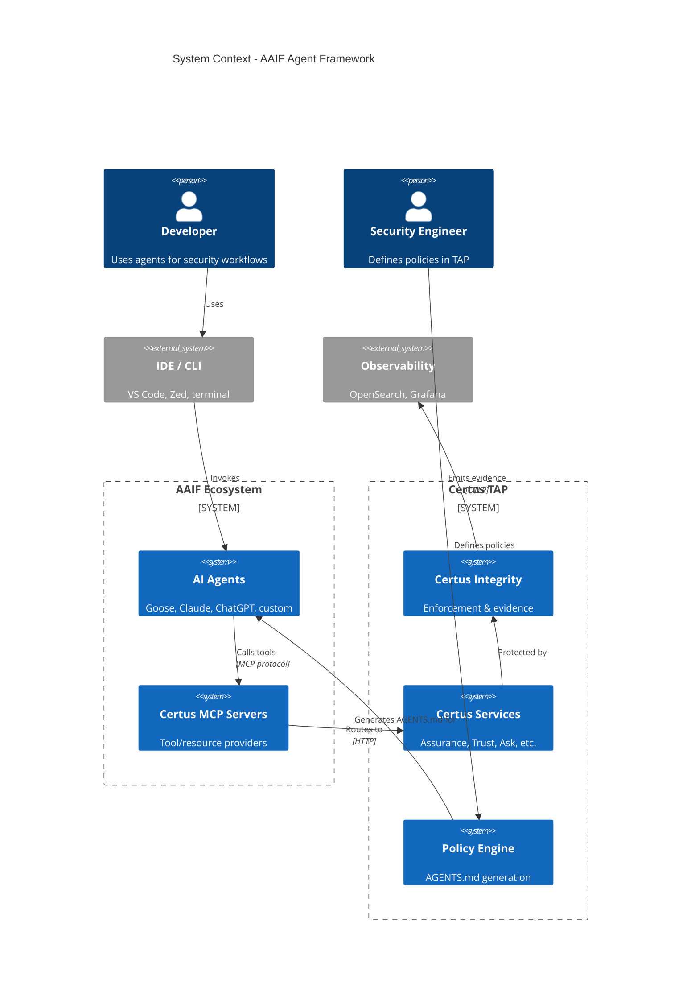
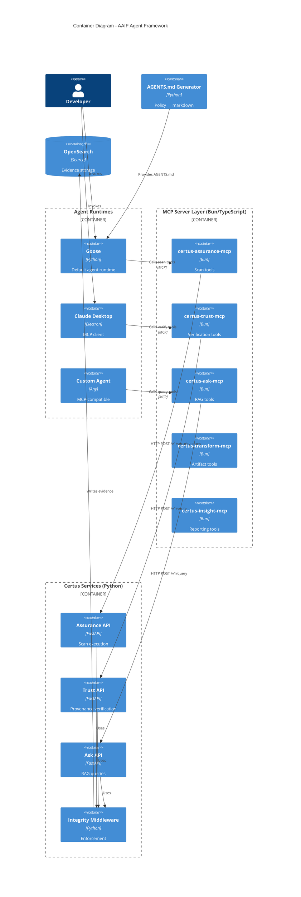
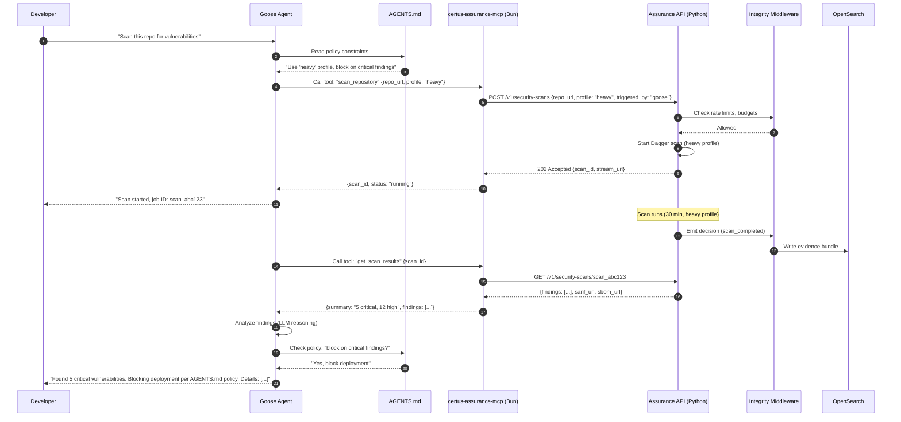

# AAIF Agent Framework: Agent-Native Security & Assurance Platform

> Transform Certus into the security substrate for the AAIF ecosystem via MCP servers, Goose agents, and AGENTS.md governance

## Metadata

- **Type**: Proposal
- **Status**: Draft
- **Author**: Certus Architecture Team
- **Created**: 2025-12-11
- **Last Updated**: 2025-12-14
- **Target Version**: v2.0
- **Implementation Timeline**: 16 weeks (phased)

## Executive Summary

The **Agentic AI Foundation (AAIF)** represents industry convergence on open standards for AI agent infrastructure, bringing together major technology organizations (AWS, Anthropic, Google, Microsoft, OpenAI, Block, Cloudflare) under Linux Foundation governance. This proposal defines how Certus becomes an **AAIF-native security and assurance platform** by adopting AAIF's three core components: **Model Context Protocol (MCP)**, **Goose**, and **AGENTS.md**.

**Key Points**:

- **Problem**: AI agents require custom integration for each framework (Semantic Kernel, AutoGen, LangChain), no standard way to encode security policies agents must follow, and current AI assistance is reactive (Q&A) rather than proactive (autonomous workflows)
- **Solution**: Build MCP servers (Bun/TypeScript) for all Certus services, adopt Goose as the default agent runtime, generate AGENTS.md governance artifacts from Certus policies, and enable any MCP-compatible agent to consume Certus capabilities
- **Benefits**: Future-proof integration (new agents work automatically via MCP), vendor-neutral positioning (Linux Foundation governance), policy-driven agent behavior (AGENTS.md), and infrastructure-native agents (Goose runs locally or in CI/CD)
- **Risks**: MCP protocol is evolving, AGENTS.md adoption is nascent, Goose is new (v0.x), agent autonomy requires robust guardrails, and managing multiple MCP servers increases operational complexity

## Motivation

### Problem Statement

Certus TAP lacks agent-native integration:

1. **Integration Fragmentation**: Every new AI agent framework (Semantic Kernel, AutoGen, LangChain, custom) requires bespoke integration work. No universal protocol for tool invocation.

2. **Policy Enforcement Gap**: No standard way to encode "how agents should behave" in repositories. Security policies exist in Certus TAP but agents cannot discover or consume them automatically.

3. **Limited AI Autonomy**: Current AI assistance is reactive (certus-ask answers questions). Agents cannot autonomously plan, execute, and validate complex security workflows (e.g., "scan repo, find vulnerabilities, propose fixes, validate fixes").

4. **Vendor Lock-in Risk**: Framework-specific integrations (e.g., Semantic Kernel plugins) create coupling to vendor ecosystems. Switching frameworks requires rewriting integrations.

5. **Governance Challenges**: Difficult to ensure agents follow security policies (severity thresholds, compliance requirements, tool restrictions) without runtime enforcement in each framework.

6. **Ecosystem Mismatch**: Certus is infrastructure/platform, but framework-centric approaches (Semantic Kernel, AutoGen) treat Certus as an application dependency.

### Background

**Current Certus Integration Layers**:

- **MCP/ACP Gateway** (from mcp-acp-proposal.md): IDE integration for human-triggered Certus operations
- **N8n**: Low-code workflow automation with predefined logic
- **REST APIs**: Traditional service integration
- **CLI**: Command-line tooling for developers

**What's Missing**: A layer that enables **autonomous AI agents** to discover, invoke, and be governed by Certus capabilities using industry-standard protocols.

**AAIF Emergence**:

In 2024-2025, the industry converged on three open standards under Linux Foundation governance:

1. **Model Context Protocol (MCP)**: Universal protocol for connecting LLM applications to external data/tools (like USB-C for AI)
2. **Goose**: Extensible, infrastructure-native AI agent from Block with built-in MCP support
3. **AGENTS.md**: Standardized location for encoding project-specific agent policies and instructions

Founding members: AWS, Anthropic, Block, Bloomberg, Cloudflare, Google, Microsoft, OpenAI. Rapid adoption: Claude Desktop, ChatGPT (planned), GitHub Copilot (planned), VS Code extensions.

### User Impact

**Developers**:

- Invoke Certus security scans from any MCP-compatible agent (Claude Desktop, ChatGPT, Goose) without manual API integration
- Use natural language to orchestrate complex workflows ("scan this repo, find critical CVEs, propose fixes, validate with tests")
- Goose agents run locally (no cloud dependency) or in CI/CD for automated security workflows

**Security Engineers**:

- Encode security policies in AGENTS.md (e.g., "always scan before merge", "block on critical findings")
- Agents automatically consume and follow policies (no manual enforcement)
- Audit all agent actions via Certus Integrity evidence bundles

**Platform Operators**:

- Deploy Certus MCP servers once, support any MCP-compatible agent (future-proof)
- Leverage Goose for infrastructure automation (agent runs in TAP environment, orchestrates security operations)
- Maintain vendor neutrality (MCP is protocol, not framework)

### Research Context

AAIF integration enables research into:

1. **Agent-Driven Security**: Do autonomous agents improve security posture vs manual workflows? Measure scan frequency, vulnerability remediation time, false positive handling.

2. **Policy Effectiveness**: Can AGENTS.md-encoded policies reduce security violations? Compare repos with/without AGENTS.md governance.

3. **Multi-Agent Collaboration**: Can multiple specialized agents (scanner, fixer, validator) collaborate to solve complex security challenges?

4. **Agent Observability**: How do we measure agent behavior quality (decision accuracy, tool usage patterns, autonomy vs human-in-the-loop ratio)?

## Goals & Non-Goals

### Goals

- [ ] **MCP Servers for All Certus Services**: Expose certus-assurance, certus-trust, certus-ask, certus-transform, certus-insight via Bun/TypeScript MCP servers
- [ ] **Goose as Default Agent Runtime**: Provide Goose profiles for common security workflows (vulnerability scanning, compliance auditing, incident response)
- [ ] **AGENTS.md Governance**: Generate AGENTS.md artifacts from Certus policies, validate compliance via certus-assurance
- [ ] **Universal Agent Compatibility**: Support any MCP-compatible agent (Claude Desktop, ChatGPT, GitHub Copilot, Goose, custom agents)
- [ ] **Integrity Integration**: All agent-triggered operations route through Certus Integrity for enforcement and evidence emission
- [ ] **Infrastructure-Native Agents**: Goose runs locally (developer machines), in CI/CD (GitHub Actions), or in TAP environments (autonomous operations)

### Non-Goals

- **Build Custom Agent Framework**: Use existing frameworks (Goose for default, Semantic Kernel/AutoGen optional), do not create yet another framework
- **Replace Human Decision-Making**: Agents augment humans for complex workflows, humans retain control for critical decisions (production deployments, policy changes)
- **Deprecate REST APIs**: MCP is primary for agents, REST remains for traditional integrations
- **Framework Lock-in**: Avoid coupling to Semantic Kernel, AutoGen, or any single framework (MCP ensures portability)
- **Mandate AGENTS.md**: AGENTS.md is opt-in governance, not required for basic Certus usage

### Success Criteria

| Criterion                | Measurement                                                                                    |
| ------------------------ | ---------------------------------------------------------------------------------------------- |
| **MCP Coverage**         | All five Certus services expose MCP servers with at least 3 tools each                         |
| **Agent Compatibility**  | Successfully invoke Certus operations from Claude Desktop, Goose, and one custom MCP client    |
| **AGENTS.md Generation** | Certus TAP auto-generates valid AGENTS.md from policies for 100 test repositories              |
| **Goose Workflow**       | Complete end-to-end security workflow (scan → analyze → fix → validate) autonomously via Goose |
| **Integrity Evidence**   | 100% of agent-triggered operations emit evidence bundles (traceable via OpenSearch)            |
| **Performance**          | Agent-triggered scans complete within 10% of manual CLI scan time (overhead acceptable)        |

## Proposed Solution

### Overview

Transform Certus into an **AAIF-native security substrate** by:

1. **Building MCP Servers** (Bun/TypeScript): Each Certus service exposes an MCP server that provides tools, resources, and prompts for agents. Servers are thin orchestration layers that route to existing Certus HTTP APIs (protected by Integrity middleware).

2. **Adopting Goose as Default Agent Runtime**: Goose agents consume Certus MCP servers to execute security workflows. Goose runs locally (developer machines), in CI/CD (GitHub Actions), or in TAP environments (autonomous infrastructure operations).

3. **Implementing AGENTS.md Governance**: Certus TAP generates AGENTS.md artifacts from policies (severity thresholds, compliance requirements, tool restrictions). Agents read AGENTS.md and adapt behavior automatically. Certus-Assurance validates compliance.

4. **Maintaining Framework Flexibility**: While Goose is default, support any MCP-compatible agent. Optionally demonstrate Semantic Kernel or AutoGen for advanced orchestration (multi-agent, planners).

5. **Enforcing via Integrity**: All agent requests route through MCP servers (Bun/TypeScript) → HTTP APIs (Python) → Integrity middleware (enforcement). Language boundary prevents agents from bypassing guardrails.

**Architectural Principle**: **MCP servers are orchestration (Bun/TypeScript), enforcement stays in Integrity (Python)**. This is consistent with the MCP/ACP Gateway design.

### Architecture

#### System Context (C4 Level 1)



**Description**: Developers use IDEs to invoke AI agents (Goose, Claude Desktop, custom). Agents call Certus MCP Servers via the MCP protocol. MCP servers route to Certus Services via HTTP APIs, which are protected by Certus Integrity middleware. Security engineers define policies in TAP, which generates AGENTS.md artifacts that agents automatically consume. All operations emit evidence to observability stack.

#### Container View (C4 Level 2)



**Description**: Multiple agent runtimes (Goose, Claude Desktop, custom) invoke Certus MCP servers via MCP protocol. MCP servers are Bun/TypeScript services that route tool calls to Certus HTTP APIs (Python FastAPI). All APIs are protected by Integrity Middleware (Python) which enforces guardrails and emits evidence. AGENTS.md Generator creates policy artifacts that agents consume. The Bun/TypeScript layer (MCP servers) is orchestration only, enforcement stays in Python (Integrity middleware).

#### Workflow: Goose Agent Executes Security Scan



**Actors**:

- _Developer_ – Issues natural language command to Goose
- _Goose Agent_ – Autonomous agent executing security workflow
- _AGENTS.md_ – Policy artifact defining agent behavior constraints
- _certus-assurance-mcp_ – MCP server (Bun/TypeScript) routing to Certus API
- _Assurance API_ – Python FastAPI service executing scans
- _Integrity Middleware_ – Python enforcement layer (rate limits, evidence emission)
- _OpenSearch_ – Evidence storage

**Actions**:

1. **Natural Language Request**: Developer asks Goose to scan repo (no manual API calls)
2. **Policy Discovery**: Goose reads AGENTS.md to understand constraints (e.g., "use heavy profile")
3. **Tool Invocation**: Goose calls MCP server's `scan_repository` tool
4. **HTTP Routing**: MCP server routes to Certus Assurance HTTP API (triggers Integrity middleware)
5. **Enforcement**: Integrity checks rate limits, budgets (enforced in Python, not MCP layer)
6. **Scan Execution**: Assurance starts Dagger security module
7. **Progress Streaming**: Goose receives updates, informs developer
8. **Evidence Emission**: Integrity emits evidence bundle to OpenSearch
9. **Result Retrieval**: Goose calls `get_scan_results` tool to fetch findings
10. **Policy Compliance**: Goose checks AGENTS.md policy ("block on critical?")
11. **Autonomous Decision**: Goose blocks deployment based on policy + findings

**Desired Outcomes**:
| Outcome | Description |
|---------|-------------|
| **Agent Autonomy** | Developer gives high-level goal, agent executes multi-step workflow autonomously |
| **Policy Adherence** | Agent reads and follows AGENTS.md policies without manual enforcement |
| **Zero Bypass** | MCP server (Bun/TypeScript) cannot bypass Integrity (language boundary forces HTTP calls) |
| **Evidence Trail** | All agent actions produce Integrity evidence bundles for audit |

### Technical Design

#### Technology Stack

**MCP Servers (Python/FastMCP)**:

- **Runtime**: Python 3.11+ (consistent with Certus services)
- **Language**: Python 3.11+ (99% of Certus codebase)
- **MCP SDK**: `fastmcp` (Python MCP framework)
- **HTTP Client**: `httpx` (async HTTP for calling Certus APIs)
- **Deployment**: Docker containers (python:3.11-slim base), deployed alongside Certus services

**Why Python for MCP Servers**:

1. **Codebase Consistency**: Certus is 99% Python (Pydantic models, FastAPI, business logic). Adding TypeScript creates a language island and operational complexity.

2. **Team Expertise**: Engineering team has deep Python knowledge. TypeScript would slow development and require learning curve.

3. **Development Velocity**: Faster to implement and maintain with existing Python skillset.

4. **Model Reuse**: Can leverage existing Pydantic models from Certus services for type safety and validation.

5. **Unified Tooling**: Same deployment pipeline (Docker, uv, pytest), monitoring patterns, debugging tools.

**Security Boundary Enforcement**:

While Python MCP servers CAN technically import Certus service code (unlike TypeScript which cannot), we enforce the architectural boundary through:

1. **Architectural Pattern**: MCP tools MUST call HTTP APIs, never import service internals directly
2. **Import Linting**: Ruff rules prevent forbidden imports (`certus_*/services/*`, `certus_*/api/router`)
3. **Architectural Testing**: CI tests verify no MCP module imports service code
4. **Code Review Standards**: All MCP tool implementations follow HTTP-only template
5. **Integration Testing**: Tests prove Integrity middleware runs for every MCP call (evidence bundles exist)

**HTTP-Only Pattern (Enforced)**:

```python
# ✅ REQUIRED: MCP tool calls HTTP API
@mcp.tool()
async def verify_artifact(input: VerifyInput, ctx: Context):
    async with httpx.AsyncClient() as client:
        response = await client.post(
            "http://certus-trust:8057/v1/verify",  # Goes through Integrity
            json=input.model_dump()
        )
    return response.json()

# ❌ FORBIDDEN: Direct service import (caught by linting + review)
from certus_trust.services.verification_service import VerificationService
service = VerificationService()  # BYPASSES Integrity middleware!
```

The language boundary TypeScript would provide is replaced with **architectural discipline + automated enforcement**.

**Goose Agent Runtime (Python)**:

- **Runtime**: Python 3.11+ (Goose is Python-based)
- **Framework**: Goose v0.x (Block's agent framework)
- **LLM Backend**: Configurable (OpenAI, Anthropic Claude, local Ollama)
- **MCP Client**: Built into Goose (native MCP support)
- **Deployment**: Local (developer machines), CI/CD (GitHub Actions), infrastructure (Kubernetes pods)

**AGENTS.md Generation (Python)**:

- **Language**: Python 3.11+ (integrates with Certus TAP policy engine)
- **Template Engine**: Jinja2 (generate markdown from policy templates)
- **Validation**: Markdown linters, JSON Schema validation for embedded metadata
- **Storage**: Git repositories (committed alongside code)

**Responsibility Split** (Critical):

```
MCP Servers (Python/FastMCP)          Certus Integrity (Python)
├── Tool registry                     ├── Rate limiting
├── Schema validation                 ├── Graph budgets
├── Route to HTTP APIs                ├── Circuit breakers
├── Return agent-friendly responses   ├── PII redaction
├── Emit MCP-specific telemetry       ├── Evidence bundles
└── Acts as client of Integrity       └── Policy enforcement
```

**MCP servers do NOT enforce**:

- ❌ Rate limits (Integrity does)
- ❌ Graph budgets (Integrity does)
- ❌ PII redaction (Integrity does)
- ❌ Circuit breaking (Integrity does)
- ❌ Direct service access (must use HTTP APIs)

**MCP servers DO**:

- ✅ Validate tool inputs (Pydantic models)
- ✅ Route to correct HTTP endpoints
- ✅ Transform responses for agent consumption
- ✅ Check coarse capability allowlists (which tools tenant can use)

#### Data Model

**MCP Tool Definition** (certus-assurance-mcp):

```python
# certus_assurance/mcp/tools.py
from fastmcp import FastMCP, Context
from pydantic import BaseModel, Field
import httpx

mcp = FastMCP("Certus Assurance")

class ScanInput(BaseModel):
    repo_url: str = Field(
        description="Git repository URL or local path",
        examples=["https://github.com/org/repo", "./my-project"]
    )
    profile: str = Field(
        default="light",
        description="Scan profile: light (fast, basic checks) or heavy (comprehensive, includes DAST)",
        pattern="^(light|heavy)$"
    )
    manifest: dict | None = Field(
        default=None,
        description="Optional: Custom manifest override (advanced users)"
    )

class ScanOutput(BaseModel):
    scan_id: str
    status: str
    message: str
    stream_url: str
    estimated_duration: str
    next_steps: str

@mcp.tool(name="scan_repository")
async def scan_repository(input: ScanInput, ctx: Context) -> ScanOutput:
    """Trigger security scan on a repository using Certus Assurance.

    Examples:
        - Basic scan: scan_repository(repo_url="./my-project")
        - Heavy scan: scan_repository(repo_url="https://github.com/org/repo", profile="heavy")
    """

    # ============================================
    # SECURITY: This tool MUST call HTTP API only
    # Never import from certus_assurance.services.*
    # ============================================

    # Call Certus Assurance HTTP API (goes through Integrity middleware)
    async with httpx.AsyncClient() as client:
        response = await client.post(
            "http://certus-assurance:8056/v1/security-scans",
            json={
                "target": input.repo_url,
                "profile": input.profile,
                "manifest": input.manifest,
                "triggered_by": "mcp-agent",
            },
            headers={
                "Authorization": f"Bearer {ctx.get('service_token')}",
                "Content-Type": "application/json",
                "X-Triggered-By": "goose-agent",
                "X-User-ID": ctx.get("user_id"),
                "X-Tenant-ID": ctx.get("tenant_id"),
            },
            timeout=30.0
        )

        if not response.is_success:
            error = response.json()
            raise ValueError(f"Scan failed: {error.get('message', 'Unknown error')}")

        result = response.json()

    # Return agent-friendly response
    return ScanOutput(
        scan_id=result["scan_id"],
        status=result["status"],
        message=f"Scan started successfully. Job ID: {result['scan_id']}",
        stream_url=result["stream_url"],
        estimated_duration="30-45 minutes" if input.profile == "heavy" else "5-10 minutes",
        next_steps="Use get_scan_results tool to retrieve findings when complete"
    )
```

**AGENTS.md Structure**:

````markdown
# Security Policy for [Project Name]

> This file provides context and instructions for AI agents working on this project.
> Generated by Certus TAP on 2025-12-14.

## Security Requirements

### Scanning Policy

- **Required Profile**: `heavy` (comprehensive security checks including DAST)
- **Frequency**: Scan on every pull request and before production deployment
- **Blocking Threshold**: `critical` (block merge/deployment if critical findings exist)

### Tool Restrictions

- **Allowed Certus Tools**: `scan_repository`, `get_scan_results`, `analyze_vulnerabilities`, `search_findings`
- **Restricted Tools**: `trust_attest` (requires manual approval for attestation signing)

### Compliance Requirements

- **Standards**: SOC 2, ISO 27001
- **Required Checks**: SAST, dependency scanning, secrets detection, license compliance
- **Audit Trail**: All security operations must emit evidence bundles to Certus Insight

## Agent Behavior Guidelines

### Vulnerability Handling

1. Run `scan_repository` with `heavy` profile on code changes
2. Use `analyze_vulnerabilities` to prioritize findings by risk
3. For critical/high findings:
   - Propose fixes with code diffs
   - Validate fixes do not introduce regressions
   - Request human review before applying

### Human-in-the-Loop

- **Auto-fix**: Low/medium severity findings (with test validation)
- **Human approval required**: Critical/high findings, dependency upgrades, config changes

### Code Modification Constraints

- Never modify `.agents/AGENTS.md` (policy is source-of-truth)
- Never disable security checks or lower thresholds
- Always validate fixes with test suite before proposing

## Certus MCP Servers

Agents can invoke Certus operations via MCP protocol:

- **certus-assurance-mcp**: Security scanning, vulnerability analysis
- **certus-trust-mcp**: Provenance verification, attestation validation
- **certus-ask-mcp**: Knowledge base queries, documentation search
- **certus-transform-mcp**: Artifact upload, lifecycle promotion
- **certus-insight-mcp**: Compliance reporting, security analytics

Endpoint: `http://localhost:8080/mcp` (local dev) or configured in IDE.

## Metadata

```json
{
  "generated_by": "certus-tap",
  "version": "1.0",
  "last_updated": "2025-12-14T10:00:00Z",
  "policy_digest": "sha256:a1b2c3...",
  "tenant_id": "acme-corp"
}
```
````

````

**Evidence Bundle Integration**:

When Goose calls MCP tools → MCP calls HTTP APIs → Integrity middleware emits evidence:

```json
{
  "bundle_id": "bundle_goose_001",
  "integrity_evidence_version": "v1",
  "trace_id": "x1y2z3...",
  "service": "certus-assurance",
  "decisions": [
    {
      "decision": "allowed",
      "guardrail": "rate_limit",
      "metadata": {
        "triggered_by": "goose-agent",
        "user_id": "dev@acme.com",
        "tenant_id": "acme-corp",
        "mcp_tool": "scan_repository",
        "agent_session_id": "goose_session_abc"
      }
    }
  ],
  "external_signals": [],
  "classification": "normal",
  "total_duration_ms": 125.3,
  "guardrail_overhead_ms": 8.1
}
````

#### APIs

**MCP Server APIs** (Bun/TypeScript):

Each MCP server exposes these standard MCP endpoints:

```http
POST /mcp/v1/tools/list
Authorization: Bearer <mcp_token>

Response:
{
  "tools": [
    {
      "name": "scan_repository",
      "description": "Trigger security scan",
      "inputSchema": { ... }
    },
    {
      "name": "get_scan_results",
      "description": "Retrieve scan findings",
      "inputSchema": { ... }
    }
  ]
}
```

```http
POST /mcp/v1/tools/call
Authorization: Bearer <mcp_token>

{
  "tool": "scan_repository",
  "input": {
    "repo_url": "./my-project",
    "profile": "heavy"
  }
}

Response:
{
  "scan_id": "scan_xyz789",
  "status": "running",
  "message": "Scan started successfully",
  "stream_url": "wss://certus-assurance/stream/scan_xyz789"
}
```

**MCP Resources** (read-only data):

```http
GET /mcp/v1/resources/list

Response:
{
  "resources": [
    {
      "uri": "certus://scans/{scan_id}/sarif",
      "name": "SARIF findings",
      "mimeType": "application/sarif+json"
    },
    {
      "uri": "certus://scans/{scan_id}/sbom",
      "name": "Software Bill of Materials",
      "mimeType": "application/vnd.cyclonedx+json"
    }
  ]
}
```

**AGENTS.md Generation API** (Python):

```http
POST /api/v1/agents-md/generate
Authorization: Bearer <api_token>

{
  "tenant_id": "acme-corp",
  "repo_url": "https://github.com/acme/my-app",
  "policy_template": "soc2-compliant"
}

Response:
{
  "agents_md": "# Security Policy for my-app\n\n...",
  "metadata": {
    "version": "1.0",
    "policy_digest": "sha256:a1b2c3...",
    "generated_at": "2025-12-14T10:00:00Z"
  }
}
```

#### Integration Points

**Certus Assurance**:

- MCP Server: `certus-assurance-mcp` (Bun/TypeScript)
- Tools: `scan_repository`, `get_scan_results`, `analyze_vulnerabilities`, `search_findings`
- Resources: SARIF files, SBOM files, scan metadata
- HTTP API: POST `/v1/security-scans` (protected by Integrity)

**Certus Trust**:

- MCP Server: `certus-trust-mcp` (Bun/TypeScript)
- Tools: `verify_attestation`, `get_provenance_chain`, `search_attestations`
- Resources: Attestation bundles, provenance graphs
- HTTP API: POST `/v1/verify` (protected by Integrity)

**Certus Ask**:

- MCP Server: `certus-ask-mcp` (Bun/TypeScript)
- Tools: `query_knowledge_base`, `ingest_documents`, `get_similar_docs`
- Resources: Indexed documents, search results
- HTTP API: POST `/v1/query`, POST `/v1/ingest` (protected by Integrity)

**Certus Transform**:

- MCP Server: `certus-transform-mcp` (Bun/TypeScript)
- Tools: `upload_artifact`, `promote_artifact`, `get_artifact_lifecycle`
- Resources: S3 objects, lifecycle metadata
- HTTP API: POST `/v1/upload`, POST `/v1/promote` (protected by Integrity)

**Certus Insight**:

- MCP Server: `certus-insight-mcp` (Bun/TypeScript)
- Tools: `generate_compliance_report`, `get_security_metrics`, `query_findings_history`
- Resources: Compliance reports, dashboards, analytics
- HTTP API: GET `/v1/reports/{tenant_id}` (protected by Integrity)

**Goose Agent Runtime**:

- Consumes all Certus MCP servers via built-in MCP client
- Reads AGENTS.md from repository root (`.agents/AGENTS.md`)
- Runs locally (developer machines), CI/CD (GitHub Actions), or infrastructure (Kubernetes)
- No direct API calls to Certus services (always via MCP)

### Technology Stack

**MCP Servers**:

- **Runtime**: Python 3.11+
- **Language**: Python 3.11+
- **Framework**: FastMCP
- **MCP SDK**: `fastmcp` (Python MCP framework)
- **HTTP Client**: `httpx` (async HTTP client)
- **Testing**: pytest
- **Deployment**: Docker (python:3.11-slim), docker-compose (local), Kubernetes (production)

**Goose Agent Runtime**:

- **Runtime**: Python 3.11+
- **Framework**: Goose v0.x (Block)
- **LLM Backend**: OpenAI, Anthropic Claude, or local Ollama
- **MCP Client**: Built-in (Goose natively supports MCP)
- **Deployment**: Local (dev machines), CI/CD (GitHub Actions workflows), infrastructure (K8s pods)

**AGENTS.md Generation**:

- **Language**: Python 3.11+
- **Template Engine**: Jinja2
- **Validation**: Markdown linters, JSON Schema for metadata
- **Integration**: Certus TAP policy engine

**Optional Advanced Runtimes** (for demonstration):

- **Semantic Kernel**: .NET or Python SDK for enterprise orchestration
- **AutoGen**: Python multi-agent framework for collaborative workflows
- **LangChain**: Python agent framework (if needed for specific use cases)

### Security Considerations

#### Authentication & Authorization

**MCP Token Flow** (same as MCP/ACP Gateway):

1. Developer requests MCP token from Certus Auth (`POST /auth/mcp/token`)
2. Auth issues short-lived JWT (1 hour TTL) with `tenant_id`, `user_id`, `allowed_tools`
3. Developer configures Goose/Claude Desktop with MCP endpoint and token
4. MCP server validates token, extracts claims
5. MCP server calls Certus API with service-to-service token (not user token)

**Goose Agent Auth**:

- Goose reads MCP token from environment variable or config file
- Token scoped to specific tools (e.g., `scan_repository`, `get_scan_results`)
- Goose cannot use tools not in token's `allowed_tools` claim

**AGENTS.md Integrity**:

- AGENTS.md files signed with Certus Trust (cosign)
- Agents verify signature before consuming policy
- Tampered AGENTS.md rejected (agent refuses to operate)

#### Data Protection

**PII Handling**:

- MCP servers never see PII (pass-through to Certus APIs)
- Integrity middleware (Python) handles PII redaction before responses return
- Agent session logs scrubbed (trace_id preserved, request/response bodies excluded)

**Evidence Privacy**:

- Evidence bundles include metadata (agent_session_id, user_id, tool_name) but not payloads
- MCP servers do not store evidence (Integrity writes directly to OpenSearch)

**AGENTS.md Privacy**:

- AGENTS.md contains policies, not secrets
- Secrets (API keys, tokens) managed via Vault, referenced in AGENTS.md by key name

#### Threat Model

| Threat                                                  | Impact   | Likelihood | Mitigation                                                                         |
| ------------------------------------------------------- | -------- | ---------- | ---------------------------------------------------------------------------------- |
| **Agent Ignores AGENTS.md** (malicious or buggy agent)  | High     | Low        | Certus Assurance validates compliance, audit logs detect violations                |
| **MCP Bypasses Integrity** (direct import)              | Critical | N/A        | Impossible—Bun/TypeScript cannot import Python code, forces HTTP calls             |
| **Token Leakage** (Goose config exposed)                | High     | Medium     | Short TTL (1 hour), rotate service tokens daily, audit logs detect anomalous usage |
| **Agent DoS** (spam scans)                              | Medium   | Medium     | Integrity enforces rate limits per tenant/user, MCP cannot bypass                  |
| **AGENTS.md Tampering** (attacker modifies policy)      | High     | Low        | Sign with Certus Trust, agents verify signature before use                         |
| **Privilege Escalation** (agent uses unauthorized tool) | High     | Low        | MCP server checks capability allowlist before calling HTTP API                     |

#### Compliance

**Audit Trail**:

- All agent tool invocations produce Integrity evidence bundles
- Evidence includes: tool name, agent_session_id, user_id, tenant_id, timestamp, decision outcome
- 90-day retention in OpenSearch (configurable per tenant)

**SOC 2 / ISO 27001**:

- AGENTS.md provides "documented security policies agents must follow"
- Evidence bundles prove "security controls are enforced during agent operations"
- Agent actions are traceable (session_id → trace_id → evidence bundles)

**AGENTS.md Governance**:

- Policies version-controlled in Git (audit history)
- Changes to AGENTS.md trigger re-validation via Certus Assurance
- Agents automatically consume updated policies (no manual enforcement)

#### Enforcing HTTP-Only Pattern in Python MCP Servers

Since MCP servers and Certus services are both Python, preventing architectural boundary violations requires multiple enforcement layers:

**1. Import Linting (Automated)**

Add to `pyproject.toml`:

```toml
[tool.ruff.lint]
select = ["E", "F", "I"]

[tool.ruff.lint.per-file-ignores]
# MCP modules MUST NOT import service internals
"*/mcp/*.py" = []

[tool.ruff.lint.flake8-tidy-imports]
# Ban direct service imports in MCP code
ban-relative-imports = "all"

[tool.ruff.lint.flake8-tidy-imports.banned-api]
"certus_*.services" = {msg = "MCP tools must use HTTP APIs, not service imports"}
"certus_*.api.router" = {msg = "MCP tools must call endpoints via HTTP, not import routers"}
```

**2. Architectural Testing (CI)**

```python
# tests/architecture/test_mcp_isolation.py
import ast
import glob
import pytest

def test_mcp_modules_use_http_only():
    """Verify all MCP tools call HTTP APIs, never import services directly."""

    violations = []

    for mcp_file in glob.glob("certus_*/mcp/**/*.py", recursive=True):
        if "__pycache__" in mcp_file:
            continue

        with open(mcp_file) as f:
            tree = ast.parse(f.read(), filename=mcp_file)

        for node in ast.walk(tree):
            if isinstance(node, (ast.Import, ast.ImportFrom)):
                module = getattr(node, 'module', None) or ''

                # Check for forbidden imports
                if module.startswith('certus_') and (
                    '.services' in module or
                    '.api.router' in module
                ):
                    violations.append(
                        f"{mcp_file}: Forbidden import '{module}'"
                    )

    assert not violations, (
        "MCP modules must not import service code:\n" +
        "\n".join(violations)
    )

def test_mcp_tools_use_httpx():
    """Verify MCP tools use httpx for HTTP calls."""

    for mcp_file in glob.glob("certus_*/mcp/tools.py"):
        with open(mcp_file) as f:
            content = f.read()

        assert 'httpx' in content, (
            f"{mcp_file} should use httpx for HTTP API calls"
        )
```

**3. Integration Testing (Runtime Verification)**

```python
# tests/integration/test_mcp_integrity.py
import pytest
from opensearch import AsyncOpenSearch

@pytest.mark.integration
async def test_all_mcp_calls_trigger_integrity():
    """Prove every MCP tool invocation goes through Integrity middleware."""

    # Clear evidence
    await opensearch.delete_by_query(
        index="evidence-bundles",
        body={"query": {"match": {"triggered_by": "test-mcp"}}}
    )

    # Call each MCP tool
    tools = ["scan_repository", "verify_attestation", "query_knowledge"]

    for tool in tools:
        await mcp_client.call_tool(tool, test_input)

    # Verify evidence bundles exist
    results = await opensearch.search(
        index="evidence-bundles",
        body={"query": {"match": {"triggered_by": "test-mcp"}}}
    )

    assert results["hits"]["total"]["value"] >= len(tools), (
        "Not all MCP calls produced evidence bundles - "
        "Integrity middleware was bypassed!"
    )

    # Verify guardrails ran
    for hit in results["hits"]["hits"]:
        bundle = hit["_source"]
        assert any(
            d["guardrail"] in ["rate_limit", "budget_check"]
            for d in bundle["decisions"]
        ), "Evidence bundle missing guardrail decisions"
```

**4. Code Review Template**

All MCP tool PRs must include this checklist:

```markdown
## MCP Tool Security Checklist

- [ ] Tool uses `httpx.AsyncClient()` to call service HTTP API
- [ ] No imports from `certus_*/services/*`
- [ ] No imports from `certus_*/api/router`
- [ ] Integration test proves Integrity middleware runs
- [ ] Tool includes security comment header
```

**5. Tool Implementation Template**

```python
# certus_*/mcp/tools.py
@mcp.tool()
async def my_tool(input: Input, ctx: Context) -> Output:
    """Tool description."""

    # ============================================
    # SECURITY: This tool MUST call HTTP API only
    # Never import from certus_*/services/*
    # Architectural tests enforce this pattern
    # ============================================

    async with httpx.AsyncClient() as client:
        response = await client.post(
            f"{settings.service_url}/v1/endpoint",
            json=input.model_dump()
        )
        return Output(**response.json())
```

**Enforcement Summary**:

| Layer               | When          | Catches                       | Automated |
| ------------------- | ------------- | ----------------------------- | --------- |
| Ruff linting        | Pre-commit/CI | Forbidden imports             | ✅        |
| Architectural tests | CI            | Service imports               | ✅        |
| Integration tests   | CI            | Integrity middleware bypassed | ✅        |
| Code review         | PR review     | Violations, missing patterns  | ⚠️        |
| Runtime validation  | Development   | Import violations             | ✅        |

This multi-layer approach provides defense-in-depth that compensates for the lack of a compiler-enforced language boundary.

### Research Considerations

#### Reproducibility

**Agent Workflow Replay**:

- All agent tool invocations logged with inputs (tool name, arguments, timestamp, session_id)
- Evidence bundles stored with trace_id for correlation
- Researchers can replay agent sessions offline (deterministic LLM calls + cached tool responses)

**AGENTS.md Versioning**:

- Policies Git-tagged with versions (e.g., `v1.0`, `v1.1`)
- Experiments can compare agent behavior under different policy versions

#### Evaluation Metrics

**Agent Effectiveness**:

- **Task Completion Rate**: Percentage of agent sessions that complete successfully (scan → analyze → fix → validate)
- **Human Intervention Rate**: How often humans intervene (approve fixes, override agent decisions)
- **Fix Quality**: Percentage of agent-proposed fixes that pass validation (tests, security rescans)

**Policy Adherence**:

- **Compliance Rate**: Percentage of agent actions that follow AGENTS.md policies
- **Violation Detection**: How quickly Certus Assurance detects policy violations

**Observability**:

- **Decision Latency**: Time from tool invocation to response
- **Reasoning Quality**: Can agents explain their decisions (trace tool calls → decisions)?

#### Experiment Design

**Scenario 1: Agent vs Human Remediation Speed**

1. **Control Group**: Humans manually fix vulnerabilities (baseline time-to-remediation)
2. **Treatment Group**: Goose agents propose fixes autonomously (measure time-to-remediation)
3. **Measure**: Time from vulnerability discovery to validated fix, fix quality (regression rate)
4. **Hypothesis**: Agents reduce time-to-remediation by 50%+ for low/medium severity issues

**Scenario 2: AGENTS.md Policy Effectiveness**

1. **Control Group**: Repos without AGENTS.md (agents receive no policy guidance)
2. **Treatment Group**: Repos with AGENTS.md (agents follow policies)
3. **Measure**: Policy violation rate, security findings that reach production
4. **Hypothesis**: AGENTS.md reduces policy violations by 80%+

#### Data Collection

**What is Collected**:

- Agent tool invocations (tool name, timestamp, session_id, user_id, tenant_id)
- Success/failure outcomes (allowed, denied, rate_limited, error)
- Latency metrics (tool call → response time)
- Evidence bundles (via Integrity, includes decision events)
- AGENTS.md usage (which policies agents read, which they follow)

**What is NOT Collected**:

- Request payloads (scan targets, query texts) unless explicitly enabled for research
- PII (Integrity redacts before responses return to agents)
- LLM prompts/responses (focus is tool usage, not LLM internals)

## Alternatives Considered

### Alternative 1: Build Custom Agent Framework (Not Use AAIF)

**Description**: Create Certus-specific agent framework instead of adopting AAIF standards.

**Pros**:

- Full control over architecture and features
- Can optimize for Certus-specific use cases
- No dependency on external standards

**Cons**:

- **Ecosystem Fragmentation**: Certus agents incompatible with broader AI ecosystem
- **Maintenance Burden**: Must maintain framework, SDK, docs independently
- **Limited Adoption**: Developers won't adopt Certus-specific agents when universal MCP exists
- **Not Future-Proof**: Industry converging on AAIF, custom framework becomes technical debt

**Decision**: Rejected because **Certus is infrastructure, not an application**. AAIF provides infrastructure standards (MCP protocol, AGENTS.md). Building custom framework contradicts Certus's positioning.

### Alternative 2: Bun/TypeScript MCP Servers (Not Python)

**Description**: Implement MCP servers in Bun/TypeScript instead of Python.

**Pros**:

- **Language Boundary**: TypeScript physically cannot import Python code, guaranteeing HTTP-only calls
- **MCP Ecosystem**: Official SDK is TypeScript, better tooling/examples
- **Prevents Bypass**: Impossible to accidentally import service internals
- **Stronger Security**: Architectural boundary enforced by compiler, not discipline

**Cons**:

- **Two-Language Stack**: Adds TypeScript to 99% Python codebase, increasing operational complexity
- **Team Learning Curve**: Engineering team lacks TypeScript expertise, slows development
- **No Model Reuse**: Cannot share Pydantic models between services and MCP servers
- **Deployment Complexity**: Separate build pipeline (Node/Bun vs Python), different base images
- **Slower Development**: Would delay pilot timeline to learn new language/tooling

**Decision**: Rejected because **pragmatic benefits of Python outweigh theoretical security benefit of language boundary**. We enforce the same architectural pattern (HTTP-only calls) through linting, testing, and code review. The language boundary TypeScript provides is a "nice to have" for preventing accidental bypass, but not critical if we establish strong team discipline and automated enforcement.

### Alternative 3: Framework-Centric (Semantic Kernel as Primary)

**Description**: Adopt Semantic Kernel as the primary agent framework instead of AAIF/Goose.

**Pros**:

- Mature framework with planners, orchestration, memory
- Enterprise-ready (Microsoft backing)
- Good .NET and Python SDKs

**Cons**:

- **Vendor Lock-in**: Microsoft ecosystem (Azure AI, OpenAI partnerships)
- **Framework Dependency**: Certus becomes Semantic Kernel application, not infrastructure
- **Limited Portability**: Semantic Kernel agents cannot easily consume non-SK tools
- **Architectural Mismatch**: Certus is infrastructure/platform, SK is application framework

**Decision**: Rejected because **AAIF aligns with Certus's infrastructure positioning**. Semantic Kernel is optional advanced runtime, not primary architecture. MCP ensures any framework can consume Certus.

### Alternative 4: No Agent Integration (Stay REST-Only)

**Description**: Keep Certus as REST API platform, do not build agent integration.

**Pros**:

- No new development required
- No agent-related risks (autonomy, governance)
- Simpler architecture

**Cons**:

- **Ecosystem Left-Behind**: AI agents are becoming primary interface for developers
- **Competitive Disadvantage**: Competitors with agent integration will win mindshare
- **Manual Toil**: Developers still manually orchestrate complex security workflows
- **No Future-Proofing**: Agent ecosystem growing rapidly, Certus becomes legacy

**Decision**: Rejected because **agent integration is inevitable**. Question is not "if" but "how". AAIF provides standardized "how".

### Why the Proposed Solution?

The AAIF-native approach with Python MCP servers balances:

- **Future-Proofing**: Industry-standard protocols (MCP), not framework lock-in
- **Vendor Neutrality**: Linux Foundation governance, multi-vendor ecosystem
- **Pragmatic Implementation**: Python MCP servers leverage team expertise and existing codebase (99% Python)
- **Architectural Integrity**: HTTP-only pattern enforced through linting, testing, and code review
- **Infrastructure Positioning**: Certus provides capabilities, agents consume them (correct layer)
- **Development Velocity**: Faster implementation with Python vs learning TypeScript

It avoids custom frameworks (Alternative 1), two-language complexity (Alternative 2), vendor lock-in (Alternative 3), and ecosystem obsolescence (Alternative 4). The trade-off of using Python (same language as services) is acceptable because we enforce the architectural boundary through automated tooling and team discipline rather than compiler guarantees.

## Dependencies

### Prerequisites

- [ ] **Certus Integrity Middleware**: All Certus services must integrate Integrity middleware (Phase 1-2 of Integrity proposal)
- [ ] **Certus Auth Service**: Must support MCP token issuance (short-lived JWTs with tool scopes)
- [ ] **MCP/ACP Gateway**: Foundation for MCP server patterns, auth flows (completed per mcp-acp-proposal.md)
- [ ] **OpenSearch Deployment**: Evidence bundles written to OpenSearch
- [ ] **Goose Installation**: Goose runtime available in development environments and CI/CD

### Downstream Impact

- **Developers**: Need to install Goose locally, configure MCP endpoints
- **CI/CD Pipelines**: Add Goose agent steps to GitHub Actions workflows
- **Certus Services**: No code changes required (MCP calls existing HTTP APIs), but must ensure Integrity middleware active
- **Documentation**: New guides for AGENTS.md generation, Goose configuration, MCP server usage

### External Dependencies

| Dependency | Version | License    | Stability  | Notes                          |
| ---------- | ------- | ---------- | ---------- | ------------------------------ |
| `fastmcp`  | Latest  | MIT        | Beta       | Python MCP framework           |
| `httpx`    | 0.27+   | BSD        | Stable     | Async HTTP client              |
| `goose`    | 0.x     | Apache 2.0 | Alpha/Beta | Agent runtime (new, evolving)  |
| `jinja2`   | 3.0+    | BSD        | Stable     | AGENTS.md template generation  |
| `ruff`     | 0.6+    | MIT        | Stable     | Linting for import enforcement |

## Risks & Mitigations

| Risk                                                      | Probability | Impact | Mitigation Strategy                                                                                 |
| --------------------------------------------------------- | ----------- | ------ | --------------------------------------------------------------------------------------------------- |
| **MCP Protocol Evolution** (breaking changes)             | High        | Medium | Version MCP tool schemas, support N-1 versions for 90 days, monitor AAIF release notes              |
| **Goose Immaturity** (v0.x, bugs, breaking changes)       | High        | Medium | Start with pilot teams, maintain fallback to manual CLI, contribute fixes upstream                  |
| **AGENTS.md Adoption** (developers don't create policies) | Medium      | Medium | Auto-generate AGENTS.md from TAP policies, provide templates, incentivize via compliance dashboards |
| **Agent Autonomy Risk** (agent makes harmful decisions)   | Medium      | High   | Human-in-the-loop for critical operations, guardrails via Integrity, audit logs detect anomalies    |
| **MCP Server Complexity** (5+ servers to maintain)        | Medium      | Medium | Share code via TypeScript library (`@certus/mcp-common`), automate deployment, monitor with Grafana |
| **Token Leakage** (Goose config exposed)                  | Medium      | High   | Short TTL (1 hour), rotate service tokens daily, audit logs detect anomalous usage                  |

## Implementation Plan

### Phased Roadmap

#### Phase 0: Standards Alignment & Prototyping (2 weeks)

**Objectives**:

- Study AAIF standards (MCP spec, Goose architecture, AGENTS.md spec)
- Build minimal MCP server for one Certus service (certus-assurance)
- Test Goose agent consuming Certus MCP server
- Generate sample AGENTS.md from TAP policy

**Deliverables**:

- [ ] **MCP Spike**: Bun/TypeScript MCP server for certus-assurance with `scan_repository` tool
- [ ] **Goose Test**: Goose agent successfully triggers scan via MCP
- [ ] **AGENTS.md Prototype**: Python script generates AGENTS.md from policy template
- [ ] **Documentation**: `docs/reference/aaif/quickstart.md` with setup instructions

**Success Criteria**:

- Goose agent completes full workflow (scan → get results → analyze findings)
- AGENTS.md validates against spec (markdown linter + JSON Schema)
- Evidence bundle appears in OpenSearch with `triggered_by: "goose-agent"` metadata

**Estimated Effort**: 2 person-weeks (1 engineer)

#### Phase 1: MCP Server Foundation (4 weeks)

**Objectives**:

- Build MCP servers for all five Certus services
- Implement tool schemas, resource schemas, prompt templates
- Deploy in docker-compose alongside Certus services
- Integrate with Certus Auth (MCP token validation)

**Deliverables**:

- [ ] **MCP Servers**: `certus-assurance-mcp`, `certus-trust-mcp`, `certus-ask-mcp`, `certus-transform-mcp`, `certus-insight-mcp`
- [ ] **Tool Coverage**: At least 3 tools per service
- [ ] **Resource Support**: SARIF, SBOM, attestations, reports
- [ ] **Docker Compose**: `docker-compose.aaif.yml` with all MCP servers + Certus services

**Success Criteria**:

- All MCP servers pass schema validation (MCP inspector tool)
- Claude Desktop can invoke all tools (manual testing)
- Evidence bundles include MCP metadata for all invocations

**Estimated Effort**: 4 person-weeks (2 engineers)

#### Phase 2: Goose Integration & AGENTS.md (4 weeks)

**Objectives**:

- Install Goose in development environments
- Create Goose profiles for security workflows (scan, audit, incident response)
- Implement AGENTS.md generation from TAP policies
- Test end-to-end autonomous workflows

**Deliverables**:

- [ ] **Goose Profiles**: `certus-security`, `certus-compliance`, `certus-incident-response`
- [ ] **AGENTS.md Generator**: Python service generates policy artifacts from TAP
- [ ] **AGENTS.md Validation**: Certus Assurance validates compliance
- [ ] **CI/CD Integration**: GitHub Actions workflow runs Goose agent on PRs

**Success Criteria**:

- Goose completes autonomous scan workflow (scan → analyze → propose fix → validate)
- AGENTS.md enforced (Goose blocks deployment when policy violated)
- CI/CD workflow succeeds (Goose agent runs in GitHub Actions)

**Estimated Effort**: 4 person-weeks (2 engineers)

#### Phase 3: Advanced Runtimes & Multi-Agent (3 weeks)

**Objectives**:

- Demonstrate Semantic Kernel consuming Certus MCP servers (optional)
- Demonstrate AutoGen multi-agent collaboration (optional)
- Build agent observability dashboards (Grafana)
- Pilot with two internal teams

**Deliverables**:

- [ ] **Semantic Kernel Plugin**: SK plugin wrapping Certus MCP servers
- [ ] **AutoGen Demo**: Multi-agent workflow (scanner agent + fixer agent + validator agent)
- [ ] **Grafana Dashboards**: Agent tool invocations, success rates, latency, evidence bundles
- [ ] **Pilot Program**: Two teams using Goose for 4 weeks

**Success Criteria**:

- Semantic Kernel successfully invokes Certus tools (proves MCP portability)
- AutoGen multi-agent completes collaborative workflow
- Pilot teams report ≥80% satisfaction

**Estimated Effort**: 3 person-weeks (2 engineers)

#### Phase 4: Production Hardening & Documentation (3 weeks)

**Objectives**:

- Add monitoring, alerting, runbooks for MCP servers
- Load test (100 concurrent Goose agents)
- Publish developer guides, AGENTS.md templates, Goose profiles
- Production deployment

**Deliverables**:

- [ ] **Monitoring**: Prometheus metrics for MCP servers exported to VictoriaMetrics
- [ ] **Alerting**: Grafana alerts for high error rate, high latency
- [ ] **Runbook**: `docs/operations/aaif-runbook.md`
- [ ] **Load Tests**: 100 concurrent Goose agents (Locust)
- [ ] **Developer Guides**: AGENTS.md authoring, Goose setup, MCP troubleshooting

**Success Criteria**:

- Load tests pass (100 agents, <5% error rate, p95 latency <300ms)
- Runbook covers all common incidents (token expiry, MCP server crash, Goose errors)
- Documentation complete (setup guides, troubleshooting, best practices)

**Estimated Effort**: 3 person-weeks (1 engineer + 1 tech writer)

### Timeline Summary

| Phase     | Duration     | Start After | Deliverables                                            |
| --------- | ------------ | ----------- | ------------------------------------------------------- |
| Phase 0   | 2 weeks      | Approval    | MCP spike, Goose test, AGENTS.md prototype              |
| Phase 1   | 4 weeks      | Phase 0     | MCP servers for all services, docker-compose deployment |
| Phase 2   | 4 weeks      | Phase 1     | Goose profiles, AGENTS.md generation, CI/CD integration |
| Phase 3   | 3 weeks      | Phase 2     | Advanced runtimes (SK, AutoGen), observability, pilot   |
| Phase 4   | 3 weeks      | Phase 3     | Production hardening, load tests, documentation         |
| **Total** | **16 weeks** |             |                                                         |

### Resource Requirements

**Development**:

- Phase 0: 2 person-weeks (1 engineer)
- Phase 1: 4 person-weeks (2 engineers)
- Phase 2: 4 person-weeks (2 engineers)
- Phase 3: 3 person-weeks (2 engineers)
- Phase 4: 3 person-weeks (1 engineer + 1 tech writer)
- **Total**: ~16 person-weeks

**Testing**: 3 person-weeks (integration tests, load tests, pilot support)

**Documentation**: 2 person-weeks (guides, runbooks, templates)

**Infrastructure**:

- Docker Compose (local): $0
- AWS (dev environment): ~$150/month (ECS, ALB, S3)
- Production (Phase 4+): ~$600/month (multi-AZ, higher concurrency for MCP servers)

### Milestones

- **M1** (Week 2): Goose agent completes scan workflow via MCP spike
- **M2** (Week 6): All 5 MCP servers deployed, Claude Desktop can invoke all tools
- **M3** (Week 10): AGENTS.md enforcement works (Goose blocks deployment on policy violation)
- **M4** (Week 13): Pilot complete (2 teams, ≥80% satisfaction)
- **M5** (Week 16): Production-ready (monitoring, load tests pass, docs published)

## Testing Strategy

### Unit Testing

**Scope**: Individual MCP tool handlers, schema validation, AGENTS.md generation

**Approach**:

- Bun's built-in test runner for MCP servers
- pytest for AGENTS.md generator
- Mock Certus HTTP APIs (return fake scan_id, status)

**Coverage Goals**:

- 90%+ line coverage for MCP server code
- 100% coverage for auth and tool validation logic

**Key Test Cases**:

- Valid tool invocation succeeds (returns scan_id)
- Invalid input rejected (schema validation fails)
- Expired token rejected (401 Unauthorized)
- Unauthorized tool blocked (capability allowlist check fails)

### Integration Testing

**Scope**: End-to-end agent workflows with real Certus services

**Approach**:

- Docker Compose with Goose + MCP servers + Certus services + Integrity
- Test complete workflows (scan → analyze → fix → validate)
- Check evidence bundles appear in OpenSearch

**Key Test Cases**:

- **Goose Scan Workflow**: Goose invokes `scan_repository` → `get_scan_results` → analyzes findings
- **AGENTS.md Enforcement**: Goose reads policy, blocks deployment on critical findings
- **Integrity Enforcement**: Rate limit exceeded → Goose receives error (enforced by Integrity, not MCP)
- **Multi-Service**: Goose calls assurance MCP (scan) → trust MCP (verify) → insight MCP (report)

### Research Validation

**Scenario**: Do Goose agents improve vulnerability remediation speed?

**Hypothesis**: Agents reduce time-to-remediation by 50%+ for low/medium severity issues.

**Experiment**:

1. Measure baseline manual remediation time (humans fix vulnerabilities, 4 weeks)
2. Deploy Goose agents to pilot teams (4 weeks)
3. Measure agent-assisted remediation time
4. Compare: agent time vs manual baseline

**Validation Criteria**:

- Agent remediation time ≤ 0.5x manual baseline
- Fix quality ≥90% (validated fixes pass tests, no regressions)

### Performance Testing

**Scope**: MCP server latency and Goose agent throughput under load

**Approach**:

- Locust load testing (100 concurrent Goose agents)
- Measure p50/p95/p99 latency for tool invocations
- Identify bottlenecks (token validation, HTTP calls, LLM latency)

**Acceptance Criteria**:

- p95 latency <300ms (MCP tool call → response)
- MCP overhead <10% of total workflow time
- 100 concurrent agents, <5% error rate

**Load Test Scenarios**:

- Baseline: 10 agents, 1 workflow/min each
- Stress: 100 agents, 5 workflows/min each
- Spike: 200 agents suddenly start workflows

### Security Testing

**Scope**: Agent bypass attempts, token leakage, AGENTS.md tampering

**Approach**:

- Manual penetration testing (attempt to bypass allowlists, forge tokens)
- Automated fuzzing (send malformed MCP requests)
- AGENTS.md signature validation testing

**Key Test Cases**:

- **Token Forgery**: Modified JWT signature → rejected
- **Capability Escalation**: Goose tries unauthorized tool → blocked by MCP server allowlist
- **Integrity Bypass**: MCP server cannot call Certus APIs without going through HTTP (verified by code inspection)
- **AGENTS.md Tampering**: Modified policy file → signature verification fails, Goose refuses to operate

**Acceptance Criteria**:

- Zero successful bypass attempts
- 100% of forged/expired tokens rejected
- AGENTS.md signature validation enforced

## Documentation Requirements

- [x] **API Documentation**: `docs/reference/api/mcp-servers.md` (tool schemas, resource schemas, prompt templates)
- [x] **User Guides**:
  - `docs/guides/goose-setup.md` (install Goose, configure MCP endpoints)
  - `docs/guides/agents-md-authoring.md` (write AGENTS.md policies)
  - `docs/guides/mcp-troubleshooting.md` (debug MCP connection issues)
- [x] **Architecture Documentation**: This proposal + C4 diagrams
- [x] **Runbooks**: `docs/operations/aaif-runbook.md` (MCP server incidents, Goose errors, AGENTS.md issues)
- [x] **Research Documentation**: `docs/research/agent-effectiveness.md` (agent vs human remediation studies)

## Migration Strategy

Not applicable—AAIF is a new capability, no existing functionality to migrate. REST APIs remain supported.

## Open Questions

- [ ] **Question 1**: Should AGENTS.md be mandatory for all repos or opt-in? **Owner**: Security team (trade-off: governance vs flexibility)
- [ ] **Question 2**: Which LLM backend should Goose use by default (OpenAI, Claude, local Ollama)? **Owner**: Architecture team (trade-off: quality vs cost vs privacy)
- [ ] **Question 3**: Should MCP servers cache tool results or always forward to Certus APIs? **Owner**: Performance team (trade-off: latency vs staleness)
- [ ] **Question 4**: How long should AGENTS.md policies be retained after repo deletion? **Owner**: Compliance team (audit retention requirements)
- [ ] **Question 5**: Should Goose agents run in shared infrastructure or per-tenant isolated environments? **Owner**: DevOps team (trade-off: cost vs isolation)

## Future Enhancements

**Hybrid Architecture: Bun/TypeScript Gateway + Python Service MCPs** (Phase 5):

If the pilot succeeds and we expand to all 5 services, consider this hybrid approach:

```
┌─────────────────────────────────────┐
│   Unified MCP Gateway               │
│   (Bun/TypeScript)                  │
│   - Language boundary enforced      │
│   - Centralized auth/telemetry      │
│   - Composes all service MCPs       │
└────────────┬────────────────────────┘
             │ HTTP
             ├──────────────────┬──────────────────┬─────────────────┐
             ▼                  ▼                  ▼                 ▼
    ┌─────────────────┐ ┌─────────────────┐ ┌──────────────┐ ┌──────────────┐
    │ Trust MCP       │ │ Ask MCP         │ │ Assurance MCP│ │ Insight MCP  │
    │ (Python)        │ │ (Python)        │ │ (Python)     │ │ (Python)     │
    │ → HTTP API      │ │ → HTTP API      │ │ → HTTP API   │ │ → HTTP API   │
    └─────────────────┘ └─────────────────┘ └──────────────┘ └──────────────┘
```

**Benefits**:

- ✅ **Language boundary at gateway**: TypeScript cannot import Python Integrity code
- ✅ **Python services remain simple**: Existing per-service MCP modules unchanged
- ✅ **One IDE configuration**: Users configure gateway endpoint only
- ✅ **Gradual migration**: Build gateway after services proven
- ✅ **Best of both worlds**: Security boundary where it matters + development velocity where it helps

**Implementation**:

- Gateway written in Bun/TypeScript (routes to service MCPs via HTTP)
- Service MCPs stay Python (internal tools, can run standalone)
- Gateway enforces boundary for external access
- Services enforce HTTP-only pattern for internal consistency

**Migration Path**:

1. Phase 1-4: Build Python MCP for each service (standalone)
2. Phase 5: Build TypeScript gateway that calls service MCPs
3. Phase 6: Optionally refactor service MCPs if needed (unlikely)

**Effort**: 3-4 weeks (gateway only, services unchanged)

**Deferred because**: Need to prove MCP value with pilot first, gateway adds complexity

---

**Multi-Agent Collaboration** (Phase 6+):

- Specialized agents (scanner, fixer, tester) collaborate on complex workflows
- Agent-to-agent communication via MCP (agents as MCP servers and clients)
- **Deferred because**: Single-agent workflows prove value first, multi-agent adds complexity

**Agent Fine-Tuning** (Phase 7+):

- Fine-tune LLMs on Certus-specific tasks (vulnerability analysis, policy interpretation)
- Custom prompts optimized for security domain
- **Deferred because**: Requires LLM fine-tuning infrastructure, research on optimal prompts needed first

**Managed Agent Service** (Future):

- Certus-hosted Goose agents (customers don't run agents locally)
- Multi-tenant agent isolation
- **Deferred because**: Certus TAP not yet multi-tenant, premature to build managed agents

**Agent Marketplace** (Future):

- Community-contributed Goose profiles for specialized workflows
- Certify and distribute via Certus TAP
- **Deferred because**: Ecosystem needs critical mass of users first

## References

### Related Proposals

- [MCP/ACP Integration](./mcp-acp-proposal.md) - IDE integration layer (MCP Gateway pattern established here)
- [Certus Integrity](./certus-integrity.md) - Enforcement layer that protects Certus APIs (agents are clients of Integrity)
- [Certus Assurance Modernization](./certus-assurance-proposal.md) - Security scanning exposed via MCP
- [Certus Trust](./certus-trust-proposal.md) - Provenance verification exposed via MCP

### Standards & Specifications

- [AAIF (Agentic AI Foundation)](https://aaif.io/) - Linux Foundation initiative for agent standards
- [Model Context Protocol (MCP)](https://modelcontextprotocol.io/) - Universal agent tool protocol
- [Goose](https://github.com/block/goose) - Infrastructure-native agent runtime from Block
- [AGENTS.md Spec](https://github.com/aaif/agents-md) - Standardized agent policy format
- [OpenTelemetry](https://opentelemetry.io/) - Telemetry standard (agents emit OTLP)

### Research Papers

- [MCP Whitepaper](https://modelcontextprotocol.io/docs/whitepaper) - Protocol design rationale
- [AAIF Vision Paper](https://aaif.io/vision) - Industry alignment on agent standards

### External Documentation

- [Bun Documentation](https://bun.sh/docs) - Bun runtime for MCP servers
- [MCP TypeScript SDK](https://github.com/modelcontextprotocol/typescript-sdk) - Official SDK
- [Goose Documentation](https://block.github.io/goose) - Agent runtime setup and usage
- [AGENTS.md Examples](https://github.com/aaif/agents-md/tree/main/examples) - Policy templates

### Implementation Priority

- See [Implementation Priority Roadmap](./implemenation-priority.md) - **Tier 1, Item #4** (strategic capability)

## Appendices

### Appendix A: MCP Tool Examples

**certus-assurance-mcp Tools**:

1. **scan_repository**: Trigger security scan (light/heavy profile)
2. **get_scan_results**: Retrieve findings, SARIF, SBOM
3. **analyze_vulnerabilities**: AI-friendly vulnerability prioritization
4. **search_findings**: Query historical scan database
5. **get_fix_guidance**: LLM-generated remediation advice

**certus-trust-mcp Tools**:

1. **verify_attestation**: Validate provenance chain
2. **get_provenance_chain**: Retrieve full attestation graph
3. **search_attestations**: Query attestation database
4. **validate_policy**: Check if artifact meets policy requirements
5. **get_trust_score**: Calculate trust score for artifact

**certus-ask-mcp Tools**:

1. **query_knowledge_base**: RAG-based Q&A
2. **ingest_documents**: Add docs to knowledge base
3. **get_similar_docs**: Semantic similarity search
4. **cite_sources**: Retrieve grounded sources for answer
5. **summarize_docs**: LLM summarization of documentation

**certus-transform-mcp Tools**:

1. **upload_artifact**: Upload to S3 (LocalStack or cloud)
2. **promote_artifact**: Move raw → golden → promoted
3. **get_artifact_lifecycle**: Retrieve lifecycle metadata
4. **list_artifacts**: Query artifact catalog
5. **delete_artifact**: Remove artifact (with approval)

**certus-insight-mcp Tools**:

1. **generate_compliance_report**: SOC 2, ISO 27001, custom
2. **get_security_metrics**: Vulnerability trends, scan coverage
3. **query_findings_history**: Time-series vulnerability data
4. **get_dashboard_link**: URL to Grafana dashboard
5. **export_analytics**: CSV/JSON export for offline analysis

### Appendix B: AGENTS.md Template

````markdown
# Security Policy for ${PROJECT_NAME}

> Auto-generated by Certus TAP on ${TIMESTAMP}
> Policy Version: ${VERSION}
> Tenant: ${TENANT_ID}

## Overview

This file provides context and instructions for AI agents working on ${PROJECT_NAME}.
Agents must follow these policies when performing security operations.

## Security Requirements

### Scanning Policy

- **Profile**: `${SCAN_PROFILE}` (light | heavy)
- **Frequency**: ${SCAN_FREQUENCY} (e.g., "every PR", "daily", "on-demand")
- **Blocking Threshold**: `${SEVERITY_THRESHOLD}` (critical | high | medium | low)

**Behavior**: Agents must run scans with the specified profile. If findings meet or exceed
the blocking threshold, deployment must be blocked pending human review.

### Tool Authorization

- **Allowed Tools**: ${ALLOWED_TOOLS} (comma-separated list)
- **Restricted Tools**: ${RESTRICTED_TOOLS} (require human approval)

**Behavior**: Agents may only use tools in the allowed list. Attempts to use restricted
tools must prompt for human approval with justification.

### Compliance Requirements

- **Standards**: ${COMPLIANCE_STANDARDS} (e.g., "SOC 2, ISO 27001")
- **Required Checks**: ${REQUIRED_CHECKS} (e.g., "SAST, dependency scanning, secrets")
- **Audit Trail**: All operations must emit evidence bundles to Certus Insight

## Agent Behavior Guidelines

### Vulnerability Handling

1. **Discovery**: Run `scan_repository` on code changes
2. **Analysis**: Use `analyze_vulnerabilities` to prioritize by risk
3. **Remediation**:
   - **Auto-fix**: Low/medium severity (with test validation)
   - **Human approval**: Critical/high severity, dependency upgrades

### Code Modification Constraints

- Never modify `.agents/AGENTS.md` (policy is source-of-truth)
- Never disable security checks or lower severity thresholds
- Always validate fixes with test suite before proposing

### Human-in-the-Loop

- **Auto-approve**: Scans, queries, reports
- **Human approval required**: Code changes, policy modifications, production deployments

## Certus MCP Servers

Agents can invoke Certus operations via MCP protocol:

- **certus-assurance-mcp**: `${ASSURANCE_MCP_ENDPOINT}`
- **certus-trust-mcp**: `${TRUST_MCP_ENDPOINT}`
- **certus-ask-mcp**: `${ASK_MCP_ENDPOINT}`
- **certus-transform-mcp**: `${TRANSFORM_MCP_ENDPOINT}`
- **certus-insight-mcp**: `${INSIGHT_MCP_ENDPOINT}`

## Metadata

```json
{
  "generated_by": "certus-tap-agents-md-generator",
  "version": "${VERSION}",
  "policy_digest": "${POLICY_DIGEST}",
  "last_updated": "${TIMESTAMP}",
  "tenant_id": "${TENANT_ID}",
  "signature": "${SIGNATURE}"
}
```
````

**Signature Verification**: Agents must verify the signature before consuming this policy.
Tampered policies must be rejected.

````

### Appendix C: Goose Profile Example

```yaml
# .goose/profiles/certus-security.yaml
name: certus-security
description: Security scanning and vulnerability remediation workflow

mcp_servers:
  certus-assurance:
    endpoint: http://localhost:8080/mcp/assurance
    token: ${CERTUS_MCP_TOKEN}
  certus-trust:
    endpoint: http://localhost:8080/mcp/trust
    token: ${CERTUS_MCP_TOKEN}

workflow:
  - name: scan
    tool: certus-assurance/scan_repository
    description: Trigger security scan
    parameters:
      repo_url: ${GOOSE_REPO_PATH}
      profile: heavy

  - name: analyze
    tool: certus-assurance/analyze_vulnerabilities
    description: Prioritize findings
    parameters:
      job_id: ${scan.scan_id}
      risk_threshold: high

  - name: propose_fixes
    tool: certus-assurance/get_fix_guidance
    description: Generate fix suggestions
    parameters:
      job_id: ${scan.scan_id}
      auto_fix: true
      validate_with_tests: true

  - name: validate
    tool: certus-assurance/scan_repository
    description: Re-scan after fixes
    parameters:
      repo_url: ${GOOSE_REPO_PATH}
      profile: light

human_in_the_loop:
  - step: propose_fixes
    condition: severity >= critical
    prompt: "Found critical vulnerabilities. Review proposed fixes?"
````

### Appendix D: Glossary

| Term                    | Definition                                                                                        |
| ----------------------- | ------------------------------------------------------------------------------------------------- |
| **AAIF**                | Agentic AI Foundation—Linux Foundation initiative for agent standards (MCP, Goose, AGENTS.md)     |
| **MCP**                 | Model Context Protocol—universal protocol for connecting LLM applications to external tools/data  |
| **Goose**               | Infrastructure-native AI agent runtime from Block with built-in MCP support                       |
| **AGENTS.md**           | Standardized file (`.agents/AGENTS.md`) encoding project-specific agent policies and instructions |
| **MCP Server**          | Service exposing tools, resources, and prompts via MCP protocol (Bun/TypeScript for Certus)       |
| **MCP Client**          | Application consuming MCP servers (Goose, Claude Desktop, ChatGPT, custom agents)                 |
| **Tool**                | MCP-exposed capability (e.g., `scan_repository`, `verify_attestation`)                            |
| **Resource**            | MCP-exposed read-only data (e.g., SARIF files, SBOM files, attestations)                          |
| **Prompt**              | MCP-exposed LLM prompt template for common tasks                                                  |
| **Evidence Bundle**     | Structured artifact produced by Certus Integrity containing runtime decisions and metadata        |
| **Orchestration Layer** | MCP servers' role—route requests to services but enforce no policies (enforcement in Integrity)   |
| **Language Boundary**   | TypeScript/Python separation preventing MCP servers from bypassing Integrity middleware           |

---

## Notes for Reviewers

### Critical Review Areas

1. **AAIF Alignment** (Motivation): Does the AAIF rationale make sense vs framework-centric approaches (Semantic Kernel, AutoGen)?
2. **Python for MCP Servers** (Technical Design): Are the enforcement mechanisms (linting, testing, code review) sufficient to prevent architectural boundary violations?
3. **HTTP-Only Pattern** (Security): Is the multi-layer enforcement approach adequate compensation for lack of language boundary?
4. **Goose as Default Runtime** (Proposed Solution): Is Goose mature enough (v0.x) to be default, or should we start with Claude Desktop + optional Goose?
5. **AGENTS.md Generation** (Data Model): Can TAP policies map cleanly to AGENTS.md format? What about policy evolution?
6. **Agent Autonomy Guardrails** (Security): Are human-in-the-loop controls sufficient for critical operations?
7. **MCP Server Count** (Implementation): 5 MCP servers (one per service) adds operational complexity—should we consolidate into one gateway?

### Open Questions Requiring Decisions

- **Question 1** (AGENTS.md mandate): Recommend **opt-in** for Phase 1-2 (prove value), consider mandatory for compliance-critical repos in Phase 3+
- **Question 2** (LLM backend): Recommend **Claude (Anthropic)** for quality, **local Ollama** for privacy-sensitive environments
- **Question 3** (Caching): Recommend **no caching** (always forward to Certus APIs to get latest Integrity enforcement)
- **Question 4** (Policy retention): Recommend **90 days** after repo deletion (matches evidence bundle retention)
- **Question 5** (Agent infrastructure): Recommend **shared infrastructure** for Phase 1-3 (simpler), **per-tenant isolation** for Phase 4+ (production)

### Before Approval

- [ ] Security team review: Agent autonomy controls, AGENTS.md signature verification, threat model
- [ ] Architecture team review: AAIF vs framework choice, Bun/TypeScript for MCP servers, integration with Integrity
- [ ] Product team review: Goose vs alternatives, pilot scope, developer adoption strategy
- [ ] DevOps team review: MCP server deployment model, observability, runbook completeness
- [ ] Research team review: Agent effectiveness experiment design, evaluation metrics
