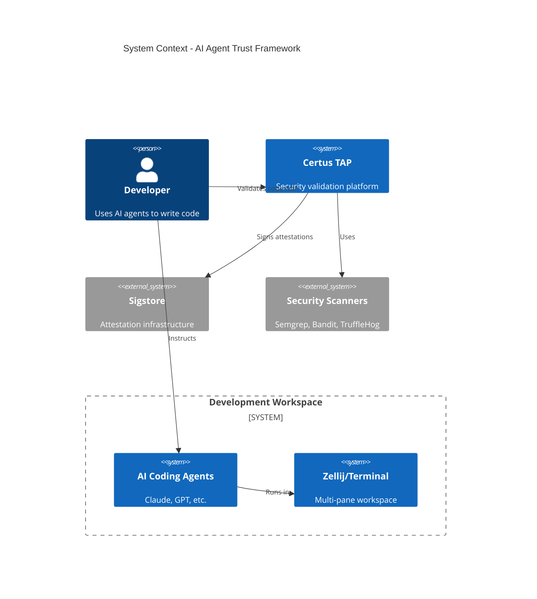
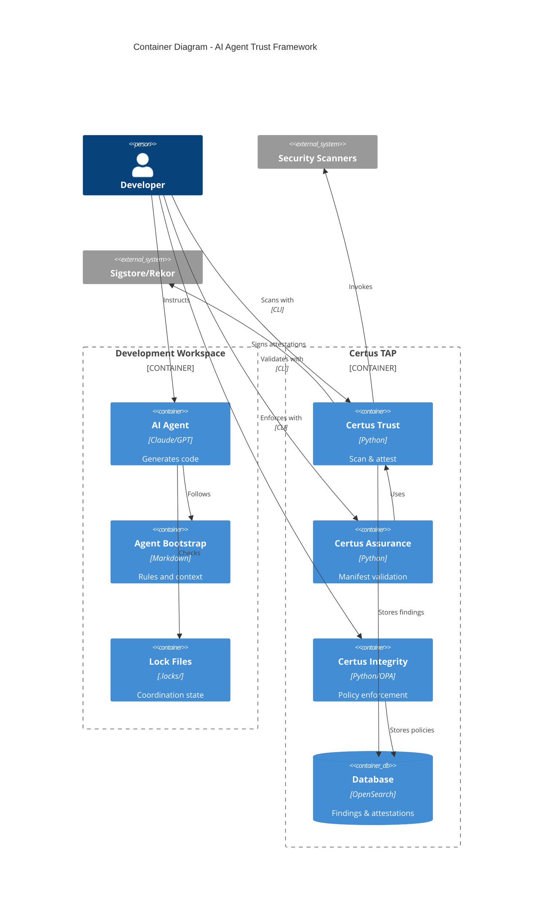
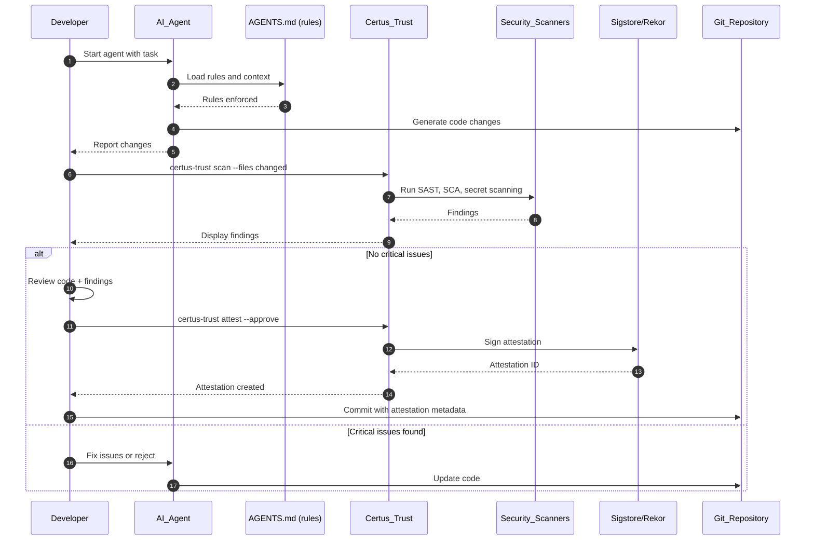
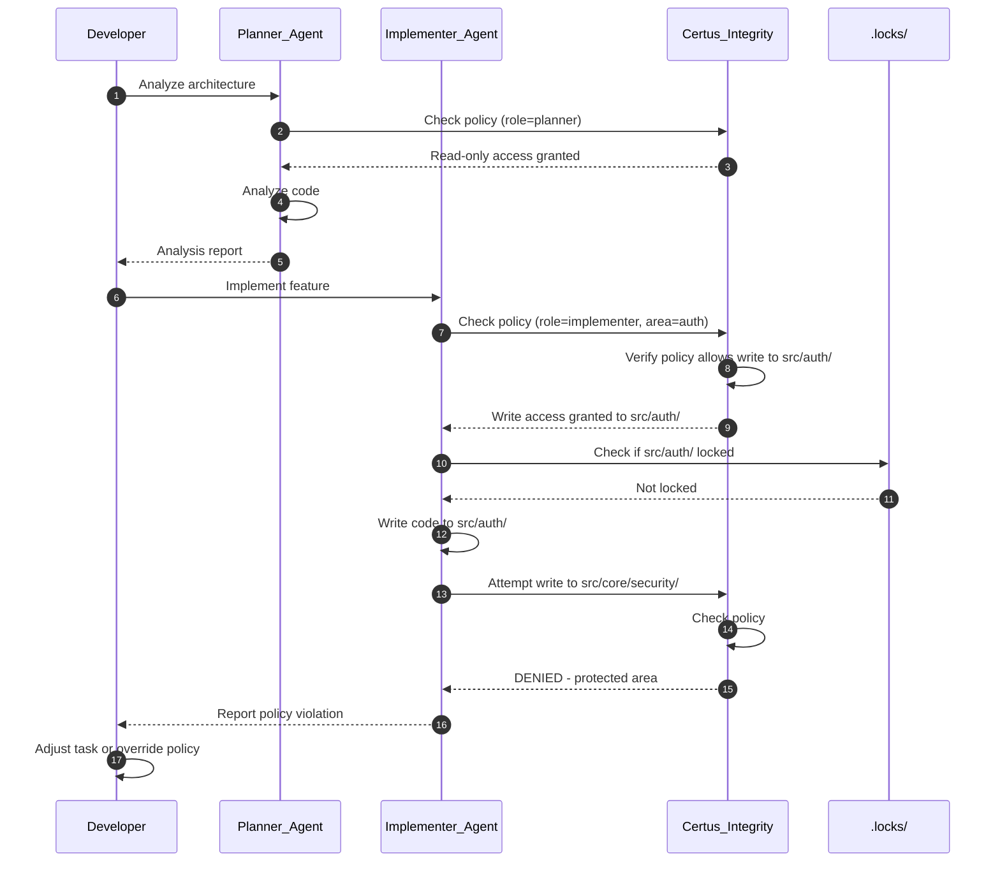
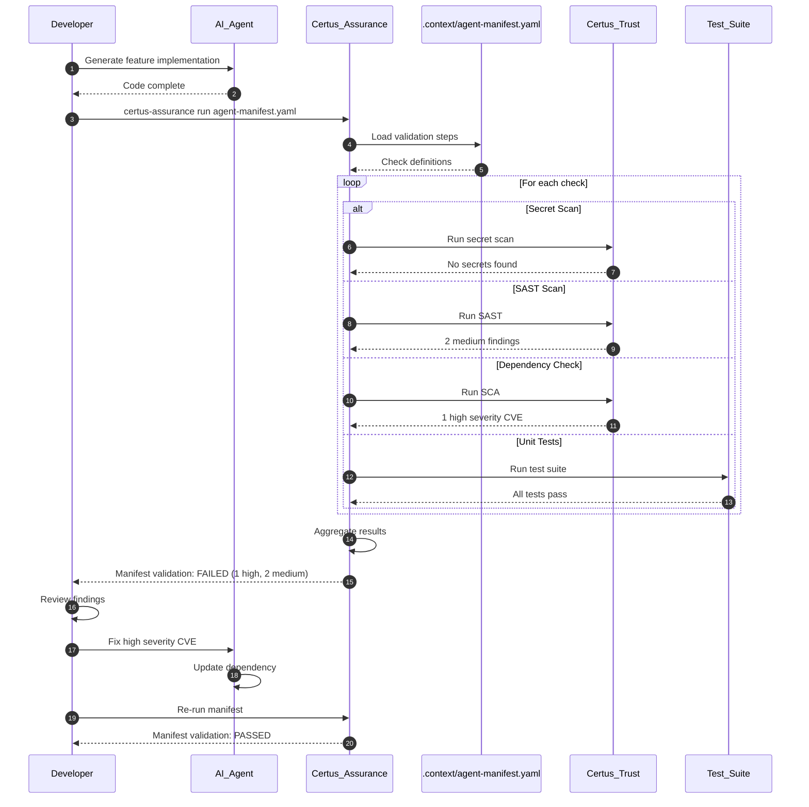

# AI Agent Trust Framework

> Integrate Certus TAP security infrastructure with AI-assisted development workflows to provide verifiable trust, assurance, and integrity for agent-generated code.

## Metadata

- **Type**: Proposal
- **Status**: Draft
- **Author**: Martin Harrod
- **Created**: 2025-12-24
- **Last Updated**: 2025-12-24
- **Target Version**: v2.1
- **Implementation Timeline**: 12 weeks (3 phases)

## Executive Summary

AI coding agents (Claude, GPT, etc.) can generate substantial amounts of code, but organizations have no way to verify that agent-generated code is secure, compliant, or trustworthy. This proposal integrates Certus TAP's trust, assurance, and integrity infrastructure into AI-assisted development workflows, creating a verifiable chain of trust from agent output to production deployment.

**Key Points**:

- **Problem**: AI agents generate code with no security validation, audit trail, or compliance verification
- **Solution**: Certus TAP scans, validates, and signs agent-generated code with cryptographic attestations
- **Benefits**: Verifiable security, automated compliance, audit trails, policy enforcement for AI development
- **Risks**: Integration complexity, workflow disruption, false positives blocking agents

## Motivation

### Problem Statement

Organizations increasingly use AI coding agents to accelerate development, but face critical security and compliance gaps:

1. **No Security Validation**: Agent-generated code bypasses security review processes
2. **Zero Audit Trail**: No verifiable record of what agents changed or who approved it
3. **Compliance Blindness**: Cannot prove to auditors that AI-generated code meets standards
4. **Policy Vacuum**: No way to enforce "agents cannot touch production secrets" or similar rules
5. **Trust Gap**: Teams don't trust agent output enough to deploy it without extensive manual review

Current approaches (manual review, hoping for the best) don't scale and provide no cryptographic proof of security validation.

### Background

**Current AI Development Workflow:**

```
Agent writes code → Human reviews → Commit → Deploy
```

**Problems:**

- Human review is inconsistent and non-verifiable
- No automated security scanning in the loop
- No proof that review actually happened
- No policy enforcement on what agents can do

**Certus TAP Capabilities (Existing):**

- **Certus Trust**: Scans artifacts, generates SBOM, creates signed attestations
- **Certus Assurance**: Manifest-driven validation workflows
- **Certus Integrity**: Policy-based guardrails and monitoring

**Opportunity**: These capabilities can validate AI agent output.

### User Impact

**Security Engineers:**

- Can trust agent-generated code has been scanned
- Have cryptographic proof of validation
- Can enforce policies on agent behavior

**Developers:**

- Get automated security feedback on agent output
- Reduce manual review burden for clean code
- Have audit trail for compliance

**Platform Teams:**

- Can enforce guardrails on what agents can access
- Monitor agent behavior over time
- Prove compliance to auditors

### Research Context

This proposal enables research into:

1. **AI Safety in Development**: How to constrain agent behavior safely
2. **Trust Metrics**: What makes agent-generated code trustworthy
3. **Automated Review**: Can we reduce manual review through automation
4. **Policy Effectiveness**: What policies actually improve security

## Goals & Non-Goals

### Goals

- [ ] **G1**: Automatically scan all agent-generated code with Certus Trust before review
- [ ] **G2**: Generate signed attestations for approved agent output
- [ ] **G3**: Enforce policies on what files/areas agents can modify
- [ ] **G4**: Create verifiable audit trail of agent activity
- [ ] **G5**: Integrate validation into existing agent workflows with minimal friction

### Non-Goals

- **NG1**: Replace human review entirely (humans remain integrators)
- **NG2**: Support all possible AI coding tools (start with CLI-based agents)
- **NG3**: Real-time enforcement during agent execution (post-execution validation)
- **NG4**: AI-specific vulnerability detection (use existing scanners)

### Success Criteria

| Criterion                | Measurement                                                    |
| ------------------------ | -------------------------------------------------------------- |
| **Automated Scanning**   | 100% of agent-generated code scanned before merge              |
| **Attestation Coverage** | All merged agent code has signed attestation                   |
| **Policy Enforcement**   | Zero policy violations reach production                        |
| **Adoption**             | 80% of developers use validated agent workflow within 3 months |
| **Performance**          | Validation adds <2 minutes to review workflow                  |

## Proposed Solution

### Overview

Integrate Certus TAP security validation into the AI agent development workflow through three mechanisms:

1. **Trust Scanning**: Automatically scan agent output for vulnerabilities, secrets, and compliance issues
2. **Assurance Manifests**: Define repeatable validation workflows for agent-generated code
3. **Integrity Policies**: Enforce boundaries on what agents can modify

The human reviewer sees scan results alongside code diffs and approves/rejects based on both code quality and security validation. Approved changes receive cryptographic attestations proving they passed security checks.

### Architecture

#### System Context (C4 Level 1)



**Description**:

- **Developer** uses AI coding agents in a structured workspace (Zellij)
- **AI Agents** generate code following bootstrap instructions and rules
- **Certus TAP** validates agent output using security scanners
- **Sigstore** provides cryptographic signing for attestations
- **Security Scanners** perform actual vulnerability detection

#### Container View (C4 Level 2)



**Description**:

- **Agent Bootstrap** provides rules and context to AI agents
- **Lock Files** coordinate multiple agents (if used)
- **Certus Trust** scans agent output and creates signed attestations
- **Certus Assurance** validates against manifest-defined workflows
- **Certus Integrity** enforces policies on agent behavior
- **OpenSearch** stores findings, attestations, and audit logs

### Workflows

#### Workflow 1: Agent Code Generation with Trust Validation

> _Developer uses AI agent to write code, validates with Certus Trust, reviews, and commits with attestation_



**Actors**:

- _Developer_ – Orchestrates the workflow, makes approval decisions
- _AI Agent_ – Generates code following bootstrap rules
- _Bootstrap Rules_ – Provides constraints and context to agent
- _Certus Trust_ – Scans code and creates attestations
- _Security Scanners_ – Perform actual vulnerability detection
- _Sigstore_ – Provides cryptographic signing infrastructure
- _Git Repository_ – Stores code and attestation metadata

**Actions**:

1. **Developer starts agent**: Provides task and role (implementer, planner, etc.)
2. **Agent loads bootstrap**: Reads `AGENTS.md` (root) for rules and boundaries
3. **Bootstrap enforces rules**: Agent constrained by scope, file access policies
4. **Agent generates code**: Makes changes within defined boundaries
5. **Agent reports changes**: Lists modified files and summary
6. **Developer initiates scan**: Runs `certus-trust scan` on changed files
7. **Trust invokes scanners**: Semgrep, Bandit, TruffleHog, etc.
8. **Scanners return findings**: Vulnerabilities, secrets, compliance issues
9. **Trust displays findings**: Developer reviews security results
10. **If clean**: Developer reviews code quality and security together
11. **Developer approves**: Runs `certus-trust attest --approve`
12. **Trust signs attestation**: Creates signed SLSA attestation via Sigstore
13. **Sigstore returns ID**: Attestation recorded in Rekor transparency log
14. **Developer commits**: Code committed with attestation reference in metadata
15. **If issues found**: Developer asks agent to fix or rejects changes

**Desired Outcomes**:
| Outcome | Description |
|---------|-------------|
| **Security Validated** | All agent code scanned before merge |
| **Attestation Created** | Cryptographic proof of validation |
| **Audit Trail** | Verifiable record of scan → review → approval |
| **Policy Compliance** | Agent stayed within defined boundaries |

#### Workflow 2: Multi-Agent Coordination with Integrity Policies

> _Multiple agents work simultaneously with policy-enforced boundaries_



**Actors**:

- _Developer_ – Orchestrates multiple agents
- _Planner Agent_ – Analyzes architecture, read-only
- _Implementer Agent_ – Writes code within permitted areas
- _Certus Integrity_ – Enforces role-based access policies
- _Lock Files_ – Coordinate exclusive access to code areas

**Actions**:

1. **Planner starts**: Developer assigns analysis task
2. **Planner checks policy**: Requests read access
3. **Integrity grants read**: Planner role allows read-only
4. **Planner analyzes**: Reviews code, generates report
5. **Implementer starts**: Developer assigns implementation task
6. **Implementer checks policy**: Requests write to `src/auth/`
7. **Integrity verifies**: Policy allows implementer to write to `src/auth/`
8. **Implementer checks locks**: Verifies no other agent owns area
9. **Implementer writes**: Makes changes to `src/auth/`
10. **Implementer attempts protected write**: Tries to modify `src/core/security/`
11. **Integrity blocks**: Policy denies write to protected area
12. **Agent reports violation**: Notifies developer of policy block
13. **Developer adjusts**: Either changes task scope or overrides policy (logged)

**Desired Outcomes**:
| Outcome | Description |
|---------|-------------|
| **Bounded Execution** | Agents cannot modify protected code areas |
| **Policy Enforcement** | Violations detected and blocked |
| **Audit Log** | All policy checks and violations recorded |
| **Coordination** | Multiple agents work safely in parallel |

#### Workflow 3: Assurance Manifest Validation

> _Automated validation of agent output against defined quality gates_



**Actors**:

- _Developer_ – Runs manifest validation
- _AI Agent_ – Generates code
- _Certus Assurance_ – Orchestrates validation workflow
- _Manifest_ – Defines required checks and thresholds
- _Certus Trust_ – Executes security scans
- _Test Suite_ – Runs automated tests

**Actions**:

1. **Agent completes work**: Developer receives code changes
2. **Developer runs manifest**: `certus-assurance run agent-manifest.yaml`
3. **Assurance loads manifest**: Reads validation steps and pass criteria
4. **Secret scan check**: Verify no hardcoded secrets
5. **SAST check**: Static analysis for code vulnerabilities
6. **SCA check**: Dependency vulnerability scanning
7. **Test check**: Run unit/integration tests
8. **Aggregate results**: Determine pass/fail based on thresholds
9. **Report to developer**: Display all findings with severity
10. **Developer reviews**: Decides if findings are acceptable
11. **Agent fixes issues**: Updates code to address critical findings
12. **Re-run validation**: Verify fixes resolved issues
13. **Pass**: All checks meet defined thresholds

**Desired Outcomes**:
| Outcome | Description |
|---------|-------------|
| **Automated Validation** | Consistent checks every time |
| **Threshold Enforcement** | Code must meet defined quality bars |
| **Repeatable Process** | Same validation in dev and CI |
| **Fast Feedback** | Developer knows immediately if code is acceptable |

### Technical Design

#### Data Model

**Attestation Record**:

```python
class AgentCodeAttestation:
    attestation_id: str          # Rekor log entry ID
    timestamp: datetime
    agent_role: str              # planner, implementer, tester, etc.
    files_changed: List[str]
    scan_results: dict          # Findings from Trust scan
    approval_status: str         # approved, rejected, conditional
    approver: str                # Human reviewer identity
    signature: str               # Cryptographic signature
    metadata: dict               # Agent session info, task ID, etc.
```

**Policy Definition** (OPA Rego):

```rego
package agent.integrity

# Planner can read everything, write nothing
allow_write {
    input.role == "planner"
    false
}

# Implementer can write to src/, but not protected areas
allow_write {
    input.role == "implementer"
    startswith(input.file, "src/")
    not is_protected(input.file)
}

# Security reviewer can only write findings
allow_write {
    input.role == "security"
    endswith(input.file, "FINDINGS.md")
}

is_protected(file) {
    protected_patterns := [
        "src/core/security/",
        "src/core/crypto/",
        ".env",
        "secrets/"
    ]
    pattern := protected_patterns[_]
    startswith(file, pattern)
}
```

**Assurance Manifest**:

```yaml
name: ai-agent-code-validation
version: 1.0.0
description: Standard validation for AI-generated code

checks:
  - name: secret-scan
    type: trust-scan
    scanner: truffleHog
    severity_threshold: none # Zero tolerance for secrets

  - name: sast-python
    type: trust-scan
    scanner: bandit
    severity_threshold: high # Block on high/critical

  - name: dependency-vuln
    type: trust-scan
    scanner: safety
    severity_threshold: high

  - name: unit-tests
    type: command
    command: 'just test'
    pass_criteria: 'exit_code == 0'

  - name: human-review
    type: manual
    required: true
    approver_role: senior-engineer

pass_criteria:
  - all_checks_pass: true
  - human_approval: required
```

#### APIs

**Certus Trust Extensions**:

```http
POST /api/v1/trust/agent-scan
Content-Type: application/json
Authorization: Bearer <token>

{
  "session_id": "agent-session-12345",
  "role": "implementer",
  "files": ["src/auth/login.py", "src/auth/session.py"],
  "context": {
    "task": "Implement OAuth support",
    "bootstrap": "lite"
  }
}
```

**Response:**

```json
{
  "scan_id": "scan-67890",
  "status": "complete",
  "findings": {
    "critical": 0,
    "high": 0,
    "medium": 2,
    "low": 5
  },
  "details": [
    {
      "severity": "medium",
      "type": "hardcoded-credential",
      "file": "src/auth/login.py",
      "line": 45,
      "description": "Possible hardcoded API key"
    }
  ],
  "recommendation": "review_required"
}
```

**Certus Integrity Extensions**:

```http
POST /api/v1/integrity/check-policy
Content-Type: application/json

{
  "role": "implementer",
  "action": "write",
  "files": ["src/auth/login.py"]
}
```

**Response:**

```json
{
  "allowed": true,
  "policy_decision": "allow_write",
  "rationale": "Implementer role permitted to modify src/auth/"
}
```

```http
POST /api/v1/integrity/check-policy
Content-Type: application/json

{
  "role": "implementer",
  "action": "write",
  "files": ["src/core/security/crypto.py"]
}
```

**Response:**

```json
{
  "allowed": false,
  "policy_decision": "deny",
  "rationale": "Protected area: src/core/security/ requires security-reviewer role",
  "violation_logged": true
}
```

#### Integration Points

**1. Agent Workspace (`.context/`)**

- Bootstrap files reference Certus TAP validation
- Workflow docs include Trust/Assurance/Integrity usage
- Lock files can be verified via Certus Integrity

**2. Development Scripts**

- `scripts/agent-verify.sh` - Wrapper for Certus TAP validation
- `scripts/dev.zellij.sh` - Launch workspace with Certus integration
- Git hooks for automatic scanning

**3. Certus TAP Services**

- Certus Trust: Scan API, attestation API
- Certus Assurance: Manifest runner
- Certus Integrity: Policy evaluator

### Technology Stack

- **Language**: Python 3.11+
- **Policy Engine**: Open Policy Agent (OPA)
- **Attestation**: Sigstore (cosign, Rekor)
- **Scanning**: Existing Certus Trust integrations (Semgrep, Bandit, TruffleHog, Safety)
- **CLI Framework**: Click (Python)
- **Integration**: Shell scripts, Git hooks

### Security Considerations

#### Authentication & Authorization

**Access Control**:

- Developer identity verified via SSH keys or corporate SSO
- Certus TAP API requires authentication token
- Attestations include approver identity

**Agent Identity**:

- Agents run with developer's identity
- Agent role (planner, implementer, etc.) separate from user identity
- Policy enforcement based on role, not user

#### Data Protection

**Secrets**:

- Scan results may contain sensitive findings
- Attestations do not include file contents
- Findings stored in Certus TAP with access controls

**Code Privacy**:

- Code is scanned locally or in trusted environment
- Results transmitted over HTTPS
- No code sent to external services without consent

#### Threat Model

| Threat                       | Impact                                 | Likelihood | Mitigation                                                   |
| ---------------------------- | -------------------------------------- | ---------- | ------------------------------------------------------------ |
| **Malicious Agent**          | High - Agent could inject backdoors    | Low        | Trust scanning catches known patterns, human review required |
| **Policy Bypass**            | High - Agent writes to protected areas | Medium     | Integrity enforcement, audit logging, alerts on violations   |
| **Attestation Forgery**      | Critical - False trust in code         | Low        | Sigstore cryptographic signing, Rekor transparency log       |
| **Scan Result Tampering**    | High - Hide vulnerabilities            | Low        | Results signed by Certus Trust, stored immutably             |
| **Developer Override Abuse** | Medium - Approve bad code              | Medium     | All overrides logged and auditable, require justification    |

#### Compliance

**Audit Requirements**:

- All agent activity logged with timestamps
- Policy decisions recorded immutably
- Attestations provide cryptographic proof of validation
- Transparency log (Rekor) provides public audit trail

**Regulatory Alignment**:

- SLSA provenance for supply chain security
- SBOM generation for asset tracking
- Attestation format compatible with SCITT/SCRAPI standards

### Research Considerations

#### Reproducibility

**Experiment Tracking**:

- Agent session ID links all activities
- Bootstrap configuration versioned with results
- Scan results deterministic (same code → same findings)

**Data Collection**:

- Agent behavior patterns (files touched, edit frequency)
- Policy violation rates by role
- Scan finding trends over time
- Human override reasons

#### Evaluation Metrics

| Metric                    | Measurement                                     | Goal       |
| ------------------------- | ----------------------------------------------- | ---------- |
| **False Positive Rate**   | Blocked clean code / total scans                | <5%        |
| **Detection Rate**        | Known vulnerabilities caught / total introduced | >95%       |
| **Workflow Overhead**     | Time added by validation                        | <2 minutes |
| **Adoption Rate**         | Developers using validated workflow             | >80%       |
| **Policy Violation Rate** | Violations detected / agent sessions            | <2%        |

#### Experiment Design

**Research Questions**:

1. What policies most effectively constrain agent behavior?
2. Can automated validation reduce manual review time?
3. Do attestations increase trust in agent-generated code?
4. What agent behaviors correlate with security issues?

**Experiments**:

- **E1**: Compare review time with/without Trust scanning (A/B test)
- **E2**: Measure policy violation rates across different agent types
- **E3**: User study: Do developers trust attested code more?
- **E4**: Longitudinal: Track security findings in agent vs human code

## Alternatives Considered

### Alternative 1: Manual Review Only

**Description**: Rely entirely on human code review without automated validation

**Pros**:

- No new infrastructure needed
- Developers understand existing process
- Flexible - humans can evaluate context

**Cons**:

- Not scalable as agent usage grows
- Inconsistent - review quality varies
- No cryptographic proof of validation
- Slow - blocks fast iteration with agents

**Decision**: Insufficient for production use. Manual review remains important but must be augmented with automated validation.

### Alternative 2: CI-Only Validation

**Description**: Run security scans in CI pipeline, not during development

**Pros**:

- Standard CI integration
- Centralized enforcement
- Doesn't interrupt development flow

**Cons**:

- Late feedback - developers find issues after commit
- No pre-commit validation
- Can't enforce policies during agent execution
- No attestation of review process

**Decision**: Complementary but insufficient. Need validation before commit, not just after.

### Alternative 3: Agent-Embedded Validation

**Description**: Build validation directly into AI agent tools (e.g., Cursor, Copilot)

**Pros**:

- Seamless integration
- Real-time feedback to agent
- Could prevent bad code from being generated

**Cons**:

- Vendor lock-in to specific tools
- Not model-agnostic
- Can't control validation logic
- Proprietary, not auditable

**Decision**: Not feasible. We need tool-agnostic validation under our control.

### Alternative 4: Post-Deployment Monitoring Only

**Description**: Deploy agent code and monitor for issues in production

**Pros**:

- Doesn't slow development
- Catches real-world issues
- Simple to implement

**Cons**:

- Issues reach production
- Expensive to fix post-deployment
- Security vulnerabilities exploitable before detection
- No preventive capability

**Decision**: Reactive, not proactive. Production monitoring is important but can't replace pre-deployment validation.

### Why the Proposed Solution?

The proposed solution:

1. **Validates before issues reach production** (unlike post-deployment monitoring)
2. **Provides cryptographic proof** (unlike manual review)
3. **Gives fast feedback** (unlike CI-only)
4. **Tool-agnostic** (unlike agent-embedded)
5. **Scalable** (automated validation)
6. **Auditable** (transparency logs)

It combines the best aspects of manual review (human judgment) with automated validation (consistency, speed, proof).

## Dependencies

### Prerequisites

- [ ] **Certus Trust v2.0**: Scanning and attestation APIs must be stable
- [ ] **Certus Integrity v1.0**: Policy engine operational
- [ ] **Certus Assurance v1.0**: Manifest runner available
- [ ] **Sigstore Integration**: cosign and Rekor connectivity configured
- [ ] **Agent Workspace**: `.context/` structure and zellij layout established

### Downstream Impact

**Components Affected**:

- **Certus Trust**: New API endpoints for agent-specific scanning
- **Certus Integrity**: Policy definitions for agent roles
- **Certus Assurance**: Manifest templates for agent validation
- **Documentation**: New workflows in `docs/framework/workflows/`
- **Developer Experience**: New commands and processes

**Migration Required**:

- Existing agent users must adopt new validated workflow
- Policies must be defined for current agent usage
- Documentation updated to reflect new process

### External Dependencies

- **Sigstore** (cosign ≥2.0, Rekor): Cryptographic signing and transparency log
  - License: Apache 2.0
  - Stability: Production-ready
  - Hosted service or self-hosted option
- **Open Policy Agent** (OPA ≥0.60): Policy evaluation engine
  - License: Apache 2.0
  - Stability: Production-ready
  - Embedded or server mode

- **Security Scanners** (existing Certus Trust integrations):
  - Semgrep, Bandit, TruffleHog, Safety
  - Already integrated, no new dependencies

## Risks & Mitigations

| Risk                                  | Probability | Impact   | Mitigation Strategy                                                           |
| ------------------------------------- | ----------- | -------- | ----------------------------------------------------------------------------- |
| **False positives block development** | Medium      | High     | Start with warnings not blocks, tune thresholds, allow documented overrides   |
| **Performance degrades workflow**     | Medium      | Medium   | Parallel scanning, incremental scans, cache results                           |
| **Developers bypass validation**      | Low         | Critical | Make validation easy, integrate into existing workflow, audit bypass attempts |
| **Policy too restrictive**            | Medium      | Medium   | Start permissive, tighten based on data, allow policy exceptions with logging |
| **Attestation key compromise**        | Low         | Critical | Use Sigstore ephemeral keys, rotate regularly, monitor Rekor logs             |
| **Integration complexity**            | High        | Medium   | Phase implementation, prototype early, comprehensive testing                  |

## Implementation Plan

### Phased Roadmap

#### Phase 1: Trust Scanning Integration (4 weeks)

**Objectives**:

- Integrate Certus Trust scanning into agent workflow
- Generate attestations for approved agent code
- Establish basic audit trail

**Deliverables**:

- [ ] **CLI command**: `certus-trust agent-scan --files <files>`
- [ ] **CLI command**: `certus-trust agent-attest --approve <scan-id>`
- [ ] **Script**: `scripts/agent-verify.sh` wrapper
- [ ] **Documentation**: Workflow guide in `.context/workflows/agent-trust.md`
- [ ] **Bootstrap update**: Reference Trust validation in `AGENTS.md`

**Success Criteria**:

- Scan completes in <30 seconds for typical change set
- Attestation successfully signed and logged to Rekor
- Workflow documented and tested with real agent session

**Estimated Effort**: 3 person-weeks

#### Phase 2: Assurance Manifests (4 weeks)

**Objectives**:

- Define validation manifests for agent-generated code
- Automate multi-check validation workflows
- Establish quality gates

**Deliverables**:

- [ ] **Manifest template**: `.context/agent-manifest.yaml`
- [ ] **CLI integration**: `certus-assurance run agent-manifest.yaml`
- [ ] **Checks**: Secret scan, SAST, SCA, unit tests
- [ ] **Documentation**: Manifest authoring guide
- [ ] **CI integration**: Run manifest in GitHub Actions

**Success Criteria**:

- Manifest validation completes in <2 minutes
- Pass/fail decision is deterministic and clear
- Integration works in both local dev and CI

**Estimated Effort**: 3 person-weeks

#### Phase 3: Integrity Policies (4 weeks)

**Objectives**:

- Enforce boundaries on what agents can modify
- Implement role-based access control for agents
- Create audit trail of policy decisions

**Deliverables**:

- [ ] **Policy definitions**: `.context/integrity/agent-policies.rego`
- [ ] **CLI command**: `certus-integrity check --role <role> --file <file>`
- [ ] **Policy engine**: OPA integration with Certus Integrity
- [ ] **Bootstrap integration**: Agents check policies before writes
- [ ] **Audit dashboard**: View policy decisions and violations

**Success Criteria**:

- Policy evaluation <100ms
- Violations blocked before code changes
- All decisions logged with rationale

**Estimated Effort**: 4 person-weeks

### Timeline Summary

| Phase     | Duration     | Start After | Deliverables                     |
| --------- | ------------ | ----------- | -------------------------------- |
| Phase 1   | 4 weeks      | Approval    | Trust scanning + attestations    |
| Phase 2   | 4 weeks      | Phase 1     | Assurance manifests + automation |
| Phase 3   | 4 weeks      | Phase 2     | Integrity policies + enforcement |
| **Total** | **12 weeks** |             | Full AI Agent Trust Framework    |

### Resource Requirements

**Development**:

- Phase 1: 3 person-weeks (Trust integration)
- Phase 2: 3 person-weeks (Assurance manifests)
- Phase 3: 4 person-weeks (Integrity policies)
- **Total Development**: 10 person-weeks

**Testing**: 4 person-weeks (1 week per phase + integration testing)

**Documentation**: 2 person-weeks (workflows, guides, examples)

**Infrastructure**: Minimal (uses existing Certus TAP, add Sigstore hosting)

**Total Effort**: ~16 person-weeks

### Milestones

- **M1** (Week 4): Trust scanning integrated and tested
- **M2** (Week 8): Assurance manifests operational
- **M3** (Week 12): Full framework deployed with policies
- **M4** (Week 14): Documentation complete, training delivered

## Testing Strategy

### Unit Testing

**Coverage Goals**: >80% for new code

**Key Areas**:

- Policy evaluation logic
- Attestation generation
- Manifest parsing and validation
- CLI command interfaces

### Integration Testing

**Test Scenarios**:

1. **End-to-end agent workflow**: Agent writes code → scan → review → attest → commit
2. **Policy enforcement**: Agent attempts forbidden write → blocked by Integrity
3. **Manifest validation**: Code fails manifest → developer fixes → re-runs → passes
4. **Multi-agent coordination**: Two agents work simultaneously with different roles

**Environment**: Local dev environment with test Certus TAP instance

### Research Validation

**Validation 1**: Can we reduce manual review time?

- **Method**: Time 20 agent sessions with/without Trust scanning
- **Acceptance**: Validated workflow ≤10% slower than unvalidated

**Validation 2**: Do attestations increase trust?

- **Method**: Survey developers before/after using attestations
- **Acceptance**: >70% report increased confidence in agent code

**Validation 3**: Are policies effective?

- **Method**: Inject policy violations, measure detection rate
- **Acceptance**: 100% of violations detected and blocked

### Performance Testing

**Benchmarks**:

- Scan 10 files (500 LOC total): <30 seconds
- Policy check: <100ms
- Manifest validation (4 checks): <2 minutes
- Attestation signing: <5 seconds

**Load Testing**:

- 10 concurrent agent sessions
- No degradation in scan performance
- Policy engine handles 100 req/sec

### Security Testing

**Tests**:

1. **Attestation integrity**: Attempt to forge attestation → detected
2. **Policy bypass**: Try to circumvent Integrity checks → blocked and logged
3. **Secret leakage**: Ensure findings don't expose secrets themselves
4. **Authentication**: Verify unauthorized users can't approve attestations

## Documentation Requirements

- [ ] **API Documentation**: Trust/Assurance/Integrity agent-specific endpoints
- [ ] **User Guides**:
  - `.context/workflows/agent-trust.md` - Using Trust with agents
  - `.context/workflows/agent-assurance.md` - Manifest validation
  - `.context/workflows/agent-integrity.md` - Policy enforcement
- [ ] **Architecture Documentation**:
  - Update `docs/framework/architecture/certus-trust/` with agent integration
  - C4 diagrams for agent workflow
- [ ] **Workflow Documentation**: Extract workflows to `docs/framework/workflows/ai-agent-trust.md`
- [ ] **Runbooks**:
  - Responding to policy violations
  - Investigating scan failures
  - Attestation verification procedures
- [ ] **Research Documentation**:
  - Experiment protocols
  - Validation methodology
  - Data collection procedures

## Migration Strategy

### Breaking Changes

**Change 1**: Introduces new required step (scanning) in agent workflow

- **Affected**: All developers using AI agents
- **Migration**: Opt-in during Phase 1, required by Phase 3

**Change 2**: Policies may block previously-allowed agent actions

- **Affected**: Developers whose agents modify protected areas
- **Migration**: Start with permissive policies, tighten gradually with data

### Upgrade Path

**Existing Agent Users**:

1. **Phase 1 (Optional)**: Start using `certus-trust agent-scan` manually
2. **Phase 2 (Recommended)**: Adopt manifest validation for quality gates
3. **Phase 3 (Required)**: All agent code must pass policies before merge

**New Users**: Start with full framework from day one

### Backward Compatibility

**Compatible**:

- Existing agent bootstrap structure (`.context/`)
- Zellij layout and workflows
- Manual review process (remains available)

**Incompatible**:

- Must add validation step to workflow (new requirement)
- Policies may reject code that was previously acceptable

### Rollback Plan

**If critical issues arise**:

1. **Disable policy enforcement**: Set Integrity to log-only mode
2. **Make scanning optional**: Allow commits without attestations (logged)
3. **Revert to Phase N-1**: Roll back to previous phase implementation
4. **Manual approval**: Human can override all validation (with justification)

**Graceful degradation**:

- If Sigstore unavailable → log warning, allow unsigned attestations
- If scanners fail → human review required, incident logged
- If policy engine down → fail open with alert, audit all decisions

## Open Questions

- [ ] **Q1**: Should we enforce attestations in CI or just in local dev? - **Owner**: Security Team
- [ ] **Q2**: What severity threshold should block agent code by default? - **Owner**: Platform Team
- [ ] **Q3**: Should policy violations automatically revert code or just warn? - **Owner**: Developer Experience
- [ ] **Q4**: How long should scan results be cached before re-scanning? - **Owner**: Performance Lead
- [ ] **Q5**: Should we support offline validation (no Sigstore connectivity)? - **Owner**: Infrastructure

## Future Enhancements

**E1**: Real-time policy enforcement during agent execution

- Rationale: Deferred - requires deep integration with agent runtimes, complex to implement
- Future: Could prevent bad code from being generated, not just detected

**E2**: AI-powered security review suggestions

- Rationale: Deferred - needs research, unclear effectiveness
- Future: LLM analyzes scan findings, suggests fixes to agent

**E3**: Cross-repository attestation verification

- Rationale: Deferred - requires broader supply chain integration
- Future: Verify all dependencies were validated by Certus TAP

**E4**: Differential scanning (only scan changed lines)

- Rationale: Deferred - optimization, not MVP requirement
- Future: Faster scans for incremental changes

**E5**: Agent behavior profiling and anomaly detection

- Rationale: Deferred - research required, advanced feature
- Future: Detect when agent behavior deviates from historical patterns

## References

### Related Proposals

- [Certus Trust Proposal](../core/certus-trust-proposal.md) - Trust infrastructure foundation
- [Certus Assurance Proposal](../core/certus-assurance-proposal.md) - Manifest-driven validation
- [Policy Engine Proposal](../security/policy-engine-proposal.md) - Policy enforcement infrastructure
- [Dagger Proposal](../security/dagger-proposal.md) - CI/CD integration (complements this)

### Standards & Specifications

- [SLSA](https://slsa.dev/) - Supply chain levels for software artifacts
- [Sigstore](https://www.sigstore.dev/) - Signing and transparency infrastructure
- [SCITT](https://scitt.io/) - Supply chain integrity, transparency, and trust
- [in-toto](https://in-toto.io/) - Software supply chain integrity framework
- [Open Policy Agent](https://www.openpolicyagent.org/) - Policy as code

### Research Papers

- [Characterizing the Security of GitHub Copilot's Code Contributions](https://arxiv.org/abs/2206.03131) - Security implications of AI code
- [Lost at C: A User Study on the Security Implications of Large Language Models](https://arxiv.org/abs/2208.09727) - User trust in AI-generated code

### External Documentation

- [Certus Trust Documentation](../../components/certus-trust.md) - Current implementation
- [Agent Workspace Strategy](../../../../sontext-strategy.md) - Multi-agent development philosophy
- [.context/README.md](../../../../.context/README.md) - Agent coordination structure

### Implementation Priority

See [Implementation Priority](../implemenation-priority.md) - **Tier 1 (High Priority), Item #3**

Rationale: Addresses critical gap in AI-assisted development security. High impact, medium complexity, enables safe adoption of AI agents.

## Appendices

### Appendix A: Detailed Policy Examples

**Example 1: File-based access control**

```rego
package agent.files

# Allow implementer to modify application code
allow {
    input.role == "implementer"
    input.action == "write"
    glob.match("src/**/*.py", [], input.file)
    not is_protected(input.file)
}

# Deny all agents from modifying secrets
deny {
    glob.match("**/.env*", [], input.file)
}

deny {
    glob.match("**/secrets/**", [], input.file)
}

is_protected(file) {
    protected := [
        "src/core/security/",
        "src/core/crypto/",
        "src/core/auth/"
    ]
    path := protected[_]
    startswith(file, path)
}
```

**Example 2: Time-based restrictions**

```rego
package agent.temporal

# Restrict agent operations during business hours only
allow {
    input.role == "implementer"
    hour := time.clock([time.now_ns()])[0]
    hour >= 9
    hour < 17
}

# Allow security reviews anytime
allow {
    input.role == "security"
}
```

### Appendix B: Research Data Collection Schema

**Agent Session Record**:

```json
{
  "session_id": "uuid",
  "timestamp_start": "2025-12-24T10:00:00Z",
  "timestamp_end": "2025-12-24T10:45:00Z",
  "agent_type": "claude-3-opus",
  "role": "implementer",
  "bootstrap": "lite",
  "task_description": "Implement OAuth support",
  "files_modified": ["src/auth/login.py", "src/auth/oauth.py"],
  "lines_added": 127,
  "lines_deleted": 34,
  "scan_results": {
    "critical": 0,
    "high": 0,
    "medium": 2,
    "low": 5
  },
  "policy_checks": 47,
  "policy_violations": 0,
  "human_review_time_seconds": 180,
  "attestation_id": "rekor-entry-12345",
  "outcome": "approved"
}
```

**Research Questions Enabled**:

1. Do certain agent types produce more secure code?
2. What tasks correlate with policy violations?
3. How does review time compare to traditional development?
4. Are findings distributed differently for agents vs humans?

### Appendix C: Glossary

| Term            | Definition                                                           |
| --------------- | -------------------------------------------------------------------- |
| **Agent**       | AI coding assistant (Claude, GPT, etc.) that generates code          |
| **Attestation** | Cryptographically signed statement proving code was validated        |
| **Bootstrap**   | Initial instructions and rules provided to an agent at session start |
| **Integrity**   | Component of Certus TAP that enforces policies on agent behavior     |
| **Manifest**    | YAML file defining validation steps and pass criteria                |
| **Policy**      | Rule written in Rego that determines what agents can/cannot do       |
| **Rekor**       | Sigstore's transparency log for attestations                         |
| **SLSA**        | Supply-chain Levels for Software Artifacts framework                 |
| **Trust**       | Component of Certus TAP that scans code and generates attestations   |

---

## Notes for Reviewers

### Key Review Points

1. **Security Model**: Is the threat model comprehensive? Are mitigations sufficient?
2. **Integration Complexity**: Is the phased approach realistic? Any missing dependencies?
3. **User Experience**: Will developers actually adopt this? Is it too much friction?
4. **Performance**: Are the performance targets achievable?
5. **Research Value**: Does this enable meaningful research? Are metrics appropriate?

### Decisions Needed

- Severity thresholds for blocking (currently: high/critical)
- Policy enforcement approach (block vs warn)
- Attestation requirement timeline (phase 1 optional, phase 3 required)
- Offline validation support (currently not planned)

### Open for Discussion

- Should we support agent-specific policies beyond roles?
- How to handle legacy code that doesn't meet current standards?
- Integration with vendor AI coding tools (Cursor, Copilot) - future enhancement?
