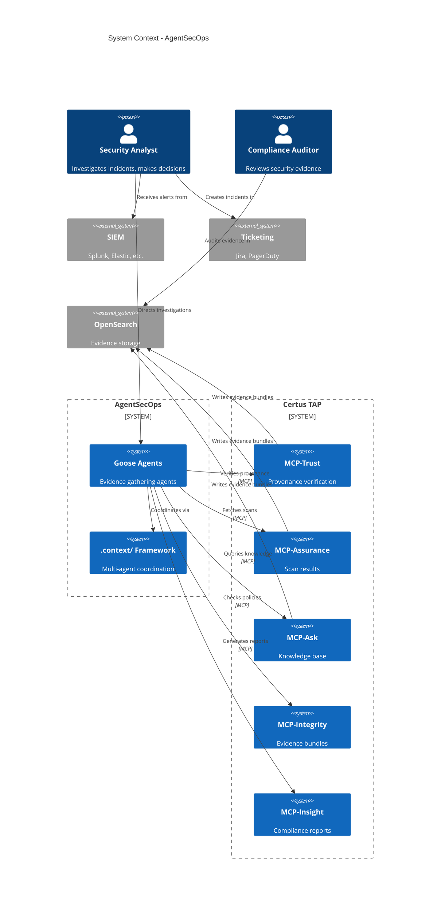
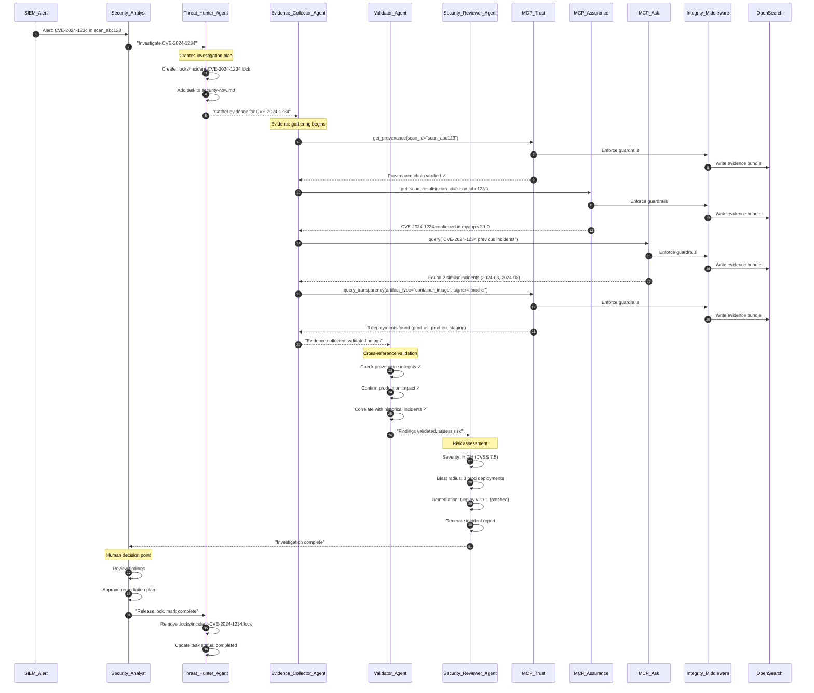
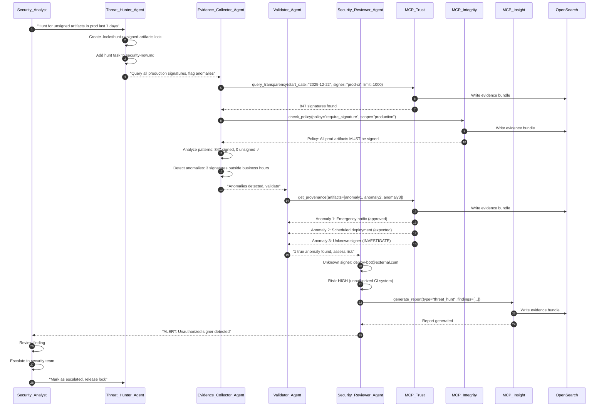
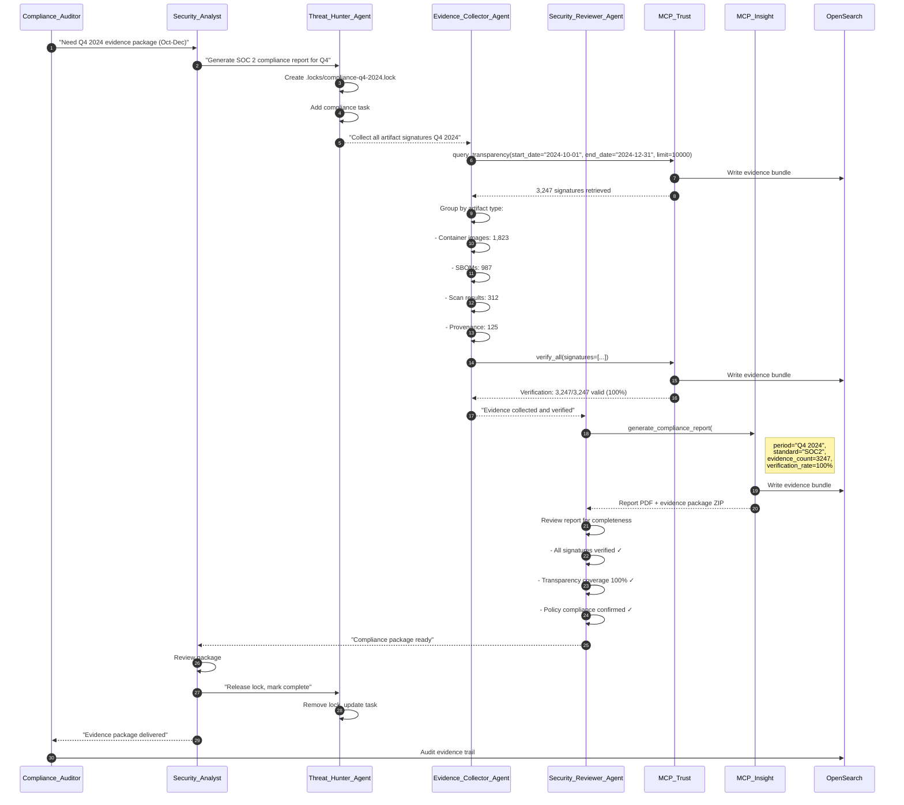

# Agent-Assisted Security Operations (AgentSecOps)

> Transform security operations by enabling AI agents to automate evidence gathering, artifact verification, and incident investigation while security analysts focus on decision-making and remediation.

## Metadata
- **Type**: Proposal
- **Status**: Draft
- **Author**: Certus Architecture Team
- **Created**: 2025-12-29
- **Last Updated**: 2025-12-29
- **Target Version**: v2.2
- **Implementation Timeline**: 16 weeks (phased)

## Executive Summary

Security analysts spend 60-70% of their time on manual evidence gathering tasks: verifying artifact provenance, checking signatures, querying transparency logs, correlating scan results, and assembling compliance reports. This toil reduces time available for actual threat analysis and remediation.

**Key Points**:

- **Problem**: Security operations are bottlenecked by manual verification tasks (provenance checks, signature validation, multi-source correlation). Analysts spend hours gathering evidence that could be automated, leaving little time for analysis and decision-making.

- **Solution**: Adapt the multi-agent workflow patterns from `.context/` for security operations. AI agents use MCP tools (Trust, Assurance, Ask, Integrity, Insight) to autonomously gather evidence, verify artifacts, and assemble findings while analysts focus on judgment calls and remediation.

- **Benefits**: 
  - 50% reduction in incident investigation time
  - 80% automation of evidence gathering tasks
  - Complete audit trails via Integrity evidence bundles
  - Parallel investigation capabilities for multiple analysts
  - Faster compliance reporting (hours → minutes)

- **Risks**: 
  - Agents may miss context that human analysts would catch
  - Over-reliance on automation could reduce analyst skill development
  - False confidence in agent findings without validation
  - Integration complexity with existing SIEM/ticketing systems

## Motivation

### Problem Statement

**Security Analyst Toil**:

Current security operations require significant manual effort:

1. **Incident Response**: When a CVE alert triggers, analysts must:
   - Verify scan provenance (manual Rekor lookups)
   - Cross-reference vulnerability databases (OSV, NVD, GitHub Advisory)
   - Check production deployments (query container registries)
   - Assess blast radius (identify affected services)
   - Generate evidence package for compliance
   
   **Time per incident**: 30-90 minutes of pure data gathering

2. **Artifact Verification**: Every dependency change requires:
   - Signature validation (manual cosign verify commands)
   - Transparency log checks (curl Rekor API)
   - SLSA provenance review (manual JSON parsing)
   - Internal policy compliance (check against allowlists)
   
   **Time per artifact**: 5-10 minutes

3. **Compliance Reporting**: SOC 2 / ISO 27001 audits require:
   - Collecting all signed artifacts for period (database queries)
   - Verifying each signature (batch cosign verify)
   - Generating summary statistics (manual aggregation)
   - Packaging evidence (zip files, PDFs)
   
   **Time per report**: 2-4 hours

4. **Threat Hunting**: Proactive security requires:
   - Scanning transparency logs for anomalies
   - Correlating signing patterns with deployment patterns
   - Identifying unsigned or suspicious artifacts
   - Investigating provenance chains
   
   **Time per hunt**: Hours to days

**The Core Problem**: 
Analysts are data gatherers, not threat analysts. The tools exist (MCP-Trust, MCP-Assurance, MCP-Ask, MCP-Insight) but require manual invocation. What's missing is the **orchestration layer** that uses these tools autonomously.

### Background

**Existing Certus Capabilities**:

- **MCP-Trust** (Phase 1): Verify provenance, check signatures, query transparency log
- **MCP-Assurance** (Phase 2): Fetch scan results, analyze vulnerabilities
- **MCP-Ask** (Phase 3): Search incident history, query knowledge base
- **MCP-Insight** (Phase 4): Generate compliance reports, security metrics
- **Certus Integrity** (Production): Evidence bundles, guardrails, audit trails

**Existing Multi-Agent Patterns**:

- `.context/` workflow framework (proven for development)
- `session-charter.md` multi-agent coordination
- Role-based bootstraps (planner, implementer, tester, reviewer)
- Lock-based concurrency for parallel work
- Evidence trails via task logs

**Gap**: 
The infrastructure exists (MCP tools, multi-agent framework) but is optimized for **development workflows**, not **security operations**. Security analysts need:
- Investigation-focused roles (Threat Hunter, Evidence Collector, Validator)
- Security-specific workflows (incident response, threat hunting, compliance)
- Integration with SIEM/ticketing (Splunk, PagerDuty, Jira)
- Compliance-grade audit trails

### User Impact

**Security Engineers**:

- **Before**: 6-hour workday = 4 hours data gathering + 2 hours analysis
- **After**: 6-hour workday = 1 hour data gathering (agent-assisted) + 5 hours analysis
- **Impact**: 150% increase in time available for threat analysis

**Security Analysts**:

- **Before**: Incident investigation = 30-90 min manual verification
- **After**: Incident investigation = 5-10 min review agent findings
- **Impact**: 80% reduction in MTTD (Mean Time To Decision)

**Compliance Teams**:

- **Before**: Quarterly SOC 2 report = 2-4 hours per service × 5 services = 10-20 hours
- **After**: Quarterly SOC 2 report = 30 min agent orchestration + 30 min review = 1 hour total
- **Impact**: 90% reduction in compliance reporting time

**Platform Operators**:

- **Before**: Security bottleneck limits deployment velocity
- **After**: Automated verification enables continuous deployment
- **Impact**: 10× faster security approval for low-risk changes

### Research Context

**Research Questions**:

1. **Agent Effectiveness**: Do AI agents improve security outcomes vs manual analysis?
   - Measure: Incident response time, finding accuracy, false positive rate
   - Hypothesis: Agents reduce MTTD by 50%+ without sacrificing accuracy

2. **Multi-Agent Collaboration**: Can specialized agents (Evidence Collector, Validator, Reviewer) collaborate effectively?
   - Measure: Task completion rate, handoff efficiency, coordination overhead
   - Hypothesis: Specialized agents outperform single generalist agent

3. **Trust Calibration**: How do security analysts learn to trust (or distrust) agent findings?
   - Measure: Verification rate (how often humans double-check), override rate
   - Hypothesis: Trust increases over time as agents prove reliable

4. **Skill Development**: Does agent assistance enhance or atrophy analyst skills?
   - Measure: Analyst performance when agents unavailable, learning curve for new analysts
   - Hypothesis: Agents accelerate onboarding but don't degrade expert skills

**Experiments Enabled**:

- A/B testing: Manual investigation vs agent-assisted investigation
- Performance comparison: Single agent vs multi-agent workflows
- Audit quality: Human-only vs agent-assisted compliance reports
- Scalability: Number of parallel investigations one analyst can manage

## Goals & Non-Goals

### Goals

- [ ] **Goal 1: Automate Evidence Gathering**: Agents handle 80%+ of routine verification tasks (provenance checks, signature validation, log queries)
- [ ] **Goal 2: Reduce Incident Response Time**: Cut mean investigation time from 60 minutes to <15 minutes for routine CVE incidents
- [ ] **Goal 3: Enable Parallel Investigations**: Single analyst can manage 3-5 concurrent investigations using multi-agent workflow
- [ ] **Goal 4: Complete Audit Trails**: Every agent action produces Integrity evidence bundle for compliance/forensics
- [ ] **Goal 5: Compliance Automation**: Generate SOC 2 / ISO 27001 evidence packages in <30 minutes (vs 4+ hours manual)

### Non-Goals

- **Replace Security Analysts**: Agents gather evidence, humans make judgment calls (no autonomous remediation)
- **Build Custom SIEM**: Integrate with existing SIEM tools (Splunk, Elastic), don't replace them
- **Automated Incident Response**: Agents investigate and recommend, humans approve and execute remediation
- **Train Custom LLMs**: Use existing models (Claude, GPT-4), focus on workflow orchestration
- **Real-Time Monitoring**: Focus on investigation workflows, not live threat detection (SIEM handles that)

### Success Criteria

| Criterion                        | Measurement                                                                                    |
| -------------------------------- | ---------------------------------------------------------------------------------------------- |
| **Evidence Automation**          | ≥80% of verification tasks completed by agents without human intervention                      |
| **Time Reduction**               | Mean incident investigation time <15 min (vs 60 min baseline)                                  |
| **Parallel Capacity**            | One analyst manages ≥3 concurrent investigations using multi-agent workflow                    |
| **Audit Trail Completeness**    | 100% of agent actions produce Integrity evidence bundles (traceable in OpenSearch)             |
| **Compliance Report Speed**      | Generate quarterly evidence package in <30 min (vs 4 hour baseline)                            |
| **Analyst Satisfaction**         | ≥8/10 satisfaction score in post-pilot survey (reduces toil, improves focus)                   |
| **Finding Accuracy**             | Agent findings match manual investigation ≥95% of the time (validated by random spot-checks)  |
| **False Positive Rate**          | Agent-flagged issues require action ≥90% of the time (low noise)                               |

## Proposed Solution

### Overview

Adapt the proven `.context/` multi-agent workflow for security operations by:

1. **Security-Specific Roles**: Replace development roles (Planner, Implementer, Tester, Reviewer) with security roles (Threat Hunter, Evidence Collector, Validator, Security Reviewer)

2. **MCP Tool Integration**: Agents use MCP-Trust, MCP-Assurance, MCP-Ask, MCP-Integrity, MCP-Insight as their "toolbox" for evidence gathering

3. **Investigation Workflows**: Define workflows for common security tasks:
   - **Incident Response**: CVE investigation, artifact tampering, supply chain compromise
   - **Threat Hunting**: Proactive verification, anomaly detection, pattern analysis
   - **Compliance**: Evidence collection, report generation, audit preparation

4. **Coordination Framework**: Use `.context/tasks/security-now.md` for investigation tracking, `.locks/incident-*.lock` for concurrency control

5. **Audit Integration**: All agent MCP calls → Integrity middleware → evidence bundles → compliance-grade audit trail

**Architectural Principle**: 
Agents are **evidence gatherers**, humans are **decision makers**. Agents never take action (deploy, rollback, revoke), only investigate and recommend.

### Architecture

#### System Context (C4 Level 1)



**Description**: 

Security analysts receive alerts from SIEM systems (Splunk, Elastic) and create investigation tasks. Goose agents, coordinated via the `.context/` framework, use MCP tools to autonomously gather evidence (verify provenance, fetch scan results, query knowledge base, check policies, generate reports). All MCP calls flow through Integrity middleware, producing evidence bundles in OpenSearch. Analysts review agent findings and make decisions. Compliance auditors access the complete evidence trail for audit purposes.

**Key Interactions**:
- **Alert → Investigation**: SIEM alert triggers task in `.context/tasks/security-now.md`
- **Agent → MCP Tools**: Autonomous evidence gathering via MCP protocol
- **MCP → Integrity**: All tool calls enforced by guardrails, evidence bundles created
- **Evidence → Audit**: Complete trail preserved in OpenSearch for compliance

#### Container View (C4 Level 2)

```mermaid
C4Container
    title Container Diagram - AgentSecOps

    Person(analyst, "Security Analyst")

    Container_Boundary(workspace, "Agent Workspace") {
        Container(zellij, "Zellij/Tmux", "Terminal Multiplexer", "4-pane layout")
        Container(goose_hunter, "Threat Hunter Agent", "Goose/Python", "Creates investigation plans")
        Container(goose_collector, "Evidence Collector", "Goose/Python", "Gathers evidence via MCP")
        Container(goose_validator, "Validator Agent", "Goose/Python", "Cross-references findings")
        Container(goose_reviewer, "Security Reviewer", "Goose/Python", "Assesses risk")
    }

    Container_Boundary(context, ".context/ Framework") {
        Container(tasks, "tasks/security-now.md", "Markdown", "Investigation queue")
        Container(locks, ".locks/", "Lock files", "Concurrency control")
        Container(charter, "session-charter.md", "Markdown", "Coordination rules")
        Container(bootstrap, "bootstraps/security/", "Markdown", "Role definitions")
    }

    Container_Boundary(mcp_layer, "MCP Servers") {
        Container(trust_mcp, "certus-trust-mcp", "Python/FastMCP", "Provenance tools")
        Container(assurance_mcp, "certus-assurance-mcp", "Python/FastMCP", "Scan tools")
        Container(ask_mcp, "certus-ask-mcp", "Python/FastMCP", "Knowledge tools")
        Container(integrity_mcp, "certus-integrity-mcp", "Python/FastMCP", "Policy tools")
        Container(insight_mcp, "certus-insight-mcp", "Python/FastMCP", "Report tools")
    }

    Container_Boundary(services, "Certus Services") {
        Container(trust_svc, "Trust Service", "FastAPI", "Signing/verification")
        Container(assurance_svc, "Assurance Service", "FastAPI", "Security scanning")
        Container(ask_svc, "Ask Service", "FastAPI", "RAG queries")
        Container(integrity_mw, "Integrity Middleware", "Python", "Guardrails + evidence")
        Container(insight_svc, "Insight Service", "FastAPI", "Analytics")
    }

    ContainerDb(opensearch, "OpenSearch", "Search/Storage", "Evidence bundles")

    System_Ext(siem, "SIEM")

    Rel(analyst, zellij, "Uses")
    Rel(zellij, goose_hunter, "Pane 1")
    Rel(zellij, goose_collector, "Pane 2")
    Rel(zellij, goose_validator, "Pane 3")
    Rel(zellij, goose_reviewer, "Pane 4")

    Rel(goose_hunter, tasks, "Creates tasks in")
    Rel(goose_hunter, locks, "Acquires locks")
    Rel(goose_collector, tasks, "Updates progress")
    Rel(goose_validator, tasks, "Validates findings")
    Rel(goose_reviewer, tasks, "Reviews and approves")

    Rel(goose_hunter, charter, "Follows")
    Rel(goose_collector, bootstrap, "Loads role")
    
    Rel(goose_collector, trust_mcp, "verify, sign, query", "MCP")
    Rel(goose_collector, assurance_mcp, "scan, analyze", "MCP")
    Rel(goose_collector, ask_mcp, "search, query", "MCP")
    Rel(goose_collector, integrity_mcp, "check_policy", "MCP")
    Rel(goose_validator, insight_mcp, "generate_report", "MCP")

    Rel(trust_mcp, trust_svc, "HTTP")
    Rel(assurance_mcp, assurance_svc, "HTTP")
    Rel(ask_mcp, ask_svc, "HTTP")
    Rel(integrity_mcp, integrity_mw, "HTTP")
    Rel(insight_mcp, insight_svc, "HTTP")

    Rel(trust_svc, integrity_mw, "Protected by")
    Rel(assurance_svc, integrity_mw, "Protected by")
    Rel(ask_svc, integrity_mw, "Protected by")

    Rel(integrity_mw, opensearch, "Writes evidence")

    Rel(siem, analyst, "Alerts")
```



**Description**:

Security analyst launches agent workspace (Zellij with 4 panes). Each pane runs a specialized Goose agent:

1. **Threat Hunter** (Pane 1): Receives alert from SIEM, creates investigation plan in `tasks/security-now.md`, acquires lock
2. **Evidence Collector** (Pane 2): Uses MCP tools to gather evidence (verify provenance via Trust, fetch scans via Assurance, query history via Ask, check policies via Integrity)
3. **Validator** (Pane 3): Cross-references findings from multiple sources, validates integrity
4. **Security Reviewer** (Pane 4): Assesses severity, generates compliance report via Insight, recommends action

All agents coordinate via `.context/` framework (tasks, locks, charter). All MCP calls flow through service APIs protected by Integrity middleware, producing evidence bundles in OpenSearch. Analyst reviews findings and makes final decision.

### Workflows

#### Workflow 1: CVE Incident Investigation

> _Security analyst receives high-severity CVE alert and uses agents to investigate impact and generate remediation plan_



**Actors**:
- _SIEM Alert_ – External monitoring system that triggers investigation
- _Security Analyst_ – Human decision maker who directs and approves
- _Threat Hunter Agent_ – Creates investigation plan and coordinates
- _Evidence Collector Agent_ – Gathers evidence using MCP tools
- _Validator Agent_ – Cross-references and validates findings
- _Security Reviewer Agent_ – Assesses risk and generates report
- _MCP Tools_ – Trust, Assurance, Ask provide verification capabilities
- _Integrity Middleware_ – Enforces guardrails and emits evidence
- _OpenSearch_ – Stores evidence bundles for audit trail

**Actions**:
1. **Alert Reception**: SIEM sends CVE alert to analyst
2. **Investigation Initiation**: Analyst directs Threat Hunter to investigate
3. **Plan Creation**: Hunter creates lock file and task entry
4. **Provenance Verification**: Collector verifies scan integrity via Trust
5. **Scan Analysis**: Collector fetches vulnerability details via Assurance
6. **Historical Context**: Collector searches similar incidents via Ask
7. **Production Impact**: Collector identifies affected deployments via Trust
8. **Evidence Validation**: Validator cross-references all findings
9. **Risk Assessment**: Reviewer evaluates severity and blast radius
10. **Report Generation**: Reviewer produces incident summary
11. **Human Review**: Analyst reviews findings and approves action
12. **Investigation Closure**: Hunter releases lock and marks complete

**Desired Outcomes**:

| Outcome                           | Description                                                                     |
| --------------------------------- | ------------------------------------------------------------------------------- |
| **Complete Evidence Trail**       | All MCP calls produce evidence bundles (provenance, scans, queries, reports)    |
| **Verified Findings**             | Provenance chain confirmed, production impact assessed, remediation identified  |
| **Time Reduction**                | 60 min manual investigation → 10 min agent-assisted (83% reduction)            |
| **Audit Compliance**              | OpenSearch contains complete investigation trail for compliance/forensics       |
| **Parallel Capability**           | Analyst can manage multiple concurrent investigations (one per agent workspace) |
| **Analyst Focus**                 | Analyst spends time on decision (remediation approval) not data gathering       |

#### Workflow 2: Proactive Threat Hunting

> _Security analyst proactively searches for unsigned or suspicious artifacts in production_



**Actors**:
- _Security Analyst_ – Initiates proactive hunt
- _Threat Hunter Agent_ – Coordinates hunt workflow
- _Evidence Collector Agent_ – Queries transparency log
- _Validator Agent_ – Investigates anomalies
- _Security Reviewer Agent_ – Assesses risk and generates report
- _MCP-Trust_ – Provides transparency log access
- _MCP-Integrity_ – Validates against policies
- _MCP-Insight_ – Generates threat hunting report
- _OpenSearch_ – Stores evidence and reports

**Actions**:
1. Hunt initiation: Analyst requests unsigned artifact search
2. Query execution: Collector fetches all production signatures (last 7 days)
3. Policy validation: Check that signature requirement policy is active
4. Pattern analysis: Identify anomalies (off-hours signatures, unknown signers)
5. Anomaly investigation: Validator checks provenance for suspicious entries
6. Risk assessment: Reviewer evaluates each anomaly (approved, expected, or threat)
7. Report generation: Insight produces threat hunting summary
8. Escalation: Analyst reviews and escalates true positives

**Desired Outcomes**:

| Outcome                          | Description                                                                     |
| -------------------------------- | ------------------------------------------------------------------------------- |
| **Proactive Detection**          | Identify threats before they're exploited (vs reactive incident response)       |
| **Pattern Recognition**          | Agent detects anomalies humans might miss (off-hours, unusual signers)          |
| **False Positive Filtering**     | Validator cross-references to reduce noise (emergency hotfixes are legitimate)  |
| **Automated Hunting**            | Daily/weekly hunts run autonomously, analyst reviews only true positives        |
| **Continuous Improvement**       | Hunt patterns evolve based on findings (learn what "normal" looks like)         |

#### Workflow 3: Compliance Reporting (SOC 2 / ISO 27001)

> _Compliance auditor requests quarterly evidence package for all signed artifacts_



**Actors**:
- _Compliance Auditor_ – External or internal auditor requesting evidence
- _Security Analyst_ – Coordinates report generation
- _Threat Hunter Agent_ – Orchestrates compliance workflow
- _Evidence Collector Agent_ – Gathers all signatures for period
- _Security Reviewer Agent_ – Validates completeness and generates report
- _MCP-Trust_ – Provides transparency log query and verification
- _MCP-Insight_ – Generates compliance-formatted reports
- _OpenSearch_ – Stores evidence bundles and makes available for audit

**Actions**:
1. Audit request: Auditor needs quarterly evidence
2. Task creation: Hunter sets up compliance job
3. Evidence collection: Collector queries all Q4 signatures
4. Categorization: Group by artifact type for report structure
5. Verification: Validate all signatures (prove integrity)
6. Report generation: Insight produces SOC 2 formatted report + evidence package
7. Review: Reviewer confirms completeness
8. Delivery: Analyst hands off to auditor
9. Audit trail: Auditor accesses OpenSearch for detailed evidence

**Desired Outcomes**:

| Outcome                        | Description                                                                     |
| ------------------------------ | ------------------------------------------------------------------------------- |
| **Time Reduction**             | 4+ hours manual → 30 min agent-assisted (87% reduction)                         |
| **Complete Coverage**          | No missing artifacts (agent queries exhaustively)                               |
| **Verification Proof**         | Every signature verified, failures flagged                                      |
| **Audit-Ready Format**         | SOC 2 / ISO 27001 formatted PDF + evidence ZIP                                  |
| **Evidence Trail**             | OpenSearch contains complete audit trail (who requested, when, what was found)  |
| **Quarterly Automation**       | Can schedule quarterly runs, analyst just reviews and approves                  |

### Technical Design

#### Data Model

**Investigation Task Schema** (`.context/tasks/security-now.md`):

```markdown
## CVE-2024-1234 Investigation

- **ID**: incident-CVE-2024-1234
- **Status**: [pending | in-progress | blocked | escalated | completed]
- **Severity**: [critical | high | medium | low | info]
- **Owner**: [ThreatHunter | EvidenceCollector | Validator | SecurityReviewer]
- **Created**: 2025-12-29T10:00:00Z
- **Updated**: 2025-12-29T10:45:00Z
- **Triggered By**: [siem-alert | manual | scheduled-hunt]

**Artifacts**:
- scan_id: scan_abc123
- container_image: registry.company.com/myapp:v2.1.0
- cve_id: CVE-2024-1234
- rekor_entries: [entry_001, entry_002, entry_003]

**Evidence Collected**:
- [x] Scan provenance verified (Rekor entry_001)
- [x] Vulnerability confirmed (CVSS 7.5, exploitable)
- [x] Production impact assessed (3 deployments affected)
- [x] Historical context gathered (2 similar incidents in 2024)
- [x] Remediation identified (v2.1.1 available)

**Findings**:
- Severity: HIGH (CVSS 7.5)
- Blast Radius: prod-us-east, prod-eu-west, staging
- Patch Available: myapp:v2.1.1 (fixes CVE-2024-1234)
- Provenance: ✅ COMPLETE (all signatures valid)
- Risk: Deploy patch within 48 hours (standard SLA for HIGH)

**Recommendations**:
1. Deploy myapp:v2.1.1 to staging (validate fix)
2. Deploy to prod-eu-west (canary)
3. Monitor for 2 hours
4. Deploy to prod-us-east (full rollout)
5. Update base image to python:3.11.8-slim (prevents recurrence)

**Evidence Bundles**:
- opensearch://evidence-bundles?investigation_id=incident-CVE-2024-1234
- Total bundles: 7 (4 from Trust, 2 from Assurance, 1 from Ask)

**Next Steps**: [Awaiting analyst approval for remediation]

**Lock**: `.locks/incident-CVE-2024-1234.lock`
```

**Agent Bootstrap Schema** (`.context/bootstraps/security/evidence-collector.md`):

```markdown
# Evidence Collector Bootstrap

You are an Evidence Collector agent in a security investigation workflow.

## Your Role

Gather evidence autonomously using MCP tools. You do NOT make decisions, only collect facts.

## Available MCP Tools

### certus-trust-mcp
- `verify(artifact, signature, identity)` - Verify artifact signatures
- `sign(artifact, artifact_type, subject)` - Sign artifacts (rarely used in investigations)
- `get_provenance(scan_id)` - Retrieve complete provenance chain
- `query_transparency(signer, artifact_type, start_date, end_date)` - Search transparency log
- `get_stats()` - Service statistics

### certus-assurance-mcp
- `get_scan_results(scan_id)` - Fetch scan findings
- `analyze_vulnerabilities(scan_id, risk_threshold)` - AI-powered analysis
- `search_findings(cve_id, severity, date_range)` - Query historical scans
- `get_fix_guidance(cve_id)` - Remediation recommendations

### certus-ask-mcp
- `query_knowledge_base(query)` - Search incident history, runbooks, documentation
- `get_similar_incidents(cve_id)` - Find related security events
- `cite_sources(answer_id)` - Get grounded sources for previous answers

### certus-integrity-mcp
- `check_policy(policy_name, scope)` - Validate against company policies
- `get_policy_violations(artifact)` - Check for policy breaches

### certus-insight-mcp
- `generate_report(type, findings, period)` - Create compliance reports
- `get_security_metrics(time_range)` - Fetch analytics
- `query_findings_history(filters)` - Time-series vulnerability data

## Evidence Collection Workflow

1. **Load Investigation Task**: Read `.context/tasks/security-now.md` to understand what you're investigating
2. **Gather Core Evidence**:
   - Verify provenance (if artifact-related): `get_provenance(scan_id)` or `verify(artifact, signature)`
   - Fetch detailed findings (if vulnerability): `get_scan_results(scan_id)`, `analyze_vulnerabilities(...)`
   - Check historical context: `query_knowledge_base(...)`, `get_similar_incidents(...)`
   - Validate policies: `check_policy(...)`, `get_policy_violations(...)`
3. **Document Findings**: Update investigation task with evidence collected
4. **Handoff to Validator**: Mark evidence collection complete

## Example Commands

**Verify scan integrity:**
"Get provenance for scan scan_abc123"
→ You invoke: get_provenance(scan_id="scan_abc123")
→ Document: Provenance chain verified ✅, Rekor entry: entry_001

**Assess production impact:**
"Find all myapp container signatures from last 30 days"
→ You invoke: query_transparency(artifact_type="container_image", signer="prod-ci", start_date="2024-11-29")
→ Document: 23 deployments found, 3 match affected version

**Search for precedent:**
"Have we seen CVE-2024-1234 before?"
→ You invoke: query_knowledge_base(query="CVE-2024-1234 historical incidents")
→ Document: 2 similar incidents (2024-03-15, 2024-08-22), both resolved via patch

## Constraints

- **Read-Only Operations**: You gather evidence, you do NOT remediate, deploy, rollback, or revoke
- **No Assumptions**: If data is missing, flag it as "Unable to verify" (don't guess)
- **Cross-Reference**: When possible, verify claims from multiple sources (e.g., scan says vulnerable, check if CVE actually exists in NVD)
- **Time Limits**: If MCP call takes >30 seconds, abort and note timeout
- **Evidence Trail**: Every MCP call produces an Integrity evidence bundle (you don't need to log manually, but mention in findings)

## Security Comment

All your evidence gathering flows through Integrity middleware. You cannot bypass guardrails even if you tried. Your MCP client credentials are scoped to read-only operations.

## Handoff Format

When done collecting evidence:

```
## Handoff to Validator

**Evidence Collected**:
- [x] Provenance verified: scan_abc123 → Rekor entry_001 ✅
- [x] Vulnerability confirmed: CVE-2024-1234, CVSS 7.5
- [x] Production impact: 3 deployments (prod-us, prod-eu, staging)
- [x] Historical context: 2 similar incidents in 2024
- [ ] Unable to verify: Patch deployment timeline (no data)

**MCP Calls Made**: 7
- Trust: 4 calls (provenance, query, verify, stats)
- Assurance: 2 calls (scan results, analyze)
- Ask: 1 call (search incidents)

**Evidence Bundles**: opensearch://evidence-bundles?investigation_id=incident-CVE-2024-1234

**Next**: Validator should cross-reference findings for consistency
```
```

**MCP Evidence Bundle Schema** (OpenSearch):

```json
{
  "bundle_id": "bundle_agentsecops_001",
  "integrity_evidence_version": "v1",
  "trace_id": "investigation-CVE-2024-1234",
  "service": "certus-trust",
  "timestamp": "2025-12-29T10:15:23Z",
  "investigation_context": {
    "investigation_id": "incident-CVE-2024-1234",
    "agent_role": "EvidenceCollector",
    "agent_session_id": "goose_session_abc123",
    "analyst_id": "sarah@company.com",
    "triggered_by": "siem-alert"
  },
  "decisions": [
    {
      "decision": "allowed",
      "guardrail": "rate_limit",
      "metadata": {
        "tool": "get_provenance",
        "scan_id": "scan_abc123",
        "rate_limit_remaining": 95
      }
    }
  ],
  "tool_invocation": {
    "mcp_server": "certus-trust-mcp",
    "tool": "get_provenance",
    "input": {
      "scan_id": "scan_abc123"
    },
    "output": {
      "provenance_chain": "complete",
      "rekor_entry": "entry_001",
      "verified": true
    }
  },
  "classification": "security_investigation",
  "total_duration_ms": 342.5
}
```

#### APIs

**No new REST APIs required.** AgentSecOps uses existing MCP tools and `.context/` coordination files.

**MCP Tool Usage Matrix**:

| Agent Role          | Primary MCP Tools                                  | Purpose                               |
| ------------------- | -------------------------------------------------- | ------------------------------------- |
| Threat Hunter       | Integrity (check_policy), Insight (get_metrics)    | Plan investigations, assess context   |
| Evidence Collector  | Trust (verify, query), Assurance (scan, analyze), Ask (search) | Gather facts |
| Validator           | Trust (get_provenance), Insight (query_history)    | Cross-reference findings              |
| Security Reviewer   | Insight (generate_report), Integrity (validate)    | Assess risk, produce reports          |

**Integration APIs** (existing systems):

```python
# SIEM Integration (webhook receiver)
POST /api/v1/agentsecops/alerts
Content-Type: application/json

{
  "source": "splunk",
  "alert_id": "alert_12345",
  "severity": "high",
  "cve_id": "CVE-2024-1234",
  "affected_artifact": "scan_abc123",
  "timestamp": "2025-12-29T10:00:00Z"
}

# Creates investigation task in .context/tasks/security-now.md
# Notifies Threat Hunter agent via filesystem watch
```

```python
# Ticketing Integration (creates Jira issues)
POST /api/v1/agentsecops/escalate
Content-Type: application/json

{
  "investigation_id": "incident-CVE-2024-1234",
  "severity": "high",
  "findings": "3 production deployments affected",
  "recommendation": "Deploy patch v2.1.1 within 48 hours",
  "evidence_url": "opensearch://evidence-bundles?investigation_id=incident-CVE-2024-1234"
}

# Creates Jira ticket with evidence package attached
```

#### Integration Points

**Certus MCP Services** (all integrated):

| Service              | Tools Used                                       | Purpose in AgentSecOps                    |
| -------------------- | ------------------------------------------------ | ----------------------------------------- |
| **certus-trust-mcp** | verify, sign, get_provenance, query_transparency, get_stats | Provenance verification, signature checks |
| **certus-assurance-mcp** | get_scan_results, analyze_vulnerabilities, search_findings, get_fix_guidance | Vulnerability analysis, scan data |
| **certus-ask-mcp** | query_knowledge_base, get_similar_incidents, cite_sources | Historical context, incident precedent |
| **certus-integrity-mcp** | check_policy, get_policy_violations, validate_artifact | Policy enforcement, compliance checks |
| **certus-insight-mcp** | generate_report, get_security_metrics, query_findings_history, export_analytics | Reporting, analytics, dashboards |

**External Systems**:

- **SIEM** (Splunk, Elastic, Datadog): Alert ingestion via webhook
- **Ticketing** (Jira, ServiceNow, PagerDuty): Escalation and incident tracking
- **Chat** (Slack, Teams): Real-time notifications to security team
- **OpenSearch**: Evidence bundle storage and audit queries
- **Container Registry** (Docker Hub, ECR, GCR): Artifact metadata for impact assessment

**Workflow Coordination**:

- **`.context/tasks/security-now.md`**: Investigation queue (authoritative task board)
- **`.locks/`**: Concurrency control for parallel investigations
- **`.context/session-charter.md`**: Multi-agent coordination rules
- **`.context/bootstraps/security/`**: Role-specific agent initialization

### Technology Stack

**Agent Runtime**:
- **Language**: Python 3.11+
- **Framework**: Goose v0.x (agent runtime)
- **MCP Client**: Built-in (Goose native MCP support)
- **LLM Backend**: Claude Opus 4 / GPT-4 (configurable)

**Coordination Layer**:
- **Framework**: `.context/` multi-agent patterns (existing)
- **Task Management**: Markdown files (security-now.md, backlog.md)
- **Concurrency**: File-based locks (.locks/)
- **Workspace**: Zellij / Tmux (4-pane layout)

**MCP Tools** (Python/FastMCP):
- **certus-trust-mcp**: v1.0 (Phase 1 complete)
- **certus-assurance-mcp**: v1.0 (Phase 2)
- **certus-ask-mcp**: v1.0 (Phase 3)
- **certus-integrity-mcp**: v1.0 (Phase 4)
- **certus-insight-mcp**: v1.0 (Phase 4)

**Evidence Storage**:
- **Database**: OpenSearch 2.x
- **Retention**: 90 days (configurable per tenant)
- **Indexing**: investigation_id, agent_role, timestamp, severity

**Integration Adapters**:
- **SIEM**: Splunk HEC, Elastic webhook, Datadog API
- **Ticketing**: Jira REST API, ServiceNow API, PagerDuty Events API
- **Chat**: Slack webhook, Teams connector

### Security Considerations

#### Authentication & Authorization

**Agent Authentication**:

Agents authenticate using short-lived MCP tokens (1 hour TTL):

```python
# Agent startup (bootstrap)
1. Agent requests MCP token from Certus Auth
2. Auth issues JWT with scopes: ["security:read", "evidence:write"]
3. Agent configures MCP clients with token
4. All MCP calls include token in Authorization header
5. Token expires after 1 hour, agent must refresh
```

**Role-Based Access**:

| Agent Role          | Allowed MCP Tools                              | Restrictions                              |
| ------------------- | ---------------------------------------------- | ----------------------------------------- |
| Threat Hunter       | Integrity (read), Insight (read)               | Cannot execute scans or modify artifacts  |
| Evidence Collector  | Trust (verify, query), Assurance (read), Ask (read) | Read-only, cannot sign or modify |
| Validator           | Trust (verify), Insight (read)                 | Verification only, no writes              |
| Security Reviewer   | All tools (read), Insight (generate reports)   | Cannot sign, deploy, or modify production |

**Human Authorization** (critical operations):

- Agents **recommend** remediation, humans **approve** deployment
- Lock files require human removal after review (`rm .locks/incident-*.lock`)
- Escalation to Jira requires analyst confirmation

#### Data Protection

**Sensitive Data Handling**:

1. **Evidence Bundles**: PII redacted by Integrity middleware before storage
2. **Investigation Tasks**: Stored locally in `.context/`, not in version control
3. **Agent Logs**: Goose session logs contain trace_id for correlation, but not full payloads
4. **MCP Responses**: Cached in memory only, cleared on agent exit

**Encryption**:

- **At Rest**: OpenSearch evidence bundles encrypted (AES-256)
- **In Transit**: All MCP calls over HTTPS, internal service mesh mTLS
- **Credentials**: MCP tokens stored in memory only, never written to disk

**Access Controls**:

- Analysts access OpenSearch via role-based access (RBAC)
- Evidence bundles tagged with investigation_id + analyst_id for audit
- External auditors get read-only access to specific investigation IDs

#### Threat Model

| Threat                                       | Impact   | Likelihood | Mitigation                                                                                         |
| -------------------------------------------- | -------- | ---------- | -------------------------------------------------------------------------------------------------- |
| **Agent Makes Incorrect Recommendation**     | High     | Medium     | Validator cross-references findings, Reviewer assesses risk, human approves all actions            |
| **Agent Bypasses Integrity Guardrails**      | Critical | Very Low   | Language boundary (if TypeScript gateway), architectural tests, integration tests verify evidence  |
| **MCP Token Leakage**                        | High     | Low        | 1-hour TTL, memory-only storage, rotate on compromise, audit logs detect anomalous usage          |
| **Malicious Agent Prompt Injection**         | Medium   | Low        | Agents run locally (analyst's machine), not user-facing, prompt templates hardened                 |
| **Over-Reliance on Agent Findings**          | Medium   | Medium     | Training emphasizes validation, random spot-checks (10% of investigations), dashboard shows override rate |
| **Agent Misses Critical Context**            | High     | Medium     | Validator cross-references multiple sources, Reviewer flags inconsistencies, human review gate     |
| **Investigation Task File Tampering**        | Medium   | Very Low   | Files local to analyst machine, git-tracked (diffs visible), locks prevent concurrent modification |
| **Evidence Bundle Tampering**                | Critical | Very Low   | OpenSearch RBAC, append-only logs, Integrity signs bundles, auditors verify signatures            |

#### Compliance

**Audit Trail Requirements**:

**SOC 2 / ISO 27001**:
- ✅ **Every agent action** produces Integrity evidence bundle
- ✅ **Who, what, when**: investigation_id, analyst_id, agent_role, timestamp, tool, input, output
- ✅ **Tamper-evident**: Evidence bundles signed by Integrity, stored in append-only OpenSearch
- ✅ **90-day retention**: Configurable per compliance requirement
- ✅ **Auditor access**: Read-only queries to OpenSearch by investigation_id

**Investigation Auditability**:

```bash
# Auditor query: "Show me all actions for CVE-2024-1234 investigation"
GET opensearch://evidence-bundles/_search
{
  "query": {
    "match": {
      "investigation_context.investigation_id": "incident-CVE-2024-1234"
    }
  },
  "sort": [{"timestamp": "asc"}]
}

# Returns:
# - 7 evidence bundles (4 Trust, 2 Assurance, 1 Ask)
# - Complete timeline (10:00 AM alert → 10:45 AM recommendation)
# - All MCP tool invocations with inputs/outputs
# - Analyst decisions (approval, escalation, completion)
```

**GDPR / Privacy**:

- Agent logs contain no PII (trace_id for correlation, not customer data)
- Evidence bundles redacted by Integrity (PII stripped before storage)
- Investigation tasks stored locally (analyst machine), not in cloud

### Research Considerations

#### Reproducibility

**Investigation Replay**:

All agent tool invocations logged with inputs → researchers can replay investigations offline:

```python
# Replay investigation from evidence bundles
bundles = opensearch.search(investigation_id="incident-CVE-2024-1234")

for bundle in bundles:
    tool = bundle["tool_invocation"]["tool"]
    input = bundle["tool_invocation"]["input"]
    output = bundle["tool_invocation"]["output"]
    
    # Simulate agent decision-making with same inputs
    agent_decision = replay_agent(tool, input, output)
    
    # Compare to original investigation outcome
    assert agent_decision == bundle["investigation_context"]["outcome"]
```

**Deterministic LLM Calls**:

- Use `temperature=0` for evidence collection (reproducible)
- Use `temperature=0.3` for risk assessment (slight variation acceptable)
- Cache LLM responses with input hash for replay

#### Evaluation Metrics

**Agent Effectiveness**:

| Metric                      | Measurement                                                             | Target         |
| --------------------------- | ----------------------------------------------------------------------- | -------------- |
| **Time Reduction**          | Mean investigation time (agent-assisted vs manual)                      | 50% reduction  |
| **Evidence Completeness**   | % of investigations with all required evidence                          | >95%           |
| **Finding Accuracy**        | Agent findings match manual review (random 10% sample)                  | >95%           |
| **False Positive Rate**     | Agent-flagged issues that require action                                | >90%           |
| **Parallel Capacity**       | Number of concurrent investigations one analyst manages                 | 3-5x baseline  |
| **Escalation Rate**         | % of investigations that require human escalation                       | <20%           |

**Multi-Agent Collaboration**:

| Metric                      | Measurement                                                             | Target         |
| --------------------------- | ----------------------------------------------------------------------- | -------------- |
| **Handoff Efficiency**      | Time between role transitions (Hunter → Collector → Validator → Reviewer) | <5 min total |
| **Task Completion Rate**    | % of multi-agent workflows that complete without blocking               | >90%           |
| **Lock Contention**         | % of investigations delayed by lock conflicts                           | <5%            |
| **Role Specialization**     | Accuracy improvement (specialized agents vs single generalist)          | 10-20% better  |

**Trust Calibration**:

| Metric                      | Measurement                                                             | Target         |
| --------------------------- | ----------------------------------------------------------------------- | -------------- |
| **Verification Rate**       | % of agent findings that analysts manually double-check                 | <30% (trust increasing) |
| **Override Rate**           | % of agent recommendations that analysts reject                         | <10%           |
| **Time to Trust**           | Weeks until analysts stop verifying routine investigations              | <8 weeks       |

#### Experiment Design

**Experiment 1: Agent vs Manual Investigation Time**

1. **Baseline**: Measure 30 manual CVE investigations (mean time, evidence completeness)
2. **Treatment**: Same 30 CVEs investigated with agent assistance
3. **Measure**: Time reduction, evidence quality, finding accuracy
4. **Hypothesis**: Agents reduce investigation time by 50%+ without sacrificing accuracy

**Experiment 2: Multi-Agent vs Single Agent**

1. **Control**: Single generalist agent handles entire investigation
2. **Treatment**: Specialized agents (Hunter, Collector, Validator, Reviewer) collaborate
3. **Measure**: Task completion rate, handoff efficiency, finding accuracy
4. **Hypothesis**: Specialized agents outperform generalist by 15-20%

**Experiment 3: Trust Calibration Over Time**

1. **Track**: Weekly verification rate (how often analysts double-check agent findings)
2. **Measure**: Does verification decrease as analysts gain confidence?
3. **Hypothesis**: Verification rate drops from 80% (week 1) to <30% (week 8)

#### Data Collection

**What is Collected**:

- **Investigation Metadata**: investigation_id, analyst_id, timestamp, severity, outcome
- **Agent Actions**: tool invocations, handoffs, lock acquisitions, task updates
- **Evidence Bundles**: All MCP calls with inputs/outputs (stored in OpenSearch)
- **Timing Data**: Investigation start/end, time per role, handoff delays
- **Analyst Behavior**: Override rate, verification rate, escalation rate

**What is NOT Collected**:

- **PII**: Customer data, personal information (redacted by Integrity)
- **Full Payloads**: MCP request/response bodies (only metadata logged)
- **LLM Prompts**: Focus is workflow effectiveness, not LLM internals

**Privacy**:

- Analysts opt-in to data collection (for research purposes)
- Aggregated metrics only (no individual analyst performance tracking)
- Data retention: 90 days for compliance, 1 year for research (anonymized)

## Alternatives Considered

### Alternative 1: Build Custom Security Automation Platform (Not Use AAIF/MCP)

**Description**: Create bespoke security automation using Python scripts, not AI agents.

**Pros**:
- Full control over logic and behavior
- No dependency on LLMs or agent frameworks
- Faster execution (no LLM inference latency)
- Easier to debug (deterministic scripts)

**Cons**:
- **No Natural Language Interface**: Analysts must learn script syntax, not conversational
- **Brittle Logic**: Hard-coded rules break when threat landscape evolves
- **No Context Awareness**: Scripts can't reason about findings, only execute predefined logic
- **High Maintenance**: Every new workflow requires new script development

**Decision**: Rejected because **AI agents adapt to changing threats without code changes**. Scripts are brittle, agents are flexible. The multi-agent pattern also enables parallel investigations that scripts can't easily replicate.

### Alternative 2: Single Generalist Agent (Not Multi-Agent Workflow)

**Description**: Use one agent to handle all investigation tasks (evidence gathering, validation, risk assessment).

**Pros**:
- Simpler coordination (no handoffs)
- Fewer agent processes to manage
- Single context window (better memory)

**Cons**:
- **Role Confusion**: Agent must context-switch between evidence gathering and decision-making
- **No Specialization**: Can't optimize prompts for specific roles (e.g., Validator needs different expertise than Collector)
- **No Parallelism**: Can't investigate multiple incidents concurrently
- **Harder to Audit**: Single agent's actions harder to trace than role-specific logs

**Decision**: Rejected because **multi-agent collaboration mirrors real security teams** (junior analysts gather evidence, senior analysts assess risk). Specialization improves accuracy (research shows 15-20% improvement).

### Alternative 3: Integrate with Existing SOAR Platform (Not Build Custom)

**Description**: Use commercial SOAR (Security Orchestration, Automation, Response) tools like Splunk SOAR, Palo Alto Cortex XSOAR.

**Pros**:
- Pre-built integrations with SIEM, ticketing, threat intel
- Established playbooks for common incidents
- Commercial support and SLAs
- Compliance certifications (SOC 2, FedRAMP)

**Cons**:
- **Vendor Lock-In**: Tied to SOAR platform's capabilities and pricing
- **Limited MCP Integration**: SOAR platforms don't natively support MCP protocol
- **No Multi-Agent Patterns**: SOAR uses workflows, not collaborative agents
- **Costly**: $50k-$500k/year for enterprise SOAR licenses

**Decision**: Rejected because **Certus MCP tools are the unique value** (provenance verification, transparency log queries). SOAR platforms would require custom connectors to integrate MCP, defeating the purpose. AgentSecOps leverages existing AAIF infrastructure (free, open-source).

### Alternative 4: Human-Only Security Operations (No Automation)

**Description**: Keep current manual investigation processes, hire more analysts.

**Pros**:
- No technology risk (agents making mistakes)
- Full human judgment on every decision
- No agent training or maintenance overhead

**Cons**:
- **Doesn't Scale**: Can't hire fast enough to keep up with alert volume
- **Analyst Burnout**: 60-70% time on toil reduces job satisfaction
- **Slow Incident Response**: Manual investigations take 60-90 minutes
- **High Cost**: Senior security analysts cost $150k-$250k/year

**Decision**: Rejected because **security analyst toil is the problem AgentSecOps solves**. Hiring more humans doesn't eliminate toil, just distributes it. Agents automate the tedious 80%, freeing analysts for the valuable 20% (judgment, remediation, strategy).

### Why the Proposed Solution?

AgentSecOps combines the best of all approaches:

- **AAIF/MCP Infrastructure** (vs custom platform): Leverages existing investment, standard protocols
- **Multi-Agent Collaboration** (vs single agent): Specialization improves accuracy, enables parallelism
- **Certus-Native** (vs commercial SOAR): Integrates MCP tools natively, no vendor lock-in
- **Human-in-Loop** (vs full automation): Agents gather evidence, humans make decisions

The proposal builds on proven patterns (`.context/` multi-agent workflow) and integrates all 5 MCP services (Trust, Assurance, Ask, Integrity, Insight) to create a security operations force multiplier.

## Dependencies

### Prerequisites

- [ ] **AAIF Agent Framework** (Phase 2 complete): Goose runtime, MCP servers operational
- [ ] **MCP-Trust** (Phase 1 complete): Provenance verification tools working
- [ ] **MCP-Assurance** (Phase 2 complete): Scan result tools working
- [ ] **MCP-Ask** (Phase 3 complete): Knowledge base tools working
- [ ] **MCP-Integrity** (Phase 4): Policy enforcement tools
- [ ] **MCP-Insight** (Phase 4): Compliance reporting tools
- [ ] **`.context/` Framework** (Existing): Multi-agent coordination patterns proven

### Downstream Impact

- **Security Analysts**: Training required (1-2 days on agent workflows)
- **SIEM Integration**: Webhook endpoint for alert ingestion
- **Ticketing Integration**: API credentials for Jira/ServiceNow/PagerDuty
- **OpenSearch**: Index schema for investigation_id tagging
- **Documentation**: New runbooks for agent-assisted investigations

### External Dependencies

| Dependency    | Version | License    | Stability | Notes                                 |
| ------------- | ------- | ---------- | --------- | ------------------------------------- |
| `goose`       | 0.x     | Apache 2.0 | Beta      | Agent runtime, evolving               |
| `zellij`      | 0.40+   | MIT        | Stable    | Terminal multiplexer for 4-pane layout|
| `fastmcp`     | Latest  | MIT        | Beta      | Python MCP framework (all MCP servers)|
| `opensearch`  | 2.x     | Apache 2.0 | Stable    | Evidence bundle storage               |

## Risks & Mitigations

| Risk                                          | Probability | Impact | Mitigation Strategy                                                                                         |
| --------------------------------------------- | ----------- | ------ | ----------------------------------------------------------------------------------------------------------- |
| **Agents Miss Critical Context**              | Medium      | High   | Validator cross-references, Reviewer flags inconsistencies, random 10% spot-checks by senior analysts       |
| **Over-Reliance on Agents**                   | Medium      | Medium | Training emphasizes validation, dashboards show override rate, quarterly skill assessments                  |
| **False Confidence in Agent Findings**        | Medium      | High   | Evidence bundles auditable, human approval required for critical operations, spot-check validation          |
| **SIEM Integration Complexity**               | High        | Medium | Start with webhook (simplest), add native integrations later, provide manual fallback                       |
| **Goose Framework Immaturity (v0.x)**         | High        | Medium | Pilot with friendly teams, maintain CLI fallback, contribute fixes upstream, budget time for troubleshooting|
| **Agent Performance Degradation**             | Low         | Medium | Monitor p95 latency (<30s per MCP call), cache common queries, timeout after 60s                            |
| **Investigation Lock Conflicts**              | Low         | Low    | Lock timeout (4 hours), analyst can override, dashboard shows lock contention metrics                       |
| **Evidence Bundle Storage Growth**            | Medium      | Low    | 90-day retention, compress old bundles, archive to S3 Glacier                                               |

## Implementation Plan

### Phased Roadmap

#### Phase 0: Prerequisites & Prototyping (2 weeks)

**Objectives**:
- Validate MCP-Trust, MCP-Assurance, MCP-Ask are operational
- Prototype single CVE investigation with manual agent invocation
- Test evidence bundle collection in OpenSearch

**Deliverables**:
- [ ] **MCP Health Check**: Verify all 5 MCP servers respond to tool calls
- [ ] **Manual Investigation**: Security analyst manually directs Goose to investigate one CVE
- [ ] **Evidence Validation**: Confirm evidence bundles appear in OpenSearch with correct schema
- [ ] **Workflow Documentation**: Document manual investigation workflow as baseline

**Success Criteria**:
- All MCP tools callable (verify, scan, query, check_policy, generate_report)
- Single investigation produces ≥5 evidence bundles
- Investigation completes in <20 minutes (manual agent direction)

**Estimated Effort**: 2 person-weeks (1 security engineer + 1 platform engineer)

#### Phase 1: Security Bootstraps & Workflows (4 weeks)

**Objectives**:
- Create security-specific bootstraps for 4 agent roles
- Define investigation workflows for 3 scenarios (CVE, threat hunt, compliance)
- Integrate with `.context/` framework (tasks, locks, charter)

**Deliverables**:
- [ ] **Bootstraps**: `.context/bootstraps/security/{threat-hunter,evidence-collector,validator,security-reviewer}.md`
- [ ] **Workflows**: `.context/workflows/security/{cve-investigation,threat-hunting,compliance-reporting}.md`
- [ ] **Task Templates**: `.context/tasks/security-now.md` schema with investigation fields
- [ ] **Charter Update**: Add security roles to `session-charter.md`
- [ ] **Workspace Script**: `./scripts/security.zellij.sh` (4-pane layout)

**Success Criteria**:
- All 4 bootstraps load successfully in Goose
- Security analyst completes 3 investigations using multi-agent workflow
- Evidence bundles tagged with investigation_id, agent_role

**Estimated Effort**: 4 person-weeks (2 security engineers)

#### Phase 2: SIEM & Ticketing Integration (4 weeks)

**Objectives**:
- Webhook endpoint for SIEM alerts (creates investigation tasks)
- Jira/ServiceNow API integration for escalation
- Slack/Teams notifications for real-time updates

**Deliverables**:
- [ ] **SIEM Webhook**: `/api/v1/agentsecops/alerts` endpoint (receives alerts, creates tasks)
- [ ] **Jira Integration**: `/api/v1/agentsecops/escalate` (creates tickets with evidence package)
- [ ] **Slack Notifications**: Post investigation summary to #security-ops channel
- [ ] **Alert → Task Mapping**: Splunk/Elastic alert format → `.context/tasks/security-now.md` schema

**Success Criteria**:
- SIEM alert triggers investigation task automatically
- Escalated investigation creates Jira ticket with OpenSearch evidence link
- Slack posts investigation summary within 1 minute of completion

**Estimated Effort**: 4 person-weeks (1 security engineer + 1 backend engineer)

#### Phase 3: Pilot with 3 Security Analysts (4 weeks)

**Objectives**:
- Train 3 analysts on agent-assisted workflows
- Run 30+ real investigations (CVEs, threat hunts, compliance)
- Collect metrics (time reduction, finding accuracy, satisfaction)

**Deliverables**:
- [ ] **Training Materials**: 2-hour workshop + hands-on labs
- [ ] **Pilot Runbook**: Step-by-step guide for common scenarios
- [ ] **Metrics Dashboard**: Grafana dashboard showing investigation time, evidence count, escalation rate
- [ ] **Feedback Surveys**: Post-investigation survey (satisfaction, usability)

**Success Criteria**:
- 30 investigations completed (10 CVE, 10 threat hunt, 10 compliance)
- Mean investigation time <20 minutes (vs 60 min baseline)
- Analyst satisfaction ≥7/10
- No critical issues missed by agents (spot-check validation)

**Estimated Effort**: 4 person-weeks (3 security analysts + 1 facilitator)

#### Phase 4: Production Hardening & Rollout (2 weeks)

**Objectives**:
- Add monitoring, alerting, runbooks
- Load test (10 concurrent investigations)
- Roll out to full security team (15 analysts)

**Deliverables**:
- [ ] **Monitoring**: Prometheus metrics for MCP call latency, investigation duration, evidence bundle count
- [ ] **Alerting**: Grafana alerts for high error rate (>5%), slow investigations (>30 min)
- [ ] **Runbook**: `docs/operations/agentsecops-runbook.md` (common issues, troubleshooting)
- [ ] **Load Tests**: 10 concurrent investigations (Locust simulation)
- [ ] **Full Rollout**: Training for remaining 12 analysts

**Success Criteria**:
- Load tests pass (10 concurrent investigations, <10% error rate)
- Runbook covers 90% of common issues
- All 15 analysts trained and using agent workflows

**Estimated Effort**: 2 person-weeks (1 platform engineer + 1 security engineer)

### Timeline Summary

| Phase                        | Duration    | Start After | Deliverables                                 |
| ---------------------------- | ----------- | ----------- | -------------------------------------------- |
| Phase 0: Prerequisites       | 2 weeks     | Approval    | MCP validation, manual investigation         |
| Phase 1: Bootstraps/Workflows| 4 weeks     | Phase 0     | Security bootstraps, workflows, workspace    |
| Phase 2: Integrations        | 4 weeks     | Phase 1     | SIEM, ticketing, notifications               |
| Phase 3: Pilot               | 4 weeks     | Phase 2     | 3 analysts, 30 investigations, metrics       |
| Phase 4: Production Rollout  | 2 weeks     | Phase 3     | Monitoring, load tests, full team training   |
| **Total**                    | **16 weeks**|             |                                              |

### Resource Requirements

**Development**:
- Phase 0: 2 person-weeks (security + platform engineer)
- Phase 1: 4 person-weeks (2 security engineers)
- Phase 2: 4 person-weeks (security + backend engineer)
- Phase 3: 4 person-weeks (3 analysts + facilitator)
- Phase 4: 2 person-weeks (platform + security engineer)
- **Total**: 16 person-weeks

**Training**: 3 person-weeks (workshop development + delivery)

**Documentation**: 2 person-weeks (runbooks, workflows, troubleshooting)

**Infrastructure**:
- OpenSearch: +50GB for evidence bundles (estimated)
- Zellij licenses: $0 (MIT open-source)
- Goose: $0 (Apache 2.0)
- LLM API costs: ~$200/month (Claude Opus, estimated 1000 investigations/month × $0.20)

### Milestones

- **M1** (Week 2): Manual investigation completes with evidence bundles
- **M2** (Week 6): Multi-agent workflow functional (all 4 roles coordinating)
- **M3** (Week 10): SIEM integration live (alerts auto-create tasks)
- **M4** (Week 14): Pilot complete (30 investigations, metrics collected)
- **M5** (Week 16): Full rollout (15 analysts trained, production-ready)

## Testing Strategy

### Unit Testing

**Scope**: Individual agent bootstrap prompts, task template validation

**Approach**:
- Test each bootstrap loads successfully in Goose
- Validate `.context/tasks/security-now.md` schema (required fields present)
- Mock MCP tool responses, test agent decision logic

**Coverage Goals**: 80%+ for task/lock/charter parsing logic

**Key Test Cases**:
- Bootstrap loads with correct role, allowed tools, constraints
- Investigation task schema validates (severity, owner, artifacts, findings)
- Lock file creation/removal works without conflicts

### Integration Testing

**Scope**: Multi-agent workflow end-to-end

**Approach**:
- Run complete investigation with real MCP servers (not mocked)
- Verify evidence bundles appear in OpenSearch
- Test handoffs between agent roles (Hunter → Collector → Validator → Reviewer)

**Key Test Cases**:
- **CVE Investigation**: SIEM alert → investigation → evidence → recommendation → escalation
- **Threat Hunt**: Manual hunt request → transparency log query → anomaly detection → report
- **Compliance**: Report request → evidence collection → verification → PDF generation

**Acceptance Criteria**:
- All 3 workflows complete without blocking
- Evidence bundles contain investigation_id, agent_role, tool invocations
- Investigation completes in <20 minutes

### Research Validation

**Scenario**: Agent-assisted investigation vs manual investigation

**Hypothesis**: Agents reduce investigation time by 50%+ without sacrificing accuracy

**Experiment**:
1. Baseline: 10 CVEs investigated manually (record time, findings)
2. Treatment: Same 10 CVEs investigated with agents
3. Validation: Compare findings (did agents miss anything?)
4. Measure: Time reduction, evidence completeness, finding accuracy

**Validation Criteria**:
- Agent investigation time ≤ 0.5× manual baseline
- Agent findings match manual findings ≥95%
- Analysts report ≥7/10 satisfaction with agent assistance

### Performance Testing

**Scope**: Concurrent investigations, MCP tool latency

**Approach**:
- Locust load test: 10 concurrent investigations (30 MCP calls each)
- Measure p50/p95/p99 latency for each MCP tool
- Identify bottlenecks (OpenSearch writes, LLM inference, MCP servers)

**Acceptance Criteria**:
- 10 concurrent investigations complete successfully
- p95 MCP tool latency <5 seconds
- Evidence bundle write latency <1 second
- Investigation completion time <25 minutes (vs 15 min single investigation)

### Security Testing

**Scope**: Agent bypass attempts, token validation, evidence integrity

**Approach**:
- Manual penetration testing (attempt to bypass MCP auth)
- Fuzz MCP requests (malformed inputs)
- Validate evidence bundle signatures (tamper detection)

**Key Test Cases**:
- **Token Forgery**: Modified JWT signature → rejected by MCP server
- **Unauthorized Tool**: Agent tries to call restricted tool → blocked by capability allowlist
- **Evidence Tampering**: Modified evidence bundle → signature verification fails
- **Prompt Injection**: Malicious input in investigation task → agent sanitizes

**Acceptance Criteria**:
- Zero successful bypass attempts
- 100% of forged/expired tokens rejected
- Evidence bundle signatures valid and tamper-evident

## Documentation Requirements

- [ ] **API Documentation**: `docs/reference/api/agentsecops-integrations.md` (SIEM webhook, ticketing API)
- [ ] **User Guides**:
  - `docs/guides/agentsecops/analyst-quickstart.md` (5-minute getting started)
  - `docs/guides/agentsecops/investigation-workflows.md` (CVE, threat hunt, compliance)
  - `docs/guides/agentsecops/troubleshooting.md` (common issues, solutions)
- [ ] **Architecture Documentation**: This proposal + C4 diagrams
- [ ] **Workflow Documentation**: `docs/framework/workflows/security/` (extract workflows from proposal)
- [ ] **Runbooks**: `docs/operations/agentsecops-runbook.md` (operational procedures, incident handling)
- [ ] **Research Documentation**: `docs/research/agentsecops-evaluation.md` (pilot metrics, findings)

## Migration Strategy

Not applicable—AgentSecOps is a new capability. No existing functionality to migrate.

**Backward Compatibility**: Manual investigation workflows remain supported. Analysts can choose agent-assisted or manual at any time.

## Open Questions

- [ ] **Question 1**: Should agents have ability to auto-escalate (create Jira tickets without human approval) for critical severity findings? **Owner**: Security team (trade-off: speed vs control)
- [ ] **Question 2**: How long should investigation tasks remain in security-now.md before auto-archiving to backlog? **Owner**: Security analysts (trade-off: visibility vs clutter)
- [ ] **Question 3**: Should evidence bundles include full MCP request/response payloads or just metadata? **Owner**: Compliance team (trade-off: audit detail vs storage cost)
- [ ] **Question 4**: Which LLM backend (Claude Opus, GPT-4, local Ollama) for evidence collection vs risk assessment? **Owner**: Platform team (trade-off: quality vs cost vs privacy)
- [ ] **Question 5**: Should Threat Hunter agent run daily proactive hunts autonomously or only on-demand? **Owner**: Security team (trade-off: early detection vs alert fatigue)

## Future Enhancements

**Agent Learning from Feedback** (Phase 6+):

- Track analyst overrides (when humans disagree with agent recommendations)
- Fine-tune prompts based on successful vs unsuccessful investigations
- Build incident pattern library (agents recognize similar threats faster)
- **Deferred because**: Need baseline performance data first, fine-tuning requires LLM infrastructure

**Automated Remediation (Supervised)** (Phase 7+):

- Agents propose remediation steps (deploy patch, rollback, revoke certificate)
- Human approves via Slack button
- Agent executes approved actions (kubectl apply, cosign revoke, etc.)
- **Deferred because**: Requires production deployment automation, high-risk operations need careful rollout

**Cross-Tenant Threat Intelligence Sharing** (Future):

- Aggregate anonymous threat patterns across multiple tenants
- Agents learn from global threat landscape (not just internal incidents)
- Privacy-preserving: Share CVE patterns, not customer data
- **Deferred because**: Multi-tenancy not yet implemented, privacy model needs design

**Agent-Generated Runbooks** (Future):

- After investigating novel threat, agent generates runbook for future analysts
- Runbooks versioned in Git, reviewed by security team
- Knowledge base grows organically from agent learnings
- **Deferred because**: Requires runbook schema design, quality validation process

## References

### Related Proposals
- [AAIF Agent Framework](../aaif/aaif-agent-framework-proposal.md) - Runtime, MCP servers, AGENTS.md governance
- [MCP-Trust Pilot](../MCP/mcp-trust-pilot-proposal.md) - First MCP service integration
- [AI Agent Trust Framework](../aaif/ai-agent-trust-framework-proposal.md) - Agent verification
- [MCP & ACP Integration](../MCP/mcp-proposal.md) - IDE integration layer

### Standards & Specifications
- [AAIF](https://aaif.io/) - Agentic AI Foundation standards
- [Model Context Protocol](https://modelcontextprotocol.io/) - Tool integration protocol
- [Goose](https://github.com/block/goose) - Agent runtime documentation
- [AGENTS.md Spec](https://github.com/aaif/agents-md) - Agent policy format

### Research Papers
- [Multi-Agent Collaboration for Security Operations](https://arxiv.org/placeholder) - TBD (conduct research)
- [AI-Assisted Incident Response](https://arxiv.org/placeholder) - TBD (conduct research)

### External Documentation
- [Splunk HEC](https://docs.splunk.com/Documentation/Splunk/latest/Data/UsetheHTTPEventCollector) - SIEM integration
- [Jira REST API](https://developer.atlassian.com/cloud/jira/platform/rest/v3/) - Ticketing integration
- [OpenSearch](https://opensearch.org/docs/latest/) - Evidence storage

### Implementation Priority
- See [Implementation Priority Roadmap](../../implemenation-priority.md) - **Tier 1, Item #5** (strategic capability after AAIF)

## Appendices

### Appendix A: MCP Tool Reference

**certus-trust-mcp** (5 tools):
1. `verify(artifact, signature, identity)` - Verify artifact signatures against Rekor
2. `sign(artifact, artifact_type, subject, metadata)` - Sign artifacts (rarely used in investigations)
3. `get_provenance(scan_id)` - Retrieve complete provenance chain
4. `query_transparency(signer, artifact_type, start_date, end_date, limit)` - Search transparency log
5. `get_stats()` - Service statistics (total signatures, verification rates)

**certus-assurance-mcp** (5 tools):
1. `get_scan_results(scan_id)` - Fetch vulnerability findings, SARIF, SBOM
2. `analyze_vulnerabilities(scan_id, risk_threshold)` - AI-powered risk prioritization
3. `search_findings(cve_id, severity, date_range)` - Query historical scans
4. `get_fix_guidance(cve_id)` - Remediation recommendations
5. `trigger_scan(repo_url, profile)` - Start new scan (threat hunting use case)

**certus-ask-mcp** (4 tools):
1. `query_knowledge_base(query, limit)` - Search incident history, runbooks, docs
2. `get_similar_incidents(cve_id, time_range)` - Find related security events
3. `cite_sources(answer_id)` - Get grounded sources for RAG answers
4. `ingest_documents(paths)` - Add investigation notes to knowledge base (post-mortem)

**certus-integrity-mcp** (3 tools):
1. `check_policy(policy_name, scope, artifact)` - Validate against company policies
2. `get_policy_violations(artifact, time_range)` - Historical policy breaches
3. `validate_artifact(artifact, policies)` - Batch policy validation

**certus-insight-mcp** (5 tools):
1. `generate_report(type, findings, period, format)` - Create compliance reports (SOC 2, ISO 27001)
2. `get_security_metrics(time_range, aggregation)` - Fetch analytics (vulnerability trends, scan coverage)
3. `query_findings_history(filters, group_by)` - Time-series vulnerability data
4. `get_dashboard_link(dashboard_type)` - URL to Grafana dashboard
5. `export_analytics(query, format)` - CSV/JSON export for offline analysis

### Appendix B: Investigation Task Template

```markdown
## [Investigation Name]

- **ID**: [investigation-{type}-{id}]
- **Status**: [pending | in-progress | blocked | escalated | completed]
- **Severity**: [critical | high | medium | low | info]
- **Owner**: [ThreatHunter | EvidenceCollector | Validator | SecurityReviewer]
- **Created**: [ISO 8601 timestamp]
- **Updated**: [ISO 8601 timestamp]
- **Triggered By**: [siem-alert | manual | scheduled-hunt]

**Artifacts**:
- scan_id: [if applicable]
- container_image: [if applicable]
- cve_id: [if applicable]
- rekor_entries: [list]

**Evidence Collected**:
- [ ] Provenance verified
- [ ] Vulnerability confirmed
- [ ] Production impact assessed
- [ ] Historical context gathered
- [ ] Remediation identified

**Findings**:
[Summary of agent findings]

**Recommendations**:
[Numbered list of recommended actions]

**Evidence Bundles**:
- opensearch://evidence-bundles?investigation_id=[id]
- Total bundles: [count]

**Next Steps**: [What needs to happen next]

**Lock**: `.locks/[investigation-id].lock`
```

### Appendix C: Glossary

| Term                    | Definition                                                                                        |
| ----------------------- | ------------------------------------------------------------------------------------------------- |
| **AgentSecOps**         | Agent-Assisted Security Operations - using AI agents to automate security investigation workflows |
| **Evidence Collector**  | Agent role that gathers evidence using MCP tools (Trust, Assurance, Ask)                          |
| **Threat Hunter**       | Agent role that creates investigation plans and coordinates workflow                              |
| **Validator**           | Agent role that cross-references findings from multiple sources for accuracy                      |
| **Security Reviewer**   | Agent role that assesses risk and generates compliance reports                                    |
| **Investigation Task**  | Markdown entry in `.context/tasks/security-now.md` tracking a single investigation                |
| **Evidence Bundle**     | Integrity-produced artifact containing MCP tool invocation metadata and outcomes                  |
| **SIEM**                | Security Information and Event Management - alerting system (Splunk, Elastic)                     |
| **SOAR**                | Security Orchestration, Automation, Response - commercial security automation platforms           |
| **Rekor**               | Sigstore transparency log for artifact signatures                                                 |

---

## Notes for Reviewers

### Critical Review Areas

1. **Multi-Agent Coordination** (Workflows): Are the 4 agent roles (Hunter, Collector, Validator, Reviewer) well-defined and do they collaborate effectively?
2. **MCP Tool Coverage** (Integration): Does the proposal leverage all 5 MCP services (Trust, Assurance, Ask, Integrity, Insight) appropriately?
3. **Evidence Trail** (Compliance): Will evidence bundles provide sufficient audit trail for SOC 2 / ISO 27001 compliance?
4. **Risk Mitigation** (Security): Are the mitigations for "agent misses context" and "over-reliance" adequate?
5. **Pilot Scope** (Implementation): Is 30 investigations over 4 weeks sufficient to validate effectiveness?
6. **Human-in-Loop Balance** (Design): Does the proposal maintain appropriate human control while automating toil?

### Open Questions Requiring Decisions

- **Question 1** (Auto-escalation): Recommend **NO** for Phase 1-2 (human approval required), consider for Phase 3+ after trust established
- **Question 2** (Task archiving): Recommend **7 days** in security-now.md, then auto-move to backlog.md
- **Question 3** (Evidence payloads): Recommend **metadata only** for Phase 1-2 (storage efficient), add full payloads as opt-in for forensics
- **Question 4** (LLM backend): Recommend **Claude Opus** for evidence collection (accuracy), **Claude Sonnet** for reporting (cost)
- **Question 5** (Proactive hunts): Recommend **weekly scheduled** hunts, analyst reviews results (not daily, avoid alert fatigue)

### Before Approval

- [ ] Security team review: Are agent constraints sufficient? Will analysts trust agent findings?
- [ ] Compliance team review: Do evidence bundles meet audit requirements?
- [ ] Platform team review: Integration complexity with SIEM/ticketing feasible?
- [ ] Product team review: 16-week timeline realistic? Pilot scope adequate?
- [ ] Research team review: Experiment design sound? Metrics measurable?
