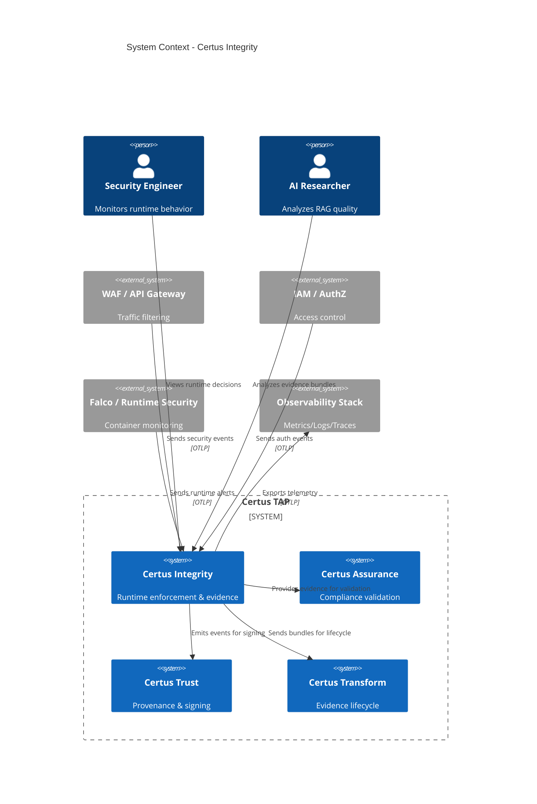
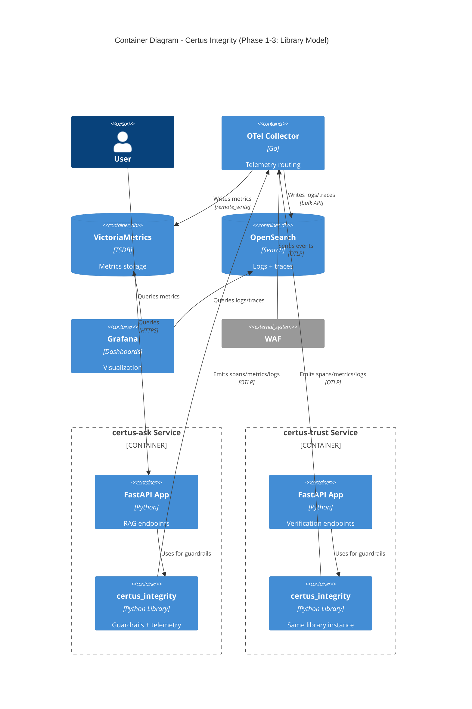
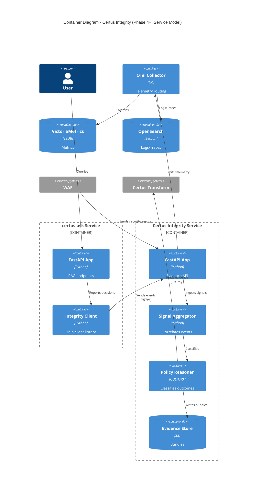
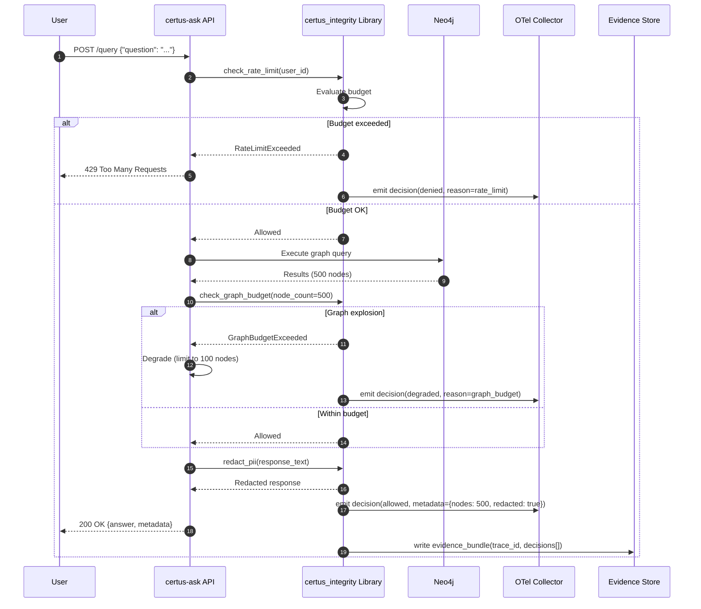
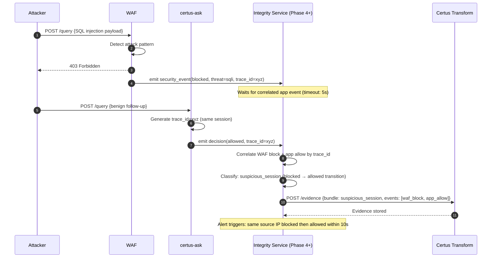

# octicons-sync-16: Certus Integrity

> Runtime enforcement, signal aggregation, and evidence production for AI, application, and platform security across Certus TAP

## Metadata

- **Type**: Proposal
- **Status**: Draft
- **Author**: Certus Architecture Team
- **Created**: 2025-12-14
- **Last Updated**: 2025-12-14
- **Target Version**: v2.0
- **Implementation Timeline**: 14 weeks (phased)

## Executive Summary

Certus Integrity is the runtime layer responsible for enforcing controls, aggregating signals, normalizing evidence, and reasoning about system behavior across AI, application, and platform security domains. It provides continuous truth about how systems behave in production and supplies normalized, verifiable evidence to downstream services: **Certus Assurance** (testing and validation), **Certus Trust** (provenance and verification), and **Certus Transform** (normalization and lifecycle management).

**Key Points**:

- **Problem**: Runtime enforcement is decentralized across applications, security signals are heterogeneous, and no unified evidence layer exists for reasoning about system behavior or feeding downstream compliance/trust services
- **Solution**: A composed capability consisting of in-process enforcement libraries (initially), external signal ingestion, telemetry correlation, and evidence production with a clear path to service extraction when cross-service reasoning becomes necessary
- **Benefits**: Unified observability, verifiable evidence for compliance, portable enforcement across clouds, and AI-specific guardrails that integrate with existing application runtimes
- **Risks**: In-process library model creates version skew and bypass risks, evidence schema versioning is complex, Neo4j graph explosion prevention requires query rewriting, PII redaction has performance overhead, and portability requires early testing

## Motivation

### Problem Statement

Certus TAP currently lacks a unified runtime integrity layer:

1. **Fragmented Enforcement**: Guardrails exist in individual services (certus-ask, certus-trust) but implementation patterns diverge. Performance budgets, circuit breakers, and PII redaction are reimplemented inconsistently.

2. **Heterogeneous Security Signals**: Runtime security signals come from multiple sources (WAF logs, IAM events, Falco alerts, application telemetry) with incompatible schemas and no correlation mechanism.

3. **No Evidence Normalization**: Downstream services (Certus Assurance, Certus Trust) receive raw telemetry and must parse/normalize independently, leading to duplicated logic and inconsistent interpretations.

4. **Limited AI-Specific Controls**: RAG systems using Neo4j and OpenSearch need specialized guardrails (graph explosion prevention, context budgets, grounding enforcement) that don't exist in standard security tooling.

5. **Observability Gaps**: No unified view of runtime decisions (allowed/denied/degraded requests), policy violations, or evidence trails for compliance auditing.

### Background

The Certus TAP platform has evolved to include:

- **certus-ask**: RAG service using OpenSearch + Neo4j with LLM generation
- **certus-trust**: Provenance verification and attestation signing
- **certus-transform**: Artifact normalization and lifecycle promotion
- **certus-assurance**: Security scanning and compliance validation

Each service implements its own enforcement logic, telemetry, and error handling. As the platform grows toward managed service offerings and MCP/ACP integration, the need for **consistent runtime behavior** and **verifiable evidence** becomes critical.

### User Impact

**Security Engineers**:

- Gain unified visibility into runtime security events across all Certus services
- Receive normalized evidence bundles for compliance reporting and incident investigation
- Can enforce consistent policies (rate limits, budgets, privacy controls) across the platform

**Platform Operators**:

- Reduce operational complexity by centralizing telemetry aggregation and evidence production
- Achieve portable deployments (AWS, Azure, GCP) with swappable observability backends
- Prevent catastrophic failures through circuit breakers, graceful degradation, and resource budgets

**Researchers & Developers**:

- Access structured evidence for evaluating RAG quality (retrieval precision, graph value-add, faithfulness)
- Experiment with guardrail configurations (budgets, allowlists, redaction rules) safely in shadow mode
- Trace end-to-end request flows across services with correlated logs/metrics/traces

### Research Context

Certus Integrity enables research into:

1. **RAG System Behavior**: Does Neo4j graph augmentation improve answer quality? What's the optimal hop/node budget? Evidence bundles capture retrieval + graph + generation metrics for offline analysis.

2. **AI Safety Guardrails**: How often do privacy controls trigger? Do circuit breakers prevent cascading failures? Structured decision events become a dataset for tuning enforcement policies.

3. **Observability at Scale**: Can tail-based sampling reduce trace storage costs while preserving error/latency outliers? Can evidence bundles replace traditional log aggregation for compliance?

4. **Portable Enforcement**: Does the same guardrail configuration behave identically on AWS vs Azure vs GCP? Evidence schemas enable cross-cloud validation.

## Goals & Non-Goals

### Goals

- [ ] **Unified Enforcement Framework**: Provide consistent guardrails (performance, security, privacy, ethics) across certus-ask, certus-trust, and future services
- [ ] **Evidence-First Architecture**: Normalize heterogeneous runtime signals into structured evidence bundles consumable by Assurance/Trust/Transform
- [ ] **AI-Specific Controls**: Implement specialized guardrails for RAG systems (graph budgets, context limits, grounding enforcement, PII redaction)
- [ ] **Portable Observability**: Support OpenTelemetry-based telemetry with swappable backends (VictoriaMetrics, AWS AMP, Azure Monitor, GCP Managed Prometheus)
- [ ] **Cross-Service Reasoning**: Correlate signals from applications, WAF, IAM, and runtime security tools into unified evidence bundles
- [ ] **Verifiable Compliance**: Produce signed evidence bundles that prove guardrail enforcement and policy compliance

### Non-Goals

- **Infrastructure Ownership**: Certus Integrity does not own WAF, IAM, or kernel-level enforcement (it aggregates and reasons over their outputs)
- **Standards Compliance Testing**: Validation against NIST/FedRAMP/PCI standards remains in Certus Assurance
- **Attestation & Signing**: Non-repudiation and provenance signing remain in Certus Trust
- **Lifecycle Management**: Evidence promotion (raw → golden → promoted) remains in Certus Transform
- **Real-Time Anomaly Detection**: ML-based anomaly detection is deferred to Phase 6+ (Phase 1-3 use rule-based classification only)

### Success Criteria

| Criterion                   | Measurement                                                                                                                     |
| --------------------------- | ------------------------------------------------------------------------------------------------------------------------------- |
| **Enforcement Consistency** | All services using certus_integrity library produce identical evidence schemas (validated via golden file comparisons)          |
| **Performance Overhead**    | p95 latency increase < 5% after guardrail integration; PII redaction overhead < 100ms per request                               |
| **Evidence Coverage**       | 100% of requests emit decision events (allowed/denied/degraded) with trace correlation                                          |
| **Portability**             | Same guardrail configuration runs on local (VictoriaMetrics), AWS (AMP), Azure (Managed Prometheus) with < 1% metric divergence |
| **Graph Safety**            | Neo4j query explosions (>10K nodes) blocked with < 0.1% false positive rate                                                     |
| **Integration Success**     | Certus Assurance consumes Integrity evidence bundles without custom parsing logic                                               |

## Proposed Solution

### Overview

Certus Integrity is **not a single service**—it is a **composed capability** consisting of:

1. **In-Process Enforcement Library** (Phase 1-3): Python package (`certus_integrity`) providing FastAPI middleware, guardrails, and telemetry emission. Used by certus-ask, certus-trust, and future services.

2. **External Signal Ingestion** (Phase 3): Adapters that normalize WAF logs, IAM events, Falco alerts, and Dagger scan outputs into Integrity evidence events.

3. **Telemetry & Aggregation** (Phase 1): OpenTelemetry instrumentation with pluggable backends (VictoriaMetrics, OpenSearch, Grafana) for metrics, logs, and traces.

4. **Evidence Production** (Phase 4): Structured evidence bundles (JSON) containing runtime decisions, aggregated signals, and policy outcomes—signed and routed to Certus Transform.

5. **Service Extraction** (Phase 4+): When cross-service correlation is required (e.g., joining certus-ask decisions + WAF events + Neo4j audit logs), extract to a standalone Certus Integrity service.

**Design Principle**: Start as a library for rapid iteration, extract to a service when cross-service reasoning becomes necessary.

### Architecture

#### System Context (C4 Level 1)



**Description**: Certus Integrity sits at the runtime boundary, aggregating signals from platform security tools (WAF, IAM, Falco), producing evidence consumed by Assurance/Trust/Transform, and exporting telemetry to the observability stack. Security engineers monitor dashboards; researchers analyze evidence bundles.

#### Container View (C4 Level 2)



**Description**: In the library model (Phase 1-3), `certus_integrity` is imported by certus-ask and certus-trust as a Python package. Each service embeds guardrail enforcement (circuit breakers, budgets, PII redaction) and emits telemetry to the OpenTelemetry Collector. The collector routes metrics to VictoriaMetrics, logs/traces to OpenSearch, and Grafana visualizes everything.

**Phase 4+ Evolution**: When cross-service reasoning is needed (e.g., "correlate certus-ask request + WAF block event + Neo4j query"), extract Certus Integrity into a dedicated service that receives telemetry from all sources and produces unified evidence bundles.

#### Container View (C4 Level 2) - Phase 4+: Service Model



**Description**: In the service model, Certus Integrity becomes a standalone API that receives decision events from applications (via thin client libraries) and security signals from external tools. The Signal Aggregator correlates events by trace_id/request_id, the Policy Reasoner classifies outcomes, and evidence bundles are stored in S3 and forwarded to Certus Transform.

### Workflows

#### Workflow 1: Request Enforcement with Evidence Production

> _User query flows through certus-ask with guardrail enforcement and evidence emission_



**Actors**:

- _User_ – Issues query to certus-ask
- _certus-ask API_ – RAG service orchestrating retrieval + graph + generation
- _certus_integrity Library_ – Enforces guardrails and emits telemetry
- _Neo4j_ – Graph database for entity expansion
- _OTel Collector_ – Receives telemetry for metrics/logs/traces
- _Evidence Store_ – Persists structured evidence bundles

**Actions**:

1. **Rate Limit Check**: Integrity library verifies user hasn't exceeded request budget
2. **Budget Enforcement**: If exceeded, request is denied and decision event emitted
3. **Graph Query Execution**: certus-ask queries Neo4j for entity relationships
4. **Graph Budget Check**: Integrity verifies node count doesn't exceed configured limit
5. **Graceful Degradation**: If budget exceeded, result set is truncated and degradation event emitted
6. **PII Redaction**: Response text is scanned and sensitive data is redacted via Presidio
7. **Telemetry Emission**: All decisions (allowed/denied/degraded) are sent to OTel Collector with metadata
8. **Evidence Bundle Creation**: Structured evidence (decisions, timings, metadata) written to storage

**Desired Outcomes**:
| Outcome | Description |
|---------|-------------|
| **Request Protection** | No single request can exhaust resources (rate limits, graph budgets, context limits) |
| **Privacy Compliance** | All PII is redacted before response delivery; redaction events are auditable |
| **Observability** | Every decision is traceable via logs/metrics/traces with correlated trace_id |
| **Evidence Trail** | Structured bundle captures enforcement decisions for compliance reporting |

#### Workflow 2: External Signal Aggregation and Cross-Service Reasoning

> _WAF blocks malicious request; Integrity correlates with application telemetry to produce unified evidence_



**Actors**:

- _Attacker_ – Malicious actor attempting SQL injection
- _WAF_ – Web Application Firewall at network edge
- _certus-ask_ – Application service processing queries
- _Integrity Service_ – Standalone service (Phase 4+) correlating signals
- _Certus Transform_ – Evidence lifecycle management service

**Actions**:

1. **Attack Detection**: WAF identifies SQL injection pattern in request
2. **Request Blocking**: WAF returns 403 and emits security event with trace_id
3. **Event Ingestion**: Integrity service receives WAF event via OTLP
4. **Follow-Up Request**: Attacker sends benign query from same session (trace_id propagated)
5. **Application Decision**: certus-ask allows request and emits decision event
6. **Signal Correlation**: Integrity joins WAF block + app allow events by trace_id
7. **Threat Classification**: Pattern detected: blocked request followed by allowed request from same source
8. **Evidence Production**: Unified evidence bundle created with both events and classification
9. **Alert Generation**: Suspicious session pattern triggers alert to security team

**Desired Outcomes**:
| Outcome | Description |
|---------|-------------|
| **Cross-Layer Visibility** | Security events from WAF and application are correlated, not siloed |
| **Threat Classification** | Patterns (blocked → allowed transitions) are automatically detected |
| **Evidence Unification** | Single bundle contains heterogeneous signals for incident investigation |
| **Compliance Audit** | Evidence bundle proves both network-level and application-level enforcement |

### Technical Design

#### Data Model

**Evidence Bundle Schema** (Version 1):

```python
from pydantic import BaseModel, Field
from datetime import datetime
from typing import Literal, Optional, List, Dict, Any

class IntegrityDecision(BaseModel):
    """Individual enforcement decision"""
    decision_id: str = Field(..., description="Unique decision identifier")
    timestamp: datetime
    trace_id: str = Field(..., description="OpenTelemetry trace ID")
    span_id: str = Field(..., description="OpenTelemetry span ID")
    service: str = Field(..., description="Service name (e.g., certus-ask)")
    decision: Literal["allowed", "denied", "degraded"]
    reason: str = Field(..., description="Why this decision was made")
    guardrail: str = Field(..., description="Which guardrail evaluated (e.g., rate_limit, graph_budget)")
    metadata: Dict[str, Any] = Field(default_factory=dict)

class ExternalSignal(BaseModel):
    """Normalized external security signal"""
    signal_id: str
    timestamp: datetime
    source: str = Field(..., description="Signal source (e.g., waf, iam, falco)")
    trace_id: Optional[str] = Field(None, description="Correlated trace ID if available")
    event_type: str = Field(..., description="Event classification (e.g., blocked, auth_failure)")
    severity: Literal["low", "medium", "high", "critical"]
    raw_event: Dict[str, Any] = Field(..., description="Original event payload")

class EvidenceBundle(BaseModel):
    """Complete evidence bundle for a request or session"""
    bundle_id: str
    integrity_evidence_version: Literal["v1"] = "v1"
    created_at: datetime
    trace_id: str
    session_id: Optional[str] = None

    # Service metadata
    service: str
    service_version: str
    deployment_environment: str

    # Enforcement decisions
    decisions: List[IntegrityDecision]

    # External signals (correlated)
    external_signals: List[ExternalSignal] = Field(default_factory=list)

    # Classification outcome
    classification: Optional[str] = Field(None, description="Reasoner classification (e.g., normal, suspicious, violation)")

    # Performance metrics
    total_duration_ms: float
    guardrail_overhead_ms: float

    # Signature (added by Certus Trust)
    signature: Optional[str] = None
    signed_at: Optional[datetime] = None
```

**Neo4j Query Budget Configuration**:

```python
class GraphBudgetConfig(BaseModel):
    """Graph explosion prevention configuration"""
    max_nodes_per_query: int = Field(1000, description="Maximum nodes returned")
    max_edges_per_query: int = Field(5000, description="Maximum relationships traversed")
    max_hops: int = Field(3, description="Maximum path length for variable-length patterns")
    timeout_seconds: int = Field(30, description="Query execution timeout")

    # Query rewriting rules
    inject_limit: bool = Field(True, description="Automatically inject LIMIT clauses")
    validate_cypher: bool = Field(True, description="Parse and validate queries before execution")
    block_patterns: List[str] = Field(
        default_factory=lambda: [
            r":\*\d{2,}",  # Block [:REL*10..] (high fan-out)
            r"OPTIONAL MATCH.*LIMIT",  # OPTIONAL MATCH can bypass LIMIT
        ]
    )
```

**PII Redaction Configuration**:

```python
class PIIRedactionConfig(BaseModel):
    """Privacy guardrail configuration"""
    enabled: bool = True
    presidio_entities: List[str] = Field(
        default_factory=lambda: [
            "PERSON", "EMAIL_ADDRESS", "PHONE_NUMBER",
            "CREDIT_CARD", "US_SSN", "IBAN_CODE"
        ]
    )

    # Domain-specific patterns
    custom_patterns: List[Dict[str, str]] = Field(
        default_factory=lambda: [
            {"name": "CUSTOMER_ID", "pattern": r"CUST-\d{8}"},
            {"name": "API_KEY", "pattern": r"sk-[a-zA-Z0-9]{32}"},
        ]
    )

    # Performance tuning
    max_text_length: int = Field(10000, description="Don't redact texts longer than this (perf)")
    async_redaction: bool = Field(False, description="Redact asynchronously for large texts")

    # Allowlists (don't redact these even if detected)
    allowlist: List[str] = Field(
        default_factory=lambda: ["John Doe", "ACME Corp"]  # Example entities
    )
```

#### APIs

**Internal Library API** (Phase 1-3):

```python
# certus_integrity/guardrails.py

from contextlib import asynccontextmanager
from fastapi import Request, HTTPException
from opentelemetry import trace

class IntegrityMiddleware:
    """FastAPI middleware for enforcement + telemetry"""

    def __init__(self, config: IntegrityConfig):
        self.config = config
        self.tracer = trace.get_tracer(__name__)

    async def __call__(self, request: Request, call_next):
        with self.tracer.start_as_current_span("integrity.request") as span:
            # Rate limiting
            if not await self.check_rate_limit(request):
                self._emit_decision("denied", "rate_limit", span)
                raise HTTPException(429, "Rate limit exceeded")

            # Execute request
            response = await call_next(request)

            # PII redaction (response body)
            if self.config.pii_redaction.enabled:
                response = await self.redact_response(response, span)

            self._emit_decision("allowed", "request_completed", span)
            return response

    async def check_graph_budget(
        self,
        node_count: int,
        edge_count: int,
        span: trace.Span
    ) -> bool:
        """Check if graph query results are within budget"""
        budget = self.config.graph_budget

        if node_count > budget.max_nodes_per_query:
            self._emit_decision("degraded", "graph_budget_nodes", span,
                              metadata={"nodes": node_count, "limit": budget.max_nodes_per_query})
            return False

        if edge_count > budget.max_edges_per_query:
            self._emit_decision("degraded", "graph_budget_edges", span,
                              metadata={"edges": edge_count, "limit": budget.max_edges_per_query})
            return False

        return True
```

**Evidence API** (Phase 4+):

```http
POST /v1/evidence/decisions
Content-Type: application/json
Authorization: Bearer <service_token>

{
  "trace_id": "4bf92f3577b34da6a3ce929d0e0e4736",
  "service": "certus-ask",
  "decisions": [
    {
      "decision_id": "dec_1234",
      "timestamp": "2025-12-14T10:30:00Z",
      "decision": "allowed",
      "guardrail": "rate_limit",
      "reason": "within_budget",
      "metadata": {"requests_remaining": 95}
    }
  ]
}
```

**Response:**

```json
{
  "bundle_id": "bundle_abc123",
  "status": "accepted",
  "correlated_signals": 0
}
```

**External Signal Ingestion** (Phase 3+):

```http
POST /v1/evidence/signals
Content-Type: application/json
Authorization: Bearer <waf_token>

{
  "source": "waf",
  "signals": [
    {
      "signal_id": "waf_evt_9876",
      "timestamp": "2025-12-14T10:29:58Z",
      "trace_id": "4bf92f3577b34da6a3ce929d0e0e4736",
      "event_type": "blocked",
      "severity": "high",
      "raw_event": {
        "rule_id": "OWASP_942100",
        "attack_type": "sqli",
        "source_ip": "203.0.113.42"
      }
    }
  ]
}
```

#### Integration Points

**Certus Assurance**:

- Consumes evidence bundles to validate that runtime enforcement matches declared policies
- Verifies that PII redaction was applied (checks `decisions[].guardrail == "pii_redaction"`)
- Uses evidence as input for compliance reports (e.g., "100% of requests had rate limiting enforced")

**Certus Trust**:

- Signs evidence bundles using cosign/in-toto before storage
- Verifies evidence bundle signatures when Assurance requests validation
- Emits verification proofs that reference evidence bundles by `bundle_id`

**Certus Transform**:

- Receives evidence bundles and applies lifecycle tiering (raw → golden → promoted)
- Enriches bundles with metadata (e.g., linking evidence to SARIF findings from scans)
- Stores bundles in S3-compatible storage with signed manifests

**OpenTelemetry Ecosystem**:

- Integrity library emits spans, metrics, and logs via OTLP to OTel Collector
- Collector routes to VictoriaMetrics (metrics), OpenSearch (logs/traces), and Grafana (visualization)
- Supports swappable exporters for cloud-native backends (AWS AMP, Azure Monitor, GCP Managed Prometheus)

### Technology Stack

**Core Runtime (Phase 1-3: Library)**:

- **Language**: Python 3.11+
- **Framework**: FastAPI middleware + Pydantic v2 models
- **Enforcement**:
  - `slowapi` (rate limiting)
  - `tenacity` (retries)
  - `pybreaker` (circuit breakers)
  - `presidio-analyzer` + `presidio-anonymizer` (PII redaction)
- **Telemetry**: OpenTelemetry SDK (Python)
- **Policy**: CUE (configuration schemas), OPA (deferred to Phase 5+)

**Service Runtime (Phase 4+)**:

- **API**: FastAPI (async)
- **Signal Correlation**: In-memory correlation (trace_id index) with TTL cache
- **Reasoning**: Rule-based classification (Python), CUE policy evaluation
- **Storage**: S3-compatible (MinIO/AWS S3/Azure Blob) for evidence bundles

**Observability Stack**:

- **Collection**: OpenTelemetry Collector (agent + gateway deployment)
- **Metrics**: VictoriaMetrics (default), swappable to AWS AMP, Azure Managed Prometheus, or GCP Managed Prometheus
- **Logs/Traces**: OpenSearch (default), swappable to AWS X-Ray, Azure Monitor, or GCP Cloud Trace
- **Visualization**: Grafana with multi-datasource support (VictoriaMetrics + OpenSearch)
- **Log Shipping**: Fluent Bit for k8s log tailing and multiline exception handling

**Neo4j Query Safety**:

- **Query Parsing**: Use `py2neo` or `neo4j` driver with pre-execution Cypher parsing
- **Budget Enforcement**: Custom middleware wraps `session.run()` to inject LIMIT, timeout, and pattern validation
- **Monitoring**: Track query execution time and node/edge counts via driver callbacks

**Development & Testing**:

- **Testing**: pytest, pytest-asyncio, pytest-benchmark
- **Evaluation**: DeepEval for RAG-specific quality metrics, Ragas for faithfulness and context precision/recall
- **CI**: GitHub Actions with docker-compose for integration tests

### Security Considerations

#### Authentication & Authorization

**Phase 1-3 (Library Model)**:

- No separate auth layer—libraries inherit authentication from host service (certus-ask, certus-trust)
- Guardrail configuration is read from service-specific config files (protected by filesystem ACLs)

**Phase 4+ (Service Model)**:

- **Service-to-Service Auth**: JWT tokens issued by Certus Trust for inter-service communication
- **External Signal Ingestion**: API keys for WAF/IAM/Falco adapters, rotated monthly and stored in Vault
- **Evidence Access**: Role-based access control (RBAC) for evidence bundles, only Assurance/Trust/Transform can read

#### Data Protection

**PII Handling**:

- All response bodies scanned with Presidio before delivery to users
- Redacted text stored in evidence bundles; original text **never persisted** unless explicitly configured
- Logs automatically scrubbed (trace_id/span_id preserved, but request/response bodies excluded)

**Evidence Bundle Encryption**:

- Bundles stored in S3 with server-side encryption (SSE-S3 or SSE-KMS)
- In transit: TLS 1.3 for all service-to-service communication
- Signed by Certus Trust using cosign (signature covers entire bundle JSON)

**Secrets Management**:

- OpenTelemetry Collector credentials (for exporters) stored in Vault
- PII redaction allowlists/denylists stored in CUE configuration files (version-controlled)

#### Threat Model

| Threat                                             | Impact   | Likelihood       | Mitigation                                                                                                                         |
| -------------------------------------------------- | -------- | ---------------- | ---------------------------------------------------------------------------------------------------------------------------------- |
| **Enforcement Bypass** (app disables library)      | Critical | Medium           | Phase 4: Extract to service—apps can't bypass external enforcement; validate evidence bundles in Assurance                         |
| **Evidence Tampering** (attacker modifies bundles) | High     | Low              | Sign bundles with Certus Trust; verify signatures before use; store in append-only S3 buckets                                      |
| **PII Leakage** (redaction fails)                  | Critical | Medium           | Layer Presidio with domain-specific denylists; log all redaction failures; benchmark false negative rate < 1%                      |
| **Graph Explosion DoS** (malicious Cypher)         | High     | Medium           | Query rewriting + pre-execution validation; hard timeouts; test with adversarial queries in CI                                     |
| **Telemetry Flooding** (attacker spams decisions)  | Medium   | Medium           | Rate limit decision event emission; tail-based sampling (keep errors, drop routine events); collector backpressure                 |
| **Version Skew** (library v1 + v2 running)         | Medium   | High (Phase 1-3) | Evidence schema includes `integrity_evidence_version`; Assurance rejects unknown versions; CI enforces library version consistency |

#### Compliance

**GDPR**:

- PII redaction ensures "right to be forgotten" compliance (original text not stored)
- Evidence bundles retain metadata (trace_id, decision outcomes) but not PII

**SOC 2 / ISO 27001**:

- Evidence bundles provide audit trail for "access controls are enforced"
- Signed bundles prove non-repudiation ("this decision was made by Certus Integrity at timestamp X")

**FedRAMP / NIST 800-53**:

- Integration with Certus Assurance allows mapping evidence to controls (e.g., AC-3: Access Enforcement)
- Evidence retention policies configurable per deployment (7 days default, 90 days for compliance environments)

### Research Considerations

#### Reproducibility

**Evidence as Ground Truth**:

- Every request produces a deterministic evidence bundle (given same inputs + configuration)
- Researchers can replay evidence bundles offline to re-evaluate decisions without re-running production workloads
- CUE policy configurations version-controlled alongside code

**Experiment Isolation**:

- Shadow mode: Enforce=False, emit decisions without blocking requests—compare "what would have been blocked" vs actual behavior
- A/B testing: Run two guardrail configurations (strict vs lenient), emit separate evidence streams, compare outcomes

#### Evaluation Metrics

**RAG Quality** (using evidence bundles):

- **Retrieval Precision**: Did OpenSearch return relevant documents? Compare `retrieved_doc_ids` in evidence vs ground truth
- **Graph Value-Add**: Score answers with graph ON vs OFF, extract `graph_node_count` from evidence metadata
- **Faithfulness**: Do LLM responses cite only retrieved context? Use DeepEval with evidence bundle as input
- **Latency Breakdown**: OpenSearch time vs Neo4j time vs LLM time, extracted from trace spans in evidence

**Guardrail Effectiveness**:

- **False Positive Rate**: How often are legitimate requests degraded/denied? Manual labeling of evidence bundles
- **Performance Overhead**: p95 latency with vs without guardrails, measured via time-series query on VictoriaMetrics
- **PII Redaction Accuracy**: Presidio recall (did it catch all PII?) and precision (did it over-redact?), measured on labeled dataset

#### Experiment Design

**Scenario 1: Graph Budget Tuning**

1. Collect 1 week of evidence bundles with `max_nodes_per_query = 1000`
2. Analyze distribution of `graph_node_count` (e.g., p50=120, p95=850, p99=3200)
3. Run offline simulation: re-evaluate evidence with `max_nodes_per_query = 500`
4. Measure: How many requests would have been degraded? Did answer quality decrease?
5. Decide: Adjust budget based on acceptable degradation rate

**Scenario 2: PII Redaction A/B Test**

1. Deploy certus-ask with two configurations:
   - Control: Presidio default entities only
   - Treatment: Presidio + custom regex patterns for domain-specific PII
2. Sample 10% of traffic to each configuration
3. Collect evidence bundles tagged with `experiment_group`
4. Measure: Redaction latency, false positive rate (manual review of 100 samples)
5. Decide: Promote treatment to production if latency < 100ms and FP rate < 5%

#### Data Collection

**What is Collected**:

- Decision events (allowed/denied/degraded) with timestamps and trace_id
- Guardrail metadata (node counts, rate limit remaining, redaction applied)
- Performance metrics (request duration, guardrail overhead)
- External signal correlation (WAF events, IAM events) **without storing raw payloads**

**What is NOT Collected**:

- User prompts or questions (unless explicitly enabled for research—requires consent)
- Retrieved document contents (only doc_ids and chunk_ids)
- Raw LLM responses (only redacted versions or metadata like token count)

**Data Retention**:

- Evidence bundles: 30 days in hot storage (OpenSearch), 90 days in warm storage (S3)
- Metrics: 180 days in VictoriaMetrics
- Traces: 14 days in OpenSearch (tail-sampled: errors + slow requests only)

## Alternatives Considered

### Alternative 1: Enforce in API Gateway (Kong/Envoy)

**Description**: Deploy guardrails as API gateway plugins (rate limiting, WAF) instead of in-process libraries.

**Pros**:

- Centralized enforcement—no per-service library imports
- Language-agnostic (works for Python, Go, Node.js services)
- Industry-standard tooling (Kong, Envoy, AWS API Gateway)

**Cons**:

- **AI-specific guardrails not supported**: Graph budgets, PII redaction, grounding enforcement require application context
- **No evidence correlation**: Gateway sees only HTTP layer, cannot correlate with Neo4j query execution or LLM token usage
- **Limited reasoning**: Gateway can block/allow but cannot classify "degraded" or emit rich decision metadata

**Decision**: Rejected for Certus Integrity because AI-specific controls require application-layer integration. However, gateway enforcement is complementary (WAF/rate limiting stays at gateway, AI guardrails live in Integrity).

### Alternative 2: Build as Service from Day 1 (Skip Library Phase)

**Description**: Start with Certus Integrity as a standalone service (Phase 4+ architecture) instead of in-process library.

**Pros**:

- No version skew (single deployment)
- Impossible to bypass (apps must call service to emit evidence)
- Easier cross-service correlation from the start

**Cons**:

- **Network latency**: Every request requires service-to-service call, adds p50=10ms and p95=50ms
- **Operational complexity**: One more service to deploy, monitor, and scale
- **Slower iteration**: Changes require service deployment, not just library version bump

**Decision**: Rejected for Phase 1-3 because rapid iteration is critical during guardrail design. Library model allows faster experimentation with lower operational overhead. Extract to service in Phase 4 when cross-service reasoning becomes necessary.

### Alternative 3: Use Existing Observability Platform (Datadog/New Relic APM)

**Description**: Skip custom evidence bundles; rely on Datadog/New Relic APM for observability and use their event APIs for decision tracking.

**Pros**:

- No need to build telemetry aggregation (collector, storage, dashboards)
- Best-in-class UX for traces, metrics, logs
- Built-in anomaly detection and alerting

**Cons**:

- **Vendor lock-in**: Certus TAP goal is portability, cannot swap Datadog for AWS AMP without rewriting instrumentation
- **No evidence signing**: Datadog events are not cryptographically signed, cannot use for compliance/trust workflows
- **Cost**: Datadog pricing scales with telemetry volume, could be prohibitive for high-traffic deployments
- **Limited customization**: Evidence schema is dictated by Datadog's event model, not our compliance needs

**Decision**: Rejected because portability and verifiable evidence are core requirements. However, Datadog/New Relic can be added as exporters (OTel Collector supports Datadog exporter) for teams that want their UX.

### Alternative 4: Rule Engine (Drools/REGO) for All Guardrails

**Description**: Implement all guardrail logic (rate limits, budgets, PII) as declarative rules in a rule engine (e.g., Drools, OPA REGO).

**Pros**:

- Declarative policy-as-code (easy to audit, version-control)
- Non-programmers can modify rules without code changes
- Clear separation between policy (rules) and enforcement (engine)

**Cons**:

- **Performance overhead**: Rule engine evaluation adds latency, especially for complex PII regex
- **Debugging difficulty**: Stack traces in rule engines are opaque compared to Python exceptions
- **Limited library ecosystem**: Presidio, tenacity, pybreaker are mature Python libraries, reimplementing in REGO is labor-intensive

**Decision**: Hybrid approach adopted. Use CUE for configuration schemas (budgets, thresholds) and OPA for authorization logic (Phase 5+), but keep enforcement in Python (tenacity, pybreaker, Presidio) for performance and debuggability.

### Why the Proposed Solution?

The library-first, service-later approach balances:

- Rapid iteration (Phase 1-3) with low operational overhead
- AI-specific guardrails that require application context
- Portability via OpenTelemetry and swappable backends
- Verifiable evidence for compliance (signed bundles, append-only storage)

It avoids vendor lock-in (Alternative 3), supports AI-specific controls (Alternative 1 cannot), and defers service complexity (Alternative 2) until cross-service reasoning is needed.

## Dependencies

### Prerequisites

- [ ] **OpenTelemetry Instrumentation**: certus-ask and certus-trust must emit basic traces/metrics before Integrity integration (baseline observability)
- [ ] **VictoriaMetrics + OpenSearch Deployment**: Observability stack must be running in docker-compose and tested
- [ ] **Certus Transform S3 Store**: Evidence bundles will be uploaded to Transform's S3 bucket, ensure bucket/prefix configuration is documented
- [ ] **Certus Trust Signing API**: Evidence bundles require signing, Trust's cosign integration must be functional

### Downstream Impact

- **certus-ask**: Import `certus_integrity` library, add middleware, update tests to validate decision events
- **certus-trust**: Same library integration, plus handle evidence bundle signing requests
- **Certus Assurance**: Update to consume evidence bundles (not raw logs) for compliance validation
- **Certus Transform**: Accept evidence bundle uploads, apply tiering, store with signed manifests
- **Grafana Dashboards**: New dashboards for Integrity metrics (decision rates, guardrail overhead, PII redaction latency)

### External Dependencies

| Dependency            | Version | License    | Stability | Notes                     |
| --------------------- | ------- | ---------- | --------- | ------------------------- |
| `opentelemetry-sdk`   | 1.21+   | Apache 2.0 | Stable    | Core telemetry            |
| `presidio-analyzer`   | 2.2+    | MIT        | Stable    | PII detection             |
| `presidio-anonymizer` | 2.2+    | MIT        | Stable    | PII redaction             |
| `slowapi`             | 0.1+    | MIT        | Stable    | Rate limiting for FastAPI |
| `tenacity`            | 8.0+    | Apache 2.0 | Stable    | Retry logic               |
| `pybreaker`           | 1.0+    | BSD-3      | Stable    | Circuit breakers          |
| `pydantic`            | 2.5+    | MIT        | Stable    | Data validation           |
| `cue` (CLI)           | 0.6+    | Apache 2.0 | Beta      | Policy schema validation  |

## Risks & Mitigations

| Risk                                                                               | Probability      | Impact   | Mitigation Strategy                                                                                                                        |
| ---------------------------------------------------------------------------------- | ---------------- | -------- | ------------------------------------------------------------------------------------------------------------------------------------------ |
| **Library version skew** (certus-ask v1.2, certus-trust v1.5 of integrity library) | High (Phase 1-3) | High     | Include `integrity_evidence_version` in bundles; CI enforces same library version across services; extract to service in Phase 4           |
| **Enforcement bypass** (service disables library imports)                          | Medium           | Critical | Phase 4: Extract to service—apps can't bypass external enforcement; Assurance validates evidence bundles exist for all requests            |
| **PII redaction performance** (Presidio adds >100ms p95 latency)                   | Medium           | Medium   | Benchmark in Phase 1; add async redaction for large texts; allowlist known-safe entities; layer custom regex before Presidio               |
| **Neo4j query rewriting complexity** (edge cases break legitimate queries)         | Medium           | High     | Build test suite of 100+ Cypher queries (normal + adversarial); whitelist known-safe patterns; log rejected queries for manual review      |
| **Evidence schema evolution** (breaking changes to bundle format)                  | Medium           | High     | Version envelope (`integrity_evidence_version: v1`); Assurance supports N-1 versions; migration guide for v1 → v2                          |
| **Portability untested until Phase 6** (AWS AMP exporter breaks in production)     | High             | Medium   | Test portability in Phase 2 (docker-compose with AWS/Azure/GCP exporter configs); add CI job that validates metrics arrive in all backends |
| **Cross-service correlation fails** (trace_id not propagated)                      | Medium           | High     | Enforce W3C Trace Context headers in all services (CI test); add smoke test that validates trace_id propagation through WAF → app → DB     |
| **Telemetry cost explosion** (high cardinality metrics)                            | Medium           | Medium   | Define allowed label keys in CUE config (never use user_id, trace_id in metric labels); use exemplars for drill-down; tail-based sampling  |

## Implementation Plan

### Phased Roadmap

#### Phase 0: Contracts & Alignment (2 weeks)

**Objectives**:

- Define evidence bundle schema with versioning strategy
- Document telemetry contract (span naming, metric labels, log fields)
- Prototype PII redaction and Neo4j query rewriting
- Establish baseline observability (current p95/p99 latency without guardrails)

**Deliverables**:

- [ ] **Evidence Schema**: `certus_integrity/models.py` with Pydantic models for `EvidenceBundle`, `IntegrityDecision`, `ExternalSignal`
- [ ] **Telemetry Contract**: Documentation in `docs/reference/observability/integrity-telemetry.md` specifying span names, metric labels, log fields
- [ ] **Prototype**: Python script demonstrating Presidio redaction + Neo4j query rewriting with performance benchmarks
- [ ] **Baseline Metrics**: Grafana dashboard showing certus-ask current latency (before Integrity integration)

**Success Criteria**:

- Evidence schema reviewed and approved by Assurance/Trust/Transform teams
- Telemetry contract validated with sample OTLP export
- Presidio prototype achieves <50ms p95 latency on 1KB text samples
- Neo4j query rewriter blocks adversarial queries (e.g., `[:REL*1..100]`) without false positives

**Estimated Effort**: 2 person-weeks (1 engineer)

#### Phase 1: Observability Baseline (1 week)

**Objectives**:

- Instrument certus-ask with OpenTelemetry (spans, metrics, logs)
- Deploy OTel Collector + VictoriaMetrics + OpenSearch in docker-compose
- Create Grafana dashboards for request rates, latency, error rates
- Validate trace_id correlation across logs/metrics/traces

**Deliverables**:

- [ ] **OTel Instrumentation**: certus-ask emits spans for `/query` endpoint, Neo4j calls, LLM calls
- [ ] **Docker Compose Stack**: `docker-compose.observability.yml` with OTel Collector, VictoriaMetrics, OpenSearch, Grafana
- [ ] **Dashboards**: Grafana dashboard showing RED metrics (Rate, Errors, Duration) + trace exemplars
- [ ] **Correlation Test**: Script that generates request, verifies same trace_id appears in metrics, logs, and traces

**Success Criteria**:

- 100% of certus-ask requests have trace_id propagated to all telemetry backends
- p95/p99 latency visible in Grafana with <1 minute delay
- Logs searchable in OpenSearch by trace_id
- No blind spots: every execution path emits spans

**Estimated Effort**: 1 person-week

#### Phase 2: Hard Rails with Shadow Mode (3 weeks)

**Objectives**:

- Implement `certus_integrity` library with FastAPI middleware
- Add guardrails: rate limiting, circuit breakers, Neo4j graph budgets, PII redaction
- Run in **shadow mode** (enforce=False): emit decision events without blocking requests
- Tune thresholds based on shadow mode data (avoid false positives)

**Deliverables**:

- [ ] **Library Package**: `certus_integrity` installable via pip with `IntegrityMiddleware`
- [ ] **Guardrails**:
  - Rate limiting (slowapi): 100 req/min per user
  - Circuit breakers (pybreaker): open circuit if 50% error rate over 1 minute
  - Graph budgets: max 1000 nodes, 5000 edges, 3 hops
  - PII redaction (Presidio): EMAIL, PHONE, SSN, CREDIT_CARD
- [ ] **Shadow Mode**: `enforce=False` config—all guardrails evaluate but don't block
- [ ] **Decision Events**: Metrics `integrity_decisions_total{decision=allowed|denied|degraded, guardrail=*}`
- [ ] **Integration**: certus-ask imports library, adds middleware, emits decisions

**Success Criteria**:

- Shadow mode runs for 1 week with zero request blocking
- False positive rate < 1% (manual review of 100 "would have been blocked" requests)
- p95 latency increase < 5% (guardrail overhead acceptable)
- Decision event metrics visible in Grafana

**Estimated Effort**: 3 person-weeks (2 engineers)

#### Sub-Phase 2b: Portability Testing (1 week, overlaps with Phase 2)

**Objectives**:

- Test OTel Collector exporters for AWS AMP, Azure Monitor, GCP Managed Prometheus
- Validate metrics arrive correctly in all backends
- Document backend configuration ("portability packs")

**Deliverables**:

- [ ] **Portability Packs**: `docker-compose.aws.yml`, `docker-compose.azure.yml`, `docker-compose.gcp.yml` with exporter configs
- [ ] **CI Job**: GitHub Actions job that deploys each stack and validates metrics
- [ ] **Documentation**: `docs/deployment/observability-backends.md` with configuration guides

**Success Criteria**:

- Metrics exported to AWS AMP, Azure Monitor, GCP Managed Prometheus with <1% divergence
- CI job passes for all three backends
- No code changes required to swap backends (config-only)

**Estimated Effort**: 1 person-week (1 engineer, overlaps with Phase 2)

#### Phase 3: Hard Enforcement + External Signals (2 weeks)

**Objectives**:

- Enable hard enforcement (enforce=True): block requests that violate guardrails
- Implement graceful degradation (e.g., truncate graph results instead of failing)
- Ingest external signals (WAF events, IAM events) via OTLP
- Correlate external signals with application decisions by trace_id

**Deliverables**:

- [ ] **Hard Enforcement**: `enforce=True` config—rate limits block, graph budgets truncate results
- [ ] **Graceful Degradation**: When graph budget exceeded, return first 1000 nodes + warning in response metadata
- [ ] **Signal Adapters**: WAF adapter (reads logs, emits OTLP events), IAM adapter (same pattern)
- [ ] **Correlation Logic**: In-memory cache (TTL=30s) joins events by trace_id
- [ ] **Evidence Bundles**: Emit `EvidenceBundle` JSON to OpenSearch with both app decisions + external signals

**Success Criteria**:

- Hard enforcement blocks malicious requests (test with rate limit DoS attack)
- Degradation prevents service failure (test with graph explosion Cypher query)
- External signals correlated with 95%+ accuracy (trace_id match rate)
- Evidence bundles include both application decisions and WAF/IAM events

**Estimated Effort**: 2 person-weeks (2 engineers)

#### Phase 4: Evidence Unification & Service Extraction (2 weeks)

**Objectives**:

- Standardize evidence bundle format (versioned schema)
- Route bundles to Certus Transform S3 store
- Sign bundles with Certus Trust (cosign)
- **Decision point**: Extract to service if cross-service reasoning is needed

**Deliverables**:

- [ ] **Evidence Schema v1**: Finalized `EvidenceBundle` Pydantic model with `integrity_evidence_version: v1`
- [ ] **Transform Integration**: Evidence bundles uploaded to `s3://certus-transform/integrity-evidence/{bundle_id}.json`
- [ ] **Signing**: Bundles signed by Certus Trust before upload (signature included in JSON)
- [ ] **Service Extraction (Conditional)**: If cross-service correlation is required, deploy Certus Integrity as standalone FastAPI service

**Success Criteria**:

- Evidence bundles validate against schema (no rejected uploads)
- 100% of bundles signed (signature verification passes)
- Certus Assurance successfully consumes bundles without custom parsing
- **If extracted to service**: Cross-service evidence bundles include app + WAF + Neo4j audit logs correlated by trace_id

**Estimated Effort**: 2 person-weeks (2 engineers)

#### Phase 5: Evaluation Integration (2 weeks)

**Objectives**:

- Certus Assurance consumes Integrity evidence for compliance validation
- Implement RAG evaluation using evidence bundles (DeepEval + Ragas)
- Add CI gating: fail PR if evidence shows policy violations
- Deploy "heavy rails" as scheduled jobs (nightly compliance scans)

**Deliverables**:

- [ ] **Assurance Connector**: Certus Assurance queries Transform S3 for evidence bundles, validates against policies
- [ ] **RAG Evaluation**: Python script using DeepEval to score faithfulness/relevance using evidence metadata
- [ ] **CI Gate**: GitHub Actions job fails if evidence bundles show >1% denied requests (indicates broken functionality)
- [ ] **Scheduled Scans**: Nightly job evaluates evidence from past 24h, flags policy violations in Slack

**Success Criteria**:

- Assurance successfully validates 100 sample evidence bundles
- RAG evaluation shows faithfulness score >0.9 (using evidence for ground truth)
- CI gate prevents merging PRs that increase denial rate
- Nightly scans detect policy violations within 12 hours

**Estimated Effort**: 2 person-weeks (1 engineer + 1 researcher)

#### Phase 6: Portability Packs & Advanced Features (Incremental, 2+ weeks)

**Objectives**:

- Productionize portability packs (AWS, Azure, GCP)
- Add advanced features: ML-based anomaly detection (optional), query cost prediction (optional)
- Harden for production: SLO-based alerting, runbook documentation

**Deliverables**:

- [ ] **Production Portability Packs**: Terraform/Helm charts for deploying Integrity + observability stack on AWS/Azure/GCP
- [ ] **ML Anomaly Detection (Optional)**: Train model on evidence bundles to detect outlier request patterns
- [ ] **Query Cost Prediction (Optional)**: Predict Neo4j query cost before execution (block expensive queries proactively)
- [ ] **SLO Alerts**: Grafana alerts for "p95 latency > 500ms for 10 minutes", "error rate > 1%"
- [ ] **Runbooks**: `docs/operations/integrity-runbook.md` with incident response procedures

**Success Criteria**:

- Portability packs deploy successfully on AWS EKS, Azure AKS, GCP GKE
- Anomaly detection flags suspicious patterns with >80% precision
- SLO alerts trigger within 5 minutes of SLO violation
- Runbooks tested in chaos engineering exercise (kill Neo4j pod, verify Integrity gracefully degrades)

**Estimated Effort**: 2+ person-weeks (ongoing, incremental)

#### Phase 7: MCP Integration (Later, 1 week)

**Objectives**:

- Expose Integrity evidence via MCP protocol
- Allow IDE/agent tools to query "why was this request denied?"
- Enable policy configuration via MCP (e.g., adjust rate limits from IDE)

**Deliverables**:

- [ ] **MCP Server**: Expose evidence query API (`get_evidence_by_trace_id`) via MCP
- [ ] **IDE Integration**: Example VS Code extension that shows Integrity decisions inline
- [ ] **Policy Configuration**: MCP tool for adjusting guardrail configs (with approval workflow)

**Success Criteria**:

- Developer can query "why was my request denied?" from IDE and see evidence bundle
- Policy changes via MCP require approval (not auto-applied)

**Estimated Effort**: 1 person-week

### Timeline Summary

| Phase     | Duration                                                    | Start After      | Deliverables                                                             |
| --------- | ----------------------------------------------------------- | ---------------- | ------------------------------------------------------------------------ |
| Phase 0   | 2 weeks                                                     | Approval         | Evidence schema, telemetry contract, prototypes                          |
| Phase 1   | 1 week                                                      | Phase 0          | OTel instrumentation, observability stack deployed                       |
| Phase 2   | 3 weeks                                                     | Phase 1          | Guardrails in shadow mode, decision events                               |
| Phase 2b  | 1 week                                                      | Overlaps Phase 2 | Portability testing (AWS/Azure/GCP)                                      |
| Phase 3   | 2 weeks                                                     | Phase 2          | Hard enforcement, external signal ingestion                              |
| Phase 4   | 2 weeks                                                     | Phase 3          | Evidence unification, Transform integration, optional service extraction |
| Phase 5   | 2 weeks                                                     | Phase 4          | Assurance integration, RAG evaluation, CI gating                         |
| Phase 6   | 2+ weeks                                                    | Phase 5          | Production portability packs, advanced features (incremental)            |
| Phase 7   | 1 week                                                      | Phase 6          | MCP integration (deferred)                                               |
| **Total** | **14 weeks** (core), **17+ weeks** (with advanced features) |                  |                                                                          |

### Resource Requirements

**Development**:

- Phase 0: 2 person-weeks (1 engineer)
- Phase 1: 1 person-week (1 engineer)
- Phase 2: 3 person-weeks (2 engineers)
- Phase 2b: 1 person-week (1 engineer, overlaps)
- Phase 3: 2 person-weeks (2 engineers)
- Phase 4: 2 person-weeks (2 engineers)
- Phase 5: 2 person-weeks (1 engineer + 1 researcher)
- Phase 6: 2+ person-weeks (1 engineer, incremental)
- Phase 7: 1 person-week (1 engineer, deferred)
- **Total**: ~16 person-weeks core development

**Testing**: 3 person-weeks (integration tests, load tests, chaos engineering)

**Documentation**: 2 person-weeks (architecture docs, runbooks, API references)

**Infrastructure**:

- Docker Compose (local): $0
- AWS (dev environment): ~$200/month (EKS cluster, AMP, S3)
- Production (Phase 6+): ~$1000/month (multi-AZ, higher retention)

### Milestones

- **M1** (Week 2): Evidence schema approved, telemetry contract documented
- **M2** (Week 3): Observability baseline established (Grafana dashboards live)
- **M3** (Week 6): Shadow mode runs in production for 1 week with <1% false positives
- **M4** (Week 7): Portability tested on AWS/Azure/GCP (metrics arrive in all backends)
- **M5** (Week 8): Hard enforcement enabled, first real request blocked by guardrail
- **M6** (Week 10): Evidence bundles uploaded to Transform, signed by Trust
- **M7** (Week 12): Certus Assurance validates 100% of evidence bundles without errors
- **M8** (Week 14): CI gates reject PRs with policy violations (RAG evaluation integrated)

## Testing Strategy

### Unit Testing

**Scope**: Individual guardrail logic (rate limiting, circuit breakers, PII redaction, graph budgets)

**Approach**:

- **pytest** with fixtures for guardrail configurations
- Mock external dependencies (Neo4j, Presidio, OTel Collector)
- Property-based testing (hypothesis) for edge cases (e.g., extreme node counts, malformed Cypher)

**Coverage Goals**:

- 90%+ line coverage for `certus_integrity` library
- 100% coverage for decision event emission logic (critical path)

**Key Test Cases**:

- Rate limit: Verify 101st request in 1 minute is denied
- Circuit breaker: Open circuit after 50% error rate, auto-close after timeout
- Graph budget: Block query returning 10,001 nodes
- PII redaction: Presidio detects EMAIL/PHONE/SSN in test corpus
- Query rewriting: Adversarial Cypher (`[:REL*1..100]`) is rejected

### Integration Testing

**Scope**: End-to-end request flows with guardrails enabled

**Approach**:

- **docker-compose** with certus-ask + Neo4j + OpenSearch + OTel Collector + VictoriaMetrics
- Send test requests that trigger each guardrail (rate limit, graph explosion, PII)
- Validate decision events appear in VictoriaMetrics
- Validate evidence bundles uploaded to mock S3 (MinIO)

**Key Test Cases**:

- **Happy Path**: Normal request → allowed decision, evidence bundle created
- **Rate Limit**: 100 requests in 1 min → 101st denied, decision event emitted
- **Graph Explosion**: Malicious Cypher → query blocked, degraded decision emitted
- **PII Redaction**: Response contains email → redacted before delivery, decision event shows redaction applied
- **External Signal**: WAF blocks request → event correlated with app decision in evidence bundle

### Research Validation

**Scenario**: Does Integrity evidence improve RAG evaluation accuracy?

**Hypothesis**: Using evidence bundles (retrieval metadata, graph node counts) as ground truth improves DeepEval faithfulness scores compared to using only LLM responses.

**Experiment**:

1. Collect 100 certus-ask requests with evidence bundles
2. Run DeepEval faithfulness metric:
   - **Control**: Use only LLM response + user question (no evidence)
   - **Treatment**: Use LLM response + retrieved doc_ids from evidence bundle
3. Measure: Faithfulness score distribution (expect treatment > control by 10%+)

**Validation Criteria**:

- Treatment group faithfulness > control by ≥0.1 (10 percentage points)
- Evidence metadata reduces DeepEval false positives (hallucination detection)

### Performance Testing

**Scope**: Guardrail overhead on p50/p95/p99 latency

**Approach**:

- **Locust** load testing with 1000 concurrent users
- Measure latency **before** and **after** Integrity integration
- Identify bottlenecks (PII redaction likely slowest)

**Acceptance Criteria**:

- p95 latency increase < 5% (e.g., 200ms → 210ms)
- PII redaction overhead < 100ms at p95
- Throughput degradation < 10% (requests/sec)

**Load Test Scenarios**:

- Baseline: 1000 req/min, no guardrails
- Guardrails enabled: 1000 req/min, all guardrails active
- Graph explosion: 100 req/min, all queries near budget limit (stress test)

### Security Testing

**Scope**: Enforcement bypass attempts, evidence tampering, PII leakage

**Approach**:

- **Manual penetration testing**: Attempt to disable guardrails, forge evidence bundles
- **Automated fuzzing**: Send malformed Cypher queries, adversarial prompts
- **PII corpus validation**: Test Presidio against labeled dataset (1000 samples with known PII)

**Key Test Cases**:

- **Bypass**: App disables `certus_integrity` import → Assurance detects missing evidence bundles
- **Tampering**: Modify evidence bundle JSON → signature verification fails
- **PII Leakage**: Presidio false negatives < 1% (measured on test corpus)
- **Cypher Injection**: Malicious query patterns blocked by rewriter

**Acceptance Criteria**:

- Zero successful bypass attempts in penetration test
- 100% of tampered evidence bundles rejected by signature verification
- Presidio recall > 99% on test corpus (< 1% false negatives)

## Documentation Requirements

- [x] **API Documentation**: `docs/reference/api/certus-integrity.md` (library API, evidence schema, decision events)
- [x] **User Guides**: `docs/guides/integrity-setup.md` (how to integrate library into new service)
- [x] **Architecture Documentation**: This proposal + C4 diagrams in `docs/architecture/`
- [x] **Workflow Documentation**: `docs/framework/workflows/integrity-enforcement.md` (decision workflow, evidence production)
- [x] **Runbooks**: `docs/operations/integrity-runbook.md` (incident response, SLO violations, evidence bundle debugging)
- [x] **Research Documentation**: `docs/research/rag-evaluation-with-evidence.md` (how to use evidence bundles for RAG quality analysis)

## Migration Strategy

### Breaking Changes

**Phase 4: Evidence Schema Version Change (v1 → v2)**:

- **Who is affected**: Certus Assurance, Certus Transform (consumers of evidence bundles)
- **Migration path**:
  1. Assurance/Transform updated to support both v1 and v2 schemas
  2. Integrity starts emitting v2 bundles
  3. After 30 days (v1 retention expires), drop v1 support

**Phase 4: Service Extraction (if triggered)**:

- **Who is affected**: certus-ask, certus-trust (switch from library import to HTTP client)
- **Migration path**:
  1. Deploy Certus Integrity service alongside existing library deployments
  2. certus-ask/certus-trust updated to use thin client library (HTTP calls instead of in-process)
  3. Validate evidence bundles identical (library vs service mode)
  4. Remove in-process library imports

### Upgrade Path

**For New Services**:

1. Add `certus_integrity` to `requirements.txt`
2. Import `IntegrityMiddleware` in FastAPI app
3. Configure guardrails in `config/integrity.yml`
4. Deploy and validate decision events appear in Grafana

**For Existing Services (certus-ask, certus-trust)**:

1. **Phase 1**: Add OTel instrumentation (no guardrails yet)
2. **Phase 2**: Import `certus_integrity`, run in shadow mode (enforce=False)
3. **Phase 3**: Enable hard enforcement (enforce=True) after 1 week of shadow mode
4. **Phase 4**: Switch to evidence bundle upload (integrate with Transform)

### Backward Compatibility

**Evidence Schema**:

- Version envelope ensures consumers can handle v1 while v2 is rolled out
- Assurance/Transform must support N-1 schema versions (e.g., support v1 for 90 days after v2 release)

**Telemetry**:

- OTel instrumentation is additive (doesn't break existing metrics/logs)
- New span names follow convention: `integrity.*` (e.g., `integrity.rate_limit`, `integrity.pii_redaction`)

### Rollback Plan

**Phase 2/3 (Library Integration)**:

1. Set `certus_integrity.enabled = false` in config
2. Redeploy certus-ask/certus-trust
3. Verify request latency returns to baseline
4. Decision events stop appearing (expected)

**Phase 4 (Service Extraction)**:

1. Revert certus-ask/certus-trust to library mode (in-process enforcement)
2. Stop Certus Integrity service
3. Evidence bundles continue to be produced (library emits directly to Transform)

**Evidence Bundle Schema Change**:

1. If v2 schema causes issues, revert Integrity to emit v1
2. Assurance/Transform rollback to v1-only consumers
3. Investigate v2 schema issue offline

## Open Questions

- [ ] **Question 1**: Should PII redaction be synchronous (block until complete) or asynchronous (redact after response delivery)? **Owner**: Security team + Performance team (trade-off: latency vs privacy)
- [ ] **Question 2**: When should service extraction (Phase 4) be triggered? What's the threshold for "cross-service reasoning is necessary"? **Owner**: Architecture team (define criteria: e.g., "when >3 services need correlated evidence")
- [ ] **Question 3**: Should evidence bundles include raw request/response bodies (encrypted) or only metadata? **Owner**: Compliance team (GDPR/SOC2 implications)
- [ ] **Question 4**: How long should evidence bundles be retained? Default 30 days, or configurable per deployment? **Owner**: Operations + Compliance (storage cost vs audit requirements)
- [ ] **Question 5**: Should Neo4j query rewriting be mandatory (always inject LIMIT) or opt-in (only for untrusted queries)? **Owner**: certus-ask team + Security team (usability vs safety trade-off)
- [ ] **Question 6**: Should circuit breakers fail-open (allow requests when circuit is open) or fail-closed (deny requests)? **Owner**: Reliability team (availability vs safety trade-off)

## Future Enhancements

**ML-Based Anomaly Detection** (Phase 6+):

- Train unsupervised model (Isolation Forest, Autoencoder) on evidence bundles to detect outlier request patterns
- Flag anomalies for manual review (e.g., "user suddenly sends 10x normal request volume")
- **Deferred because**: Rule-based classification (Phase 1-5) addresses 90% of use cases, ML adds complexity without proven ROI yet

**Query Cost Prediction** (Phase 6+):

- Use Neo4j query plan analyzer to predict execution cost before running query
- Block queries estimated to exceed cost budget (proactive vs reactive enforcement)
- **Deferred because**: Requires deep Neo4j expertise, graph budgets (reactive enforcement) are simpler and address immediate risk

**Real-Time Dashboards for End Users** (Phase 7+):

- Expose Integrity decisions in certus-ask UI (e.g., "This answer was truncated due to graph budget limits")
- Allow users to request "unredacted" responses with approval workflow
- **Deferred because**: Research/internal use cases do not require end-user visibility yet, focus on backend evidence first

**Multi-Tenancy Isolation** (Phase 7+):

- Per-tenant rate limits, budgets, and PII redaction rules
- Evidence bundles tagged with tenant_id for isolated compliance reporting
- **Deferred because**: Certus TAP is not yet multi-tenant; premature to build tenant isolation

## References

### Related Proposals

- [Certus Assurance Modernization](./certus-assurance-proposal.md) - Consumer of Integrity evidence bundles
- [Certus Trust Proposal](./certus-trust-proposal.md) - Signs evidence bundles for non-repudiation
- [Dagger Security Module](./dagger-proposal.md) - External signal source (scan outputs)
- [MCP & ACP Integration](./mcp-acp-proposal.md) - Future integration for IDE/agent access to evidence

### Standards & Specifications

- [OpenTelemetry](https://opentelemetry.io/) - Telemetry instrumentation standard
- [W3C Trace Context](https://www.w3.org/TR/trace-context/) - Distributed tracing correlation
- [OWASP Top 10](https://owasp.org/www-project-top-ten/) - Security threat model reference
- [CUE Language](https://cuelang.org/) - Configuration schema validation
- [OPA/Rego](https://www.openpolicyagent.org/) - Policy-as-code (Phase 5+)

### Research Papers

- [Presidio: Context-aware PII Detection](https://github.com/microsoft/presidio) - PII redaction methodology
- [DeepEval: LLM Evaluation Framework](https://docs.confident-ai.com/) - RAG quality metrics
- [Ragas: RAG Assessment Framework](https://docs.ragas.io/) - Faithfulness and context precision metrics

### External Documentation

- [VictoriaMetrics](https://docs.victoriametrics.com/) - Time-series database for metrics
- [OpenSearch Observability](https://opensearch.org/docs/latest/observability/) - Logs and traces storage
- [Grafana](https://grafana.com/docs/) - Visualization and alerting
- [Fluent Bit](https://docs.fluentbit.io/) - Log shipping and enrichment
- [Neo4j Query Tuning](https://neo4j.com/docs/cypher-manual/current/query-tuning/) - Graph query optimization

### Implementation Priority

- See [Implementation Priority Roadmap](./implemenation-priority.md) - **Tier 1, Item #3** (foundational capability)

## Appendices

### Appendix A: Detailed Guardrail Specifications

**Rate Limiting**:

- Algorithm: Token bucket (via slowapi)
- Default: 100 requests/minute per user_id
- Configurable per endpoint (e.g., `/query` = 100/min, `/upload` = 10/min)
- Storage: In-memory (single instance), Redis (multi-instance)

**Circuit Breakers**:

- Algorithm: Consecutive failure threshold (via pybreaker)
- Default: Open circuit after 5 consecutive failures OR 50% error rate over 1 minute
- Auto-close: Attempt recovery after 60 seconds (half-open state)
- Scope: Per downstream dependency (Neo4j circuit, OpenSearch circuit, LLM circuit)

**Graph Budgets**:

- Enforcement: Pre-execution query rewriting + post-execution result truncation
- Default limits:
  - `max_nodes_per_query = 1000`
  - `max_edges_per_query = 5000`
  - `max_hops = 3` (for variable-length patterns)
  - `timeout_seconds = 30`
- Query rewriting: Inject `LIMIT 1000` if missing; block patterns like `[:REL*10..]`

**PII Redaction**:

- Detection: Presidio Analyzer (NER + regex patterns)
- Anonymization: Presidio Anonymizer (replace with `<PERSON>`, `<EMAIL>`, etc.)
- Entities: PERSON, EMAIL_ADDRESS, PHONE_NUMBER, CREDIT_CARD, US_SSN, IBAN_CODE
- Custom patterns: Domain-specific (e.g., `CUSTOMER_ID`, `API_KEY`)
- Performance: Benchmark target <50ms p95 on 1KB text

### Appendix B: Evidence Bundle Examples

**Example 1: Normal Request (Allowed)**:

```json
{
  "bundle_id": "bundle_abc123",
  "integrity_evidence_version": "v1",
  "created_at": "2025-12-14T10:30:00Z",
  "trace_id": "4bf92f3577b34da6a3ce929d0e0e4736",
  "session_id": null,
  "service": "certus-ask",
  "service_version": "2.1.0",
  "deployment_environment": "production",
  "decisions": [
    {
      "decision_id": "dec_001",
      "timestamp": "2025-12-14T10:30:00.100Z",
      "trace_id": "4bf92f3577b34da6a3ce929d0e0e4736",
      "span_id": "00f067aa0ba902b7",
      "service": "certus-ask",
      "decision": "allowed",
      "reason": "within_rate_limit",
      "guardrail": "rate_limit",
      "metadata": { "requests_remaining": 95 }
    },
    {
      "decision_id": "dec_002",
      "timestamp": "2025-12-14T10:30:00.500Z",
      "trace_id": "4bf92f3577b34da6a3ce929d0e0e4736",
      "span_id": "00f067aa0ba902b8",
      "service": "certus-ask",
      "decision": "allowed",
      "reason": "within_budget",
      "guardrail": "graph_budget",
      "metadata": { "node_count": 237, "edge_count": 891, "hops": 2 }
    }
  ],
  "external_signals": [],
  "classification": "normal",
  "total_duration_ms": 523.4,
  "guardrail_overhead_ms": 12.7,
  "signature": null,
  "signed_at": null
}
```

**Example 2: Degraded Request (Graph Budget Exceeded)**:

```json
{
  "bundle_id": "bundle_def456",
  "integrity_evidence_version": "v1",
  "created_at": "2025-12-14T10:35:00Z",
  "trace_id": "7c8f9e1a2b3c4d5e6f7a8b9c0d1e2f3a",
  "session_id": null,
  "service": "certus-ask",
  "service_version": "2.1.0",
  "deployment_environment": "production",
  "decisions": [
    {
      "decision_id": "dec_003",
      "timestamp": "2025-12-14T10:35:00.200Z",
      "trace_id": "7c8f9e1a2b3c4d5e6f7a8b9c0d1e2f3a",
      "span_id": "a1b2c3d4e5f6a7b8",
      "service": "certus-ask",
      "decision": "degraded",
      "reason": "graph_budget_exceeded",
      "guardrail": "graph_budget",
      "metadata": {
        "node_count": 1523,
        "limit": 1000,
        "action": "truncated_to_1000_nodes"
      }
    }
  ],
  "external_signals": [],
  "classification": "degraded_performance",
  "total_duration_ms": 1834.2,
  "guardrail_overhead_ms": 45.1,
  "signature": null,
  "signed_at": null
}
```

**Example 3: Correlated with External Signal (WAF Block)**:

```json
{
  "bundle_id": "bundle_ghi789",
  "integrity_evidence_version": "v1",
  "created_at": "2025-12-14T10:40:00Z",
  "trace_id": "9d8e7f6a5b4c3d2e1f0a9b8c7d6e5f4a",
  "session_id": "sess_xyz",
  "service": "certus-ask",
  "service_version": "2.1.0",
  "deployment_environment": "production",
  "decisions": [
    {
      "decision_id": "dec_004",
      "timestamp": "2025-12-14T10:40:05.300Z",
      "trace_id": "9d8e7f6a5b4c3d2e1f0a9b8c7d6e5f4a",
      "span_id": "f1e2d3c4b5a69788",
      "service": "certus-ask",
      "decision": "allowed",
      "reason": "within_rate_limit",
      "guardrail": "rate_limit",
      "metadata": { "requests_remaining": 87 }
    }
  ],
  "external_signals": [
    {
      "signal_id": "waf_evt_001",
      "timestamp": "2025-12-14T10:40:02.100Z",
      "source": "waf",
      "trace_id": "9d8e7f6a5b4c3d2e1f0a9b8c7d6e5f4a",
      "event_type": "blocked",
      "severity": "high",
      "raw_event": {
        "rule_id": "OWASP_942100",
        "attack_type": "sqli",
        "source_ip": "203.0.113.42",
        "blocked_path": "/query"
      }
    }
  ],
  "classification": "suspicious_session",
  "total_duration_ms": 412.8,
  "guardrail_overhead_ms": 8.3,
  "signature": "MEUCIQCx...",
  "signed_at": "2025-12-14T10:40:10Z"
}
```

### Appendix C: Glossary

| Term                     | Definition                                                                                                     |
| ------------------------ | -------------------------------------------------------------------------------------------------------------- |
| **Evidence Bundle**      | Structured JSON artifact containing runtime decisions, external signals, and metadata for a request or session |
| **Guardrail**            | Enforcement mechanism (rate limit, circuit breaker, budget) that protects system resources or privacy          |
| **Decision Event**       | Telemetry event emitted when a guardrail evaluates (outcome: allowed/denied/degraded)                          |
| **Shadow Mode**          | Configuration where guardrails evaluate but don't block requests (enforce=False)                               |
| **Hard Enforcement**     | Configuration where guardrails block requests that violate policies (enforce=True)                             |
| **Graceful Degradation** | Strategy where system reduces functionality (e.g., truncate results) instead of failing completely             |
| **Graph Explosion**      | Scenario where Neo4j query returns excessive nodes/edges, exhausting memory or time                            |
| **PII Redaction**        | Process of detecting and removing personally identifiable information from text                                |
| **Trace Context**        | W3C standard for propagating trace_id across distributed systems                                               |
| **Evidence Versioning**  | Schema version (e.g., v1, v2) included in bundles to handle evolution over time                                |
| **Tail-Based Sampling**  | Telemetry sampling strategy that keeps errors and slow requests, drops routine events                          |
| **Portability Pack**     | Configuration bundle (docker-compose, Terraform) for deploying observability stack on specific cloud           |

---

## Notes for Reviewers

### Critical Review Areas

1. **Evidence Schema Design** (Appendix B): Does the schema capture sufficient metadata for Assurance/Trust? Is versioning strategy sound?
2. **Phase 2 Shadow Mode** (Implementation Plan): Is 1 week sufficient to tune thresholds and avoid false positives?
3. **Service Extraction Criteria** (Phase 4): What specific trigger should cause extraction from library to service? Define clearly.
4. **PII Redaction Performance** (Risks): Is <100ms p95 realistic for Presidio? Should we benchmark earlier?
5. **Neo4j Query Rewriting** (Technical Design): Are the blocked patterns sufficient? Will we break legitimate queries?
6. **Portability Testing** (Phase 2b): Should this be Phase 1 (earlier validation) instead of overlapping Phase 2?

### Open Questions Requiring Decisions

- **Question 1** (PII redaction timing): Recommend **synchronous** for Phase 1-3 (simpler, guaranteed privacy) with async option added in Phase 6 if latency becomes issue
- **Question 2** (service extraction trigger): Propose criterion: "When evidence requires joining signals from ≥3 services (app + WAF + IAM + DB audit logs)"
- **Question 3** (evidence bundle contents): Recommend **metadata-only** by default (GDPR-safe), with encrypted raw bodies as opt-in feature for debugging
- **Question 5** (query rewriting mandatory): Recommend **mandatory for production**, opt-out for dev/test environments (safety by default)

### Before Approval

- [ ] Security team review: PII redaction approach, evidence signing, threat model
- [ ] Performance team review: Latency overhead targets, load test scenarios
- [ ] Compliance team review: Evidence retention, GDPR/SOC2 implications
- [ ] Assurance/Trust/Transform teams: Evidence schema compatibility
- [ ] Operations team review: Observability stack deployment, runbook completeness
