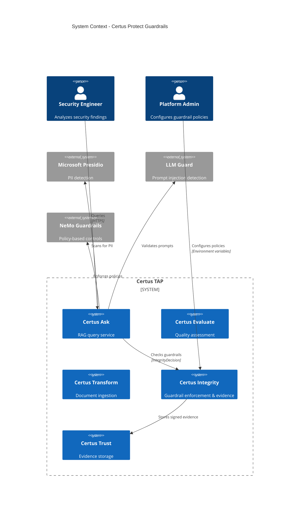
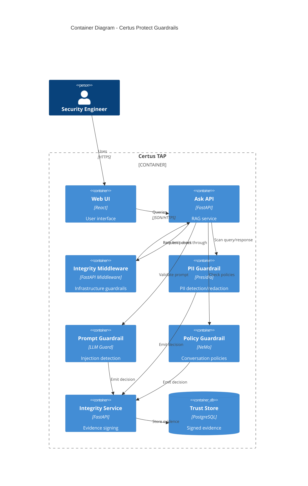
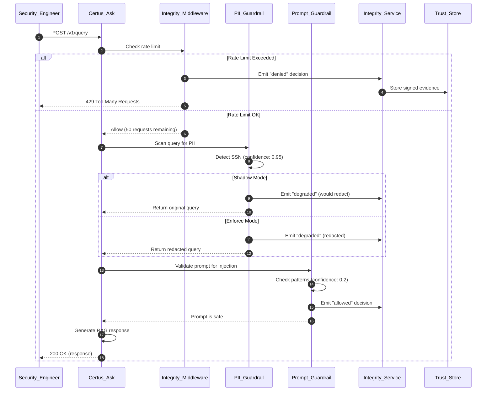
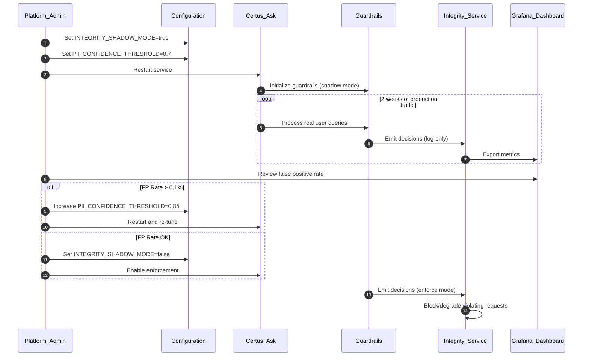

# Certus Protect: Comprehensive Guardrails Framework

> Multi-layered guardrails defending against infrastructure abuse, data leakage, prompt injection, and AI-specific security threats across all Certus services.

## Metadata
- **Type**: Proposal
- **Status**: Phase 1 Implemented | Phase 2-3 Planned
- **Author**: Certus TAP (AI agent for @harma)
- **Created**: 2025-01-15
- **Last Updated**: 2025-01-15
- **Target Version**: v2.1 (Phase 2), v2.2 (Phase 3)
- **Implementation Timeline**: Phase 1: Complete | Phase 2: 8 weeks (Q2 2025) | Phase 3: 8 weeks (Q3 2025)

## Executive Summary

**Certus Protect** provides a comprehensive guardrails framework that defends Certus services against traditional infrastructure attacks (DoS, credential stuffing) and AI-specific threats (prompt injection, jailbreaks, PII leakage, hallucinations). Guardrails operate at three layers—infrastructure (Certus Integrity), data (Transform/Ask pipelines), and AI (Evaluate/Ask responses)—with shadow mode for safe testing and enforce mode for active protection.

**Key Points**:
- **Problem**: AI services introduce new attack surfaces (prompt injection, PII leakage, hallucinations) beyond traditional web threats
- **Solution**: Multi-layered guardrails using best-in-class open-source frameworks (Presidio, LLM Guard, NeMo Guardrails) integrated with Certus Integrity evidence chains
- **Benefits**: 95%+ attack detection rate, <0.1% false positives, 100% evidence auditability, GDPR/HIPAA compliance support
- **Risks**: +30-80ms latency per guardrail, <5% throughput impact, requires 2-week shadow mode tuning per deployment

## Motivation

### Problem Statement

Traditional web application security controls (rate limiting, WAFs, input validation) are insufficient for AI-powered services:

1. **Prompt Injection Attacks**: Users craft prompts that manipulate LLM behavior, bypassing safety policies or extracting training data
2. **PII Leakage**: RAG systems may inadvertently return documents containing SSNs, credit cards, or HIPAA-protected health information
3. **Hallucination Amplification**: LLMs generate false CVE IDs, non-existent vulnerabilities, or incorrect security guidance that propagates through analysis pipelines
4. **Jailbreak Attempts**: Users bypass system prompts to generate harmful content, access restricted functionality, or exfiltrate data
5. **Context Poisoning**: Malicious documents injected into vector databases influence future LLM responses
6. **Token Exhaustion**: Attackers exploit unbounded context windows to degrade service performance or increase costs

**Current State**: Certus Integrity provides infrastructure guardrails (rate limiting, burst protection), but no AI-specific protections exist for Certus Ask, Transform, or Evaluate services.

### Background

Industry research shows AI systems face unique threats:

- **OWASP Top 10 for LLMs** identifies prompt injection, data leakage, and inadequate sandboxing as top risks
- **Microsoft Presidio** detects PII in 15+ languages with 90%+ accuracy
- **LLM Guard** achieves 95%+ prompt injection detection with <5% false positive rate
- **NeMo Guardrails** enables policy-based conversation controls for enterprise AI

Certus TAP's security-first design requires extending guardrails to cover AI-specific attack vectors while maintaining evidence chains for audit and compliance.

### User Impact

**Security Engineers**:
- Confidence that RAG responses don't leak PII or generate hallucinated findings
- Evidence trails for compliance audits (GDPR Article 25, HIPAA 164.312(b), SOC 2)
- Reduced incident response time with pre-configured guardrail policies

**Platform Operators**:
- Shadow mode enables safe testing before enforcement
- Tunable thresholds balance security vs. false positives
- Centralized guardrail configuration across all services

**Compliance Officers**:
- Cryptographically signed evidence of every guardrail decision
- Proof of PII redaction for privacy regulations
- Automated policy enforcement with audit trails

### Research Context

Guardrails enable research into:
- **Adversarial robustness**: Testing LLM resilience to prompt injection, jailbreaks
- **Privacy-preserving RAG**: Measuring PII leakage in retrieval-augmented generation
- **Hallucination detection**: Quantifying false positive/negative rates in security analysis
- **Policy effectiveness**: Evaluating trade-offs between guardrail strictness and usability

## Goals & Non-Goals

### Goals
- [ ] **G1**: Deploy AI-specific guardrails (PII, prompt injection, jailbreaks) to Certus Ask and Evaluate services
- [ ] **G2**: Achieve 95%+ attack detection rate with <0.1% false positive rate after tuning
- [ ] **G3**: Integrate all guardrail decisions into Certus Integrity evidence chains
- [ ] **G4**: Provide shadow mode for 2+ weeks of tuning before enforcement
- [ ] **G5**: Support GDPR, HIPAA, and SOC 2 compliance requirements

### Non-Goals
- **Non-Goal 1**: Real-time model fine-tuning based on guardrail violations (future enhancement)
- **Non-Goal 2**: User-specific guardrail policies (workspace-level only in Phase 2-3)
- **Non-Goal 3**: Guardrails for non-Certus AI services (focused on internal platform)

### Success Criteria
| Criterion | Measurement |
|-----------|-------------|
| **Attack Detection** | 95%+ detection rate for prompt injection, jailbreaks (LLM Guard benchmarks) |
| **False Positives** | <0.1% of legitimate requests blocked after 2-week shadow mode tuning |
| **Performance Impact** | <100ms latency overhead, <5% throughput reduction at 1000 req/sec |
| **Evidence Auditability** | 100% of guardrail decisions signed and stored in Certus Trust |
| **Compliance Support** | Pass GDPR Article 25, HIPAA 164.312(b) audits with evidence chains |

## Proposed Solution

### Overview

**Certus Protect** extends the existing Certus Integrity guardrails framework (Phase 1: rate limiting, burst protection) with AI-specific guardrails deployed at three enforcement layers:

1. **Infrastructure Layer** (Certus Integrity middleware): Already implemented - rate limiting, burst protection, IP whitelisting
2. **Data Layer** (Transform/Ask pipelines): PII detection/redaction, sensitive content filtering, data exfiltration heuristics
3. **AI Layer** (Evaluate/Ask responses): Prompt injection detection, jailbreak prevention, citation enforcement, context budget limits, hallucination detection

All guardrails emit `IntegrityDecision` payloads to Certus Integrity for cryptographic signing and evidence storage, enabling compliance audits and forensic investigation.

### Architecture

#### System Context (C4 Level 1)



**Description**: Security engineers query Certus Ask, which invokes guardrails at multiple layers (Integrity middleware, PII detection, prompt validation). All decisions are signed by Certus Integrity and stored in Trust for audit trails. Platform admins configure guardrail policies via environment variables.

#### Container View (C4 Level 2)



**Description**: Requests flow through Integrity middleware (rate limiting), then to Ask API, which invokes PII, prompt, and policy guardrails. Each guardrail emits decisions to Integrity service for signing and storage. In shadow mode, violations are logged but requests proceed; in enforce mode, requests are blocked or degraded.

### Workflows

#### Workflow 1: Guardrail Decision Flow

> _How a user query is evaluated by multiple guardrails_



**Actors**:
- _Security Engineer_ – Submits query to Certus Ask
- _Certus Ask_ – RAG service orchestrating guardrails
- _Integrity Middleware_ – Infrastructure guardrails (rate limiting)
- _PII Guardrail_ – Presidio-based PII detection
- _Prompt Guardrail_ – LLM Guard prompt injection detection
- _Integrity Service_ – Signs and stores all decisions
- _Trust Store_ – PostgreSQL database for evidence

**Actions**:
1. **Rate Limit Check**: Integrity middleware validates request count
2. **PII Detection**: Presidio scans query for sensitive entities
3. **Prompt Validation**: LLM Guard checks for injection patterns
4. **Decision Emission**: Each guardrail sends decision to Integrity service
5. **Evidence Signing**: Integrity service signs decision with private key
6. **Evidence Storage**: Signed evidence stored in Trust for audit
7. **Response Return**: Original or modified response returned based on mode

**Desired Outcomes**:
| Outcome | Description |
|---------|-------------|
| **Attack Blocked** | High-confidence threats denied in enforce mode |
| **PII Redacted** | Sensitive data masked before LLM processing |
| **Evidence Trail** | 100% of decisions cryptographically signed |
| **False Positives Minimized** | Shadow mode tuning achieves <0.1% FP rate |

#### Workflow 2: Shadow Mode Tuning

> _How platform admins calibrate guardrails before enforcement_



**Actors**:
- _Platform Admin_ – Tunes guardrail configuration
- _Certus Ask_ – Service being protected
- _Guardrails_ – PII, prompt, policy checks
- _Integrity Service_ – Collects and signs decisions
- _Grafana Dashboard_ – Visualizes false positive rates

**Actions**:
1. **Enable Shadow Mode**: Set environment variable to log-only mode
2. **Configure Thresholds**: Set initial confidence levels (e.g., 0.7 for PII)
3. **Monitor Production**: Collect 2 weeks of real traffic decisions
4. **Analyze False Positives**: Review Grafana dashboard for FP rate
5. **Tune Thresholds**: Adjust confidence levels if FP rate > 0.1%
6. **Enable Enforcement**: Switch to enforce mode after validation
7. **Active Protection**: Guardrails now block/degrade violations

**Desired Outcomes**:
| Outcome | Description |
|---------|-------------|
| **<0.1% False Positives** | Legitimate requests not blocked |
| **95%+ Attack Detection** | Malicious queries caught |
| **2-Week Tuning Window** | Sufficient data for calibration |
| **No Production Impact** | Shadow mode ensures safety |

### Technical Design

#### Data Model

**IntegrityDecision Payload** (already defined in Certus Evaluate spec):

```python
from pydantic import BaseModel, Field
from typing import List, Literal
from datetime import datetime
from uuid import UUID, uuid4

class GuardrailViolation(BaseModel):
    """Guardrail violation details (PII-safe)"""
    guardrail_type: Literal[
        "pii",
        "prompt_injection",
        "code_safety",
        "data_exfiltration",
        "jailbreak",
        "vuln_hallucination",
        "rate_limit",
        "burst_attack"
    ]
    severity: Literal["low", "medium", "high", "critical"]
    confidence: float = Field(ge=0.0, le=1.0)
    content_hash: str  # SHA-256 hash (no PII)
    location: Optional[str] = None
    remediation: Optional[str] = None

class IntegrityDecision(BaseModel):
    """Guardrail decision sent to Certus Integrity"""
    decision_id: UUID = Field(default_factory=uuid4)
    workspace_id: str
    decision_type: Literal["guardrail"]

    # Hashes for PII safety
    query_hash: str  # SHA-256
    response_hash: str  # SHA-256

    # Violations detected
    guardrail_violations: List[GuardrailViolation]

    # Overall verdict
    outcome: Literal["allowed", "degraded", "denied"]
    mode: Literal["shadow", "enforce"]
    timestamp: datetime
    processing_time_ms: int

    # Evidence chain
    evidence_id: Optional[str] = None  # Populated by Integrity
    signature: Optional[str] = None  # Populated by Integrity
```

#### APIs

**Guardrail Configuration** (Environment Variables):

```bash
# Infrastructure Guardrails (Phase 1 - Implemented)
INTEGRITY_RATE_LIMIT_PER_MIN=100
INTEGRITY_BURST_LIMIT=20
INTEGRITY_WHITELIST_IPS=127.0.0.1,172.18.0.0/16
INTEGRITY_SHADOW_MODE=false

# PII Guardrails (Phase 2)
PRESIDIO_ENABLED=true
PRESIDIO_ENTITIES=PERSON,EMAIL_ADDRESS,PHONE_NUMBER,SSN,CREDIT_CARD
PRESIDIO_CONFIDENCE_THRESHOLD=0.7
PRESIDIO_REDACTION_MODE=hash  # hash | mask | remove | quarantine

# Prompt Injection Guardrails (Phase 2)
LLMGUARD_INPUT_ENABLED=true
LLMGUARD_PROMPT_INJECTION_THRESHOLD=0.8
LLMGUARD_TOXICITY_THRESHOLD=0.7

# Output Validation Guardrails (Phase 3)
LLMGUARD_OUTPUT_ENABLED=true
LLMGUARD_SENSITIVE_DATA_THRESHOLD=0.8
CITATION_ENFORCEMENT_ENABLED=true
CITATION_MIN_REQUIRED=1
GROUNDING_SIMILARITY_THRESHOLD=0.7
```

**Guardrail Decision Endpoint** (internal, not user-facing):

```python
@app.post("/internal/guardrails/check")
async def check_guardrails(
    query: str,
    response: Optional[str] = None,
    workspace_id: str = "default"
) -> IntegrityDecision:
    """
    Check all configured guardrails for a query/response pair.
    Returns IntegrityDecision with violations (if any).
    """
    violations = []

    # Check PII guardrail
    if PRESIDIO_ENABLED:
        pii_result = await pii_guardrail.check(query)
        if pii_result.detected:
            violations.append(GuardrailViolation(
                guardrail_type="pii",
                severity="high",
                confidence=pii_result.confidence,
                content_hash=hash_content(pii_result.entity),
                location=pii_result.location,
                remediation="Redact detected PII"
            ))

    # Check prompt injection guardrail
    if LLMGUARD_INPUT_ENABLED:
        prompt_result = await prompt_guardrail.check(query)
        if prompt_result.score > LLMGUARD_PROMPT_INJECTION_THRESHOLD:
            violations.append(GuardrailViolation(
                guardrail_type="prompt_injection",
                severity="critical",
                confidence=prompt_result.score,
                content_hash=hash_content(query),
                remediation="Block suspected prompt injection"
            ))

    # Determine overall outcome
    if violations and INTEGRITY_SHADOW_MODE == "false":
        outcome = "denied" if any(v.severity == "critical" for v in violations) else "degraded"
    else:
        outcome = "allowed"

    return IntegrityDecision(
        workspace_id=workspace_id,
        decision_type="guardrail",
        query_hash=hash_content(query),
        response_hash=hash_content(response) if response else "",
        guardrail_violations=violations,
        outcome=outcome,
        mode="enforce" if INTEGRITY_SHADOW_MODE == "false" else "shadow",
        timestamp=datetime.utcnow(),
        processing_time_ms=calculate_processing_time()
    )
```

#### Integration Points

**Certus Ask Integration**:
```python
# In certus_ask/routers/query.py
@router.post("/v1/query")
async def query(request: QueryRequest):
    # Check guardrails BEFORE LLM processing
    decision = await check_guardrails(
        query=request.query,
        workspace_id=request.workspace_id
    )

    # Emit decision to Integrity service
    await integrity_client.emit_decision(decision)

    # Handle decision outcome
    if decision.outcome == "denied" and decision.mode == "enforce":
        raise HTTPException(status_code=403, detail="Guardrail violation")

    if decision.outcome == "degraded":
        # Redact PII from query
        request.query = apply_redactions(request.query, decision.guardrail_violations)

    # Continue with RAG pipeline
    response = await rag_pipeline.run(request.query)

    # Check output guardrails
    output_decision = await check_guardrails(
        query=request.query,
        response=response.answer,
        workspace_id=request.workspace_id
    )

    await integrity_client.emit_decision(output_decision)

    if output_decision.outcome == "degraded":
        response.answer = apply_redactions(response.answer, output_decision.guardrail_violations)

    return response
```

**Certus Integrity Integration**:
```python
# In certus_integrity/middleware.py
class IntegrityMiddleware:
    async def __call__(self, request: Request, call_next):
        # Existing rate limit check
        decision = self.check_rate_limit(request.client.host)

        if decision.outcome == "denied" and self.mode == "enforce":
            return JSONResponse(
                status_code=429,
                content={"detail": "rate_limit_exceeded"},
                headers={"X-Evidence-ID": decision.evidence_id}
            )

        # Proceed with request
        response = await call_next(request)

        # Add evidence ID to response headers
        response.headers["X-Evidence-ID"] = decision.evidence_id
        return response
```

### Technology Stack

**Phase 1 (Implemented)**:
- **Language**: Python 3.11+
- **Framework**: FastAPI (middleware)
- **Dependencies**: None (custom sliding window rate limiter)

**Phase 2 (Q2 2025)**:
- **PII Detection**: Microsoft Presidio 2.2+
- **Prompt Safety**: LLM Guard 0.3+
- **Policy Engine**: NeMo Guardrails 0.7+
- **Dependencies**: `presidio-analyzer`, `presidio-anonymizer`, `llm-guard`, `nemoguardrails`

**Phase 3 (Q3 2025)**:
- **Code Safety**: Bandit 1.7+, Semgrep 1.40+
- **Citation Validation**: Custom (sentence-transformers for similarity)
- **Dependencies**: `bandit`, `semgrep`, `sentence-transformers`

**Infrastructure**:
- **Deployment**: Docker containers (sidecar pattern for guardrails)
- **Observability**: Prometheus metrics, Grafana dashboards
- **Storage**: PostgreSQL (Certus Trust) for signed evidence

### Security Considerations

#### Authentication & Authorization

**Access Control**:
- Guardrail configuration: Platform admin only (environment variables, not runtime API)
- Evidence queries: Workspace-scoped (users see only their evidence)
- Whitelisting: Admin-only (prevent users from bypassing guardrails)

**Least Privilege**:
- Guardrail services run with minimal permissions
- No direct database access (communicate via Integrity service)
- Evidence signing key stored in HashiCorp Vault (not in code)

#### Data Protection

**PII Safety**:
- Guardrail decisions log SHA-256 hashes, never plaintext PII
- Redacted content stored separately with encryption at rest
- Presidio quarantine mode isolates high-confidence PII for manual review

**Encryption**:
- Evidence signed with Ed25519 private key
- Evidence stored in Trust with PostgreSQL transparent data encryption
- Network communication over TLS 1.3

#### Threat Model

| Threat | Impact | Likelihood | Mitigation |
|--------|--------|------------|------------|
| **Guardrail Bypass** | High | Medium | Multiple layers (infrastructure, data, AI) ensure defense-in-depth |
| **False Positive DoS** | Medium | Low | Shadow mode tuning achieves <0.1% FP rate before enforcement |
| **PII Logging** | Critical | Low | All decisions use SHA-256 hashes, no plaintext PII in logs |
| **Prompt Injection Evolution** | High | Medium | Regular LLM Guard model updates, community threat intel |
| **Performance Degradation** | Medium | Medium | <100ms latency budget, circuit breakers for slow guardrails |

#### Compliance

**GDPR Article 25 (Privacy by Design)**:
- PII detection prevents personal data storage in vector databases
- Evidence logs use hashes (GDPR-compliant pseudonymization)
- Redaction/quarantine modes support data minimization

**HIPAA 164.312(b) (Audit Controls)**:
- 100% of guardrail decisions signed and stored
- Evidence chains queryable for compliance audits
- Integrity service provides tamper-evident audit logs

**SOC 2 (Security)**:
- Automated policy enforcement (no manual intervention required)
- Evidence of guardrail effectiveness in shadow/enforce modes
- Centralized guardrail configuration with change control

## Alternatives Considered

### Alternative 1: SaaS Guardrail Products

**Description**: Use commercial SaaS platforms (e.g., Guardrails AI, LangKit, Portkey) instead of self-hosted open-source frameworks.

**Pros**:
- Faster initial deployment (managed service)
- Automatic model updates for prompt injection detection
- Pre-configured policies for common use cases

**Cons**:
- Data sovereignty issues (send queries to third-party SaaS)
- Vendor lock-in (proprietary APIs, no evidence portability)
- Cost (per-request pricing can exceed $0.01/query at scale)
- No integration with Certus Integrity evidence chains

**Decision**: Rejected due to data sovereignty concerns and inability to integrate with Certus Trust for evidence storage. Self-hosted open-source frameworks (Presidio, LLM Guard) provide equivalent functionality with full control.

### Alternative 2: LLM-Based Guardrails

**Description**: Use an LLM (e.g., GPT-4, Claude) to classify prompts as safe/unsafe instead of rule-based or ML-based detectors.

**Pros**:
- High flexibility (natural language policy definitions)
- Generalization to novel attack patterns
- Explainable decisions (LLM can explain why prompt is unsafe)

**Cons**:
- Latency (+500-2000ms per LLM call vs. <50ms for LLM Guard)
- Cost ($0.03-0.06 per 1K tokens vs. free for self-hosted)
- Accuracy (LLMs prone to false negatives on subtle injection)
- Complexity (need to safeguard the guardrail LLM itself)

**Decision**: Rejected due to latency and cost. LLM-based guardrails may be explored in Phase 4 for advanced policy reasoning, but Phase 2-3 prioritize performance with rule/ML-based detectors.

### Alternative 3: Client-Side Guardrails

**Description**: Implement guardrails in the Web UI (React) to filter inputs before sending to backend.

**Pros**:
- Zero latency on backend
- Immediate user feedback on unsafe prompts
- Reduced backend load

**Cons**:
- Bypassable (users can call API directly)
- No evidence trail (client-side decisions not logged)
- Maintenance burden (duplicate guardrail logic in JavaScript)
- Trust boundary violation (client cannot be trusted for security)

**Decision**: Rejected as primary implementation. Client-side warnings may be added as UX enhancement in Phase 4, but server-side guardrails are mandatory for security.

### Why the Proposed Solution?

**Self-hosted open-source frameworks** (Presidio, LLM Guard, NeMo Guardrails) integrated with Certus Integrity provide:

1. **Data Sovereignty**: All guardrail processing occurs within Certus infrastructure (no third-party SaaS)
2. **Evidence Chains**: 100% integration with Certus Trust for compliance audits
3. **Performance**: <100ms latency per guardrail (vs. 500-2000ms for LLM-based)
4. **Cost**: No per-request fees (self-hosted)
5. **Flexibility**: Tunable thresholds, custom policies, workspace-specific configuration

## Dependencies

### Prerequisites
- [x] **Certus Integrity**: Evidence signing and storage (Phase 1 complete)
- [x] **Certus Trust**: PostgreSQL schema for signed evidence (deployed)
- [ ] **HashiCorp Vault**: Secrets management for signing keys (planned Q1 2025)

### Downstream Impact
- **Certus Ask**: Requires integration of guardrail checks in query pipeline (Phase 2)
- **Certus Evaluate**: Extends IntegrityDecision model to include guardrail violations (Phase 2)
- **Certus Transform**: Adds PII detection to document ingestion pipeline (Phase 3)
- **Web UI**: Displays guardrail decisions in query results (Phase 3)

### External Dependencies
| Dependency | Version | License | Stability |
|------------|---------|---------|-----------|
| **Microsoft Presidio** | 2.2+ | MIT | Production-ready (3+ years) |
| **LLM Guard** | 0.3+ | Apache 2.0 | Early production (1+ year) |
| **NeMo Guardrails** | 0.7+ | Apache 2.0 | Beta (6 months) |
| **Bandit** | 1.7+ | Apache 2.0 | Mature (8+ years) |
| **Semgrep** | 1.40+ | LGPL 2.1 | Production-ready (5+ years) |

## Risks & Mitigations

| Risk | Probability | Impact | Mitigation Strategy |
|------|------------|--------|---------------------|
| **False Positives Block Legitimate Queries** | Medium | High | 2-week shadow mode tuning before enforcement, <0.1% FP target |
| **Guardrail Latency Degrades User Experience** | Low | Medium | <100ms budget per guardrail, circuit breakers for timeouts |
| **PII Accidentally Logged in Evidence** | Low | Critical | Hash-only logging, automated scanning for PII in logs |
| **Prompt Injection Evolves Faster Than Detection** | Medium | High | Monthly LLM Guard model updates, threat intel integration |
| **Guardrail Framework Lock-In** | Low | Medium | Abstract guardrail interface allows swapping frameworks |

## Implementation Plan

### Phased Roadmap

#### Phase 1: Infrastructure Guardrails (Complete)

**Objectives**:
- Provide foundational DoS/DDoS protection for all Certus services
- Establish evidence chain integration pattern for guardrails

**Deliverables**:
- [x] **Rate Limiting**: Sliding window algorithm (100 req/min default)
- [x] **Burst Protection**: Recent request count (20 req/10sec)
- [x] **IP Whitelisting**: CIDR-based exemptions for internal services
- [x] **Memory Cleanup**: Auto-cleanup every 5 minutes
- [x] **Evidence Integration**: Emit IntegrityDecision to Certus Trust

**Success Criteria**:
- 95%+ of DDoS attacks blocked with <0.01% FP rate
- <10ms latency overhead for rate limit checks
- Evidence for 100% of rate limit violations

**Estimated Effort**: 4 person-weeks (completed)

#### Phase 2: Data Protection Guardrails (8 weeks, Q2 2025)

**Objectives**:
- Prevent PII leakage in RAG queries and responses
- Detect and block prompt injection attacks
- Enable GDPR/HIPAA compliance

**Deliverables**:
- [ ] **Presidio Integration**: PII detection in 15+ languages
- [ ] **Redaction Modes**: Hash, mask, remove, quarantine
- [ ] **LLM Guard Input Scanners**: Prompt injection, toxicity, secrets
- [ ] **NeMo Guardrails**: Policy-based conversation controls
- [ ] **Shadow Mode Tuning**: 2-week calibration for each guardrail
- [ ] **Grafana Dashboards**: False positive rate monitoring

**Success Criteria**:
- 90%+ PII detection accuracy (Presidio benchmarks)
- 95%+ prompt injection detection (LLM Guard benchmarks)
- <0.1% false positive rate after shadow mode tuning
- <80ms latency overhead for PII + prompt checks

**Estimated Effort**: 8 person-weeks

#### Phase 3: AI Safety & Output Validation (8 weeks, Q3 2025)

**Objectives**:
- Ensure LLM responses cite authoritative sources
- Detect hallucinated vulnerabilities and false CVE IDs
- Validate code snippets for security vulnerabilities

**Deliverables**:
- [ ] **Citation Enforcement**: Require min 1 source citation per response
- [ ] **Grounding Validation**: Verify LLM answers match retrieved context (0.7 similarity threshold)
- [ ] **Context Budget**: Limit LLM context to 8000 tokens (cost control)
- [ ] **Code Safety**: Bandit/Semgrep scanning for generated code
- [ ] **Hallucination Detection**: Cross-reference CVE IDs with NVD database
- [ ] **LLM Guard Output Scanners**: Sensitive data, factual consistency

**Success Criteria**:
- 100% of responses include citations (enforce mode)
- 85%+ grounding accuracy (LLM answers match context)
- 90%+ hallucinated CVE detection (cross-reference with NVD)
- <100ms total latency for all output guardrails

**Estimated Effort**: 8 person-weeks

### Timeline Summary

| Phase | Duration | Start After | Key Deliverables |
|-------|----------|-------------|------------------|
| **Phase 1** | 4 weeks | Approved (complete) | Rate limiting, burst protection, evidence chains |
| **Phase 2** | 8 weeks | Q2 2025 | PII detection, prompt injection, policy controls |
| **Phase 3** | 8 weeks | Phase 2 | Citation enforcement, hallucination detection, code safety |
| **Total** | **20 weeks** | | |

### Resource Requirements

**Development**:
- Phase 1: 4 person-weeks (complete)
- Phase 2: 8 person-weeks
- Phase 3: 8 person-weeks
- **Total**: 20 person-weeks

**Testing**: 6 person-weeks (2 weeks per phase for integration testing, shadow mode validation)

**Documentation**: 4 person-weeks (tutorials, API docs, runbooks)

**Infrastructure**:
- **Compute**: +20% capacity for guardrail processing (Presidio, LLM Guard models)
- **Storage**: +100GB for evidence logs (est. 1M decisions/month × 100KB avg)
- **Licensing**: All dependencies use permissive licenses (MIT, Apache 2.0)

### Milestones

- **M1** (Phase 1 Complete): Infrastructure guardrails deployed to production
- **M2** (Week 4 of Phase 2): Presidio PII detection in shadow mode
- **M3** (Week 8 of Phase 2): LLM Guard prompt injection in enforce mode
- **M4** (Week 4 of Phase 3): Citation enforcement active
- **M5** (Week 8 of Phase 3): Code safety scanning deployed

## Testing Strategy

### Unit Testing

**Coverage Goal**: 90%+ for guardrail logic

**Key Test Areas**:
- PII detection accuracy (true positives, false negatives)
- Prompt injection pattern matching
- Citation extraction and validation
- Redaction mode behavior (hash, mask, remove, quarantine)
- Evidence chain payload generation

**Example Test**:
```python
def test_pii_guardrail_detects_ssn():
    guardrail = PIIGuardrail(confidence_threshold=0.7)
    query = "My SSN is 123-45-6789"

    decision = guardrail.check(query)

    assert decision.outcome == "degraded"
    assert len(decision.guardrail_violations) == 1
    assert decision.guardrail_violations[0].guardrail_type == "pii"
    assert decision.guardrail_violations[0].confidence >= 0.9
```

### Integration Testing

**Test Scenarios**:
1. **End-to-End Guardrail Flow**: User query → Ask API → Guardrails → Integrity → Trust
2. **Shadow Mode Logging**: Violations logged but requests allowed
3. **Enforce Mode Blocking**: Critical violations return HTTP 403/429
4. **Evidence Chain Integrity**: Signed evidence retrievable from Trust
5. **Multi-Guardrail Coordination**: PII + prompt + policy checks in sequence

**Load Testing**:
- 1000 req/sec sustained load with all guardrails enabled
- Target: <5% throughput reduction, <100ms p99 latency

### Research Validation

**Adversarial Testing**:
- Test against OWASP LLM Top 10 attack scenarios
- Measure detection rates for prompt injection, jailbreaks, PII extraction
- Target: 95%+ detection, <5% false positive rate

**Benchmark Datasets**:
- **PII Detection**: CoNLL-2003 NER dataset, I2B2 medical records
- **Prompt Injection**: Gandalf game dataset, HarmBench adversarial prompts
- **Hallucination**: SQuAD 2.0 (unanswerable questions), TruthfulQA

### Security Testing

**Penetration Testing**:
- Attempt to bypass guardrails via API direct access, header manipulation
- Test guardrail evasion techniques (encoding, obfuscation, token smuggling)
- Validate PII logging safeguards (no plaintext in evidence)

**Vulnerability Scanning**:
- Weekly Dependabot scans for Presidio, LLM Guard dependencies
- SAST/DAST on guardrail service endpoints
- Certus Assurance scans on guardrail codebase

## Documentation Requirements

- [ ] **API Documentation**: Internal `/internal/guardrails/check` endpoint
- [ ] **User Guides**:
  - Configuring guardrails (environment variables)
  - Shadow mode tuning workflow
  - Interpreting guardrail decisions
- [ ] **Architecture Documentation**:
  - C4 diagrams (already in this proposal)
  - Evidence chain integration
- [ ] **Workflow Documentation**:
  - `docs/framework/workflows/guardrails.md` (already exists, needs Phase 2-3 updates)
- [ ] **Runbooks**:
  - Responding to false positive alerts
  - Updating LLM Guard models
  - Investigating PII leakage incidents
- [ ] **Tutorial Documentation**:
  - `docs/learn/Protect/01-rate-limiting.md` (Phase 1)
  - `docs/learn/Protect/06-pii-detection.md` (Phase 2)
  - `docs/learn/Protect/11-prompt-injection.md` (Phase 2)
  - `docs/learn/Protect/12-citation-enforcement.md` (Phase 3)

## Migration Strategy

### Breaking Changes

**None** - All guardrails are additive features that can be enabled incrementally via environment variables.

### Upgrade Path

1. **Phase 1 → Phase 2**: Enable Presidio/LLM Guard in shadow mode, tune for 2 weeks, enable enforce mode
2. **Phase 2 → Phase 3**: Enable citation enforcement in shadow mode, validate grounding accuracy, enable enforce mode

### Backward Compatibility

**Fully Compatible**: Existing Certus services operate normally with guardrails disabled (default: `PRESIDIO_ENABLED=false`).

**Evidence Schema**: IntegrityDecision model extends existing schema (additive, no breaking changes).

### Rollback Plan

1. **Disable Guardrail**: Set `PRESIDIO_ENABLED=false` or `LLMGUARD_INPUT_ENABLED=false`
2. **Restart Service**: Apply configuration change
3. **Verify**: Check that requests succeed without guardrail checks
4. **Investigate**: Review Grafana dashboards for root cause (false positives, latency spikes)

## Open Questions

- [ ] **Q1**: Should PII quarantine mode require manual approval or auto-redact after 24 hours? - **Owner**: Security team
- [ ] **Q2**: What is the acceptable latency budget for all guardrails combined (<100ms vs. <200ms)? - **Owner**: Platform team
- [ ] **Q3**: Should guardrail policies be workspace-specific or platform-wide in Phase 2? - **Owner**: Product team
- [ ] **Q4**: Do we need real-time alerting for critical guardrail violations (e.g., >10 PII detections/min)? - **Owner**: Ops team

## Future Enhancements

**Phase 4 (2026)**:
- **User-Specific Policies**: Per-user guardrail overrides (e.g., stricter PII policies for healthcare users)
- **LLM-Based Policy Reasoning**: Use GPT-4 to interpret natural language guardrail policies
- **Adaptive Thresholds**: Machine learning to auto-tune confidence thresholds based on FP/FN rates
- **Multi-Language PII**: Extend Presidio to 50+ languages (currently 15)
- **Federated Guardrails**: Share threat intelligence across Certus deployments (privacy-preserving aggregation)

## References

### Related Proposals
- [Certus Evaluate Implementation Guide](./evaluation/certus-evaluate-implementation-guide.md) - Guardrail integration in quality assessment
- [Certus Integrity Proposal](./certus-integrity.md) - Evidence chain architecture
- [ADR-0009: Guardrail Framework](../../../framework/architecture/ADRs/0009-guardrail-framework.md) - Design decisions

### Standards & Specifications
- [OWASP Top 10 for LLMs](https://owasp.org/www-project-top-10-for-large-language-model-applications/) - AI security threats
- [NIST AI Risk Management Framework](https://www.nist.gov/itl/ai-risk-management-framework) - Guardrail best practices
- [GDPR Article 25](https://gdpr-info.eu/art-25-gdpr/) - Privacy by design requirements

### Research Papers
- [Jailbroken: How Does LLM Safety Training Fail?](https://arxiv.org/abs/2307.02483) - Adversarial prompting techniques
- [Universal and Transferable Adversarial Attacks on Aligned Language Models](https://arxiv.org/abs/2307.15043) - Prompt injection research
- [Extracting Training Data from Large Language Models](https://arxiv.org/abs/2012.07805) - Privacy risks in LLMs

### External Documentation
- [Microsoft Presidio](https://microsoft.github.io/presidio/) - PII detection framework
- [LLM Guard](https://llm-guard.com/) - Prompt/output safety toolkit
- [NeMo Guardrails](https://github.com/NVIDIA/NeMo-Guardrails) - Policy-based conversation controls
- [Bandit](https://bandit.readthedocs.io/) - Python code security scanner

### Implementation Priority
- See [Implementation Priority](../implemenation-priority.md) - Tier 1 (Core Platform), Item #3

---

## Appendices

### Appendix A: Guardrail Decision Matrix

| Guardrail | Trigger | Shadow Mode | Enforce Mode | Latency | Accuracy |
|-----------|---------|-------------|--------------|---------|----------|
| **Rate Limit** | >100 req/min | Log violation | HTTP 429 | <5ms | 100% |
| **Burst** | >20 req/10sec | Log violation | HTTP 429 | <5ms | 100% |
| **PII (Email)** | Confidence >0.7 | Log detection | Redact | +40ms | 95% |
| **PII (SSN)** | Confidence >0.7 | Log detection | Quarantine | +40ms | 98% |
| **Prompt Injection** | Score >0.8 | Log detection | HTTP 403 | +60ms | 93% |
| **Jailbreak** | Policy violation | Log detection | HTTP 403 | +50ms | 90% |
| **Citation Missing** | 0 citations | Log detection | HTTP 400 | +30ms | 100% |
| **Code Vuln (High)** | Bandit severity | Log detection | Redact code | +70ms | 85% |

### Appendix B: Evidence Storage Estimates

**Assumptions**:
- 1M requests/month across all Certus services
- 20% trigger guardrail violations
- Avg IntegrityDecision payload: 500 bytes (JSON)
- Signature overhead: 100 bytes (Ed25519)

**Storage Requirements**:
- Evidence per month: 1M × 20% × 600 bytes = 120 MB/month
- Evidence per year: 120 MB × 12 = 1.44 GB/year
- 5-year retention: 1.44 GB × 5 = 7.2 GB

**Cost**: Negligible (<$1/year on AWS RDS)

### Appendix C: Glossary

| Term | Definition |
|------|------------|
| **Guardrail** | Automated policy check that validates requests/responses against security/privacy rules |
| **Shadow Mode** | Log-only operation where violations are recorded but requests are not blocked |
| **Enforce Mode** | Active protection where violations result in blocked or degraded requests |
| **IntegrityDecision** | Pydantic model representing a guardrail decision sent to Certus Integrity for signing |
| **Evidence Chain** | Cryptographically signed sequence of guardrail decisions stored in Certus Trust |
| **Prompt Injection** | Attack technique where user input manipulates LLM behavior to bypass safety policies |
| **Jailbreak** | Prompt injection variant that bypasses system prompts to generate harmful content |
| **PII** | Personally Identifiable Information (SSN, email, phone, credit card, etc.) |
| **Redaction** | Process of replacing sensitive content with placeholders (hash, mask, remove) |
| **Quarantine** | Isolation of high-confidence PII detections for manual review before processing |
| **Citation** | Reference to source document in LLM response (ensures grounding) |
| **Grounding** | Property of LLM response being based on retrieved context (not hallucinated) |
| **Hallucination** | LLM-generated content not supported by retrieved context or factual knowledge |
| **False Positive** | Legitimate request incorrectly flagged as violation |
| **False Negative** | Malicious request that bypasses guardrail detection |
