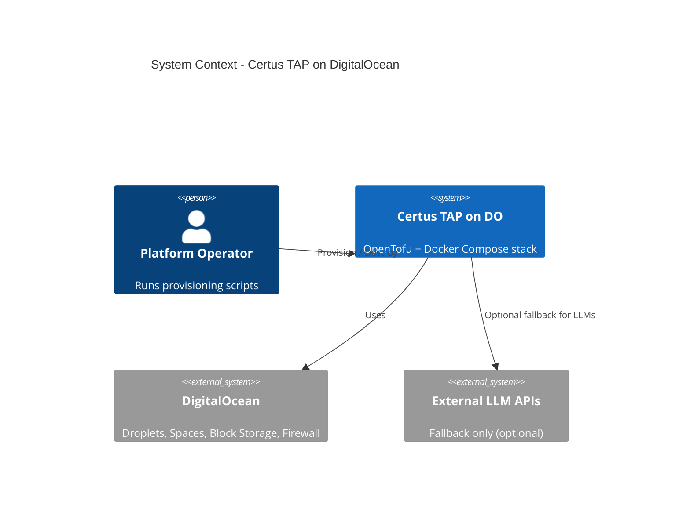
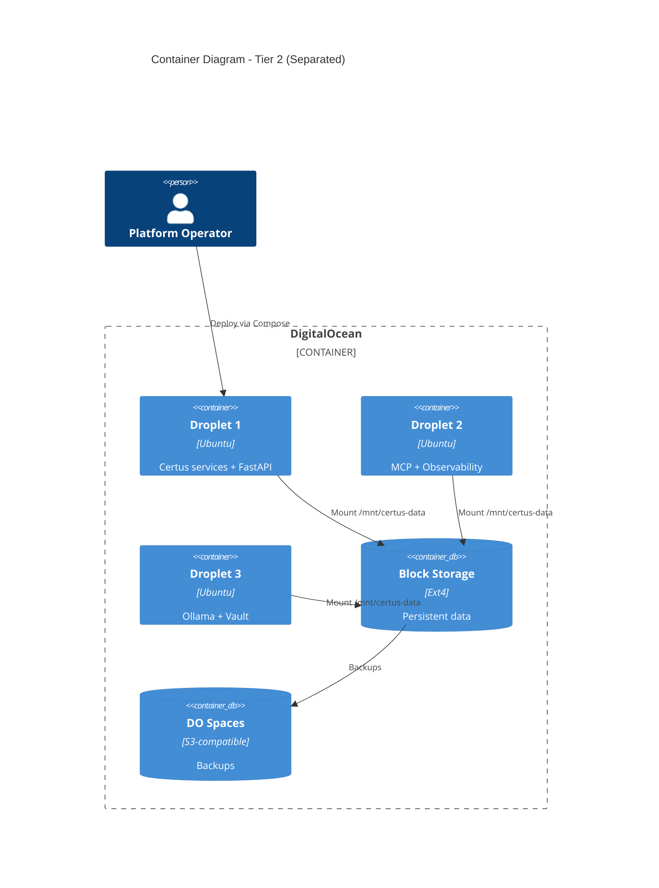
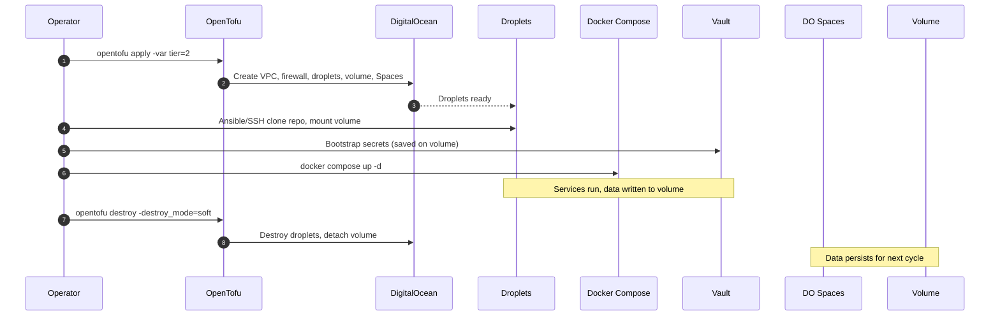

# Certus TAP Deployment: DigitalOcean Immutable Stack

> Define the default deployment blueprint for running the full Certus TAP platform on DigitalOcean using OpenTofu + Docker Compose with soft/hard destroy modes.

## Metadata
- **Type**: Proposal
- **Status**: Draft
- **Author**: Certus TAP Team
- **Created**: 2025-12-14
- **Last Updated**: 2025-12-14
- **Target Version**: v2.0
- **Implementation Timeline**: 6 weeks (phased)

## Executive Summary

Certus TAP requires a reproducible, cost-aware deployment pattern that any team can spin up without relying on Kubernetes or bespoke cloud stacks. This proposal specifies the canonical DigitalOcean (DO) deployment: OpenTofu provisions droplets, volumes, Spaces, VPCs, and firewalls; Docker Compose orchestrates Certus services, MCP servers, observability stack, Vault, and Ollama-based LLMs. The architecture embraces immutable infrastructure with two destroy modes—**soft destroy** (compute rebuilt, persistent data reattached) and **hard destroy** (full wipe).

**Key Points**:
- **Problem**: No reference deployment for running Certus TAP end-to-end on commodity cloud; ad-hoc VMs lead to drift, fragile secrets management, and unpredictable costs.
- **Solution**: An OpenTofu + Docker Compose blueprint with tiered droplet layouts, persistent block storage, DO Spaces backups, Vault-managed secrets, and local Ollama LLMs.
- **Benefits**: Repeatable cluster spin-up, predictable spend (destroy when idle), data persists across rebuilds, secrets stay out of git/state files.
- **Risks**: Additional tooling (Vault, OpenTofu) to operate, provisioning time (~30 minutes) unless snapshots/registries are introduced, DigitalOcean feature coverage varies by region.

## Motivation

### Problem Statement
- Teams lack a documented, automated path to stand up Certus TAP outside Docker Desktop.
- Secrets frequently end up in `.env` files committed to git or Terraform state.
- Infrastructure is either overkill (Kubernetes) or under-managed (manual droplets).
- Without a destroy-friendly model, DO resources accumulate cost even when unused.

### Background
Prior internal deployments used ad-hoc droplets or docker-compose on laptops for demos. As the platform expands (security workflow, Sovereign AI Learning Platform), we need a shared cloud environment pattern: automated provisioning, repeating destroy/build cycles, cost transparency, and room for future managed services. DigitalOcean fits the target user base (simple UI, predictable pricing) and already hosts supporting assets (Spaces, Container Registry). This proposal precedes higher-level initiatives so all future work references a common deployment substrate.

### User Impact
- **Platform Operators**: Consistent IaC to build/destroy stacks with two commands; secrets centralized in Vault.
- **Contributors**: Clear instructions for running integration tests or demos on DO without Kubernetes expertise.
- **Finance/Ops**: Predictable month-to-month costs with tagging and destroy workflows that cap idle spend.

### Research Context
Even though this is a production-style deployment, researchers benefit from immutable cycles (spin up, run experiments, destroy) and from local Ollama models for zero-cost LLM queries.

## Goals & Non-Goals

### Goals
- [ ] Publish an OpenTofu module set that provisions DO droplets, block storage, Spaces, VPC, firewall, Reserved IPs in region `sfo3`.
- [ ] Split Docker Compose into modular files (services, MCP, observability, infra, Ollama, Vault) with a single entrypoint orchestrator.
- [ ] Document **soft destroy** and **hard destroy** procedures, including persistence expectations.
- [ ] Provide tiered droplet layouts (Tier 1 minimal, Tier 2 separated, Tier 3 managed services) with cost estimates so operators can pick.
- [ ] Standardize secrets management on self-hosted Vault (persisted on block storage) and integrate it with Compose startup.
- [ ] Include local Ollama LLM hosting (models stored on block storage) with pre-pull automation.

### Non-Goals
- **Geo-redundancy**: Only single-region (sfo3) deployments are in scope.
- **24/7 HA**: No load balancers or multi-droplet clustering; environment is intended for controlled runs.
- **Kubernetes Migration**: Compose remains the orchestrator; no K8s/ECS.

### Success Criteria
| Criterion | Measurement |
|-----------|-------------|
| OpenTofu reproducibility | `opentofu apply` provisions Tier 1 or Tier 2 stack without manual edits; destroy reclaims droplets.
| Persistence guarantees | After soft destroy/reprovision, OpenSearch/Postgres/Vault data and Ollama models reappear intact.
| Secrets hygiene | No secrets checked into git or Terraform state; Vault integration verified.
| Cost transparency | Docs include cost tables and tagging guidance; operators can estimate monthly spend per tier.

## Proposed Solution

### Overview
1. **Infrastructure-as-Code (OpenTofu)**: Modules for networking, droplets, block storage, Spaces, optional managed OpenSearch/Postgres. Region pinned to `sfo3`.
2. **Docker Compose Modular Stack**: `docker-compose.yml` includes `services`, `mcp`, `observability`, `infra`, `ollama`, `vault`. Compose networks align with DO VPC.
3. **Persistent Storage**: A single DO Block Storage volume (120GB Tier 1 / 220GB Tier 2) mounted at `/mnt/certus-data` storing OpenSearch, Postgres, VictoriaMetrics, Redis persistence, Vault data, and Ollama models.
4. **Secrets Management**: Vault container (persisted) holds all service credentials; bootstrap script seeds Vault and renders `.env`/Compose secrets at deploy time.
5. **LLM Layer**: Ollama container exposes `http://certus-ollama:11434`; models (llama3.1:8b, codellama:7b, mistral:7b) pre-pulled during provisioning and stored on the shared volume.
6. **Destroy Modes**: Soft destroy detaches block storage + Spaces (data retained) and wipes droplets; hard destroy wipes everything including volumes/Spaces for clean-slate testing.
7. **Backups**: Daily DO Spaces backups of OpenSearch snapshots, Postgres dumps, Vault data; rotation rules (7 daily, 4 weekly) enforced by scripted lifecycle policy.

### Architecture

#### System Context (C4 Level 1)


#### Container View (C4 Level 2)


### Workflows

#### Workflow 1: Provision → Deploy → Destroy (Soft)


#### Workflow 2: Hard Destroy
Same as above, but `opentofu destroy -destroy_mode=hard` issues `doctl`/API calls to delete the block storage volume and (optionally) purge Spaces backups.

### Technical Design

#### Data Model / Persistence Map
| Component | Location | Persists After Soft Destroy? | Notes |
|-----------|----------|------------------------------|-------|
| OpenSearch data | `/mnt/certus-data/opensearch` | Yes | Repopulated instantly on rebuild |
| PostgreSQL data | `/mnt/certus-data/postgres` | Yes | Supports Vault-generated creds |
| VictoriaMetrics | `/mnt/certus-data/victoria` | Yes | Retains research metrics |
| Redis persistence | `/mnt/certus-data/redis` | Optional | Can be disabled if not needed |
| Vault data | `/mnt/certus-data/vault` | Yes | Contains sealed state |
| Ollama models | `/mnt/certus-data/ollama` | Yes | Avoids re-download |
| Backups | DO Spaces bucket | Configurable | Daily + weekly rotation |

#### APIs / Automation Interfaces
- **OpenTofu variables**: `tier`, `destroy_mode`, `region` (default `sfo3`), `ssh_key_ids`, `spaces_credentials`, `vault_root_token_file`.
- **Provision scripts**: Ansible or shell scripts mount block storage, install Docker, clone repo, seed Vault, pull Compose images, pre-download Ollama models via `docker exec ollama ollama pull ...`.
- **Backup script**: Cron-triggered shell script runs nightly inside Droplet 2 or a lightweight utility container, using `s3cmd` (Spaces-compatible) to sync compressed dumps.

#### Integration Points
- **Certus services** (`certus_ask`, `certus_assurance`, etc.) rely on environment variables that now load from Vault at container start.
- **MCP servers** share the same Compose network and read Vault-managed tokens.
- **Ollama** binds to `certus-internal` network; Goose profiles point to `http://certus-ollama:11434`.
- **scripts/preflight.sh** gains awareness of DO-specific health checks (volume mounted, Vault unsealed, Ollama models present).

### Technology Stack
- **Infrastructure**: OpenTofu 1.8+, DigitalOcean provider 2.x, DO CLI (`doctl`) for snapshots/destroy helpers.
- **Runtime**: Docker 26+, Docker Compose v2 includes file includes.
- **Secrets**: Vault (OSS) container, persisted on block storage.
- **Backup tooling**: `s3cmd` or `rclone` for Spaces, `cron` for scheduling.
- **LLM**: Ollama container (latest), models `llama3.1:8b`, `codellama:7b`, `mistral:7b`.

### Security Considerations

#### Authentication & Authorization
- DO Cloud Firewall restricts inbound traffic to SSH (from operator IP), HTTPS (external), and Ollama only within VPC.
- Vault stores all service secrets; Compose files reference Vault tokens; `.env` contains only non-sensitive config.
- SSH key auth only; passwords disabled.

#### Data Protection
- Block storage encrypted at rest (DO-managed).
- Spaces bucket enforces server-side encryption (SSE-S3) and limited access keys.
- Backups compressed and optionally encrypted using age/GPG before upload.

#### Threat Model
| Threat | Impact | Likelihood | Mitigation |
|--------|--------|------------|------------|
| Secrets leakage via git/state | High | Medium | Vault-backed secrets, `.env` templates with placeholders, Terraform backend encryption |
| Residual data after destroy | Medium | Low | Hard destroy procedure wipes volumes + buckets |
| Unauthorized SSH access | High | Low | Cloud firewall IP allow-list, SSH keys only, fail2ban optional |
| LLM exposure | Medium | Low | Ollama runs on private network; fallback cloud LLMs require explicit env vars |

#### Compliance
- Auditable because OpenTofu state + Spaces backups provide evidence of provisioning history.
- Supports ingest of sensitive datasets without leaving DO boundary thanks to local LLMs and Vault.

### Research Considerations
- Rebuilding from soft destroy ensures reproducibility (same data, fresh compute).
- Hard destroy mode documents clean-slate runs for experiments.

## Alternatives Considered

### Alternative 1: Kubernetes (DOKS)
**Pros**: Managed control plane, autoscaling.
**Cons**: Higher cost, more complexity than needed, duplicates Compose definitions. **Decision**: Rejected.

### Alternative 2: AWS/Azure reference stack
**Pros**: Broader feature set, geo options.
**Cons**: Higher operational overhead, diverges from current contributor base using DO. **Decision**: Rejected for initial blueprint.

### Alternative 3: Pulumi instead of OpenTofu
**Pros**: Imperative logic, strong TypeScript/Python integration.
**Cons**: Smaller DO ecosystem, secrets stored in Pulumi Cloud unless self-hosted, steeper learning curve. **Decision**: Stick with OpenTofu.

## Dependencies

### Prerequisites
- [ ] DO account with API token, Spaces access keys, SSH keys uploaded.
- [ ] Internal agreement on tagging/billing conventions.
- [ ] Vault usage decision (approved as of this proposal).

### Downstream Impact
- Future proposals (e.g., Sovereign AI Learning Platform) reference this deployment for their infrastructure assumptions.
- Docs/readme must link to this blueprint; onboarding scripts depend on Vault and Compose structure described here.

### External Dependencies
- DigitalOcean services (Droplets, VPC, Spaces, Block Storage) availability in `sfo3`.
- Ollama container image hosting (Docker Hub) – consider mirroring if bandwidth issues arise.

## Risks & Mitigations
| Risk | Probability | Impact | Mitigation |
|------|------------|--------|------------|
| Provisioning time (~30m) too long | Medium | Medium | Provide DO Snapshot workflow + optional Container Registry to speed rebuilds |
| Vault adds operational overhead | Medium | Medium | Supply bootstrap scripts, store unseal keys securely, document recovery |
| Block storage failure | Low | High | Spaces backups + optional DO snapshots |
| Cost overruns from idle volumes | Medium | Low | Document ongoing costs ($12 volume + $1.20 backups) even when destroyed; add billing alerts |

## Implementation Plan

### Phase 1 (2 weeks): OpenTofu Modules + Tier Definitions
- Deliver networking, droplets, volume, Spaces modules.
- Document Tier 1 (single droplet) and Tier 2 (separated) layouts with cost tables.

### Phase 2 (2 weeks): Compose & Vault Integration
- Split Compose files; add Vault + Ollama containers.
- Author bootstrap scripts (Vault init/unseal, env rendering) and preflight checks.

### Phase 3 (2 weeks): Docs, Destroy Modes, Backups
- Write operator guides (soft/hard destroy, cost tracking, tagging).
- Implement Spaces backup scripts + lifecycle rules, failover tests.

**Total**: 6 weeks (overlapping documentation/testing as needed).

## Testing Strategy
- Automated `opentofu apply/destroy` runs in CI with DO sandbox account.
- Scripted soft destroy validation (data persists) and hard destroy validation (data wiped).
- Compose smoke tests (services healthy, Vault unsealed, Ollama inference test) baked into `scripts/preflight.sh`.

## Documentation Requirements
- [ ] `docs/reference/roadmap/proposals/digitalocean-deployment-proposal.md` (this doc).
- [ ] Operator guide under `docs/learn/platform/digitalocean.md` (how-to with commands).
- [ ] Updates to `docs/framework/workflows/` describing provision/destroy flows.
- [ ] Runbook for Vault recovery and Spaces backup restoration.

## Migration Strategy

### Breaking Changes
- Existing ad-hoc DO deployments must migrate data to new block storage layout; manual steps required once.

### Upgrade Path
1. Provision new stack using OpenTofu modules.
2. Migrate data (rsync or snapshot attach) into `/mnt/certus-data` paths.
3. Cut traffic over to new stack; destroy old droplets.

### Backward Compatibility
- Compose definitions remain compatible with local Docker Desktop usage (Vault optional via env flag).

### Rollback Plan
- If deployment fails, destroy stack and re-attach block storage to last known-good snapshot; re-run apply.

## Open Questions
- [ ] Should we adopt DO Container Registry to reduce image pull time? – **Owner**: DevOps
- [ ] Preferred method for storing Vault unseal keys (DO Secrets vs. SOPS)? – **Owner**: Security
- [ ] Minimum set of Ollama models to pre-load? – **Owner**: AI/ML

## Future Enhancements
- Integrate DO Managed OpenSearch/Postgres as Tier 3 once costs justified.
- Add optional Grafana Cloud hookup for persistent dashboards after destroy.
- Automate DO snapshot creation post-successful deploy for faster rebuilds.

## References
- [Proposal Submission Guide](../proposal-submission.md)
- [OpenTofu Documentation](https://opentofu.org/docs/)
- [DigitalOcean Provider](https://registry.terraform.io/providers/digitalocean/digitalocean/latest/docs)
- [Docker Compose Include](https://docs.docker.com/compose/multiple-compose-files/)

## Appendices

### Appendix A: Tier Summary & Cost Table
| Tier | Layout | Estimated Monthly Cost (24/7) | Notes |
|------|--------|-------------------------------|-------|
| Tier 1 | 1× 8vCPU/16GB droplet + 120GB volume + Spaces | ~$108 | All services + Ollama on one droplet |
| Tier 2 | 3× 4vCPU/8GB droplets + 220GB volume + Spaces | ~$170 | Services, observability, Ollama/Vault separated |
| Tier 3 | Tier 2 + Managed OpenSearch + Managed Postgres | ~$320 | Use only when stability outweighs cost |

*(Actual spend lower when using soft destroy; block storage + Spaces cost ~$13/month even when compute off.)*

### Appendix B: Compose File Layout
```
docker-compose.yml
├── include docker-compose.services.yml
├── include docker-compose.mcp.yml
├── include docker-compose.observability.yml
├── include docker-compose.infra.yml (Postgres, Redis)
├── include docker-compose.ollama.yml
└── include docker-compose.vault.yml
```

### Appendix C: Destroy Mode Behavior
| Mode | Droplets | Block Storage | Spaces | Use Case |
|------|----------|---------------|--------|----------|
| Soft | Destroyed | Detached & preserved | Preserved | Day-to-day rebuilds |
| Hard | Destroyed | Deleted | Optional purge | Clean-slate testing / cost reset |
