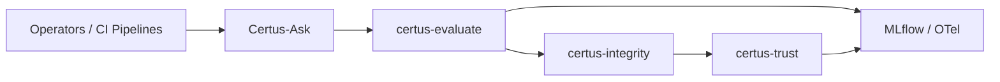
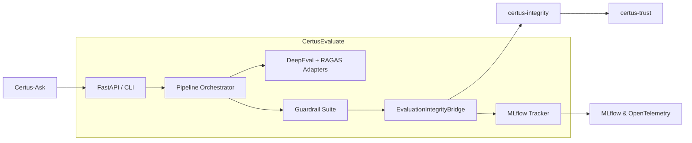
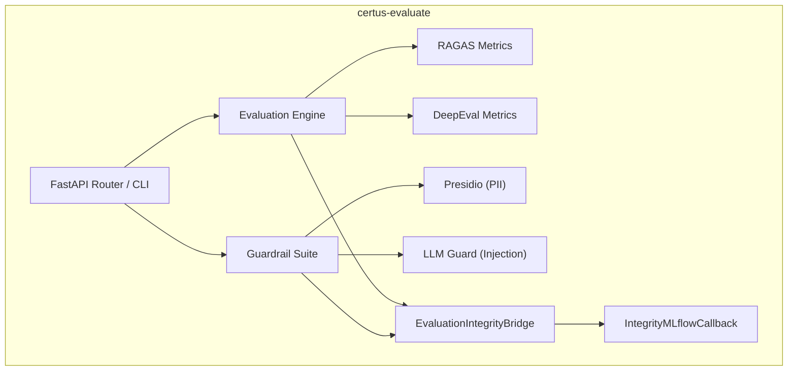
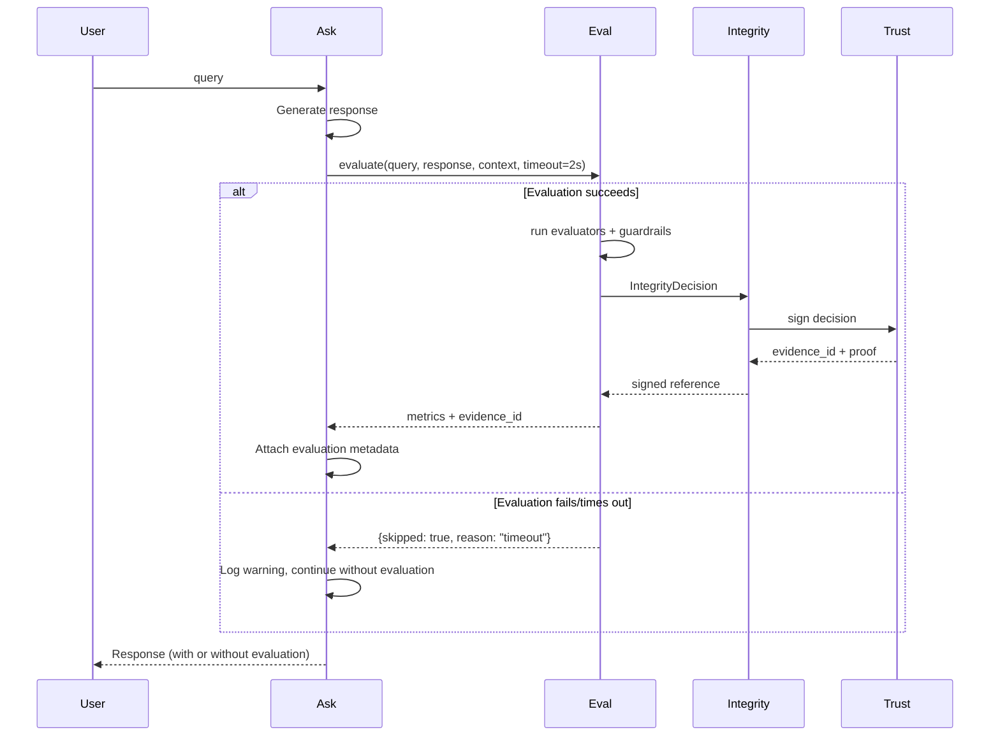
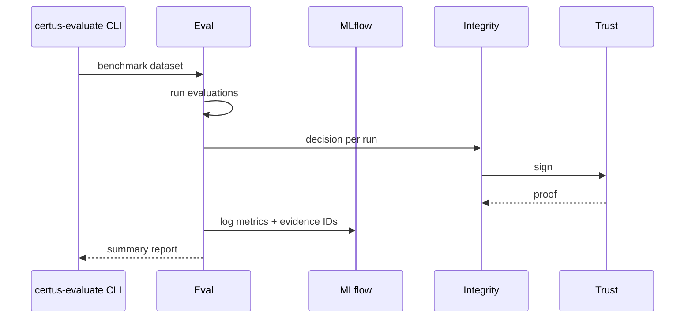

# Certus-Evaluate Service & Guardrail Platform

> Introduce a dedicated evaluation service (`certus-evaluate`) and guardrail framework that scores every RAG response (DeepEval/RAGAS), emits signed evidence via certus-integrity/trust, and enforces manifest-driven quality thresholds across Certus TAP.

## Metadata

- **Type**: Proposal
- **Status**: Draft
- **Author**: Certus TAP (AI agent for @harma)
- **Created**: 2024-11-15
- **Last Updated**: 2024-12-21
- **Target Version**: v0.9 (TBD)
- **Implementation Timeline**: 10–12 weeks (3 phases)

## Executive Summary

Certus TAP currently focuses on ingesting and transforming security evidence, but our RAG experiences (Certus-Ask and future agent workflows) still rely on ad-hoc evaluation logic. This proposal introduces `certus-evaluate`: a modular service + library that runs DeepEval/RAGAS metrics, Haystack validators, and security guardrails (prompt injection, PII leakage, code safety, data exfiltration, jailbreak detection, vulnerability hallucination). Every evaluation produces an `IntegrityDecision` routed through certus-integrity and signed by Certus-Trust, creating a cryptographically verifiable quality record for every response, regression test, or CI benchmark.

**Key Points**:

- **Problem**: No consistent, auditable gating of RAG responses; guardrails are duplicated across services; no MLflow/OTel linkage to signed evidence.
- **Solution**: Build `certus-evaluate` as a separate module/service with Haystack components, CLI, MLflow tracker, and integrity bridge. Integrate with certus-ask pipelines via optional wrappers. Store metrics + evidence in MLflow/OpenTelemetry.
- **Benefits**: Deterministic quality enforcement, reproducible experiments, defensible audit trail, shared guardrail framework for future domains (medical/legal/etc.).
- **Risks**: Heavy dependencies (DeepEval/RAGAS, Presidio) inflate footprints; misconfigured thresholds could block valid responses; integrating inline might increase latency.
- **Mitigations**: Optional deployment (shadow mode by default), separate module keeps dependencies isolated, manifest-defined thresholds allow per-workspace tuning.

## Motivation

### Problem Statement

- Lack of consistent evaluation/guardrail enforcement across Certus-Ask, CI benchmarks, and future agents.
- No end-to-end provenance linking RAG quality results to signed evidence, MLflow runs, and telemetry.
- Quality regressions go unnoticed until users complain; no automated blocking of hallucinated or unsafe responses.
- Guardrail implementations (prompt-injection checks, PII detection) are duplicated and ad-hoc.

### Background

- Prior discussions defined how certus-integrity should sign evaluation outputs (see certus-evaluate architecture docs, new ADRs 0007–0010).
- Certus-Ask uses Haystack; we already identified natural insertion points for validators and guardrails.
- Certus-Assurance demonstrates the pattern of manifest-driven workflows; we want the same for evaluation (manifests define thresholds).

### User Impact

- **Security Engineers / Operators**: Receive higher-quality responses and immediate evidence when guardrails trigger; can trust dashboards showing signed metrics.
- **Researchers**: Gain reproducible benchmarks, MLflow experiments tied to evidence IDs, easier A/B testing.
- **Compliance / Audit Teams**: Get cryptographically signed records proving AI responses met policy thresholds (faithfulness, relevancy, PII leakage, etc.).

### Research Context

- Enables experimentation with multi-model ensembles, prompt engineering, retrieval quality analysis, and dataset curation with measurable, signed metrics.
- Provides baseline metrics for studying new evaluation techniques without rewriting infrastructure.

## Goals & Non-Goals

### Goals

- [ ] Deliver `certus-evaluate` service + Python package (CLI + FastAPI) that produces signed evaluation evidence.
- [ ] Integrate with Certus-Ask via REST API with graceful degradation (evaluation optional and non-blocking).
- [ ] Implement guardrail validators (prompt injection, PII leakage, code safety, data exfiltration, jailbreak, vulnerability hallucination) that emit `IntegrityDecision`s.
- [ ] Integrate MLflow + OpenTelemetry logging with evidence IDs and manifest references.
- [ ] Support manifest-driven thresholds and policies across evaluation + guardrails.

### Non-Goals

- **Fine-grained UI tooling**: Dashboards/UX beyond MLflow/OpenSearch are not part of this proposal.
- **Model training**: We are not training evaluators or LLMs; we rely on existing frameworks (DeepEval/RAGAS, etc.).
- **Complete Ask refactor**: Certus-Ask remains mostly unchanged aside from optional wrappers/config toggles.

### Success Criteria

| Criterion                  | Measurement                                                                  |
| -------------------------- | ---------------------------------------------------------------------------- |
| **Non-blocking operation** | Certus-Ask p99 latency unchanged when evaluation times out or fails          |
| **Shadow coverage**        | 100% of Certus-Ask responses attempt evaluation in shadow mode               |
| **Graceful degradation**   | 99.9% of Ask requests succeed even when evaluate service is down             |
| **MCP readiness**          | API uses resource URIs and stateless operations compatible with MCP patterns |
| **Auditability**           | MLflow runs + OpenTelemetry traces reference evidence IDs when available     |

## Proposed Solution

### Overview

Create `certus-evaluate` as a standalone module + service that:

- Runs evaluations using DeepEval and RAGAS frameworks for RAG-specific quality metrics.
- Executes security guardrails (prompt injection, PII, code safety, exfiltration, jailbreak, vulnerability hallucination).
- Emits `IntegrityDecision` payloads via an `EvaluationIntegrityBridge` to certus-integrity/certus-trust.
- Exposes REST API + CLI commands for integration with Certus-Ask, CI regression testing, and benchmarking.
- Logs metrics/params/artifacts to MLflow (with evidence references) and emits OpenTelemetry spans for monitoring.

### Architecture

#### System Context (C4 Level 1)



**Description**: Requests originate from Certus-Ask or CI automation. certus-evaluate produces decisions and forwards them to certus-integrity/trust for signing; metrics/evidence references land in MLflow + OpenTelemetry.

#### Container View (C4 Level 2)



**Description**: The service consists of a FastAPI layer/CLI, pipeline orchestrator (Haystack-aware), evaluator adapters, guardrail suite, and the integrity bridge. It communicates with certus-integrity/trust for signing and MLflow/OTel for observability.

#### Component Design



### Workflows

#### Workflow 1: Inline Evaluation with Graceful Degradation (Certus-Ask)



#### Workflow 2: CI Benchmark / CLI



### Technical Design

#### Data Model

```python
class EvaluationResult(BaseModel):
    test_id: str
    workspace_id: str
    evidence_id: str
    deepeval_score: float
    ragas_faithfulness: float
    ragas_relevancy: float
    guardrail_violations: list[str]
    manifest_id: str
    shadow_mode: bool
```

#### APIs

**Primary Endpoint** (MCP-ready design):

```http
POST /v1/evaluate
Content-Type: application/json

{
  "workspace_id": "acme",
  "query": "What is Certus?",
  "response": "...",
  "context": ["doc chunk"],
  "manifest_uri": "certus://manifests/acme/2025-01",
  "mode": "shadow",
  "timeout_ms": 2000
}
```

**Success Response** (200 OK):

```json
{
  "evaluation_id": "eval_abc123",
  "passed": true,
  "evidence_id": "dec_abc123",
  "metrics": {
    "deepeval": 0.82,
    "faithfulness": 0.79,
    "relevancy": 0.75
  },
  "guardrails": [],
  "processing_time_ms": 1847
}
```

**Degraded Response** (200 OK - evaluation skipped):

```json
{
  "evaluation_id": null,
  "skipped": true,
  "reason": "evaluator_timeout",
  "evidence_id": null,
  "metrics": {},
  "guardrails": []
}
```

**Error Response** (503 Service Unavailable):

```json
{
  "error": "evaluation_service_unavailable",
  "message": "Evaluation service is temporarily unavailable",
  "fallback": "Response generated without quality evaluation",
  "retry_after_ms": 30000
}
```

**Async Mode** (202 Accepted):

```json
{
  "evaluation_id": "eval_abc123",
  "status": "pending",
  "status_uri": "/v1/evaluate/eval_abc123/status",
  "estimated_completion_ms": 5000
}
```

#### Authorization for Threshold Overrides

- Threshold overrides via `thresholds_override` field require `workspace:admin` scope
- Regular evaluation calls only need `workspace:read` scope
- Manifest-defined thresholds are trusted; overrides are logged and audited

#### Integration Points

- **certus-ask**:
  - Calls certus-evaluate via REST API (external service, non-blocking)
  - Config toggles for evaluation mode (shadow/enforce/disabled)
  - Circuit breaker client for graceful degradation
  - Note: Certus-Ask uses Haystack for RAG pipelines; certus-evaluate is a separate service
- **certus-integrity**: Receives `IntegrityDecision` objects via HTTP/async client, forwards to certus-trust
- **certus-trust**: Signs evaluation evidence, stores proofs in transparency log
- **MLflow / OpenTelemetry**: Logging of metrics, params, evidence references, span attributes
- **Assurance Manifests**: Provide thresholds, guardrail policies, storage targets referenced by evaluation logs

### Technology Stack

- **Language**: Python 3.11+
- **API Framework**: FastAPI (REST API + async support)
- **Evaluation Frameworks**:
  - **RAGAS**: RAG-specific metrics (faithfulness, answer relevancy, context precision/recall)
  - **DeepEval**: LLM-based evaluation and testing framework
- **Guardrail Frameworks**: Microsoft Presidio (PII detection), LLM Guard (prompt injection/jailbreak), NeMo Guardrails
- **Observability**: MLflow (experiment tracking), OpenTelemetry SDK (tracing/metrics)
- **Integration**: certus-integrity client, certus-trust SDK
- **Infrastructure**: Containerized service (Docker/K8s), optional GPU nodes for LLM-based evaluators, S3-compatible storage for evidence bundles

### Resilience & Graceful Degradation

**Design Principle**: Certus-Ask MUST function fully when certus-evaluate is unavailable, degraded, or disabled.

#### Failure Modes & Handling

| Scenario                     | Certus-Ask Behavior                                   | Evidence/Logging                                 |
| ---------------------------- | ----------------------------------------------------- | ------------------------------------------------ |
| Evaluate service unreachable | Continue without evaluation; log warning              | Emit OTel span with `evaluation.skipped=true`    |
| Evaluate timeout (>2s)       | Return response; run evaluation async in background   | Background job logs evidence after response sent |
| Evaluate returns error       | Continue; log error with request ID                   | Error details in OTel, no blocking               |
| Shadow mode                  | Always continue regardless of scores                  | Log all metrics/violations without blocking      |
| Enforce mode + failure       | Continue (failsafe: prefer availability over quality) | Alert ops team, auto-fallback to shadow          |

#### Circuit Breaker Pattern

- **Threshold**: 3 consecutive failures or 50% error rate over 1 minute
- **Behavior**: Open circuit → skip evaluation calls for 30s
- **Recovery**: Half-open → test with single request → close if successful
- **Configuration**: Manifest-driven per workspace

#### Client-Side Implementation

```python
# Certus-Ask integration (pseudocode)
async def get_response_with_evaluation(query, context):
    response = await generate_response(query, context)

    # Non-blocking evaluation
    try:
        eval_task = asyncio.create_task(
            evaluate_response(query, response, context, timeout=2.0)
        )
        eval_result = await asyncio.wait_for(eval_task, timeout=2.5)
        response.metadata["evaluation"] = eval_result
    except (asyncio.TimeoutError, ConnectionError, EvaluationError) as e:
        logger.warning(f"Evaluation skipped: {e}")
        response.metadata["evaluation"] = {"skipped": True, "reason": str(e)}

    return response  # Always return, evaluation optional
```

### MCP Migration Readiness

**Future Direction**: All Certus services will migrate to Model Context Protocol (MCP). The evaluation API is designed for seamless transition.

#### MCP-Compatible Design Principles

1. **Tool-Oriented Interface**: Evaluation exposed as MCP tools/resources, not just REST endpoints
2. **Stateless Operations**: No session requirements; each evaluation is self-contained
3. **Resource Naming**: Follow MCP resource URI patterns (`certus://evaluate/{workspace_id}/evaluations/{eval_id}`)
4. **Streaming Support**: Design for streaming evaluation results (partial metrics, progressive guardrails)

#### API Design for MCP Compatibility

**Current REST API** (Phase 1-3):

```http
POST /v1/evaluate
Content-Type: application/json

{
  "workspace_id": "acme",
  "query": "What is Certus?",
  "response": "...",
  "context": ["doc chunk"],
  "manifest_uri": "certus://manifests/acme/2025-01"
}
```

**MCP Tool Mapping** (Future Phase 4):

```json
{
  "tool": "certus_evaluate",
  "arguments": {
    "workspace_id": "acme",
    "query": "What is Certus?",
    "response": "...",
    "context": ["doc chunk"],
    "manifest_uri": "certus://manifests/acme/2025-01"
  }
}
```

**MCP Resource Access**:

```
certus://evaluate/acme/evaluations/{eval_id}
certus://evaluate/acme/guardrails/latest
certus://evaluate/acme/thresholds
```

#### Implementation Strategy

- **Phase 1-3**: REST API + Python SDK (current proposal)
- **Phase 4** (post-v1.0): Add MCP server adapter wrapping existing evaluation engine
  - Expose `certus_evaluate` tool
  - Expose evaluation results as MCP resources
  - Support MCP sampling for LLM-based evaluators
  - Maintain REST API for backwards compatibility

#### Key Design Decisions for MCP

- **Use resource URIs instead of IDs**: `manifest_uri` instead of `manifest_id` prepares for MCP resource model
- **Avoid session state**: Each evaluation call is independent (no `/start`, `/continue`, `/finish` patterns)
- **Support streaming**: Design data models to support partial/progressive results
- **Tool composition**: Guardrails as separate tools that can be composed by MCP clients

### Security Considerations

- **Authentication**: Same auth model as Certus-Ask (JWT/OIDC). Evaluation endpoints require workspace-scoped tokens.
- **Data Protection**: Responses/context processed in-memory; optional redact/anonymize when logging. Evidence stored via certus-integrity/trust.
- **Threat Model**:
  | Threat | Impact | Likelihood | Mitigation |
  |--------|--------|------------|------------|
  | Prompt injection bypassing guardrails | Medium | Medium | Layered detectors (LLM Guard + regex + manifest allowlists) |
  | Evaluation outputs leaking PII | Medium | Low | Presidio scanning before logging; manifest controls for logging scopes |
  | DoS via heavy evaluators | Medium | Medium | Rate limits, worker pools, optional async job queue, circuit breakers |
  | Tampered thresholds | High | Low | Thresholds signed via manifests; certus-integrity rejects unsigned overrides |
  | Malicious manifests with impossible thresholds | Medium | Low | Manifest validation with threshold sanity checks (0.0-1.0 range, required fields) |
  | Evaluation service compromise leading to forged evidence | High | Low | Service runs in isolated namespace; evidence signing uses HSM/KMS; integrity chain validation |
  | Timing attacks revealing PII through latency | Low | Low | Constant-time evaluation where feasible; random jitter added to response times |

### Research Considerations

- **Reproducibility**: MLflow + evidence bundle ensures each experiment’s parameters + metrics + signed proof are preserved.
- **Metrics**: DeepEval, RAGAS metrics, guardrail violation counts, latency histograms.
- **Experiments**: Prompt tuning, retrieval tuning, multi-model ensembles, guardrail threshold analysis.
- **Data Collection**: Evaluation metrics and guardrail decisions stored with anonymized queries/responses where required.

## Alternatives Considered

### Alternative 1: Embed evaluation logic in certus-integrity

- **Pros**: Single service; fewer network hops.
- **Cons**: Heavy dependencies bloating integrity deployments, slower startup, less modular.
- **Decision**: Rejected; prefer separation of concerns (ADR-0008).

### Alternative 2: Rely on third-party guardrail SaaS for evaluation + enforcement

- **Pros**: Faster initial rollout, outsourced maintenance.
- **Cons**: Data residency issues, limited customization, no signed evidence integration, vendor lock-in.
- **Decision**: Rejected; we require cryptographic provenance and manifest-driven policies.

### Why the Proposed Solution?

- Aligns with existing architecture (manifests, TrustCentre).
- Keeps evaluation optional yet reusable across services.
- Balances SaaS vs self-hosted needs via modular design.

## Dependencies

### Prerequisites

- [ ] Manifest thresholds defined for target workspaces.
- [ ] certus-integrity client stable (v0.3 or later).
- [ ] MLflow + OpenTelemetry environments available.

### Downstream Impact

- **Certus-Ask**: Gains REST API client for evaluation service; must expose config toggles for evaluation mode (shadow/enforce/disabled).
- **Assurance Manifests**: Need evaluation sections (thresholds, guardrail policies).
- **Docs**: Update architecture, workflows, runbooks.

### External Dependencies

- DeepEval, RAGAS, Presidio, LLM Guard, NeMo Guardrails, MLflow.

## Risks & Mitigations

| Risk                           | Probability | Impact | Mitigation                                                              |
| ------------------------------ | ----------- | ------ | ----------------------------------------------------------------------- |
| Latency increase for Ask       | Medium      | Medium | Shadow mode default, ability to run evaluations async, caching contexts |
| Dependency conflicts           | Medium      | Medium | Separate module/service; optional extras in pyproject                   |
| Guardrail false positives      | Medium      | Medium | Shadow rollout, allowlists, manifest-tunable thresholds                 |
| Evidence spam / storage growth | Low         | Medium | Evidence GC policies, configurable retention                            |

## Implementation Plan

### Phase 1: Foundations (4 weeks)

**Objectives**: Build certus-evaluate service, DeepEval/RAGAS integration, integrity bridge, MLflow logging.
**Deliverables**:

- [ ] FastAPI/CLI service with REST API endpoints
- [ ] Evaluation Engine with direct DeepEval and RAGAS integration
- [ ] EvaluationIntegrityBridge + MLflow callback
- [ ] REST API client for Certus-Ask with circuit breaker pattern
- [ ] Shadow-mode integration with Certus-Ask (config flag, graceful degradation)
      **Success Criteria**: API returns evaluation metrics + evidence IDs in shadow mode; Certus-Ask works fully when evaluate service is unavailable.

### Phase 2: Guardrail Suite (3 weeks)

**Objectives**: Implement guardrails (prompt injection, PII, code safety, exfiltration, jailbreak, vuln hallucination) with shadow/enforce modes.
**Deliverables**:

- [ ] Guardrail components + tests
- [ ] Manifest threshold ingestion
- [ ] OpenTelemetry spans for guardrail decisions
      **Success Criteria**: Guardrail violations logged with evidence IDs; manifests can override thresholds.

### Phase 3: Deployment & Tooling (3–5 weeks)

**Objectives**: Productionize deployment models, CI benchmarks, docs/runbooks.
**Deliverables**:

- [ ] Compose/K8s manifests
- [ ] CI benchmark CLI workflow + artifacts
- [ ] Docs (architecture, workflows, runbooks)
      **Success Criteria**: certus-evaluate running in at least one environment; CI regression gate using evaluations.

### Timeline Summary

| Phase   | Duration | Start After | Deliverables                       |
| ------- | -------- | ----------- | ---------------------------------- |
| Phase 1 | 4 wks    | Approval    | Service + API + shadow integration |
| Phase 2 | 3 wks    | Phase 1     | Guardrails + manifest thresholds   |
| Phase 3 | 3–5 wks  | Phase 2     | Deployments, CI tooling, docs      |

## Testing Strategy

- **Unit Tests**: Evaluator adapters, guardrail logic, integrity bridge.
- **Integration Tests**: certus-ask pipeline with evaluation enabled (shadow/enforce); MLflow logging; trust signing round-trip.
- **Performance**: Measure added latency; stress test evaluation concurrency.
- **Security**: Validate guardrail coverage, run dependency scans, fuzz API inputs.
- **Research validation**: Compare baseline vs new prompts using signed evaluation evidence.

## Documentation Requirements

- [ ] Update `docs/framework/architecture/certus-evaluate/*`.
- [ ] Add workflow doc for “Evaluated Ask Requests”.
- [ ] Runbook for enabling/disabling evaluation per workspace.
- [ ] API reference for `/v1/evaluate`, CLI usage.

## Migration Strategy

- **Breaking Changes**: None; evaluation opt-in with shadow default.
- **Upgrade Path**:
  1. Deploy certus-evaluate in shadow mode.
  2. Enable config flags per workspace; monitor dashboards.
  3. Switch to enforce for specific workspaces when thresholds validated.
- **Rollback**: Disable evaluation flag; service can be scaled to zero without affecting Ask.

## Open Questions

- [ ] **[P0, Phase 1]** What is acceptable evaluation timeout for inline mode (2s? 5s?)? – **Owner:** Performance Team
- [ ] **[P0, Phase 1]** Should circuit breaker state be per-workspace or global? – **Owner:** Architecture
- [ ] **[P1, Phase 2]** How should we surface guardrail failures to end users (custom message vs generic)? – **Owner:** Product
- [ ] **[P2, Phase 3]** Do we need GPU workers for certain evaluators? – **Owner:** Infra
- [ ] **[P2, Phase 3]** Should evaluation evidence be stored in the same raw/golden buckets as Assurance artifacts? – **Owner:** Data Team
- [ ] **[P3, Phase 4]** MCP migration timeline - align with other Certus services? – **Owner:** Architecture

## Future Enhancements

- **Phase 4: MCP Migration**: Expose evaluation as MCP tools/resources while maintaining REST compatibility
- **Model ensemble voting**: automatically choose best model per query based on evaluation scores
- **Cost-aware routing**: use evaluation metrics to optimize retrieval depth / model choice
- **Domain-specific profiles**: medical/legal manifest profiles with custom evaluators
- **Streaming evaluation**: Progressive guardrail checks during response generation (real-time blocking)

## References

- [System Landscape](../../architecture/system-landscape.md)
- [Assurance Manifests Architecture](../../architecture/assurance-manifests/)
- [ADR-0007](../../architecture/ADRs/0007-deployment-topologies.md)
- [ADR-0008](../../architecture/ADRs/0008-separate-evaluate-and-integrity.md)
- [ADR-0009](../../architecture/ADRs/0009-guardrail-framework.md)
- [ADR-0010](../../architecture/ADRs/0010-observability-strategy.md)
- DeepEval, RAGAS, Microsoft Presidio, LLM Guard documentation

## Appendices

_(None at this time)_
