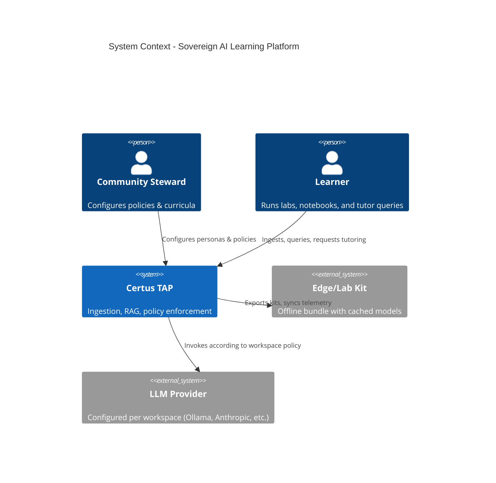
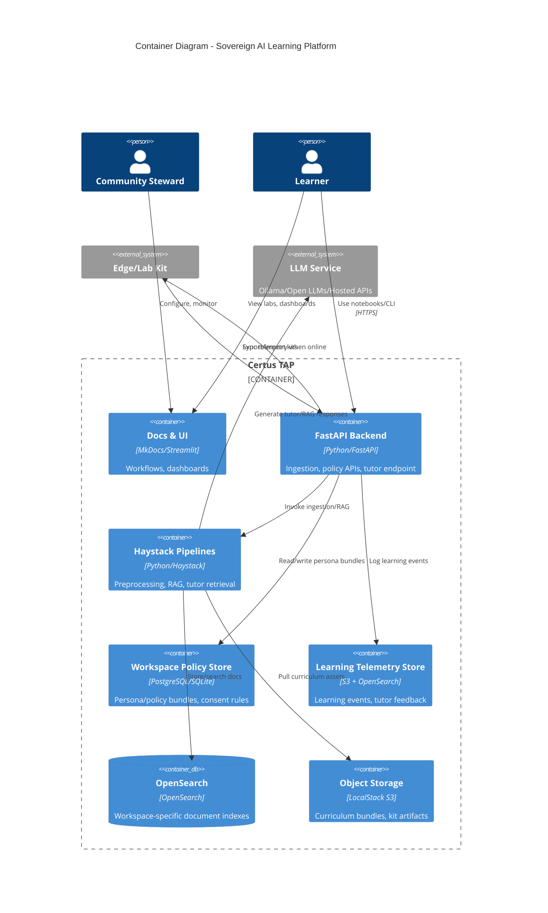
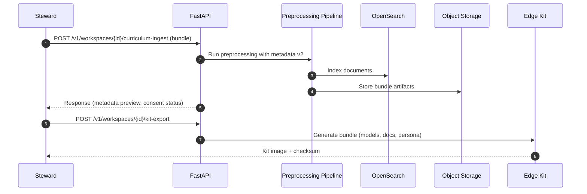
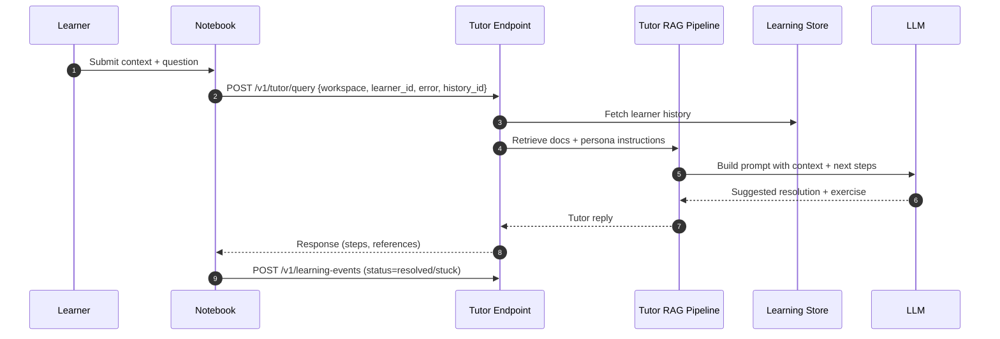

# :material-pencil-outline: Sovereign AI Learning Platform :material-pencil-outline: Draft

> Elevate Certus TAP into a configurable learning and governance substrate for any community seeking sovereign control over AI adoption.

## Metadata

- **Type**: Proposal
- **Status**: Draft
- **Author**: Certus TAP Team
- **Created**: 2025-12-14
- **Last Updated**: 2025-12-14
- **Target Version**: v2.0
- **Implementation Timeline**: 22 weeks (phased)

## Executive Summary

Certus TAP currently showcases a security-analyst workflow, yet the underlying ingestion and RAG architecture is agnostic enough to power many assurance-centric learning experiences. This proposal codifies a roadmap for transforming Certus TAP into the **Sovereign AI Learning Platform**—a toolkit that lets any displaced or underserved community (Indigenous Nations, rural schools, labor unions, NGOs) configure their own ethics guardrails, curricula, personas, and offline lab kits without forking the stack.

The plan introduces workspace-scoped persona/policy bundles, culturally aware metadata envelopes, curriculum packaging pipelines, offline/edge export tooling, and a retrieval-grounded tutor agent. Together, these unlock reproducible “Labs in a Box” that teach ethical AI usage while preserving data sovereignty and provenance.

**Key Points**:

- **Problem**: Certus TAP ships with security-centric prompts, schemas, and guardrails that make it hard to serve other communities or ethical guidelines without code edits.
- **Solution**: Layer configurable personas, metadata, ingestion presets, tutor services, and telemetry on top of the existing FastAPI/Haystack stack so each workspace becomes a sovereign AI lab.
- **Benefits**: Faster onboarding for new verticals, reproducible curricula, policy-driven guardrails, offline-ready kits, auditable learning progress, and a reusable tutor agent.
- **Risks**: Additional complexity in configuration management, higher operational load (per-workspace policies), dependency on LLM quality for the tutor, and need for robust consent enforcement to avoid data misuse.

## Motivation

### Problem Statement

- Tenants outside security (medical, legal, education, Indigenous sovereignty) cannot tailor prompts, metadata, or guardrails without modifying code.
- There is no structured way to capture learning progress, consent states, or curriculum lineage inside metadata envelopes.
- Offline or low-connectivity deployments (e.g., “Lab in a Box”) need deterministic exports, embeddings, and health checks that today’s scripts do not provide.
- Learners lack in-product coaching—errors during ingestion or guardrail checks force them back to static documentation.

### Background

Certus TAP already abstracts ingestion sources (files, repos, SARIF, web) and isolates tenants through OpenSearch workspaces and metadata envelopes. Privacy logging via Presidio provides a baseline guardrail for PII. Current proposals and documentation, however, emphasize security scanning workflows, security-flavored prompts, and SARIF/SPDX adapters. Emerging initiatives like “AI Sovereignty Lab in a Box” require the same substrate but with culturally anchored curricula, consent-aware metadata, and offline-first ergonomics. Rather than spin up bespoke stacks, we can evolve Certus TAP to serve as the common learning substrate.

### User Impact

- **Community Stewards / Program Architects**: Configure personas, consent policies, curricula, and offline exports without editing Python code.
- **Learners (Youth, Researchers, Practitioners)**: Use notebooks/workshops backed by the same ingestion/query APIs while getting guided feedback from the tutor agent.
- **Elders / Subject-Matter Experts**: Review and approve artifacts via governance dashboards, ensuring cultural or ethical protocols are honored.
- **Platform Operators**: Maintain one codebase while supporting multiple sovereign workspaces, each with custom guardrails and telemetry.

### Research Context

- Enables experiments on ethical AI pedagogy (how guardrails affect learning outcomes).
- Allows comparative studies across communities (e.g., Indigenous vs. rural schools) while preserving data sovereignty.
- Provides instrumentation for studying agent coaching effectiveness, guardrail adherence, and offline deployment resiliency.

## Goals & Non-Goals

### Goals

- [ ] **Workspace Personas**: Allow each workspace to define prompt templates, allowed tools, and RAG instructions without code changes.
- [ ] **Metadata Envelope v2**: Extend envelopes with consent, curriculum, and governance fields while maintaining backward compatibility.
- [ ] **Curriculum & Story Pipelines**: Provide ingestion presets for lesson bundles, audio transcripts, and language-tagged archives.
- [ ] **Offline/Edge Kits**: Ship export + preflight tooling that prepares ruggedized devices with cached models, datasets, and health attestation.
- [ ] **Learning Telemetry & Tutor Agent**: Capture structured learning events and expose a retrieval-grounded tutor endpoint for coaching.
- [ ] **Policy Dashboards & Reports**: Surface per-workspace ethics compliance (consent coverage, reviewer approvals, guardrail incidents).

### Non-Goals

- **Replace Security Workflow**: Security ingestion remains supported; this proposal generalizes rather than replaces it.
- **Create a Full LMS**: We integrate with notebooks/docs but do not build grading, enrollment, or credentialing systems.
- **Mandate Specific Communities**: The platform is sovereign by design—no cultural narrative is hard-coded; example bundles remain optional.

### Success Criteria

| Criterion               | Measurement                                                                                                                   |
| ----------------------- | ----------------------------------------------------------------------------------------------------------------------------- |
| Persona Configurability | Workspace admins can update prompts/policies via API and see changes reflected in RAG responses without redeploying services. |
| Metadata Coverage       | ≥90% of new ingestions carry consent + curriculum metadata validated by automated checks.                                     |
| Offline Kit Validation  | `scripts/preflight.sh --kit` passes on a disconnected device, verifying cached models, datasets, and policy bundles.          |
| Tutor Adoption          | ≥70% of onboarding sessions route at least one question through the tutor agent with positive (“resolved”) feedback.          |
| Governance Reporting    | Dashboards list reviewer approvals/consent states for every workspace, with exportable audit logs.                            |

## Proposed Solution

### Overview

The Sovereign AI Learning Platform layers five capabilities onto Certus TAP:

1. **Persona & Policy Bundles**: JSON/YAML configs stored per workspace describing prompts, allowed tools, consent rules, and compliance hooks, dynamically loaded by FastAPI routers and Haystack pipelines.
2. **Metadata Envelope v2**: Augments existing envelopes with domain-neutral fields (e.g., `domain`, `document_type`, `consent_state`, `lesson_stage`, `ethics_code_id`). Validation occurs during ingestion.
3. **Curriculum & Story Pipelines**: New ingestion adapters for lesson packs (MkDocs bundles, notebooks), audio → text (Whisper integration), and language tagging to support story archives.
4. **Offline/Edge Tooling**: Export scripts that bundle embeddings, docs, personas, and models onto kits plus a “kit preflight” mode that runs health checks offline.
5. **Learning Telemetry & Tutor Agent**: New services/endpoints to log learning events, power dashboards, and feed a retrieval-augmented tutor agent that references the documentation corpus + learner history.

### Architecture

#### System Context (C4 Level 1)



**Description**: Community stewards configure persona/policy bundles inside Certus. Learners interact via API/UI/notebooks. Edge kits are prepared/exported from Certus for offline delivery and later sync back. Certus invokes approved LLM endpoints per workspace when serving tutor/RAG responses.

#### Container View (C4 Level 2)



**Description**: FastAPI orchestrates ingestion, tutor, and export operations while persisting policies and telemetry. Haystack pipelines continue to embed/query content but now read per-workspace personas and metadata rules. Edge kits run a trimmed stack that syncs with the central system when connectivity permits.

### Workflows

#### Workflow 1: Curriculum Bundle Ingestion & Kit Export

> _Steward uploads a curriculum pack, validates metadata, and exports an offline kit._



**Desired Outcomes**:
| Outcome | Description |
|---------|-------------|
| **Validated Metadata** | Bundle must include consent + lesson tags before indexing. |
| **Kit Integrity** | Export produces signed manifest + preflight script. |
| **Reusability** | Kit image can be flashed to multiple devices. |

#### Workflow 2: Tutor Agent Coaching Loop

> _Learner encounters an error, requests coaching, and logs resolution._



**Desired Outcomes**:
| Outcome | Description |
|---------|-------------|
| **Actionable Guidance** | Response references specific docs/commands. |
| **Progress Tracking** | Learning event stored with lesson_stage + resolution. |
| **Escalation Hooks** | If learner marks “still stuck”, notify steward. |

### Technical Design

#### Data Model

```python
class MetadataEnvelopeV2(MetadataEnvelope):
    domain: str | None = None
    document_type: str | None = None
    consent_state: Literal["granted", "revoked", "restricted", "pending"] = "pending"
    consent_expires_at: datetime | None = None
    lesson_stage: str | None = None
    curriculum_track: str | None = None
    ethics_code_id: str | None = None
    reviewer_ids: list[str] = Field(default_factory=list)
    workspace_persona_version: str | None = None
```

- Stored alongside documents in OpenSearch and emitted in metadata preview.
- Validation rules enforce consent requirements when `document_type` indicates sensitive data.

#### APIs

```http
POST /v1/workspaces/{workspace_id}/personas
Content-Type: application/json
{
  "prompt_template": "...",
  "allowed_llms": ["ollama:llama3"],
  "policy_refs": ["icoc-2025"],
  "guardrails": {"block_terms": [...], "require_consent": true}
}
```

**Response**

```json
{
  "persona_id": "pers_123",
  "version": "2025.1",
  "status": "active"
}
```

```http
POST /v1/tutor/query
Content-Type: application/json
{
  "workspace_id": "lab-box",
  "learner_id": "student-42",
  "question": "Ingestion failed with validation error 422",
  "context": {
    "last_command": "just ingest-curriculum",
    "logs": "missing consent_state"
  }
}
```

**Response**

```json
{
  "reply": "Add consent metadata using ...",
  "references": ["docs/learn/sovereign-ai/getting-started.md#L45"],
  "suggested_next_exercise": "lesson-track-1-session-2"
}
```

#### Integration Points

- **certus_ask pipelines**: Load metadata v2 + persona data before embedding.
- **scripts/preflight.sh**: Gains `--kit` mode plus checks for persona/policy presence.
- **docs/learn/**: New tutorials referenced by tutor responses.
- **OpenSearch indices**: Continue per-workspace isolation while storing new fields.

### Technology Stack

- **Language**: Python 3.11+, TypeScript (for optional edge helpers)
- **Framework**: FastAPI, Haystack, Structlog, MkDocs
- **Dependencies**: Whisper or alternative ASR, LangChain optional for tutor prompt mgmt, SQLModel/SQLite for policy store
- **Infrastructure**: OpenSearch, LocalStack S3, optional Redis/SQLite for tutor session caching

### Security Considerations

#### Authentication & Authorization

- Workspace policy APIs restricted to steward roles via API keys/JWT.
- Tutor endpoint enforces per-learner quotas and inherits workspace ACLs.
- Edge kits sign exports with existing Certus Trust keys for tamper evidence.

#### Data Protection

- Consent metadata dictates whether documents may be retrieved; RAG/tutor must filter results accordingly.
- Sensitive curriculum data stored in encrypted S3 buckets (KMS / LocalStack equivalent).
- Learning telemetry anonymized (hashed learner IDs) before central aggregation if required by policy.

#### Threat Model

| Threat                                           | Impact | Likelihood | Mitigation                                                                  |
| ------------------------------------------------ | ------ | ---------- | --------------------------------------------------------------------------- |
| Persona misconfiguration exposes restricted data | High   | Medium     | Schema validation, policy linting, staged rollouts                          |
| Tutor agent hallucination                        | Medium | Medium     | Strict retrieval grounding, cite sources, fallback to “no context” response |
| Edge kit tampering                               | High   | Low        | Signed manifests, checksum verification in kit preflight                    |
| Unauthorized policy changes                      | High   | Low        | Steward-only RBAC, audit logs, 2FA for policy endpoints                     |

#### Compliance

- Supports sovereign/community-defined policies (HIPAA, legal privilege, Indigenous codes) via policy bundles.
- Audit exports include consent states + reviewer approvals for evidence.

### Research Considerations

#### Reproducibility

- Kit exports include versioned datasets, models, and instructions for deterministic labs.
- Tutor prompts + persona configs stored with semantic version tags.

#### Evaluation Metrics

- Tutor resolution rate, guardrail violations per lesson, consent coverage percentage, offline kit success rate.

#### Experiment Design

- A/B testing of different tutor prompts or curricula using workspace variants.
- Measuring bias/fairness of outputs before/after ethics policy enforcement.

#### Data Collection

- Learning events (timestamp, action, lesson_stage, outcome) stored in telemetry store with opt-in consent.

## Alternatives Considered

### Alternative 1: Separate Vertical Forks

**Description**: Create independent branches (security, education, legal) each with customized prompts/metadata.

- **Pros**: Tailored experiences, minimal per-tenant config complexity.
- **Cons**: Fragmented maintenance, duplicate bug fixes, no shared telemetry, harder to share improvements.
- **Decision**: Rejected—violates goal of a single sovereign platform.

### Alternative 2: Integrate with External LMS Only

**Description**: Keep Certus security-focused and rely on third-party LMS/LXP platforms for learning features.

- **Pros**: Offloads curriculum management, familiar UX for educators.
- **Cons**: Loses provenance, harder to enforce consent metadata, LMS vendors rarely support sovereign/offline flows, duplicates ingestion pipeline logic.
- **Decision**: Rejected—Certus needs native policy + guardrail integration to guarantee sovereignty.

### Why the Proposed Solution?

- Reuses existing ingestion/RAG investments, minimizing rework.
- Keeps multi-tenant architecture while adding flexible configuration layers.
- Aligns with roadmap items (metadata envelopes, policy enforcement, doc tooling) and emerging user demand (AI Lab in a Box, ethical AI training).

## Dependencies

### Prerequisites

- [ ] **Policy Store Foundation**: Lightweight persistence for workspace personas.
- [ ] **Metadata Envelope Refactor**: Ability to version + extend envelope schema.
- [ ] **Telemetry Sink**: Pattern for emitting learning events (likely reuse structlog sinks).

### Downstream Impact

- **certus_ask API**: New endpoints and response fields; clients must handle metadata v2.
- **Docs Site**: Additional tutorials/navigation for sovereign learning modules.
- **scripts/preflight.sh**: Extended flags & validations for kit mode.

### External Dependencies

- **Whisper / ASR Engine**: Evaluate licensing/performance for offline use.
- **LLM Providers**: Need workspace-specific configuration (local Ollama vs. hosted APIs).

## Risks & Mitigations

| Risk                                    | Probability | Impact | Mitigation Strategy                                                   |
| --------------------------------------- | ----------- | ------ | --------------------------------------------------------------------- |
| Configuration sprawl                    | Medium      | Medium | Provide schema + linting tools, defaults per template                 |
| Tutor quality varies by LLM             | Medium      | Medium | Allow workspace to choose provider, add eval harness                  |
| Offline kits drift from mainline        | Low         | High   | Include update manifest + sync script, run kit preflight on CI images |
| Consent metadata ignored by old clients | Medium      | High   | Enforce server-side validation, version APIs                          |
| Schedule overruns                       | Medium      | Medium | Phase delivery, prioritize metadata + policy groundwork first         |

## Implementation Plan

### Phased Roadmap

#### Phase 1: Foundational Sovereignty (6 weeks)

**Objectives**:

- Ship workspace persona/policy APIs.
- Implement MetadataEnvelopeV2 with validation + backward compatibility.
- Update ingestion routers/preprocessors to honor new metadata fields.

**Deliverables**:

- [ ] Persona CRUD endpoints + storage.
- [ ] Metadata validators + migration scripts.
- [ ] Docs outlining configuration + examples.

**Success Criteria**: Personas can be swapped per workspace; ingestion rejects payloads missing consent when required.

#### Phase 2: Learning Platform Enablement (8 weeks)

**Objectives**:

- Build curriculum/story ingestion presets + Whisper integration.
- Add kit export + `preflight --kit` flow with signed manifests.
- Create dashboards for consent/reviewer status.

**Deliverables**:

- [ ] Curriculum ingestion endpoints + templates.
- [ ] Kit export CLI + docs.
- [ ] Governance dashboard MVP.

**Success Criteria**: Lab bundle ingestions succeed end-to-end; kit export validated on disconnected device.

#### Phase 3: Coaching & Analytics (8 weeks)

**Objectives**:

- Implement learning telemetry store + tutor endpoint.
- Integrate tutor with persona/policy data and docs.
- Add audit reports summarizing consent + tutor outcomes.

**Deliverables**:

- [ ] `/v1/tutor/query` endpoint + notebook widget.
- [ ] Telemetry pipeline + dashboards.
- [ ] Ethics audit export.

**Success Criteria**: Tutor handles ingestion errors referencing docs; dashboards show learning progress + consent coverage.

### Timeline Summary

| Phase     | Duration     | Start After | Deliverables                      |
| --------- | ------------ | ----------- | --------------------------------- |
| Phase 1   | 6 weeks      | Approval    | Personas, metadata v2             |
| Phase 2   | 8 weeks      | Phase 1     | Curriculum ingestion, kit tooling |
| Phase 3   | 8 weeks      | Phase 2     | Tutor agent, dashboards           |
| **Total** | **22 weeks** |             |                                   |

### Resource Requirements

- **Development**: 14 person-weeks (Phase 1) + 18 (Phase 2) + 18 (Phase 3) ≈ 50 person-weeks.
- **Testing**: 8 person-weeks (covering pipelines, offline kits, tutor evals).
- **Documentation**: 4 person-weeks (docs/learn modules, proposal maintenance).
- **Infrastructure**: Additional S3 storage, optional small Postgres instance for policies.

### Milestones

- **M1 (Week 6)**: Metadata v2 + persona APIs merged, docs published.
- **M2 (Week 14)**: Kit export flow demoed with real curriculum bundle.
- **M3 (Week 22)**: Tutor agent assisting learners; governance reports live.

## Testing Strategy

### Unit Testing

- Validators for metadata v2, persona schema, consent enforcement.
- Kit export utilities with checksum/signature verification.

### Integration Testing

- End-to-end ingestion of curriculum bundles + metadata preview snapshots.
- Offline kit preflight executed in CI-runner with network disabled.
- Tutor endpoint tests using mocked telemetry + LLM responses.

### Research Validation

- **Validation 1**: Tutor agent evaluation set with known ingestion errors; expect ≥85% actionable guidance.
- **Validation 2**: Consent enforcement scenario tests (attempt unauthorized retrieval). Expect hard failure + audit log.

### Performance Testing

- Ensure additional metadata fields do not regress ingestion throughput (>5% overhead).
- Tutor endpoint load test for concurrent learners (burst of 50 requests).

### Security Testing

- Policy endpoint authorization tests, fuzzing for injection.
- Signed kit manifest verification + tamper attempts.
- Privacy regression tests ensuring consent filtering works in RAG responses.

## Documentation Requirements

- [ ] **API Documentation**: Persona APIs, tutor endpoint, kit export endpoints.
- [ ] **User Guides**: Sovereign AI onboarding in `docs/learn/sovereign-ai/`.
- [ ] **Architecture Documentation**: Update context/container diagrams.
- [ ] **Workflow Documentation**: Add curriculum and tutor workflows to `docs/framework/workflows/`.
- [ ] **Runbooks**: Kit preparation + sync, tutor incident response.
- [ ] **Research Documentation**: Tutor evaluation methodology, guardrail metrics.

## Migration Strategy

### Breaking Changes

- **Metadata Schema**: Additional required consent fields for certain document types; clients need to include them.

### Upgrade Path

1. Roll out MetadataEnvelopeV2 with feature flag; log warnings for missing fields.
2. Update ingestion clients (CLI/SDK) to auto-populate consent placeholders.
3. Enforce mandatory consent fields once adoption hits ≥90%.

### Backward Compatibility

- Legacy documents retain old envelope but are tagged `version=1.0`; retrieval handles both formats.

### Rollback Plan

1. Disable persona/policy overrides via feature flag if errors spike.
2. Revert to MetadataEnvelope v1 storage while keeping v2 data for analysis.
3. Disable tutor endpoint separately if needed (independent deployment toggle).

## Open Questions

- [ ] **Telemetry Storage Selection**: S3-only vs. Postgres/Timescale? – **Owner**: Platform Team
- [ ] **Default Tutor LLM**: Ollama local vs. hosted provider baseline? – **Owner**: AI/ML Lead
- [ ] **Consent Taxonomy**: Need shared vocabulary across domains? – **Owner**: Governance Working Group

## Future Enhancements

- **Autonomous Kit Sync Agent**: Background agent that syncs edge kits via delay-tolerant networking.
- **Certification Issuance**: Automatic badges/certificates once learners finish tracked modules.
- **Multi-Agent Facilitators**: Specialized agents for ethics review, dataset QA, and translation built atop the same telemetry.

## References

### Related Proposals

- [Data Ingestion & Enrichment](./data-ingestion-enrichment-proposal.md) – Base pipelines leveraged here.
- [Security SLM Proposal](./security-slm-proposal.md) – Inspiration for persona/policy layering.

### Standards & Specifications

- [C4 Model](https://c4model.com/) – Diagram methodology used in this proposal.
- [MCP Protocol](https://modelcontextprotocol.io/) – Future integration point for tutor/agent tooling.

### Research Papers

- Placeholder for future citations on sovereign AI education (TBD during implementation).

### External Documentation

- [Ollama](https://ollama.com/) – Local LLM runtime for tutor/offline kits.
- [OpenSearch](https://opensearch.org/docs/) – Document store reference.

### Implementation Priority

- See [Implementation Priority](../implemenation-priority.md) – Proposed as Tier 1 candidate for v2.0 planning.

## Appendices

### Appendix A: Detailed Technical Specifications

- Persona bundle schema draft, consent taxonomy references, kit manifest example (to be added during implementation).

### Appendix B: Research Background

- Summaries of AI Lab in a Box requirements and ethical AI learning objectives (TBD).

### Appendix C: Glossary

| Term               | Definition                                                                                              |
| ------------------ | ------------------------------------------------------------------------------------------------------- |
| **Sovereign AI**   | AI systems where the community controls data, guardrails, and deployment context.                       |
| **Persona Bundle** | Config artifact defining prompts, allowed tools, and ethics policies for a workspace.                   |
| **Kit Preflight**  | Script that validates an offline lab kit has all required assets, models, and policies before shipment. |

---
