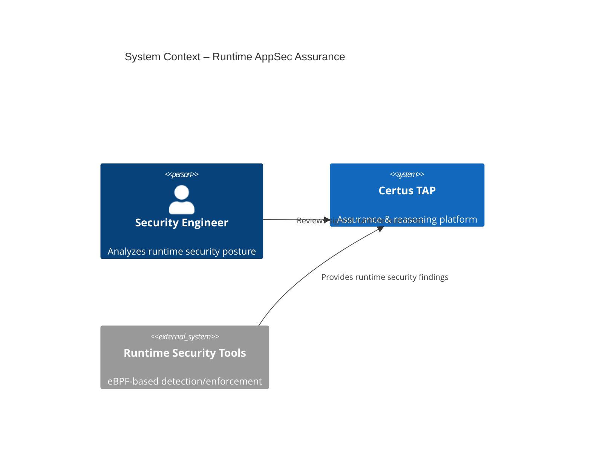
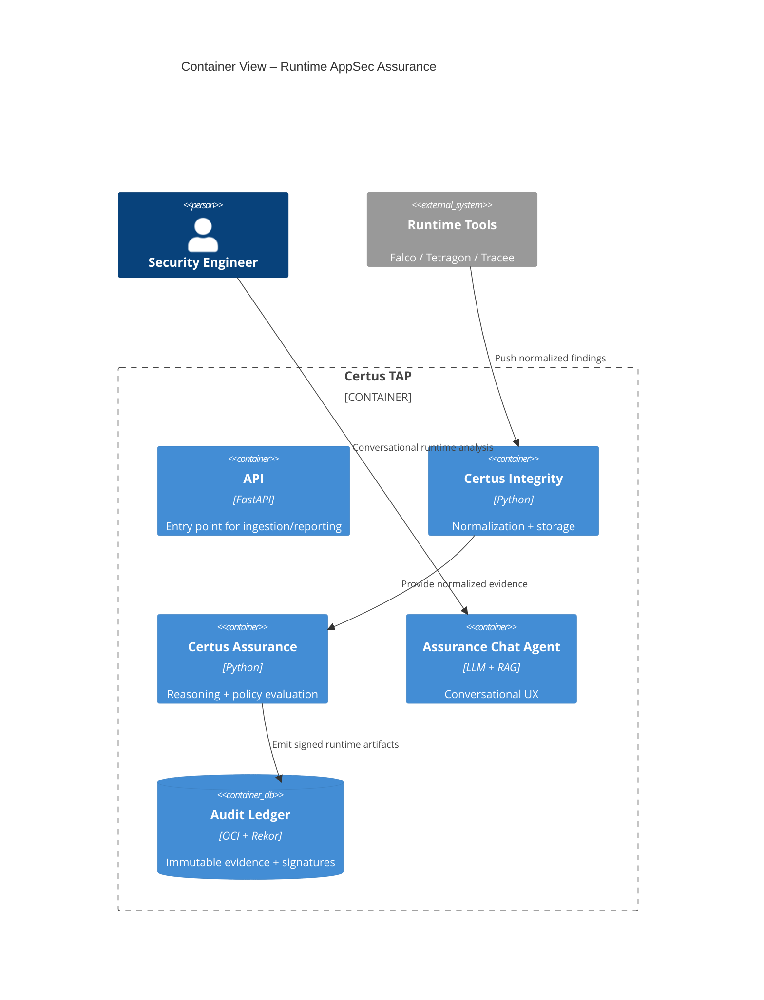
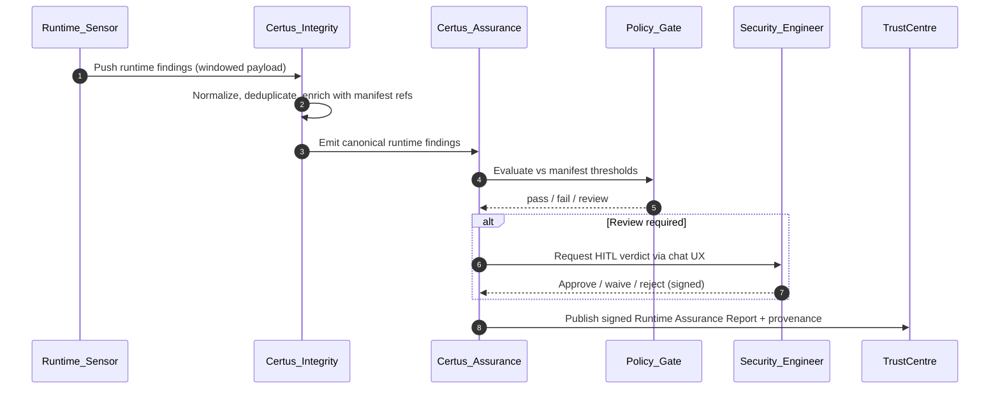

# Runtime Application Security Assurance (eBPF-backed)

> Manifest-driven runtime analysis that turns eBPF signals into signed, auditor-verifiable assurance artifacts.

## Metadata
- **Type:** Proposal
- **Status:** Draft
- **Author:** Martin Harrod
- **Created:** 2025-12-16
- **Last Updated:** 2025-12-16
- **Target Version:** v0.4 (TBD)
- **Implementation Timeline:** ~10–12 weeks (phased)

---

## Executive Summary

Modern application security programs heavily emphasize pre-deployment controls (SAST, SCA, IaC scanning). Once workloads are live, teams lack a cryptographically verifiable way to prove that services actually operated within agreed security boundaries. Alerts from runtime tools pile up, but they are rarely tied back to contractual controls or preserved as immutable evidence.

Runtime Application Security Assurance introduces eBPF-derived runtime signals as a first-class evidence type inside Certus. Findings flow through the same Integrity → Assurance → TrustCentre lifecycle as other artifacts: manifests declare runtime expectations, normalized evidence is evaluated against policy, and final verdicts are signed and anchored for independent verification. Certus does **not** replace CNAPP/EDR enforcement; instead, it acts as the reasoning, judgment, and proof engine for runtime behavior.

**Key Points**
- **Problem:** Organizations cannot prove that production services behaved securely over time; runtime alerts lack contractual binding.
- **Solution:** Treat runtime signals as manifest-governed evidence, processed offline/near-time, normalized, reasoned upon, policy-evaluated, and signed.
- **Benefits:** Continuous runtime trust, reduction in point-in-time attestations, auditor-ready artifacts, conversational runtime analysis for engineers.
- **Risks:** Data volume and signal quality (mitigated via normalization + windowing) and integration complexity with runtime sensors (phased rollout).

---

## Motivation

### Problem Statement
Security teams can detect runtime anomalies, but they cannot answer:
- _“Was the application operating securely during this period?”_
- _“Did runtime controls actually work?”_
- _“Can this be proven independently?”_

Existing tooling generates telemetry, not assurance. There is no manifest-aware evidence chain for runtime behavior.

### Background
- Certus already supports manifest-driven controls, evidence normalization, policy evaluation, human-in-the-loop (HITL) reviews, and signed artifacts.
- Missing ingredient: a runtime evidence class that plugs into this lifecycle using eBPF-based detections as inputs.

### User Impact
- **Security Engineers:** Conversational runtime analysis with provenance, ability to issue waivers/remediations that tie back to manifests.
- **Platform Owners:** Quantified runtime posture (violations per service, MTTA, waiver frequency).
- **Customers/Auditors:** Independent verification of runtime controls through signed artifacts anchored to Rekor/Audit Ledger.

### Research Context
- Enables studies on behavioral baselining, policy effectiveness, AI/HITL decision quality, and runtime assurance metrics (MTTA, drift rates, waiver ratios).

---

## Goals & Non-Goals

### Goals
- [ ] Make runtime behavior a first-class assurance domain governed by manifests.
- [ ] Ingest and normalize eBPF-derived findings into a canonical schema.
- [ ] Evaluate runtime evidence against policy thresholds with HITL escalation.
- [ ] Publish signed runtime assurance artifacts with full provenance.

### Non-Goals
- **Inline enforcement:** Blocking remains with runtime sensors (Falco, Tetragon, etc.).
- **EDR replacement:** Certus consumes their findings; it does not become an agent.
- **Raw syscall archiving:** Certus ingests summarized findings, not the entire signal firehose.

### Success Criteria
| Criterion | Measurement |
|-----------|-------------|
| Runtime controls defined | Assurance Manifest supports runtime clauses with evidence mappings |
| Evidence quality | Deduplicated, normalized findings enriched with context |
| Assurance artifacts | Signed runtime assurance reports anchored to TrustCentre |
| Audit usability | Reports + provenance verifiable independently (Rekor + Ledger) |

---

## Proposed Solution

### Overview
Certus ingests runtime security findings emitted by eBPF-powered tools. Findings are normalized, enriched, and evaluated against manifest-defined expectations. Policy outcomes plus human decisions are captured, and the resulting Runtime Assurance Report is signed, timestamped, and anchored for third-party verification. The solution is “analysis-first”: no inline blocking, but strong contracts, reasoning, and proof.

---

## Architecture

### System Context (C4 Level 1)

**Description:** Certus consumes runtime findings from external sensors, evaluates them against manifests, and serves adjudicated evidence to engineers, auditors, and customers.

### Container View (C4 Level 2)

**Description:** Runtime tools push findings to Integrity (via API/service connector). Assurance performs enrichment + policy evaluation, then emits signed outputs anchored in the Ledger. The chat agent surfaces these results with provenance.

---

## Workflows

### Workflow 1: Runtime Assurance Execution
> _Collect, judge, and publish runtime evidence over a defined window._



**Actors**
- _Runtime Sensor_ – Falco/Tetragon/Tracee job emitting findings.
- _Certus Integrity_ – Normalizes, enriches, fingerprints evidence.
- _Certus Assurance_ – Runs enrichment, reasoning, and policy gates.
- _Policy Gate_ – Deterministic evaluation (OPA/CUE).
- _Security Engineer_ – Handles low-confidence or exceptional cases.
- _TrustCentre Ledger_ – WORM storage, signatures, Rekor anchoring.

**Desired Outcomes**
| Outcome | Description |
|---------|-------------|
| **Windowed Evidence** | Each run captures a scoped, reproducible window of runtime behavior. |
| **Policy Verdicts** | Manifest thresholds yield pass/fail/review, with HITL when needed. |
| **Signed Artifacts** | Results are signed, timestamped, and independently verifiable. |

---

## Technical Design

### Data Model (Conceptual)
```python
class RuntimeFinding(BaseModel):
    id: str
    rule_id: str
    action: Literal["exec", "connect", "open", "privilege_change"]
    subject: dict  # workload identity, PID, container, service
    target: dict   # binary, IP, file, namespace
    severity: Literal["info", "low", "medium", "high"]
    confidence: float
    manifest_control: str
    window_id: str
```

### APIs
```http
POST /api/v1/runtime/findings/ingest
Content-Type: application/json

{
  "window_id": "runtime-2025-12-16T00:00Z",
  "manifest_version": "manifest:v2024.12",
  "sensor": "tetragon",
  "findings": [ ... ]
}
```

```http
GET /api/v1/runtime/assurance/report?window_id=runtime-2025-12-16T00:00Z
```

### Integration Points
- **Runtime security tools:** Falco/Tetragon/Tracee connectors emit normalized JSON or SARIF-like payloads.
- **TrustCentre OCI/Rekor:** WORM storage + transparency log anchoring for runtime reports.
- **Assurance Chat Agent:** Surfaces runtime workflows, approvals, waivers, and insights.

### Technology Stack
- **Language:** Python 3.11+
- **Frameworks:** FastAPI, Haystack, OPA/CUE for policy evaluation
- **Storage:** OCI (WORM) for signed artifacts, OpenSearch for searchable runtime findings
- **Runtime Inputs:** eBPF-based sensors (external to Certus)

---

## Security Considerations

### Authentication & Authorization
- Service-to-service ingestion uses signed workload identities.
- Human access (chat/report download) enforced via OIDC/SSO with role-scoped policies.

### Data Protection
- Only normalized findings (not raw syscalls) are ingested.
- Evidence scoped by application/environment/time window; stored immutably with signatures.

### Threat Model
| Threat | Impact | Likelihood | Mitigation |
|--------|--------|------------|------------|
| Signal poisoning | Medium | Low | Signed sensor attestations, provenance tracking, detector confidence scoring |
| Excessive data volume | Medium | Medium | Windowing + deduplication + severity thresholds |
| False positives | Medium | Medium | HITL review loop + model tuning |

### Compliance
- Runtime reports inherit manifest references, making it straightforward to map to SOC2/ISO/AI governance clauses already tracked in TrustCentre.

---

## Research Considerations
- **Reproducibility:** Every runtime window has signed artifacts + ledger references, enabling replay.
- **Evaluation Metrics:** Runtime violation rate, MTTA, waiver frequency, control effectiveness over time.
- **Experiment Design:** Compare posture before/after manifest updates; study drift detection efficacy.
- **Data Collection:** Aggregated metrics stored for analysis; raw sensor data remains outside Certus scope.

---

## Alternatives Considered

### Alternative 1: Real-Time Inline Enforcement
- **Pros:** Immediate response to runtime threats.
- **Cons:** High blast radius, operational risk, brittle automation, difficult to audit retroactively.
- **Decision:** Rejected. Certus focuses on assurance (analysis + proof) rather than enforcement.

---

## Dependencies

### Prerequisites
- [ ] Runtime ingestion schema + connectors
- [ ] Manifest extensions for runtime clauses
- [ ] Normalization/enrichment modules for runtime signals

### External Dependencies
- eBPF-based runtime tools (Falco, Tetragon, Tracee) providing structured findings.

---

## Risks & Mitigations
| Risk | Probability | Impact | Mitigation Strategy |
|------|-------------|--------|---------------------|
| Integration complexity with runtime tools | Medium | Medium | Pilot with one sensor, define schema adapters, reuse connectors |
| User confusion vs. EDR expectations | Low | Medium | Clear docs/UI messaging about non-inline scope |
| Scope creep (collecting all telemetry) | Medium | High | Enforce manifest-driven windows + summarized findings only |

---

## Implementation Plan

### Phase 1 – Runtime Evidence Ingestion (4 weeks)
- Objectives: Schema definition, connectors for initial sensors (Falco/Tetragon), windowed ingestion endpoints.
- Deliverables: `/runtime/findings/ingest`, normalization pipeline, manifest runtime clauses (alpha).
- Success Criteria: Sample runtime findings flow into Integrity with fingerprints and manifest mappings.

### Phase 2 – Policy & HITL Integration (4 weeks)
- Objectives: Policy evaluation (OPA/CUE), Assurance enrichment, chat-based runtime review workflow.
- Deliverables: Policy rule sets, HITL UX in Assurance Chat Agent, waiver capture for runtime cases.
- Success Criteria: Manifest-driven pass/fail decisions with HITL overrides stored in ledger.

### Phase 3 – Signing & Metrics (2–4 weeks)
- Objectives: Runtime Assurance Report generation, signing + Rekor anchoring, metrics dashboards (violations/service, MTTA).
- Deliverables: Signed artifacts in TrustCentre OCI, dashboard widgets, API endpoints for report retrieval.
- Success Criteria: Auditors/customers can download runtime reports and verify signatures independently.

### Timeline Summary
| Phase | Duration | Start After | Deliverables |
|-------|----------|-------------|--------------|
| Phase 1 | 4 weeks | Approval | Runtime ingestion + schema |
| Phase 2 | 4 weeks | Phase 1 | Policy + HITL integration |
| Phase 3 | 2–4 weeks | Phase 2 | Signing, metrics, dashboards |
| **Total** | **10–12 weeks** | | |

### Resource Requirements
- Development: ~3 engineers across Integrity, Assurance, and TrustCentre services.
- Testing: 1 QA/Security engineer for sensor integration validation.
- Documentation: 0.5 technical writer for manifests + workflow docs.

---

## Open Questions
- [ ] Which runtime tools (Falco, Tetragon, Tracee) are first-class vs. community adapters? — **Owner:** Platform Eng
- [ ] Default assurance windows (rolling 24h vs. manifest-defined custom)? — **Owner:** Assurance PM
- [ ] Priority environments (Kubernetes vs. bare-metal/serverless) for phase 1? — **Owner:** Runtime Ops

---

## Future Enhancements
- Near-real-time advisory alerts that feed Certus Insight dashboards.
- Cross-cluster correlation for multi-region runtime narratives.
- Automated manifest/control tuning suggestions based on observed runtime drift.

---

## Outcome

With Runtime Application Security Assurance, Certus can finally answer **“Can we prove our applications operated securely in production?”** eBPF provides runtime truth, Certus Integrity normalizes and preserves it, Certus Assurance reasons and signs it, and TrustCentre exposes verifiable artifacts. Runtime security graduates from monitoring to provable assurance.***
