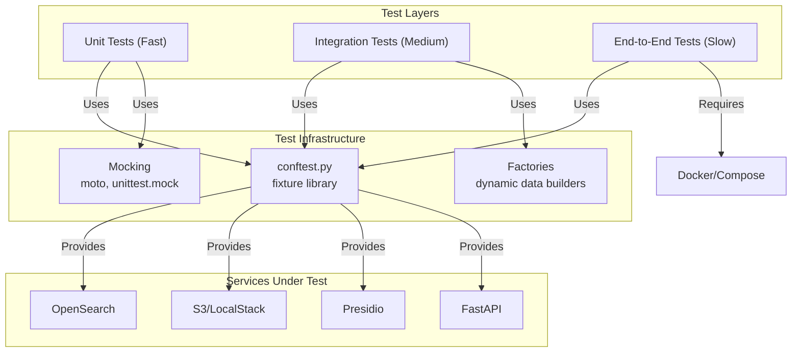

# Testing Strategy & Architecture

Complete architecture overview of the Certus TAP testing system plus the day-to-day workflow for keeping coverage green.

## Goals

- Catch regressions across ingestion, pipeline, and API layers quickly.
- Keep `./scripts/preflight.sh` green as the canonical acceptance suite.
- Provide fast feedback during development via targeted pytest selections.
- Trend coverage upward by keeping unit/service tests fast and deterministic.

## Architecture

## Test Pyramid

### Level 1: Unit Tests (fast)
- **Time**: seconds per suite, **Isolation**: complete (all dependencies mocked)
- **Coverage**: service methods, helper functions, core logic
- **Tools**: moto for AWS, `MagicMock` or `SimpleNamespace` for OpenSearch/Presidio, factory fixtures for sample data

### Level 2: Integration Tests (medium)
- **Time**: minutes per suite, **Isolation**: partial (FastAPI app + patched backends)
- **Coverage**: request/response behavior, validation, router orchestration
- **Tools**: FastAPI `TestClient`, moto-backed S3 clients, patched document stores (`get_document_store_for_workspace`)

### Level 3: End-to-End Tests (slow)
- **Time**: 5–10+ minutes, **Isolation**: none (Dockerized services)
- **Coverage**: ingestion → datalake → query → evaluation
- **Tools**: `./scripts/preflight.sh`, LocalStack/OpenSearch containers, optional Dagger pipelines for security scans

## Fixture & Tooling Foundation

`tests/conftest.py` centralizes more than 26 fixtures:

- moto-based S3 helpers (raw/golden buckets, sample uploads)
- Mocked OpenSearch document store and workspace-specific helpers
- FastAPI `create_app()` with patched dependencies + deterministic settings
- Presidio analyzer/anonymizer fakes, privacy logger helpers, and document factories
- Async FastAPI clients plus general-purpose test data fixtures

Supporting tools:

- `pytest-asyncio` for async routers
- `MagicMock` / `SimpleNamespace` for lightweight seams
- Field-tested factory fixtures (`document_factory`, `analysis_result_factory`, etc.)

## Key Suites & Entry Points

| Area | Command | Notes |
| --- | --- | --- |
| Core Pytest | `uv run python -m pytest` | Default suite (`tests/`). |
| Coverage | `uv run python -m pytest --cov=certus_ask --cov-report=term` | Run locally + CI. |
| Service layer | `uv run python -m pytest tests/test_services/ -v` | OpenSearch/S3/Presidio/Privacy helpers. |
| Router/API smoke | `uv run python -m pytest tests/test_routers_api.py` | Health, datalake preprocess, query. |
| Pipeline unit | `uv run python -m pytest tests/test_pipelines_preprocessing.py` | Presidio anonymizer + preprocessing. |
| Datalake routers | `uv run python -m pytest tests/test_datalake.py` | moto-backed ingestion endpoints. |
| Acceptance | `./scripts/preflight.sh` | Dockerized ingestion/query/evaluation. |
| Security scans | `python tools/security/run_certus_assurance_security.py` | Dagger pipeline (OpenGrep/Bandit/Trivy). |

## Workflow Guidelines

1. **Local iteration** – run targeted suites (e.g., service tests) while writing code. Use `uv run python -m pytest --maxfail=1 --disable-warnings`.
2. **Before PRs** – run the full coverage suite plus `./scripts/preflight.sh` to confirm Docker workflows still pass.
3. **CI** – PR workflows run lint + `uv run python -m pytest -m "not smoke"`; smoke/tutorial suites run nightly or via `pytest -m smoke`/`pytest -m tutorial`.

## Adding Tests

- Place unit tests next to their domain (`tests/test_services/`, `tests/test_routers/`, etc.).
- Extend fixtures only when common setup repeats; keep them lean to preserve startup time.
- Mark longer suites with `@pytest.mark.smoke`, `@pytest.mark.tutorial`, or `@pytest.mark.slow`.
- Document new suites or tooling in this file and in the landing page.

## Troubleshooting

- **Async plugin errors** – ensure `pytest-asyncio` is installed and tests use `@pytest.mark.asyncio`.
|- **OpenSearch logging noise** – set `DISABLE_OPENSEARCH_LOGGING=true` during pytest runs or patch the handler fixture.
- **Moto credential warnings** – rely on the env vars set in `tests/conftest.py` or set dummy values.
- **LLM/Network calls** – always patch `create_rag_pipeline` and similar boundaries in router tests to avoid live requests.

## References

- `docs/learn/getting-started.md` for environment bootstrap.
- `justfile` targets (`just preflight`, `just test`) for convenience.
- `AGENTS.md` for mission-critical requirements (preflight must stay green).
